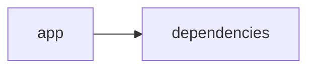

# Documentación del Proyecto

## Documentación Técnica

A continuación se presenta la documentación técnica completa en markdown del repositorio, orientada a desarrolladores que deseen comprender la arquitectura, componentes principales, APIs internas y la forma de desarrollo e integración de los módulos.

---

# Documentación Técnica – VoC Analyst

Este repositorio implementa una aplicación para el análisis de la Voz del Cliente (VoC) utilizando procesamiento de archivos, extracción de texto y análisis con modelos de lenguaje (LLM). La interfaz de usuario se realiza mediante Streamlit y el backend integra múltiples proveedores LLM (OpenAI, Anthropic y Google GenAI) para generar insights y recomendaciones basadas en conversaciones de clientes.

---

## Tabla de Contenidos

1. [Resumen](#resumen)
2. [Arquitectura General](#arquitectura-general)
3. [Componentes Principales](#componentes-principales)
   - [1. Aplicación Streamlit](#aplicación-streamlit)
   - [2. Módulo LLMBackend](#módulo-llmbackend)
   - [3. Módulo de Conversación y Parser](#módulo-de-conversación-y-parser)
4. [Configuración y Dependencias](#configuración-y-dependencias)
5. [Guías de Desarrollo](#guías-de-desarrollo)
   - [Instalación y Ejecución](#instalación-y-ejecución)
   - [Extender y Configurar LLMBackend](#extender-y-configurar-llmbackend)
   - [Pruebas y Validación](#pruebas-y-validación)
6. [Consideraciones y Buenas Prácticas](#consideraciones-y-buenas-prácticas)

---

## Resumen

El repositorio está construido en varios lenguajes y módulos (señalados como "other" en la clasificación de lenguajes) e integra diversas librerías para el procesamiento de documentos PDF, manejo de datos (con Pandas), y comunicación con APIs de proveedores LLM. La interfaz gráfica se maneja mediante Streamlit, lo que permite a los usuarios cargar archivos, visualizar resultados de análisis y seguir el flujo de procesamiento de documentos en tiempo real.

---

## Arquitectura General

El flujo de datos y la interacción entre módulos se puede resumir en el siguiente diagrama Mermaid:

```mermaid
graph LR
  A[Aplicación Streamlit] --> B[Módulo LLMBackend]
  B --> C[Proveedores LLM (OpenAI, Anthropic, Google GenAI)]
  A --> D[Módulo de Conversación y Parser]
  D --> E[Extracción y Redacción de PII]
```

- La **Aplicación Streamlit** actúa como la interfaz principal para la interacción del usuario.
- El **Módulo LLMBackend** se encarga de inicializar la conexión con el proveedor LLM configurado y de procesar los prompts de análisis.
- El **Módulo de Conversación y Parser** se encarga de procesar y normalizar las conversaciones (incluyendo la detección de PII) para la posterior generación de insights.
- Cada módulo se comunica y transmite datos de entrada/salida, permitiendo un flujo de procesamiento modular y extensible.

---

## Componentes Principales

### Aplicación Streamlit

- **Propósito:**  
  La aplicación principal se configura mediante Streamlit para gestionar la carga de archivos, mostrar el progreso de análisis, y visualizar los resultados (gráficos, datos en tablas, etc.).
  
- **Características Principales:**  
  - Configuración inicial de la página (título, ícono, layout y sidebar).
  - Gestión del estado de sesión con variables como `analysis_results`, `run_id`, `uploaded_files_data` y `processing_complete`.
  - Funciones auxiliares, como:
    - `extract_text_from_pdf(pdf_file)`: Extrae texto de archivos PDF utilizando la librería PyPDF2.
    - `validate_file_size(file)`: Valida que el tamaño del archivo no supere el límite definido (ej. 100MB).

- **Ejemplo de Uso en Código:**

  ```python
  import streamlit as st
  import PyPDF2

  # Configuración de la página con Streamlit
  st.set_page_config(
      page_title="VoC Analyst - Análisis de Voz del Cliente con LLM",
      page_icon="📊",
      layout="wide",
      initial_sidebar_state="expanded"
  )

  # Inicialización del estado de sesión
  if 'analysis_results' not in st.session_state:
      st.session_state.analysis_results = None

  def extract_text_from_pdf(pdf_file) -> str:
      """Extraer texto de archivo PDF"""
      try:
          pdf_reader = PyPDF2.PdfReader(pdf_file)
          text = ""
          for page in pdf_reader.pages:
              text += page.extract_text() + "\n"
          return text.strip()
      except Exception as e:
          st.error(f"Error al extraer texto de PDF: {str(e)}")
          return ""
  ```

### Módulo LLMBackend

- **Propósito:**  
  Integrar y gestionar el acceso a múltiples proveedores de LLM para la generación de análisis sobre la Voz del Cliente.

- **Componentes y Funcionalidades Clave:**
  - **ModelConfig:**  
    Un dataclass para la configuración del modelo, que incluye el proveedor (`openai`, `anthropic`, `gemini`), el modelo a utilizar, la API key y parámetros de reintentos.
  
  - **LLMBackend:**  
    Clase encargada de:
    - Inicializar la conexión con el proveedor adecuado (OpenAI, Anthropic o Google GenAI).
    - Cargar los prompts necesarios para el parsing y análisis de la conversación.
    - Manejar las peticiones y respuestas de la API LLM.

- **Ejemplo de Configuración y Uso:**

  ```python
  from dataclasses import dataclass
  import openai
  import anthropic
  from google import genai

  @dataclass
  class ModelConfig:
      provider: str  # 'openai', 'anthropic', 'gemini'
      model: str
      api_key: str
      max_retries: int = 3
      retry_delay: float = 1.0

  class LLMBackend:
      """Backend service for LLM-based VoC analysis"""

      def __init__(self, config: ModelConfig):
          self.config = config
          self.client = self._initialize_client()
          self.parse_prompt = self._load_parse_prompt()
          self.analyze_prompt = self._load_analyze_prompt()

      def _initialize_client(self):
          """Initialize the appropriate LLM client"""
          if self.config.provider == 'openai':
              return openai.OpenAI(api_key=self.config.api_key)
          elif self.config.provider == 'anthropic':
              return anthropic.Anthropic(api_key=self.config.api_key)
          elif self.config.provider == 'gemini':
              return genai.Client(api_key=self.config.api_key)
          else:
              raise ValueError(f"Unsupported provider: {self.config.provider}")
  ```

### Módulo de Conversación y Parser

- **Propósito:**  
  Procesar archivos de texto que contienen interacciones entre clientes y agentes. Se encarga de:
  - Normalizar y estructurar conversaciones en formato JSON.
  - Extraer metadatos y redireccionar datos, como la identificación de conversaión e información de PII (redactada).

- **Requisitos y Funciones:**
  - **Identificación de Conversación:**  
    - Extraer o derivar `conversation_id` (por ejemplo, usando el nombre del archivo).
    - Detectar y etiquetar el idioma de la transcripción.
    - Validar que se trate de una única interacción.
  
  - **Análisis a Nivel de Mensaje:**  
    - Dividir la conversación en turnos.
    - Extraer timestamps y determinar el rol de cada interlocutor (cliente, agente o desconocido).
    - Extraer metadatos adicionales (por canal, duración, agent_id, etc.).
  
  - **Redacción de PII:**  
    Identificar y reemplazar datos sensibles (correos electrónicos, teléfonos, números de tarjetas, etc.) por etiquetas uniformes como [EMAIL], [PHONE], [CARD] y [ID].

- **Ejemplo de Requisitos (Extracto):**

  ```
  ## VoC Conversation Parser

  ### Objetivo
  Transformar un archivo de interacción en un JSON estructurado, normalizando mensajes y redactando PII.

  ### Requerimientos:
  1. Identificar la conversación y extraer el conversation_id.
  2. Parsear cada turno y ubicar timestamps, roles (cliente/agente) y canales.
  3. Redactar información sensible:
     - Email → [EMAIL]
     - Teléfono → [PHONE]
     - Tarjeta de crédito → [CARD]
     - Identificaciones → [ID]
  4. Extraer metadatos adicionales (interaction_id, agent_id, etc.)
  ```

---

## Configuración y Dependencias

El proyecto utiliza las siguientes dependencias principales:

- streamlit>=1.49.1
- openai>=1.106.1
- anthropic>=0.66.0
- google-genai>=1.33.0
- pandas>=2.3.2
- pypdf2>=3.0.1

**Archivo requirements.txt:**

```
streamlit>=1.49.1
openai>=1.106.1
anthropic>=0.66.0
google-genai>=1.33.0
pandas>=2.3.2
pypdf2>=3.0.1
```

Estas dependencias se instalan comúnmente a través de:

  pip install -r requirements.txt

---

## Guías de Desarrollo

### Instalación y Ejecución

1. Clonar el repositorio:

   git clone https://tu-repositorio/url.git

2. Crear un entorno virtual (opcional pero recomendado):

   python -m venv venv  
   source venv/bin/activate  (Linux/macOS)  
   venv\Scripts\activate     (Windows)

3. Instalar las dependencias:

   pip install -r requirements.txt

4. Ejecutar la aplicación:

   streamlit run app.py

   Nota: Asegurarse de que el archivo principal (por ejemplo, app.py) corresponda a la entrada de Streamlit.

### Extender y Configurar LLMBackend

- **Configuración Inicial:**  
  Configure la clase ModelConfig con los detalles del proveedor de LLM que desea utilizar:
  
  ```python
  config = ModelConfig(
      provider="openai",  # o 'anthropic' / 'gemini'
      model="gpt-4",
      api_key="YOUR_API_KEY"
  )
  llm_backend = LLMBackend(config=config)
  ```

- **Extensible:**  
  Para agregar nuevos proveedores, se debe extender el método _initialize_client dentro de la clase LLMBackend e implementar la lógica de autenticación/biblioteca.

### Pruebas y Validación

- **Pruebas Unitarias:**  
  Se recomienda escribir pruebas unitarias para cada función de extracción y parsing, en particular para:
  - Extracción de texto desde PDFs.
  - Funciones que validan el tamaño de archivo.
  - Funciones de redacción de PII (para emails, teléfonos, etc.).

- **Logs y Manejo de Errores:**  
  La aplicación utiliza el logging (nivel INFO) para hacer seguimiento del flujo de ejecución y la detección de errores en la conexión con el LLM.  
  Verifique los mensajes de error en la consola o en las notificaciones de la interfaz Streamlit.

---

## Consideraciones y Buenas Prácticas

- Mantener las claves API y otra información sensible fuera del código fuente, por ejemplo, usando variables de entorno o archivos de configuración.
- Asegurarse de que los archivos cargados por el usuario pasen las validaciones (como tamaño máximo) antes de proceder con el procesamiento.
- Extender la modularidad del código siguiendo patrones de diseño (por ejemplo, separando la lógica de UI de la lógica de negocio) para facilitar futuras mejoras o integraciones.
- Utilizar control de versiones y realizar pruebas en cada cambio para evitar regresiones en la funcionalidad del análisis de VoC.

---

Esta documentación tiene el objetivo de guiar tanto a nuevos desarrolladores como a los colaboradores habituales en la comprensión y extensión de la funcionalidad de VoC Analyst. Si se requieren aclaraciones adicionales, se recomienda revisar los comentarios en el código y los commit messages del repositorio para conocer el historial y los motivos de cada cambio.


## Diagrama



---

## Guía de Usuario

# Guía de Usuario de la Aplicación

Bienvenido a la guía de usuario de nuestra aplicación. Este documento está diseñado para ayudarte a comprender las principales funcionalidades, el uso básico de la aplicación y resolver las dudas más comunes.

---

## 1. Descripción de la Aplicación

Nuestra aplicación es una solución diseñada para facilitar la gestión de tareas y la interacción entre usuarios en un entorno digital. Aunque las tecnologías utilizadas no han sido determinadas y la integración con endpoints externos actualmente no está disponible, la aplicación está pensada para ofrecer una interfaz intuitiva y amigable que permita a los usuarios:

- Gestionar sus actividades diarias.
- Visualizar información relevante en un panel central.
- Personalizar la experiencia de usuario a través de diversas opciones de configuración.

Esta guía te ayudará a sacar el máximo provecho de las funcionalidades que la aplicación tiene para ofrecer.

---

## 2. Principales Funcionalidades

A continuación, se describen las funcionalidades clave disponibles en la aplicación:

- **Inicio de Sesión y Registro**  
  Permite a los usuarios crear una cuenta o iniciar sesión en una cuenta existente para acceder a la plataforma.
  
- **Panel de Control**  
  Una vista centralizada donde se muestran datos relevantes, notificaciones y accesos directos a secciones importantes.
  
- **Gestión de Tareas**  
  Herramienta para crear, editar, asignar y marcar tareas como completadas. Ideal para organizar actividades y proyectos personales o de equipo.
  
- **Configuración de Perfil**  
  Opción para actualizar información personal, cambiar la contraseña y ajustar preferencias de notificación.
  
- **Reportes y Estadísticas**  
  Sección para visualizar reportes resumidos y gráficos que ayudan a analizar el progreso y la eficiencia de las tareas gestionadas.
  
- **Soporte y Ayuda**  
  Acceso a recursos de ayuda, documentación adicional y contacto con el soporte técnico para resolver cualquier incidencia.

---

## 3. Descripción de Uso

A continuación, encontrarás una guía paso a paso sobre el uso de la aplicación:

### 3.1 Acceso a la Aplicación

1. **Abrir la Aplicación:**  
   Inicia la aplicación desde el escritorio, la web o la ubicación en la que esté instalada.

2. **Inicio de Sesión/Registro:**  
   - Si ya tienes una cuenta, ingresa tu usuario y contraseña para iniciar sesión.
   - Si eres un nuevo usuario, selecciona la opción de registro e ingresa los datos solicitados para crear tu cuenta.

### 3.2 Navegación en el Panel de Control

- **Panel Central:**  
  Una vez iniciada la sesión, se mostrará el panel de control con un resumen de tus tareas, notificaciones y accesos directos a las secciones más utilizadas.

- **Menú de Navegación:**  
  Utiliza el menú lateral o superior para acceder a las diferentes secciones, tales como Gestión de Tareas, Reportes o Configuración.

### 3.3 Gestión de Tareas

1. **Crear una Nueva Tarea:**  
   Selecciona la opción “Nueva Tarea” y completa los campos requeridos (título, descripción, fecha límite, etc.).
   
2. **Editar o Eliminar Tareas:**  
   Haz clic en el icono de edición o eliminación ubicado junto a la tarea correspondiente para realizar modificaciones o retirarla de la lista.

3. **Marcar Tarea como Completada:**  
   Para finalizar una tarea, selecciona el icono de verificación (check) o marca la casilla correspondiente.

### 3.4 Configuración de Perfil

- Accede a la sección “Mi Perfil” o “Configuración” para:
  - Actualizar tus datos personales.
  - Cambiar tu contraseña.
  - Configurar las notificaciones y otras preferencias de la aplicación.

### 3.5 Soporte y Ayuda

- Si encuentras algún inconveniente o tienes preguntas no resueltas en esta guía, accede a la sección “Soporte” para:
  - Consultar artículos de ayuda.
  - Enviar una solicitud de soporte técnico.
  - Revisar las FAQ adicionales.

---

## 4. Preguntas Frecuentes (FAQ)

### 4.1 ¿Cómo creo una nueva cuenta en la aplicación?  
Para crear una cuenta, selecciona la opción "Registrarse" en la pantalla de inicio y sigue las instrucciones ingresando tus datos personales. Recibirás un correo de confirmación para activar tu cuenta.

### 4.2 ¿Olvidé mi contraseña, cómo puedo recuperarla?  
Haz clic en "¿Olvidaste tu contraseña?" en la pantalla de inicio de sesión. Se te pedirá ingresar tu correo electrónico y recibirás un enlace para restablecer tu contraseña.

### 4.3 ¿Puedo personalizar el panel de control?  
Sí, en la sección de Configuración encontrarás opciones para personalizar la vista del panel de control, como elegir qué widgets o secciones se muestran según tus preferencias.

### 4.4 ¿Qué debo hacer si encuentro un error o fallo en la aplicación?  
Si experimentas algún error:
- Asegúrate de que la aplicación esté actualizada a la última versión.
- Consulta la sección “Soporte” para buscar soluciones en la documentación.
- Si el problema persiste, contacta al equipo de soporte técnico a través del formulario de contacto disponible en la sección de ayuda.

### 4.5 ¿La aplicación es compatible con dispositivos móviles?  
Sí, la aplicación está diseñada para ser responsiva y funcionar en diferentes dispositivos, incluidos teléfonos móviles y tabletas, ofreciendo una experiencia óptima sin importar el tamaño de pantalla.

---

Esperamos que esta guía te sea de utilidad para comenzar a usar la aplicación. Si tienes más preguntas o necesitas asistencia adicional, no dudes en contactar a nuestro equipo de soporte. ¡Gracias por elegir nuestra aplicación!