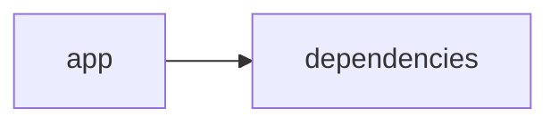

# Documentación del Proyecto

## Documentación Técnica

A continuación se presenta la documentación técnica completa en formato Markdown para desarrolladores. Esta documentación ha sido generada a partir del análisis del código fuente y la estructura del repositorio, e incluye una descripción de la arquitectura, los componentes principales, las APIs internas y guías para facilitar el desarrollo, la integración y el mantenimiento del proyecto.

---

# Documentación Técnica – VoC Analyst

VoC Analyst es una aplicación para el análisis de la Voz del Cliente que combina la extracción y normalización de datos de conversación (incluyendo la lectura y procesamiento de archivos PDF) con análisis avanzados basados en modelos de lenguaje (LLM). La interfaz se implementa utilizando Streamlit, facilitando la visualización y operación de análisis interactivos, mientras que el backend utiliza proveedores LLM (como OpenAI, Anthropic y Google GenAI) para generar insights y recomendaciones relevantes.

---

## Tabla de Contenidos

1. [Resumen del Repositorio](#resumen-del-repositorio)
2. [Arquitectura General](#arquitectura-general)
3. [Componentes Principales](#componentes-principales)
   - [Aplicación Streamlit](#aplicación-streamlit)
   - [Módulo LLMBackend](#módulo-llmbackend)
   - [Parser y Análisis de Conversaciones](#parser-y-análisis-de-conversaciones)
4. [APIs Internas y Funciones Destacadas](#apis-internas-y-funciones-destacadas)
5. [Configuración y Dependencias](#configuración-y-dependencias)
6. [Guías de Desarrollo](#guías-de-desarrollo)
   - [Instalación y Ejecución](#instalación-y-ejecución)
   - [Extender y Configurar LLMBackend](#extender-y-configurar-llmbackend)
   - [Pruebas y Validación](#pruebas-y-validación)
7. [Consideraciones y Buenas Prácticas](#consideraciones-y-buenas-prácticas)

---

## Resumen del Repositorio

- **Lenguajes:** Aunque se clasifica como "other", el código principal se encuentra escrito en Python y utiliza bibliotecas y frameworks como Streamlit, PyPDF2, pandas y clientes SDK de proveedores LLM.
- **Endpoints:** No se detectaron endpoints REST; la interacción principal se realiza a través de la interfaz de usuario en Streamlit.
- **Diagrama (Mermaid):**



El repositorio está organizado en múltiples secciones de código (fragmentos de alrededor de 400 a 500 líneas cada uno) que gestionan la configuración de la interfaz, el procesamiento de archivos y la comunicación con los proveedores de LLM.

---

## Arquitectura General

La arquitectura del proyecto se puede dividir en tres capas principales:

1. **Interfaz de Usuario (Frontend):**
   - Implementada en Streamlit, se encarga de gestionar la configuración de la página, el estado de sesión y la visualización interactiva de resultados.
   - Permite la carga de archivos, manejo de errores y actualización en tiempo real de los análisis.

2. **Lógica de Negocio y Procesamiento:**
   - Incluye funciones para la extracción de texto de archivos PDF.
   - Contiene validaciones (como el tamaño del archivo) y transforma los datos brutos en información estructurada.
   - El parser de conversación normaliza y redirige la información, eliminando datos sensibles (PII).

3. **Backend de LLM (LLMBackend):**
   - Gestiona la conexión y ejecución de modelos LLM a través de múltiples proveedores (OpenAI, Anthropic, Google GenAI).
   - Se configura a través del objeto ModelConfig, que especifica parámetros como el proveedor, el modelo, la API key y configuraciones de reintentos.
   - Posee funciones internas para inicializar clientes y cargar prompts específicos para el parseo y análisis de conversaciones.

---

## Componentes Principales

### Aplicación Streamlit

- **Archivo Principal:** El archivo base de la aplicación (posiblemente denominado `app.py` o similar) se encarga de:
  - Configurar la página (título, icono, layout).
  - Inicializar el estado de la sesión para almacenar resultados del análisis, identificadores de ejecución y archivos subidos.
  - Llamar a funciones de procesamiento (como la extracción de texto de archivos PDF y la validación del tamaño de los mismos).

- **Funciones Destacadas:**
  - `extract_text_from_pdf(pdf_file)`: Utiliza PyPDF2 para extraer y concatenar el texto de cada página de un PDF.
  - `validate_file_size(file)`: Valida que el tamaño de un archivo subido sea inferior a 100MB, moviendo el puntero del archivo para determinar la cantidad de bytes.

---

### Módulo LLMBackend

- **Propósito:** Ofrecer un servicio backend para la generación de análisis basados en LLM, aprovechando diferentes proveedores.
  
- **Estructura y Configuración:**
  - **ModelConfig:** Es un dataclass que almacena la configuración necesaria para la conexión al proveedor LLM. Incluye atributos como:
    - `provider`: Identifica el proveedor ('openai', 'anthropic', 'gemini').
    - `model`: Modelo específico a utilizar.
    - `api_key`: Clave para la autenticación.
    - `max_retries` y `retry_delay`: Parámetros para la lógica de reintentos ante fallos.
  
- **Inicialización y Cliente:**
  - La clase `LLMBackend` se encarga de:
    - Inicializar el cliente de LLM adecuado según el proveedor configurado.
    - Cargar prompts específicos (por ejemplo, para parsear mensajes o para generar análisis).
  
- **Ejemplo de Código:**
  
  La parte del código muestra cómo se importa y se configura la conexión a proveedores LLM (como OpenAI, Anthropic y Google GenAI) mediante sus respectivos SDK.

---

### Parser y Análisis de Conversaciones

- **Objetivo:** Transformar archivos de conversaciones (por ejemplo, transcripciones de interacciones cliente-agente) en un JSON estructurado y normalizado.
  
- **Funciones y Requisitos:**
  - **Identificación de Conversaciones:**
    - Extraer o derivar un `conversation_id` (usando el nombre del archivo en caso de no encontrarse en el texto).
    - Detectar el lenguaje del documento y asegurarse de que se trate de una única interacción.
  
  - **Análisis de Mensajes:**
    - Separar cada turno (mensaje) de conversación.
    - Extraer información como timestamps, roles de los participantes (`cliente`, `agente`, `unknown`) y el canal (chat, email, etc.).
  
  - **Redacción de Información Sensible (PII):**
    - Se redactan datos como correos electrónicos, números de teléfono, números de tarjetas de crédito y otros identificadores sensibles, reemplazándolos por etiquetas específicas.
  
  - **Extracción de Metadata:**
    - Buscar en el documento metadatos como `interaction_id`, `agent_id`, `channel` y `duration`.
  
- **Documentación de Requerimientos adicionales para el Análisis:**
  - Se incluyen requerimientos detallados para análisis a nivel de conversaciones y mensajes, como el análisis de sentimiento y detección de emociones (basados en categorías definidas y escalas de valores).

---

## APIs Internas y Funciones Destacadas

Aunque la aplicación no expone endpoints REST, internamente se definen varias APIs y funciones que interactúan entre sí:

1. **Función de Extracción y Validación de Archivos:**
   - `extract_text_from_pdf(pdf_file)`: Extrae el contenido textual de archivos PDF.
   - `validate_file_size(file)`: Verifica que el archivo subido no exceda un tamaño límite.

2. **API del LLMBackend:**
   - Constructor `__init__(config: ModelConfig)`: Configura el backend con el cliente de LLM adecuado.
   - `_initialize_client()`: Método privado que inicializa y retorna el cliente según el proveedor especificado (OpenAI, Anthropic o Gemini de Google).
   - Métodos para cargar y gestionar los prompts de análisis y parseo.

3. **Parser de Conversaciones:**
   - Se implementan lógicas para identificar mensajes individuales, asignar roles a los participantes y redigir información sensible, todo orientado a generar una estructura JSON normalizada para su análisis posterior.

---

## Configuración y Dependencias

El proyecto se apoya en varias dependencias clave, declaradas típicamente en un archivo de requerimientos (por ejemplo, `requirements.txt`):

- streamlit>=1.49.1
- openai>=1.106.1
- anthropic>=0.66.0
- google-genai>=1.33.0
- pandas>=2.3.2
- pypdf2>=3.0.1

Estas dependencias son necesarias tanto para la interfaz de usuario como para la conexión con proveedores de LLM y el procesamiento de documentos.

---

## Guías de Desarrollo

### Instalación y Ejecución

1. **Clonar el Repositorio:**

   Desde la terminal, clona el repositorio:

   ```
   git clone <URL_DEL_REPOSITORIO>
   cd <NOMBRE_DEL_REPOSITORIO>
   ```

2. **Instalar Dependencias:**

   Se recomienda utilizar un entorno virtual. Luego, instala las dependencias:

   ```
   python -m venv venv
   source venv/bin/activate      # En Linux/Mac
   venv\Scripts\activate         # En Windows
   pip install -r requirements.txt
   ```

3. **Ejecutar la Aplicación:**

   Arranca la aplicación Streamlit con el siguiente comando:

   ```
   streamlit run app.py
   ```

   Esto abrirá la aplicación en el navegador, permitiendo la carga de archivos y el inicio del análisis de VoC.

---

### Extender y Configurar LLMBackend

Para adaptar el análisis o soportar nuevos proveedores LLM:

1. **Modificar o Ampliar ModelConfig:**

   - Actualiza el dataclass `ModelConfig` para incluir nuevos parámetros si es necesario.
   - Asegúrate de validar que el `provider` suministrado se encuentre soportado.

2. **Agregar Soporte para Nuevos Proveedores:**

   - En el método `_initialize_client()`, añade las condiciones necesarias para inicializar el nuevo cliente mediante su SDK.
   - Configura los parámetros adicionales y revisa los métodos de reintento y manejo de errores según la documentación del proveedor.

3. **Cambiar o Personalizar Prompts:**

   - Los prompts utilizados para el parseo y análisis se cargan internamente. Si se requiere personalizar la forma en que se formula la petición al LLM, localiza y modifica los métodos relacionados (por ejemplo, `_load_parse_prompt()` y `_load_analyze_prompt()`).

---

### Pruebas y Validación

1. **Pruebas Unitarias:**
   - Se recomienda crear pruebas unitarias para funciones críticas como `extract_text_from_pdf` y las lógicas de validación de archivos.
   - Verificar la correcta inicialización y funcionamiento del cliente en `LLMBackend`.

2. **Validación de Análisis:**
   - Realiza pruebas cargando archivos de conversación para asegurar que la extracción, normalización y redacción de datos sensibles (PII) se llevan a cabo correctamente.
   - Verifica que los resultados del análisis (por ejemplo, asignación de temas, sentimiento y emociones) se generan conforme a los requerimientos especificados.

3. **Manejo de Errores:**
   - Asegúrate de que los mensajes de error sean claros y se gestionen apropiadamente tanto en la interfaz de usuario como en la lógica de backend.

---

## Consideraciones y Buenas Prácticas

- **Gestión del Estado:**  
  La aplicación utiliza el estado de sesión de Streamlit para almacenar resultados intermedios y datos de ejecución. Es fundamental asegurarse de que estos datos se manejen de forma segura, evitando filtraciones de información.

- **Redacción de PII:**  
  Siga las pautas definidas para la redacción de información sensible, reemplazándola con etiquetas consistentes. Esto es crucial para cumplir con normativas de privacidad y protección de datos.

- **Reintentos y Manejo de Conexiones:**  
  Al comunicarte con proveedores LLM, revisa la lógica de reintentos (mediante `max_retries` y `retry_delay`). Esto es esencial para mantener la robustez de la aplicación ante fallos temporales.

- **Documentación y Comentarios:**  
  Mantén actualizados los comentarios en el código y la documentación técnica conforme se realicen modificaciones en los procesos o se amplíen las funcionalidades.

- **Extensibilidad del Proyecto:**  
  La arquitectura modular permite añadir nuevos módulos o ampliar los existentes. Asegúrate de seguir patrones de diseño consistentes y documentar cualquier nueva funcionalidad implementada.

---

Esta documentación debe servir como guía para desarrolladores que deseen contribuir o mantener el proyecto VoC Analyst, garantizando claridad tanto en la estructura del código como en la interacción entre los componentes. Para ampliar la documentación, se recomienda incluir ejemplos de casos de uso, diagramas detallados de flujo de datos y especificaciones adicionales de la API interna conforme evolucione el proyecto.


## Diagrama


---

## Guía de Usuario

# Guía de Usuario - [Nombre de la Aplicación]

Bienvenido a [Nombre de la Aplicación], una herramienta intuitiva y potente diseñada para facilitar la gestión de tareas y optimizar los procesos diarios. En esta guía encontrarás toda la información necesaria para aprovechar al máximo las funcionalidades de la aplicación.

---

## Descripción de la Aplicación

[Nombre de la Aplicación] es una solución integral que te permite organizar tus actividades, hacer seguimiento de proyectos y gestionar tu calendario de manera eficiente. Con una interfaz limpia y amigable, la aplicación ha sido creada pensando en simplificar la administración de tus tareas y mejorar la productividad, tanto para usuarios individuales como para equipos de trabajo.

---

## Principales Funcionalidades

1. **Gestión de Tareas**  
   Organiza tus actividades creando, editando y eliminando tareas según tus necesidades. Asigna prioridades y fechas de vencimiento para mantener el control de tu trabajo.

2. **Seguimiento de Proyectos**  
   Visualiza el estado y el progreso de tus proyectos en tiempo real. Utiliza dashboards y reportes para identificar áreas de mejora y optimizar la distribución de recursos.

3. **Organización de Calendario**  
   Administra eventos y recordatorios en un calendario integrado. Sincroniza tus actividades con otros calendarios para planificar tu día de forma efectiva.

4. **Notificaciones y Alertas**  
   Configura alertas y notificaciones para recibir avisos sobre fechas límite, actualizaciones y otros cambios importantes directamente en la aplicación o a través de tu correo electrónico.

---

## Cómo Usar la Aplicación

### 1. Registro e Inicio de Sesión

- **Registro:**  
  Visita la página principal y haz clic en el botón “Registrarse”. Completa el formulario de registro con tus datos personales, crea una contraseña segura y acepta los términos de uso.

- **Inicio de Sesión:**  
  Una vez registrado, ingresa a la aplicación usando tu nombre de usuario y contraseña desde la pantalla de login.

### 2. Creación y Gestión de Tareas

- **Crear una Nueva Tarea:**  
  Desde el panel principal, selecciona “Nueva Tarea”. Completa el formulario asociando una descripción, prioridad y fecha límite.  
- **Editar o Eliminar Tareas:**  
  En la lista de tareas, utiliza los iconos de edición o eliminación para modificar una tarea existente o eliminarla si ya no es necesaria.

### 3. Seguimiento de Proyectos

- **Acceder al Módulo de Proyectos:**  
  Navega a la sección “Proyectos” para obtener una vista global de todos los proyectos en curso.  
- **Detalles del Proyecto:**  
  Selecciona un proyecto para ver su progreso, tareas asociadas y estadísticas actualizadas en tiempo real.

### 4. Uso del Calendario

- **Visualización del Calendario:**  
  Accede a la sección “Calendario” para ver todos tus eventos y tareas programadas en los días correspondientes.  
- **Agregar o Editar Eventos:**  
  Haz clic en la fecha deseada para crear un nuevo evento o modificar uno existente. Añade recordatorios para no olvidar fechas importantes.

### 5. Configuración de Notificaciones

- **Ajuste de Preferencias:**  
  Dirígete al menú “Configuración” y selecciona “Notificaciones” para personalizar la forma en que recibes alertas (por ejemplo, a través de email o notificaciones internas).

---

## Preguntas Frecuentes (FAQ)

1. **¿Cómo puedo recuperar mi contraseña olvidada?**  
   En la pantalla de inicio de sesión, haz clic en “¿Olvidaste tu contraseña?” y sigue las instrucciones para restablecerla a través de tu correo electrónico.

2. **¿La aplicación es segura para mis datos?**  
   Sí, [Nombre de la Aplicación] utiliza protocolos de seguridad avanzados para proteger tu información personal y los datos de tus proyectos.

3. **¿Puedo utilizar la aplicación desde dispositivos móviles?**  
   Actualmente, la aplicación está optimizada para su uso en navegadores web. Sin embargo, se recomienda utilizar un escritorio o portátil para aprovechar todas las funcionalidades de forma óptima.

4. **¿Cómo puedo contactar al soporte técnico?**  
   Puedes comunicarte con el equipo de soporte mediante el formulario “Contáctenos” dentro de la sección de ayuda, o escribiendo directamente a soporte@[nombredeaplicacion].com.

5. **¿Se podrán integrar otras herramientas de productividad?**  
   La integración con otros servicios es una funcionalidad en constante desarrollo. Mantente atento a nuestras actualizaciones para conocer las nuevas posibilidades de integración.

---

Esta guía es una introducción para ayudarte a comenzar con [Nombre de la Aplicación]. Si tienes más preguntas o necesitas asistencia, visita la sección de Ayuda en la aplicación o nuestro sitio web oficial.

¡Disfruta de una experiencia de gestión más organizada y productiva!