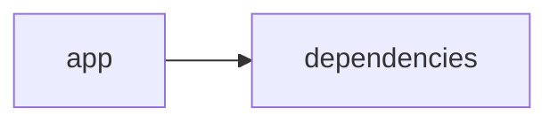

# Documentación del Proyecto

## Documentación Técnica

A continuación se presenta la documentación técnica completa en Markdown para desarrolladores del repositorio VoC Analyst. Este documento detalla la arquitectura, los componentes principales, las APIs internas, y las guías de desarrollo necesarias para comprender, extender e integrar el sistema.

---

# VoC Analyst – Documentación Técnica

VoC Analyst es una aplicación orientada al análisis de la Voz del Cliente, integrando procesos de extracción y normalización de datos de conversaciones (incluyendo la lectura de archivos PDF) con análisis avanzados apoyados en modelos de lenguaje (LLM). La interfaz se implementa mediante Streamlit, mientras que el backend aprovecha diferentes proveedores LLM (como OpenAI, Anthropic y Google GenAI) para generar insights y recomendaciones accionables.

---

## Tabla de Contenidos

1. [Resumen del Repositorio](#resumen-del-repositorio)
2. [Arquitectura General](#arquitectura-general)
3. [Componentes Principales](#componentes-principales)
   - [Aplicación Streamlit](#aplicación-streamlit)
   - [Módulo LLMBackend](#módulo-llmbackend)
   - [Parser de Conversaciones y Análisis](#parser-de-conversaciones-y-análisis)
4. [APIs Internas y Funciones Destacadas](#apis-internas-y-funciones-destacadas)
5. [Configuración y Dependencias](#configuración-y-dependencias)
6. [Guías de Desarrollo](#guías-de-desarrollo)
   - [Instalación y Ejecución](#instalación-y-ejecución)
   - [Extensión y Configuración del LLMBackend](#extensión-y-configuración-del-llmbackend)
   - [Pruebas y Validación](#pruebas-y-validación)
7. [Guía de Usuario](#guía-de-usuario)

---

## Resumen del Repositorio

- **Lenguajes**: Predominantemente código "other" (p.ej., Python).
- **Endpoints**: No se han detectado endpoints REST o similares, ya que la aplicación se ejecuta con Streamlit en una única interfaz.
- **Estructura General**:
  - La aplicación central se encuentra en el directorio `app` y depende de diversos módulos y librerías externas.
  - Se utiliza un diagrama Mermaid para visualizar la relación básica entre la aplicación y sus dependencias.

**Diagrama Mermaid:**



---

## Arquitectura General

La arquitectura del sistema consta de dos capas principales:

1. **Capa de Presentación (Frontend)**  
   Basada en Streamlit, esta capa se encarga de la visualización, interacción y carga de archivos (por ejemplo, archivos PDF). Se administran estados de sesión (como resultados del análisis y archivos subidos) para proporcionar una experiencia interactiva.

2. **Capa de Lógica de Negocio y Análisis (Backend)**  
   Incluye componentes para:
   - Procesar y extraer texto a partir de archivos PDF.
   - Implementar lógica de validación y procesamiento de archivos (por ejemplo, validación de tamaño).
   - Integrar análisis mediante modelos de lenguaje (LLM) a través del módulo LLMBackend, que es capaz de conectar con distintos proveedores según la configuración.

La comunicación entre ambas capas se realiza de forma directa en la aplicación Streamlit, sin intermediarios REST.

---

## Componentes Principales

### Aplicación Streamlit

- **Descripción:**  
  La interfaz principal se implementa en Streamlit, lo que permite la interacción en tiempo real y la visualización de resultados. Entre sus características principales se incluyen:
  - Configuración de la página y estado de sesión.
  - Manejo de archivos subidos, con funciones como la extracción de texto desde PDF.
  - Funciones utilitarias para validar el tamaño de los archivos y gestionar el flujo de procesamiento.

- **Ejemplos de Código:**
  - Inicialización del estado de sesión:
    ```python
    if 'analysis_results' not in st.session_state:
        st.session_state.analysis_results = None
    if 'run_id' not in st.session_state:
        st.session_state.run_id = None
    if 'uploaded_files_data' not in st.session_state:
        st.session_state.uploaded_files_data = []
    if 'processing_complete' not in st.session_state:
        st.session_state.processing_complete = False
    ```
  - Extracción de texto desde PDF:
    ```python
    def extract_text_from_pdf(pdf_file) -> str:
        """Extraer texto de archivo PDF"""
        try:
            pdf_reader = PyPDF2.PdfReader(pdf_file)
            text = ""
            for page in pdf_reader.pages:
                text += page.extract_text() + "\n"
            return text.strip()
        except Exception as e:
            st.error(f"Error al extraer texto de PDF: {str(e)}")
            return ""
    ```

### Módulo LLMBackend

- **Descripción:**  
  Este módulo es el encargado de la comunicación con diferentes proveedores de modelos de lenguaje. Define la estructura de configuración mediante la clase `ModelConfig` y gestiona la inicialización del cliente adecuado según el proveedor especificado (OpenAI, Anthropic o Google GenAI).

- **Componentes Clave:**
  - **ModelConfig:**  
    Define los parámetros necesarios para la conexión a un proveedor LLM, incluyendo el `provider`, `model`, la `api_key`, número de reintentos y el retardo entre reintentos.
    ```python
    @dataclass
    class ModelConfig:
        provider: str  # 'openai', 'anthropic', 'gemini'
        model: str
        api_key: str
        max_retries: int = 3
        retry_delay: float = 1.0
    ```
  - **LLMBackend:**  
    Implementa la lógica principal para la selección y comunicación con el proveedor LLM, inicializando el cliente mediante el método `_initialize_client` y cargando prompts para análisis y parsing.
    ```python
    class LLMBackend:
        """Backend service for LLM-based VoC analysis"""
        
        def __init__(self, config: ModelConfig):
            self.config = config
            self.client = self._initialize_client()
            self.parse_prompt = self._load_parse_prompt()
            self.analyze_prompt = self._load_analyze_prompt()
        
        def _initialize_client(self):
            """Initialize the appropriate LLM client"""
            if self.config.provider == 'openai':
                return OpenAI(api_key=self.config.api_key)
            elif self.config.provider == 'anthropic':
                return Anthropic(api_key=self.config.api_key)
            elif self.config.provider == 'gemini':
                return genai.Client(api_key=self.config.api_key)
            else:
                raise ValueError(f"Unsupported provider: {self.config.provider}")
    ```

### Parser de Conversaciones y Análisis

- **Descripción:**  
  Este componente se encarga de parsear la conversación a partir de archivos de texto o PDF, normalizando mensajes, extrayendo metadatos y redirigiendo información sensible (PII) a tags específicos.  
- **Requisitos y Funcionalidades:**
  - Extracción o derivación del `conversation_id`.
  - Detección del idioma y verificación de que el archivo contenga una sola conversación.
  - Análisis detallado a nivel de mensaje, asignando roles (cliente, agente o desconocido) según el contenido.
  - Redacción de PII mediante tags como [EMAIL], [PHONE], [CARD] y [ID].
  - Extracción de metadatos adicionales como `interaction_id`, `agent_id`, `channel` y duración.

- **Contexto de Análisis (VoC Conversation Parser):**  
  Se aplica en escenarios donde es necesario transformar una conversación cruda en un formato JSON estructurado para posteriores análisis de temas, emociones, sentimientos y recomendaciones.

---

## APIs Internas y Funciones Destacadas

Aunque la aplicación no expone endpoints REST, implementa diversas funciones internas y APIs que facilitan el procesamiento y análisis:

- **Extracción de Texto:**  
  Función: `extract_text_from_pdf(pdf_file) -> str`  
  Se encarga de leer un archivo PDF y devolver el texto extraído.

- **Validación de Archivos:**  
  Función: `validate_file_size(file) -> bool`  
  Valida que el tamaño del archivo no exceda el límite (por ejemplo, menor a 100MB).

- **LLMBackend API:**  
  Métodos clave:
  - `_initialize_client()`: Inicializa el cliente del proveedor LLM correspondiente.
  - `_load_parse_prompt()` y `_load_analyze_prompt()`: Cargan los prompts de análisis y parsing que guiarán la generación de insights.

- **Parser y Redacción PII:**  
  Funcionalidades para identificar y redirigir información sensible dentro de las conversaciones siguiendo patrones definidos.

---

## Configuración y Dependencias

El proyecto se apoya en diversas librerías y dependencias clave:

- **Librerías Principales:**
  - Streamlit (>=1.49.1): Para la interfaz de usuario.
  - PyPDF2 (>=3.0.1): Para la extracción de texto desde PDF.
  - Pandas (>=2.3.2): Para el manejo y procesamiento de datos.
  - OpenAI (>=1.106.1), Anthropic (>=0.66.0) y google-genai (>=1.33.0): Para la interacción con modelos LLM.
  
- **Archivo de Requerimientos:**
  El proyecto incluye un archivo de requerimientos (por ejemplo, requirements.txt) con la lista completa:
  ```
  streamlit>=1.49.1
  openai>=1.106.1
  anthropic>=0.66.0
  google-genai>=1.33.0
  pandas>=2.3.2
  pypdf2>=3.0.1
  ```

---

## Guías de Desarrollo

### Instalación y Ejecución

1. **Clonar el repositorio:**
   ```bash
   git clone https://github.com/tu_usuario/VoC-Analyst.git
   cd VoC-Analyst
   ```

2. **Instalar dependencias:**
   Se recomienda utilizar un entorno virtual.
   ```bash
   python -m venv venv
   source venv/bin/activate  # En Windows usa: venv\Scripts\activate
   pip install -r requirements.txt
   ```

3. **Ejecutar la aplicación:**
   La aplicación se ejecuta a través de Streamlit.
   ```bash
   streamlit run app/app.py
   ```

### Extensión y Configuración del LLMBackend

- **Configuración del Modelo LLM:**
  - Crea o modifica un objeto `ModelConfig` para definir el proveedor (p.ej., "openai"), el modelo específico, y la clave API.
  - Ejemplo:
    ```python
    from llm_backend import LLMBackend, ModelConfig

    config = ModelConfig(
        provider="openai",
        model="gpt-4",
        api_key="TU_API_KEY_AQUI"
    )
    llm_service = LLMBackend(config)
    ```

- **Agregar Nuevas Funcionalidades:**
  - Para integrar un nuevo proveedor o modificar la lógica de parsing/análisis, se recomienda:
    - Revisar e implementar en el módulo LLMBackend.
    - Añadir métodos específicos para la inicialización del nuevo proveedor.
    - Actualizar los prompts (análisis y parsing) que configuran la interacción con el LLM.

### Pruebas y Validación

- **Pruebas Unitarias:**  
  Implementar pruebas unitarias para cada función crítica (por ejemplo, `extract_text_from_pdf` y validaciones de archivos) utilizando frameworks como pytest.
  
- **Validación de Integración:**  
  Ejecutar flujos de procesamiento completos mediante la interfaz de Streamlit y validar que:
  - La extracción de texto se realice correctamente.
  - El parsing de conversaciones y redacción de PII funcione de acuerdo con lo esperado.
  - El módulo LLMBackend se comunique correctamente con el proveedor configurado.

---

## Guía de Usuario

Aunque este documento se centra en aspectos de desarrollo, se incluye una breve guía de usuario para comprender el flujo de la aplicación:

1. **Subir Archivos:**  
   Utiliza la interfaz de Streamlit para cargar archivos (p.ej., PDFs).  
   
2. **Visualización y Análisis:**  
   La aplicación procesa el archivo, extrae el texto, normaliza la información y realiza análisis mediante el LLM configurado, mostrando los resultados en tiempo real en la interfaz.  
   
3. **Interpretación de Resultados:**  
   Los resultados incluyen insights sobre la Voz del Cliente, como descubrimiento de temas, análisis de sentimiento y emociones, y recomendaciones basadas en los análisis generados.

---

## Consideraciones Finales

- La arquitectura modular permite extender funcionalidades, tanto en la parte frontend (Streamlit) como en la lógica de negocio (LLMBackend y Parser).
- Se recomienda documentar cualquier cambio o adición en el código siguiendo las pautas establecidas en esta documentación para mantener la consistencia y facilitar la colaboración.
- El uso de configuraciones centralizadas para la conexión de proveedores LLM permite que el sistema se adapte fácilmente a cambios o integraciones futuras sin modificar el flujo principal del análisis.

Esta documentación está diseñada para servir como guía de referencia para desarrolladores nuevos y actuales que deseen comprender, mantener o extender el proyecto VoC Analyst.  
  
¡Bienvenido y feliz desarrollo!


## Diagrama


---

## Guía de Usuario

# Guía de Usuario para la Herramienta de Análisis y Procesamiento de Información

Esta documentación está diseñada para ayudarte a entender y utilizar la aplicación de análisis de información. La herramienta combina una interfaz web interactiva (basada en Streamlit) con capacidades avanzadas de procesamiento de archivos PDF y análisis con modelos de lenguaje (IA), permitiendo además el análisis de conversaciones, sentimientos y emociones.

---

## Descripción de la Aplicación

La aplicación es una solución integral para:
- **Visualización y análisis interactivo:** Se basa en una interfaz web intuitiva creada con Streamlit.
- **Procesamiento de archivos PDF:** Permite la carga y extracción de información de documentos en formato PDF.
- **Análisis con modelos de lenguaje (IA):** Emplea algoritmos de inteligencia artificial para procesar y analizar el contenido textual.
- **Análisis de conversaciones:** Capacidad para analizar diálogos y extraer información relevante.
- **Análisis de sentimientos y emociones:** Detecta y clasifica emociones y sentimientos en textos de entrada.

Con estas funcionalidades, la herramienta se posiciona como un recurso eficaz para el análisis y la extracción de insights a partir de grandes volúmenes de información textual.

---

## Principales Funcionalidades

1. **Interfaz Web Interactiva:**
   - Construida con Streamlit, permite una experiencia de usuario amigable e intuitiva.
   - Acceso a través de un endpoint web para usar la aplicación desde cualquier navegador.

2. **Procesamiento de Archivos PDF:**
   - Carga y extracción de información de PDFs.
   - Transformación de datos en formatos adecuados para su análisis posterior.

3. **Análisis con Modelos de Lenguaje (IA):**
   - Aplicación de modelos avanzados de procesamiento del lenguaje natural para interpretar y analizar textos.
   - Capacidad para identificar temas, relaciones y patrones en el contenido textual.

4. **Análisis de Conversaciones:**
   - Evaluación de diálogos y conversaciones para extraer conclusiones y puntos relevantes.
   - Útil para el monitoreo de interacciones y la evaluación de la comunicación.

5. **Análisis de Sentimientos y Emociones:**
   - Detección automática de sentimientos (positivo, negativo o neutral) en el texto.
   - Identificación de emociones, permitiendo una comprensión más profunda de la interacción humana.

---

## Uso de la Aplicación

### Requisitos Previos

- Tener acceso a Internet y un navegador web compatible.
- Conocimientos básicos en el uso de interfaces web.
- (Opcional) Conocimientos sobre el manejo de archivos PDF y la interpretación de resultados de análisis de sentimientos.

### Instrucciones Paso a Paso

1. **Acceso a la Aplicación:**
   - Ingresa al endpoint web proporcionado para acceder a la interfaz interactiva de la aplicación.

2. **Carga del Archivo PDF:**
   - Utiliza la opción de carga para seleccionar el archivo PDF que deseas analizar.
   - La herramienta extraerá el contenido textual del PDF de forma automática para su análisis.

3. **Configuración del Análisis:**
   - Selecciona el tipo de análisis que deseas realizar:
     - Análisis por modelos de lenguaje (IA).
     - Análisis de conversaciones.
     - Análisis de sentimientos y emociones.
   - Configura las opciones disponibles según tus necesidades (por ejemplo, ajustes de intensidad del análisis o selección de secciones específicas del documento).

4. **Ejecución y Visualización de Resultados:**
   - Inicia el proceso de análisis y espera unos instantes mientras se procesan los datos.
   - Los resultados serán presentados en la misma interfaz, resaltando las conclusiones relevantes, puntuaciones de sentimiento y cualquier otra información procesada.

5. **Exportación y Uso de Resultados:**
   - Si es necesario, exporta o guarda los resultados para informes o análisis adicionales.
   - Utiliza las visualizaciones y resúmenes generados para tomar decisiones o profundizar en los datos.

---

## Preguntas Frecuentes (FAQ)

1. **¿Qué tipos de archivos PDF puedo cargar?**  
   La aplicación soporta la carga de archivos PDF que contengan texto seleccionable. Los PDFs que contengan imágenes o texto en formato no reconocible pueden requerir un procesamiento adicional (ejemplo: OCR).

2. **¿Cómo garantiza la herramienta la privacidad y seguridad de mi información?**  
   La aplicación está diseñada para procesar la información de manera segura. Los datos se manejan de forma local o en entornos seguros, dependiendo de la configuración implementada. Se recomienda revisar la política de privacidad adjunta o comunicarse con el administrador para detalles específicos.

3. **¿Qué modelos de lenguaje utiliza la aplicación para el análisis?**  
   Se utilizan modelos avanzados de IA y lenguaje natural (por ejemplo, bibliotecas de Python especializadas y APIs de procesamiento del lenguaje) que permiten extraer insights y clasificar emociones y sentimientos de manera eficaz.

4. **¿Es posible analizar otros tipos de contenido o formatos distintos a archivos PDF?**  
   Actualmente, la funcionalidad principal está orientada al procesamiento de archivos PDF. Sin embargo, se está evaluando la expansión a otros formatos de texto.

5. **¿Cómo puedo solucionar problemas de carga o errores durante el análisis?**  
   - Verifica que el archivo PDF esté en buen estado y que el contenido sea reconocible.
   - Si el problema persiste, recarga la aplicación o verifica la conexión a Internet.
   - Consulta la sección de soporte o contáctanos para asistencia técnica.

6. **¿Puedo personalizar el análisis de sentimientos y emociones?**  
   La herramienta permite ajustar ciertos parámetros del análisis, adaptándose a las necesidades específicas del usuario. Por ejemplo, se pueden configurar umbrales de sensibilidad o seleccionar secciones específicas del texto para un análisis más detallado.

---

## Conclusión

Esta guía ha presentado una visión general detallada de la aplicación, destacando sus principales funcionalidades y proporcionando instrucciones claras para su uso. La herramienta es ideal para quienes buscan transformar grandes volúmenes de datos PDF en insights accionables a través del poder de la inteligencia artificial.

Si tienes alguna otra duda o necesitas asistencia adicional, por favor, revisa nuestras FAQ o contacta al equipo de soporte.

¡Disfruta explorando y analizando tu información con nuestra herramienta!