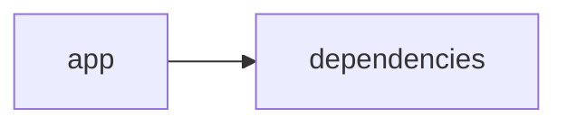

# Documentación del Proyecto

## Documentación Técnica

A continuación se presenta la documentación técnica completa en Markdown orientada a desarrolladores, que detalla la arquitectura, los componentes principales, las APIs internas y las guías de desarrollo para el repositorio VoC Analyst.

-----------------------------

# VoC Analyst – Documentación Técnica

VoC Analyst es una aplicación destinada al análisis de la Voz del Cliente (VoC). La aplicación combina la extracción y procesamiento de archivos (por ejemplo, PDFs) con análisis de conversaciones e inteligencia artificial a través de Modelos de Lenguaje (LLM). La interfaz se implementa con Streamlit, lo que permite una experiencia web interactiva, mientras que el backend integra proveedores de LLM (como OpenAI, Anthropic y Google GenAI) para generar insights y recomendaciones accionables.

-----------------------------

## Tabla de Contenidos

1. [Resumen del Repositorio](#resumen-del-repositorio)
2. [Arquitectura General](#arquitectura-general)
3. [Componentes Principales](#componentes-principales)  
   3.1 [Aplicación Streamlit](#aplicación-streamlit)  
   3.2 [Módulo LLMBackend](#módulo-llmbackend)  
   3.3 [Parser de Conversaciones y Análisis](#parser-de-conversaciones-y-análisis)
4. [APIs Internas y Funciones Destacadas](#apis-internas-y-funciones-destacadas)
5. [Configuración y Dependencias](#configuración-y-dependencias)
6. [Guías de Desarrollo](#guías-de-desarrollo)  
   6.1 [Instalación y Ejecución](#instalación-y-ejecución)  
   6.2 [Extensión y Configuración de LLMBackend](#extensión-y-configuración-de-llmbackend)  
   6.3 [Pruebas y Validación](#pruebas-y-validación)
7. [Diagrama del Sistema](#diagrama-del-sistema)

-----------------------------

## 1. Resumen del Repositorio

- **Lenguajes:** Se detectaron aproximadamente 10 archivos de tipo "other", indicando que la mayor parte del código es Python y scripts complementarios.
- **Endpoints:** No se han detectado endpoints expuestos, ya que la comunicación se realiza internamente (para uso de Streamlit y LLM).
- **Objetivo:** Permitir la carga, procesamiento y análisis de información (por ejemplo, archivos PDF y textos de conversaciones) para extraer insights sobre la Voz del Cliente.

-----------------------------

## 2. Arquitectura General

El sistema se compone de dos grandes bloques:

- **Frontend Web con Streamlit:**  
  Proporciona una interfaz interactiva en la que el usuario puede cargar documentos, visualizar resultados y realizar análisis.
  
- **Backend LLM y Procesamiento:**  
  Incluye módulos para:
  - Extraer y normalizar datos de archivos (por ejemplo, extracción de texto de PDF).
  - Conectar e integrar múltiples proveedores LLM a través del módulo LLMBackend.
  - Procesar y analizar conversaciones y datos para extraer información (por ejemplo, análisis de sentimiento y emociones).

A continuación se presenta un diagrama en Mermaid que ilustra brevemente la relación entre los componentes:

```mermaid
graph LR
    A[app (Streamlit)] --> B[dependencies]
    A --> C[LLMBackend]
    A --> D[Parser y Procesamiento de Conversaciones]
    C --> E[OpenAI / Anthropic / Google GenAI]
```

-----------------------------

## 3. Componentes Principales

### 3.1 Aplicación Streamlit

- **Función principal:**  
  La aplicación se inicia configurando la interfaz (título, icono y estado del sidebar) utilizando la función `st.set_page_config` de Streamlit.  

- **Gestión del estado:**  
  Se inicializa el estado de sesión (`st.session_state`) para almacenar resultados de análisis, identificador de ejecución (`run_id`), archivos cargados y estado del procesamiento.

- **Integración con funcionalidades de procesamiento:**  
  Proporciona funciones auxiliares como:
  - Extracción de texto de archivos PDF _(función extract_text_from_pdf)_.
  - Validación del tamaño del archivo para asegurar que se encuentre dentro de límites aceptables (por ejemplo, menor a 100MB).

### 3.2 Módulo LLMBackend

- **Propósito:**  
  Gestionar la interacción con distintos proveedores de modelos de lenguaje (LLM).

- **Clases y Estructuras:**
  - `ModelConfig`: Un `dataclass` que almacena la configuración para cada proveedor, incluyendo:
    - Proveedor ("openai", "anthropic", o "gemini")
    - Modelo específico a usar.
    - API key para autenticación.
    - Parámetros de reintento (número de reintentos y retraso entre intentos).

  - `LLMBackend`:  
    Implementa la lógica para:
    - Inicializar el cliente LLM basado en la configuración.
    - Cargar los prompts o plantillas para el parseo y análisis.
    - Manejar la comunicación y las llamadas a la API del proveedor seleccionado.

- **Soporte para múltiples proveedores:**  
  Se incluye el soporte a través de condicionales que verifican el valor de `provider` y, en función de éste, inicializan el cliente correspondiente.
  
- **Ejemplo de inicialización:**  
  Cuando se utiliza el proveedor "openai", se crea una instancia del cliente OpenAI utilizando la clave de API:
  ```python
  if self.config.provider == 'openai':
      return OpenAI(api_key=self.config.api_key)
  ```

### 3.3 Parser de Conversaciones y Análisis

- **Objetivo del Parser:**  
  Transformar textos brutos de interacciones en conversaciones estructuradas en formato JSON.  
  Este proceso incluye:
  - Identificar la conversación mediante `conversation_id`.
  - Normalizar el contenido de cada mensaje.
  - Detectar metadatos (por ejemplo, tiempos de mensaje, roles de los interlocutores o el canal de comunicación).

- **Principales funciones:**
  - **Extracción de metadata:** Se obtienen elementos como `interaction_id`, `agent_id` o duración del contacto si están presentes.
  - **PII Redaction:** Las funciones específicas reemplazan datos sensibles (correo electrónico, números telefónicos, tarjetas de crédito, identificaciones) substituyéndolos por etiquetas estándar (por ejemplo, [EMAIL], [PHONE]).
  - **Control de errores:** Se implementan métodos para validar que el archivo procesado contenga una única conversación, retornando errores en caso de detectar múltiples interacciones.

-----------------------------

## 4. APIs Internas y Funciones Destacadas

Aunque el repositorio no expone endpoints HTTP, la lógica interna presenta las siguientes funciones y APIs internas:

- **Funciones de extracción:**
  - `extract_text_from_pdf(pdf_file)`:  
    Extrae y concatena el texto de todas las páginas de un archivo PDF usando PyPDF2, notificando errores a la interfaz en caso de fallo.

  - `validate_file_size(file)`:  
    Valida que el tamaño del archivo no exceda un límite definido (por ejemplo, 100MB).

- **Módulo LLMBackend:**
  - `_initialize_client()`:  
    Función interna para instanciar el cliente del proveedor (OpenAI, Anthropic o Gemini).
  
  - `_load_parse_prompt()` y `_load_analyze_prompt()`:  
    Métodos para cargar los prompts (plantillas) utilizados en la interacción con el LLM.

- **Parser de Conversaciones:**  
  Existen funciones específicas para separar cada turno en la conversación, determinar el `speaker_role` (cliente, agente o desconocido) y extraer metadatos del documento o del header.

-----------------------------

## 5. Configuración y Dependencias

### Dependencias Clave

- **Streamlit:** (>=1.49.1) Interfaz web interactiva.
- **PyPDF2:** (>=3.0.1) Extracción de texto de archivos PDF.
- **Pandas:** (>=2.3.2) Manipulación y análisis de datos.
- **LLM SDKs:**  
  - `openai` (>=1.106.1): Para integración con modelos de OpenAI.
  - `anthropic` (>=0.66.0): Para uso de los modelos de Anthropic.
  - `google-genai` (>=1.33.0): Para integración con los modelos de Google GenAI.

### Instalación

Para instalar las dependencias se puede utilizar el archivo requirements.txt con el siguiente contenido:

-------------------------------------------------
streamlit>=1.49.1  
openai>=1.106.1  
anthropic>=0.66.0  
google-genai>=1.33.0  
pandas>=2.3.2  
pypdf2>=3.0.1  
-------------------------------------------------

Instalar con:

    pip install -r requirements.txt

-----------------------------

## 6. Guías de Desarrollo

### 6.1 Instalación y Ejecución

1. Clonar el repositorio:

       git clone <URL-del-repositorio>
       cd <nombre-del-repositorio>

2. Instalar las dependencias:

       pip install -r requirements.txt

3. Ejecutar la aplicación:

       streamlit run app.py

*Nota:* El nombre del archivo principal puede variar; verificar el punto de entrada definido en el repositorio.

### 6.2 Extensión y Configuración de LLMBackend

- **Configuración de modelos:**  
  Se utiliza la clase `ModelConfig` para configurar el proveedor, el modelo y la clave API de cada proveedor de LLM. Para extender el soporte a nuevos proveedores o modificar parámetros, ajustar o extender esta clase y el método `_initialize_client()` en `LLMBackend`.

- **Integración de nuevos prompts:**  
  Los métodos `_load_parse_prompt()` y `_load_analyze_prompt()` son puntos clave donde se cargan las plantillas para la generación de prompts. Los desarrolladores pueden actualizar o extender estos prompts según las necesidades del análisis.

### 6.3 Pruebas y Validación

- **Pruebas Unitarias:**  
  Se recomienda implementar y/o extender pruebas unitarias para:
  - Validar la correcta extracción de texto de diferentes PDFs.
  - Verificar que la redacción de PII en conversaciones sea correcta.
  - Simular llamadas a proveedores de LLM usando mocks para asegurar la integración sin requerir llamadas reales a APIs externas.

- **Validación de Conversaciones:**  
  Revisar que el parser procesador de conversaciones cumpla con detectar:
  - Un único flujo conversacional.
  - Extracción correcta de timestamps y roles.
  - Identificación y redacción de información sensible.

-----------------------------

## 7. Diagrama del Sistema

A continuación se presenta un diagrama en Mermaid que resume gráficamente la arquitectura y la interacción entre los componentes principales:

```mermaid
graph LR
    A[Interfaz Streamlit] --> B[Extracción y Validación]
    B --> C[Parser de Conversaciones]
    B --> D[Extracción de PDFs]
    A --> E[LLMBackend]
    E --> F[Proveedor LLM (OpenAI/Anthropic/Gemini)]
```

-----------------------------

## Conclusión

Esta documentación técnica está diseñada para proporcionar una visión completa del funcionamiento interno de VoC Analyst, facilitando la labor de desarrollo, mantenimiento y extensión del sistema. Se recomienda a los desarrolladores revisar a fondo cada módulo, especialmente la integración de LLM, para adaptar o ampliar las funcionalidades según los requerimientos del negocio.

Para cualquier duda adicional o para reportar incidencias, se sugiere revisar el sistema de issues del repositorio y la guía de contribución incluida.

Happy Coding!


## Diagrama



---

## Guía de Usuario

# Guía de Usuario: Herramienta de Análisis y Procesamiento de Información

Bienvenido a la herramienta de análisis y procesamiento de información. Esta aplicación, desarrollada con Python y potenciada por la biblioteca Streamlit, permite realizar un análisis avanzado de documentos PDF utilizando modelos de lenguaje basados en inteligencia artificial (IA).

---

## Tabla de Contenidos

1. [Descripción General](#descripción-general)
2. [Principales Funcionalidades](#principales-funcionalidades)
3. [Cómo Usar la Aplicación](#cómo-usar-la-aplicación)
4. [Preguntas Frecuentes (FAQ)](#preguntas-frecuentes-faq)
5. [Soporte y Contacto](#soporte-y-contacto)

---

## Descripción General

La aplicación integra una interfaz web interactiva mediante Streamlit, facilitando la carga y el procesamiento de archivos PDF. Una vez cargados, la herramienta utiliza modelos de lenguaje de inteligencia artificial para analizar y extraer información relevante, brindando resultados claros y precisos. Diseñada para usuarios que requieren extraer, procesar y obtener insights de documentos, esta herramienta es ideal tanto para profesionales como para investigadores.

---

## Principales Funcionalidades

- **Interfaz Web Interactiva:**  
  Utilizando Streamlit, la aplicación ofrece una experiencia de usuario intuitiva y accesible directamente desde el navegador.

- **Procesamiento de Archivos PDF:**  
  Permite la carga y análisis estructurado de documentos PDF, extrayendo el contenido necesario de forma automatizada.

- **Análisis con Modelos de Lenguaje (IA):**  
  Aplica algoritmos de inteligencia artificial para interpretar, resumir y extraer información valiosa de los documentos procesados.

- **Flujo de Trabajo Simplificado:**  
  La integración de funcionalidades permite a los usuarios seguir un proceso claro desde la carga del archivo hasta la obtención de resultados.

---

## Cómo Usar la Aplicación

### 1. Requisitos Previos

- Tener Python instalado en el sistema (preferiblemente la versión 3.8 o superior).
- Acceso a un navegador web moderno para utilizar la interfaz de Streamlit.
- Conexión a Internet (según configuración de la API del modelo de lenguaje).

### 2. Instalación y Ejecución

1. **Clonar el Repositorio:**  
   Descargue o clone el repositorio que contiene el código fuente de la aplicación.
   ```
   git clone https://github.com/tu-repositorio/herramienta-analisis.git
   ```

2. **Instalar Dependencias:**  
   Acceda al directorio del proyecto e instale los paquetes necesarios, por ejemplo:
   ```
   cd herramienta-analisis
   pip install -r requirements.txt
   ```

3. **Ejecutar la Aplicación:**  
   Inicie la aplicación utilizando Streamlit.
   ```
   streamlit run app.py
   ```
   Una vez ejecutado, se abrirá automáticamente la interfaz en su navegador.

### 3. Uso en la Interfaz Web

- **Carga del Archivo PDF:**  
  En la página principal, utilice el botón de carga para seleccionar su archivo PDF.

- **Procesamiento y Análisis:**  
  Después de la carga, la aplicación procesará el documento y aplicará los modelos de lenguaje para extraer relevante información.

- **Visualización de Resultados:**  
  Los resultados se mostrarán en formato de resumen, análisis detallado y, en algunos casos, visualizaciones interactivas.  
  Utilice los elementos interactivos (botones, menús desplegables, etc.) para explorar los resultados.

- **Exportación de Resultados (si está habilitado):**  
  Puede exportar los resultados en diferentes formatos (por ejemplo, PDF o CSV) para su posterior análisis o documentación.

---

## Preguntas Frecuentes (FAQ)

**P1: ¿Qué tipos de documentos puedo analizar?**  
R: Actualmente, la herramienta está diseñada para procesar y analizar archivos PDF. La integración y soporte de otros formatos pueden implementarse en futuras versiones.

**P2: ¿Requiere conexión a Internet para funcionar?**  
R: Sí, se requiere conexión a Internet para acceder a los modelos de lenguaje basados en inteligencia artificial, a menos que se disponga de una versión local del modelo.

**P3: ¿Cómo se garantiza la seguridad de mis datos?**  
R: La aplicación procesa los archivos localmente siempre que la configuración lo permita. Si se utiliza una API externa, los datos se transmiten utilizando protocolos seguros. Se recomienda revisar la política de privacidad antes de utilizar la herramienta en información sensible.

**P4: ¿Puedo utilizar la herramienta para análisis masivo de documentos?**  
R: Sí, la aplicación está diseñada para ser escalable. Sin embargo, el rendimiento dependerá de la capacidad del hardware y de la configuración del servidor.

**P5: ¿Qué debo hacer si encuentro un error en la aplicación?**  
R: Puede reportar cualquier problema a través de nuestro sistema de soporte, proporcionando detalles del error y los pasos para reproducirlo.

---

## Soporte y Contacto

Si necesita más información, asistencia o desea reportar un problema, póngase en contacto con el equipo de soporte:

- **Correo Electrónico:** soporte@herramienta-analisis.com  
- **Sitio Web:** [www.herramienta-analisis.com](https://www.herramienta-analisis.com)  
- **Foro de la Comunidad:** [Foro de Usuarios](https://foro.herramienta-analisis.com)

¡Gracias por utilizar nuestra herramienta de análisis y procesamiento de información!  
Disfrute de una experiencia interactiva y eficiente en el análisis de sus documentos PDF.