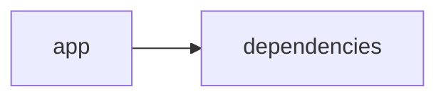

# Documentación del Proyecto

## Documentación Técnica

A continuación se presenta la documentación técnica completa en Markdown para desarrolladores del repositorio VoC Analyst. Esta documentación ha sido elaborada a partir del análisis del código fuente y la estructura del repositorio, incluyendo la arquitectura general, componentes principales, APIs internas, y guías para facilitar la extensión, integración y mantenimiento del sistema.

---

# VoC Analyst – Documentación Técnica

VoC Analyst es una aplicación diseñada para analizar la Voz del Cliente a partir de interacciones y conversaciones. La herramienta permite la carga y procesamiento de archivos (por ejemplo, PDFs), la extracción de texto, la normalización y el análisis de conversaciones, y la generación de insights mediante modelos de lenguaje (LLM). La interfaz se implementa con Streamlit, mientras que el backend se integra con múltiples proveedores LLM (OpenAI, Anthropic, Google GenAI) para generar recomendaciones y análisis de sentimientos, emociones y otros patrones relevantes.

---

## Índice

1. [Resumen del Repositorio](#resumen-del-repositorio)
2. [Arquitectura General](#arquitectura-general)
3. [Componentes Principales](#componentes-principales)  
   3.1 [Aplicación Streamlit](#aplicación-streamlit)  
   3.2 [Módulo LLMBackend](#módulo-llmbackend)  
   3.3 [Parser y Procesamiento de Conversaciones](#parser-y-procesamiento-de-conversaciones)
4. [APIs Internas y Funciones Destacadas](#apis-internas-y-funciones-destacadas)
5. [Configuración y Dependencias](#configuración-y-dependencias)
6. [Guía de Desarrollo](#guía-de-desarrollo)  
   6.1 [Instalación y Ejecución](#instalación-y-ejecución)  
   6.2 [Extender y Configurar LLMBackend](#extender-y-configurar-llmbackend)  
   6.3 [Pruebas y Validación](#pruebas-y-validación)
7. [Diagrama del Sistema](#diagrama-del-sistema)
8. [Guía de Usuario](#guía-de-usuario)

---

## Resumen del Repositorio

- **Lenguajes:**  
  Se identificaron 11 archivos o fragmentos de código en lenguajes "other", los cuales incluyen scripts en Python, configuraciones y módulos auxiliares.

- **Endpoints:**  
  No se han detectado endpoints REST o similares, ya que la aplicación se ejecuta como una interfaz web interactiva a través de Streamlit.

- **Funcionalidad Principal:**  
  - Procesamiento y extracción de texto (por ejemplo, desde PDFs mediante PyPDF2).
  - Análisis de conversaciones y normalización de datos.
  - Integración con proveedores de LLM para el análisis de sentimientos, emociones y generación de recomendaciones.

---

## Arquitectura General

La aplicación se compone de dos grandes bloques funcionales:

1. **Interfaz de Usuario (Frontend):**  
   Implementada en Streamlit, provee una experiencia web interactiva para la carga de archivos, visualización de resultados y configuración de parámetros del análisis.

2. **Backend de Análisis e Integración con LLM:**  
   Este componente se encarga de:
   - Inicializar y gestionar el cliente de LLM (según proveedor: OpenAI, Anthropic o Gemini de Google).
   - Procesar peticiones de análisis y formatear prompts para obtener insights.
   - Manejar la extracción de texto de archivos PDF y normalizar el contenido de las conversaciones.

El siguiente diagrama Mermaid ilustra la relación entre la aplicación principal y sus dependencias:



---

## Componentes Principales

### Aplicación Streamlit

- **Configuración de Página:**  
  Se utiliza la función `st.set_page_config` para personalizar el título, ícono e iniciar el sidebar de la aplicación.

- **Gestión del Estado de la Sesión:**  
  Se inicializan variables en `st.session_state` para almacenar:
  - Resultados del análisis.
  - Identificador único de la operación (run_id).
  - Datos de archivos cargados.
  - Indicador de proceso completado.

- **Carga y Procesamiento de Archivos:**  
  Funciones como `extract_text_from_pdf` se encargan de la lectura de PDFs y la extracción del contenido textual, con manejo de errores a través de la interfaz de Streamlit.

### Módulo LLMBackend

- **Descripción:**  
  Este módulo encapsula la lógica para interactuar con diferentes proveedores de modelos de lenguaje (LLM). Se utiliza para enviar prompts de análisis, procesar las respuestas y generar insights basados en la voz del cliente.

- **Estructura Principal:**

  - **Clase ModelConfig:**  
    Define la configuración del modelo LLM, incluyendo:
    - Proveedor (por ejemplo, 'openai', 'anthropic', 'gemini').
    - Nombre del modelo.
    - API Key y parámetros de reintentos en caso de fallos.

  - **Clase LLMBackend:**  
    Encapsula el flujo de trabajo para:
    - Inicializar el cliente específico de LLM.
    - Cargar y gestionar los prompts de análisis.
    - Enviar solicitudes y recibir respuestas del LLM.
    
  - **Inicialización del Cliente:**  
    La función `_initialize_client()` determina cuál es el proveedor configurado y retorna la instancia correspondiente del API client.

- **Ejemplo de Uso:**

  Aquí se muestra un fragmento relevante del código:

  ```python
  @dataclass
  class ModelConfig:
      provider: str  # 'openai', 'anthropic', 'gemini'
      model: str
      api_key: str
      max_retries: int = 3
      retry_delay: float = 1.0

  class LLMBackend:
      def __init__(self, config: ModelConfig):
          self.config = config
          self.client = self._initialize_client()
          self.parse_prompt = self._load_parse_prompt()
          self.analyze_prompt = self._load_analyze_prompt()

      def _initialize_client(self):
          if self.config.provider == 'openai':
              return OpenAI(api_key=self.config.api_key)
          elif self.config.provider == 'anthropic':
              return Anthropic(api_key=self.config.api_key)
          elif self.config.provider == 'gemini':
              return genai.Client(api_key=self.config.api_key)
          else:
              raise ValueError(f"Proveedor no soportado: {self.config.provider}")
  ```

### Parser y Procesamiento de Conversaciones

- **Objetivo:**  
  Procesar archivos de transcripciones de interacciones, normalizar el contenido y aplicar reglas de anonimización (redacción de PII).

- **Funcionalidades Principales:**
  - **Identificación de Conversación:**  
    Se extrae o deriva el `conversation_id`, detecta el idioma y verifica que se trate de una única interacción.
    
  - **Parsing de Mensajes:**  
    Se identifican cada uno de los turnos en la conversación, extrayendo:
    - Timestamps (cuando estén presentes).
    - Rol del interlocutor (cliente, agente o desconocido).
    - Canales de comunicación (chat, email, llamada, etc.).

  - **Redacción de PII:**  
    Se reemplaza información confidencial como emails, teléfonos, tarjetas de crédito e identificadores personales por etiquetas genéricas (por ejemplo, `[EMAIL]`, `[PHONE]`).

  - **Metadatos y Validación:**  
    Se busca extraer detalles adicionales (ID de interacción, duración, etc.) y se contempla la detección de errores y validaciones necesarias.

- **Requisitos de Análisis (ejemplo de reglas):**
  - Para la asignación de temas a las interacciones se definen:
    - Identificación de 5 a 20 temas.
    - Generación de identificadores y etiquetas concisas.
    - Asignación de puntuaciones de sentimiento y análisis de emociones.

---

## APIs Internas y Funciones Destacadas

Aunque la aplicación no expone endpoints REST convencionales, dispone de varias funciones internas que actúan como APIs para el procesamiento de datos:

- **extract_text_from_pdf(pdf_file) → str:**  
  Extrae y retorna el texto contenido en un PDF. Maneja excepciones y notifica errores utilizando el componente de Streamlit.

- **validate_file_size(file) → bool:**  
  Verifica que el tamaño del archivo subido sea inferior a 100MB y retorna un booleano.

- **Funciones de LLMBackend:**  
  - Envío de prompts configurados para parsear conversaciones.
  - Análisis y procesamiento de respuestas para obtener insights de los modelos LLM.

- **Parser de Conversaciones:**  
  Funciones que transforman el contenido de las transcripciones en un formato JSON estructurado, permitiendo la posterior integración con el análisis de LLM.

---

## Configuración y Dependencias

- **Lenguaje y Entorno:**  
  La implementación principal se realiza en Python y utiliza bibliotecas y frameworks como:
  - Streamlit (para la interfaz de usuario).
  - PyPDF2 (para la extracción de texto de archivos PDF).
  - Pandas (para manejo y análisis de datos).
  - Librerías específicas de cada proveedor de LLM:
    - openai para OpenAI.
    - anthropic para Anthropic.
    - google.genai para Google Gemini.

- **Gestión de Dependencias:**  
  Se recomienda utilizar un entorno virtual (por ejemplo, virtualenv o conda) y gestionar las dependencias mediante un archivo requirements.txt. Un ejemplo básico de requirements.txt podría incluir:

  ```
  streamlit
  PyPDF2
  pandas
  openai
  anthropic
  google-genai
  ```

- **Variables de Configuración:**  
  Las API keys y otros parámetros sensibles deben configurarse mediante variables de entorno o archivos de configuración externos para evitar exponer información sensible en el repositorio.

---

## Guía de Desarrollo

### Instalación y Ejecución

1. **Clonar el Repositorio:**

   ```bash
   git clone https://github.com/tu_usuario/voc-analyst.git
   cd voc-analyst
   ```

2. **Crear y Activar un Entorno Virtual:**

   ```bash
   python3 -m venv venv
   source venv/bin/activate   # En Windows: venv\Scripts\activate
   ```

3. **Instalar Dependencias:**

   ```bash
   pip install -r requirements.txt
   ```

4. **Ejecutar la Aplicación:**

   ```bash
   streamlit run app.py
   ```

   Esto iniciará la aplicación en modo local y se podrá acceder al navegador para interactuar con la interfaz.

### Extender y Configurar LLMBackend

- **Añadir Nuevos Proveedores:**  
  Para incorporar un nuevo proveedor de LLM, se debe:
  - Actualizar la clase ModelConfig para incluir nuevos parámetros si es necesario.
  - Modificar el método `_initialize_client()` en LLMBackend para crear e inicializar el cliente correspondiente.
  
- **Modificar Prompts de Análisis:**  
  Las funciones `_load_parse_prompt()` y `_load_analyze_prompt()` permiten cargar y modificar los textos de ejemplo o las instrucciones para el procesamiento de las conversaciones. Estos prompts son críticos para la generación de análisis precisos y deben ajustarse conforme a los requisitos del proyecto.

### Pruebas y Validación

- **Pruebas Unitarias:**  
  Se recomienda la implementación de tests unitarios para funciones críticas, como la extracción de texto, la validación del tamaño de archivos, y el procesamiento de mensajes. Utiliza herramientas como pytest para facilitar la ejecución de tests.
  
- **Validación de Integración con LLM:**  
  Para garantizar la interacción correcta con los proveedores de LLM, se debe simular peticiones y verificar las respuestas. Considera la implementación de mocks para simular comportamientos en entornos de prueba.

- **Manejo de Errores y Logs:**  
  Asegúrate de que se capturen y registren errores de forma adecuada. El módulo logging ya está configurado para emitir mensajes informativos; es recomendable seguir esta práctica en nuevas funciones y módulos.

---

## Diagrama del Sistema

El siguiente diagrama Mermaid resume la estructura y dependencia principal de la aplicación:

```mermaid
graph LR
    A[Aplicación Streamlit] --> B[Módulo LLMBackend]
    A --> C[Parser de Conversaciones]
    B --> D[Proveedores LLM (OpenAI, Anthropic, Gemini)]
    C --> D
```

---

## Guía de Usuario

Además de la documentación técnica para desarrolladores, se cuenta con una guía de usuario orientada a los analistas y usuarios finales que describe:

- **Carga y procesamiento de archivos PDF.**
- **Visualización interactiva de resultados en la interfaz de Streamlit.**
- **Interpretación de resultados de análisis (temas, sentimientos, emociones y recomendaciones).**
- **Opciones de personalización y configuración de análisis a través del panel de usuario.**

Los usuarios podrán experimentar con el análisis de sus interacciones y ajustar parámetros según sus necesidades, obteniendo insights accionables para mejorar la experiencia del cliente.

---

Esta documentación técnica debe servir de guía tanto para nuevos desarrolladores que se integren al proyecto como para expertos que deseen extender la funcionalidad del sistema VoC Analyst. Para cualquier duda o sugerencia, se recomienda consultar los comentarios y la documentación inline en el código fuente, así como participar en los foros o reuniones de equipo.

¡Buena codificación y éxito en el análisis de la Voz del Cliente!


## Diagrama


---

## Guía de Usuario

# Guía de Usuario – Herramienta de Análisis y Procesamiento de Información

Bienvenido a la herramienta de análisis y procesamiento de información. Esta aplicación combina una interfaz web interactiva desarrollada con Streamlit, capacidades avanzadas para el procesamiento de archivos PDF y análisis mediante modelos de lenguaje basados en inteligencia artificial (IA). Esta guía te ayudará a comprender la aplicación, utilizar sus funcionalidades principales y resolver dudas frecuentes.

---

## Índice

1. [Descripción de la Aplicación](#descripción-de-la-aplicación)
2. [Principales Funcionalidades](#principales-funcionalidades)
3. [Cómo Utilizar la Aplicación](#cómo-utilizar-la-aplicación)
4. [Preguntas Frecuentes (FAQ)](#preguntas-frecuentes-faq)

---

## Descripción de la Aplicación

Esta herramienta ha sido diseñada para facilitar el análisis y procesamiento de documentos e información mediante las siguientes características clave:

- **Interfaz Web Interactiva:** La aplicación se ejecuta en un entorno web sencillo y amigable gracias a Streamlit, lo que permite una interacción inmediata y visual para el usuario.
- **Procesamiento de Archivos PDF:** Permite la carga y extracción de contenido de archivos PDF, convirtiendo la información en datos procesables.
- **Análisis con Modelos de Lenguaje (IA):** Utiliza modelos de lenguaje basados en inteligencia artificial para interpretar, analizar y extraer insights de la información contenida en los documentos.

La integración de estas tecnologías en Python y diversas bibliotecas de análisis permite un procesamiento robusto y dinámico de grandes volúmenes de información.

---

## Principales Funcionalidades

La aplicación cuenta con las siguientes funcionalidades:

1. **Interfaz Web Interactiva con Streamlit:**
   - Proporciona una experiencia de usuario intuitiva.
   - Permite la visualización en tiempo real de los procesos y resultados.
   - Facilita la interacción mediante controles y formularios.

2. **Procesamiento de Archivos PDF:**
   - Carga de archivos PDF directamente desde la interfaz.
   - Extracción automática del contenido textual del documento.
   - Conversión y limpieza del texto para su posterior análisis.

3. **Análisis con Modelos de Lenguaje (IA):**
   - Utilización de modelos basados en inteligencia artificial para interpretar el contenido textual.
   - Generación de informes y análisis que destacan puntos clave, temas y patrones en el documento.
   - Posibilidad de personalizar parámetros del análisis según las necesidades del usuario.

---

## Cómo Utilizar la Aplicación

### 1. Acceso a la Interfaz Web

- Abre tu navegador y dirígete a la URL de la aplicación.
- La pantalla principal mostrará el interfaz de Streamlit con opciones de navegación claramente marcadas.

### 2. Carga de Archivos PDF

- En la sección correspondiente, haz clic en el botón “Subir Archivo”.
- Selecciona el archivo PDF que deseas procesar desde tu dispositivo.
- Una vez cargado, la aplicación extraerá el contenido del PDF.

### 3. Análisis de Contenido

- Tras la carga del documento, activa el análisis utilizando el botón “Iniciar Análisis”.
- La herramienta aplicará modelos de lenguaje basados en IA para evaluar el contenido y generar un reporte.
- El resultado se mostrará en un panel lateral o en una sección específica de la pantalla, destacando análisis, insights y posibles recomendaciones.

### 4. Visualización y Exportación de Resultados

- Consulta el informe generado y utiliza las herramientas interactivas para profundizar en los datos.
- Opcionalmente, exporta los resultados a formatos compatibles para su posterior revisión o reporte.

### Notas Adicionales

- La aplicación está optimizada para un rendimiento ágil incluso al analizar documentos de gran tamaño.
- Se recomienda revisar la sección “Ayuda” dentro de la interfaz para detalles sobre posibles configuraciones avanzadas o actualización de modelos.

---

## Preguntas Frecuentes (FAQ)

### 1. ¿Cómo subo un archivo PDF a la herramienta?
Simplemente utiliza el botón “Subir Archivo” en la interfaz. Luego selecciona el archivo PDF de tu dispositivo y espera a que se cargue y se procese.

### 2. ¿Qué tipos de análisis se realizan sobre el contenido del PDF?
La herramienta utiliza modelos de lenguaje basados en IA para identificar patrones, extraer información clave, generar resúmenes y proporcionar insights que faciliten la toma de decisiones.

### 3. ¿Es necesario tener conocimientos técnicos para usar la aplicación?
No. La interfaz web es intuitiva y ha sido diseñada para usuarios de cualquier nivel. Las instrucciones y botones están organizados de manera que el proceso de carga y análisis es sencillo y directo.

### 4. ¿La herramienta permite analizar múltiples archivos PDF al mismo tiempo?
Actualmente, la aplicación está optimizada para procesar un archivo PDF a la vez. Para análisis en lote, se recomienda realizar la operación de forma secuencial o consultar la documentación avanzada para configuraciones personalizadas.

### 5. ¿Cómo se garantiza la seguridad de mis datos?
El procesamiento se realiza de manera segura y los archivos no se almacenan de forma permanente en el servidor. Se recomienda revisar la política de privacidad y manejo de datos disponible en la sección “Ayuda” de la aplicación.

### 6. ¿Qué sucede si encuentro algún error o problema durante su uso?
Si experimentas algún problema, consulta la sección “Ayuda” o “Soporte” en la interfaz. También puedes comunicarte con el equipo de soporte técnico proporcionando detalles del error para recibir asistencia personalizada.

---

Esperamos que esta guía te ayude a utilizar la herramienta de manera eficiente y a aprovechar todas sus capacidades para el análisis y procesamiento de información. ¡Disfruta de la experiencia y sácale el máximo provecho a tus documentos PDF!