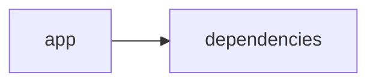

# Documentación del Proyecto

## Documentación Técnica

A continuación se presenta la documentación técnica completa en formato Markdown para desarrolladores del proyecto VoC Analyst. Este documento abarca la arquitectura general, los componentes principales, las APIs internas y las guías de desarrollo, basado en el análisis del código fuente proporcionado.

---

# VoC Analyst – Documentación Técnica

VoC Analyst es una aplicación diseñada para el análisis de la Voz del Cliente (VoC). La aplicación permite la carga y procesamiento de archivos (por ejemplo, archivos PDF), el análisis de conversaciones, la detección de temas y emociones, y la generación de insights mediante Modelos de Lenguaje (LLM). La interfaz de usuario se implementa con Streamlit y el backend integra varios proveedores LLM (como OpenAI, Anthropic y Google GenAI) para realizar análisis avanzados.

---

## Tabla de Contenidos

1. [Resumen del Repositorio](#resumen-del-repositorio)
2. [Arquitectura General](#arquitectura-general)
3. [Componentes Principales](#componentes-principales)  
   3.1 [Aplicación Streamlit](#aplicación-streamlit)  
   3.2 [Módulo LLMBackend](#módulo-llmbackend)  
   3.3 [Parser y Análisis de Conversaciones](#parser-y-análisis-de-conversaciones)
4. [APIs Internas y Funciones Destacadas](#apis-internas-y-funciones-destacadas)
5. [Configuración y Dependencias](#configuración-y-dependencias)
6. [Guías de Desarrollo](#guías-de-desarrollo)
7. [Diagrama de Componentes](#diagrama-de-componentes)

---

## 1. Resumen del Repositorio

- **Lenguajes:** Se han detectado 11 archivos en el lenguaje “other”, lo que indica una diversidad de scripts y configuraciones.
- **Endpoints:** No se han detectado endpoints públicos, ya que la comunicación se realiza internamente entre la interfaz (Streamlit) y los módulos de backend.
- **Objetivo Principal:** Analizar las interacciones y conversaciones de clientes, extrayendo datos relevantes, normalizando la información y generando insights mediante modelos de lenguaje.

---

## 2. Arquitectura General

La arquitectura de VoC Analyst se basa en una separación de responsabilidades entre una **capa de interfaz** (implementada en Streamlit) y una **capa de procesamiento y análisis** que incluye:  
- **Extracción y normalización de datos (PDF, texto).**
- **Procesamiento y análisis de conversaciones.**
- **Integración con API de Modelos de Lenguaje (LLM).**

La siguiente representación en Mermaid resume la relación entre la aplicación y sus dependencias:



Cada componente se comunica internamente para transformar los datos ingresados en insights accionables.

---

## 3. Componentes Principales

### 3.1 Aplicación Streamlit

- **Funcionalidad:**  
  - Configura la página mediante la función `st.set_page_config`.
  - Inicializa y utiliza el `st.session_state` para almacenar resultados de análisis, identificadores de ejecución y datos de archivos subidos.
  - Integra funcionalidades de carga de archivos y visualización interactiva de resultados.

- **Ejemplo de Código (Fragmento):**

  ```python
  import streamlit as st
  # Configuración de la página
  st.set_page_config(
      page_title="VoC Analyst - Análisis de Voz del Cliente con LLM",
      page_icon="📊",
      layout="wide",
      initial_sidebar_state="expanded"
  )

  # Inicializar el estado de la sesión
  if 'analysis_results' not in st.session_state:
      st.session_state.analysis_results = None
  # ... (más inicializaciones)
  ```

- **Responsabilidades:**  
  - Interfaz de usuario.
  - Gestión del estado de la sesión.
  - Coordinación de cargas y visualización de datos.

---

### 3.2 Módulo LLMBackend

- **Funcionalidad:**  
  - Proporciona una abstracción para la comunicación con los proveedores LLM (OpenAI, Anthropic, Google Gemini).
  - Permite la configuración dinámica del modelo a usar a través de la clase `ModelConfig`.
  - Inicializa el cliente correspondiente basado en el proveedor elegido.
  
- **Componentes Clave:**  
  - **ModelConfig:**  
    - Contiene atributos como `provider`, `model`, `api_key`, `max_retries` y `retry_delay`.
  - **LLMBackend:**  
    - Métodos para inicializar el cliente LLM.
    - Métodos internos para cargar prompts de análisis y parsing (por ejemplo, `_load_parse_prompt` y `_load_analyze_prompt`).

- **Ejemplo de Código (Fragmento):**

  ```python
  from dataclasses import dataclass

  @dataclass
  class ModelConfig:
      """Configuración para la selección del modelo LLM"""
      provider: str  # Ej: 'openai', 'anthropic', 'gemini'
      model: str
      api_key: str
      max_retries: int = 3
      retry_delay: float = 1.0

  class LLMBackend:
      """Backend para el análisis LLM en VoC Analyst"""
      
      def __init__(self, config: ModelConfig):
          self.config = config
          self.client = self._initialize_client()
          self.parse_prompt = self._load_parse_prompt()
          self.analyze_prompt = self._load_analyze_prompt()
      
      def _initialize_client(self):
          """Inicializa el cliente LLM correspondiente según el proveedor configurado"""
          if self.config.provider == 'openai':
              return OpenAI(api_key=self.config.api_key)
          elif self.config.provider == 'anthropic':
              return Anthropic(api_key=self.config.api_key)
          elif self.config.provider == 'gemini':
              return genai.Client(api_key=self.config.api_key)
          else:
              raise ValueError(f"Proveedor no soportado: {self.config.provider}")
  ```

- **Responsabilidades:**  
  - Selección y configuración dinámica del proveedor LLM.
  - Manejo de la comunicación y solicitudes a los modelos de lenguaje.
  - Implementación de mecanismos de reintentos en caso de fallos (uso de `max_retries` y `retry_delay`).

---

### 3.3 Parser y Análisis de Conversaciones

- **Funcionalidad:**  
  - Transforma archivos de conversaciones (por ejemplo, transcripciones de interacciones con clientes) a un formato JSON estructurado.
  - Realiza la extracción de metadatos como `conversation_id`, `agent_id`, `channel` y otros.
  - Implementa la redacción de PII (redacción de correos electrónicos, números telefónicos, etc.) sustituyéndolos por etiquetas como `[EMAIL]`, `[PHONE]`, `[CARD]`, y `[ID]`.
  - Realiza validaciones para asegurar que el archivo corresponda a una única conversación.

- **Requisitos y Ejemplos de Proceso:**  
  - **Identificación de Conversación:** Utilizar el nombre del archivo (o metadatos del documento) para derivar o extraer el `conversation_id`.
  - **Extracción de Mensajes:** Detectar cada turno de conversación, identificar el rol del interlocutor (cliente o agente) y extraer la información disponible (por ejemplo, timestamps, canal de comunicación).
  - **Párrafo de Redacción:**  
    El algoritmo debe buscar patrones que correspondan a PII y reemplazarlos utilizando expresiones regulares.

- **Citas de Requerimientos (Ejemplo):**

  ```
  ## VoC Conversation Parser

  Transformar texto crudo de una interacción en JSON con mensajes normalizados y redacción de PII.
  - Conversación única (error si se detectan múltiples conversaciones).
  - Extracción de metadatos y mensajes.
  - Redacción de datos sensibles: correos, teléfonos, tarjetas e identificadores.
  ```

- **Responsabilidades:**  
  - Normalización y estructuración de transcripciones.
  - Reducción de riesgos de exposición de información sensible mediante técnicas de redacción.
  - Garantizar consistencia en el formato de salida para su posterior análisis.

---

## 4. APIs Internas y Funciones Destacadas

### Funciones de Utilidad

1. **Extracción de Texto de PDF:**

   - Propósito: Extraer el contenido textual de un archivo PDF.
   - Implementación: Utiliza `PyPDF2.PdfReader` para recorrer las páginas y concatenar el texto.
   - Manejo de errores: Captura excepciones y muestra un mensaje de error en la interfaz (utilizando `st.error`).

   ```python
   def extract_text_from_pdf(pdf_file) -> str:
       """Extraer texto de archivo PDF"""
       try:
           pdf_reader = PyPDF2.PdfReader(pdf_file)
           text = ""
           for page in pdf_reader.pages:
               text += page.extract_text() + "\n"
           return text.strip()
       except Exception as e:
           st.error(f"Error al extraer texto de PDF: {str(e)}")
           return ""
   ```

2. **Validación del Tamaño del Archivo:**

   - Propósito: Garantizar que el archivo sea de un tamaño aceptable (por ejemplo, menos de 100 MB).
   - Detalle: Se mueve el puntero del archivo para determinar su tamaño.

   ```python
   def validate_file_size(file) -> bool:
       """Validar que el tamaño del archivo sea menor a 100MB"""
       file.seek(0, 2)  # Mover al final del archivo
       size = file.tell()
       # Aquí se puede agregar una verificación, por ejemplo:
       return size < 100 * 1024 * 1024
   ```

### Métodos del Módulo LLMBackend

- **_initialize_client:**  
  Inicializa el cliente basado en el proveedor configurado (OpenAI, Anthropic o Gemini).

- **_load_parse_prompt / _load_analyze_prompt:**  
  Métodos internos que cargan los prompts predefinidos para el análisis (los detalles pueden variar según la integración y necesidades).

---

## 5. Configuración y Dependencias

### Dependencias

El proyecto utiliza múltiples bibliotecas y módulos para cubrir diversas funcionalidades:

- **Streamlit:** Para la interfaz web interactiva.
- **Pandas:** Manejo y transformación de datos.
- **PyPDF2:** Extracción de texto desde archivos PDF.
- **Llibrerías para LLM:**  
  - OpenAI  
  - Anthropics (por ejemplo, la librería `anthropic`)  
  - Google GenAI (por ejemplo, `google.genai`)
- **Otras:**  
  - json, os, time, datetime, uuid, zipfile, io, re, logging.

### Configuración de Entorno

Se recomienda utilizar un entorno virtual (por ejemplo, virtualenv o conda) e instalar las dependencias mediante un archivo requirements.txt o similar. Un ejemplo de requirements.txt podría lucir de la siguiente manera:

```
streamlit
pandas
PyPDF2
openai
anthropic
google-genai
```

Además, es importante definir las variables de entorno necesarias para el API Key de cada proveedor LLM.

---

## 6. Guías de Desarrollo

### 6.1 Instalación y Ejecución

1. Clonar el repositorio:
   > git clone https://ejemplo.com/tu-repositorio.git

2. Crear y activar un entorno virtual:
   > python -m venv venv  
   > source venv/bin/activate  (Linux/Mac)  
   > .\venv\Scripts\activate  (Windows)

3. Instalar dependencias:
   > pip install -r requirements.txt

4. Ejecutar la aplicación:
   > streamlit run app.py

### 6.2 Extender y Configurar LLMBackend

- Para añadir un nuevo proveedor LLM o extender funcionalidades, se puede modificar la clase LLMBackend.  
- Asegúrese de agregar la validación del proveedor en el método `_initialize_client` y definir los métodos que se requieran para el manejo de prompts.  
- Actualice la clase ModelConfig con los parámetros necesarios para el nuevo proveedor.

### 6.3 Pruebas y Validación

- Se recomienda la integración de pruebas unitarias para cada función crítica, en especial para:
  - Extracción y validación de archivos.
  - Procesamiento y parsing de las conversaciones.
  - Conexión y respuesta de los proveedores LLM.
- Utilice frameworks de testing como pytest para automatizar la validación de cambios.

### 6.4 Manejo de Errores y Logging

- El módulo de logging se configura para registrar eventos importantes, facilitando la depuración y monitoreo de la aplicación.
- Cada función crítica, especialmente las relacionadas con la extracción de datos y la comunicación con servicios externos, debe implementar un manejo robusto de errores.

---

## 7. Diagrama de Componentes

El siguiente diagrama en Mermaid ilustra la relación básica entre la aplicación y sus dependencias:

```mermaid
graph LR
    A[Interfaz (Streamlit)]
    B[Procesamiento de Datos]
    C[LLMBackend (OpenAI, Anthropic, Gemini)]
    D[Parser de Conversaciones]

    A --> B
    B --> D
    B --> C
```

---

## Conclusión

Esta documentación técnica está pensada para orientar a desarrolladores en la comprensión, extensión e integración del sistema VoC Analyst. Se recomienda mantener actualizadas las secciones de APIs internas y dependencias conforme se implementen nuevas funcionalidades o se integren nuevos proveedores.

Para cualquier consulta adicional o contribución, por favor refiérase a las guías de contribución del repositorio o contacte al equipo de desarrollo.

¡Feliz desarrollo!

---


## Diagrama


---

## Guía de Usuario

# Guía de Usuario: Herramienta de Análisis y Procesamiento de Información

Bienvenido a la guía de usuario de nuestra aplicación, una herramienta diseñada para facilitar el análisis y procesamiento de documentos e información utilizando técnicas avanzadas de Inteligencia Artificial. A continuación, encontrarás una descripción detallada de la aplicación, sus funcionalidades principales, instrucciones para su uso y una sección de preguntas frecuentes.

---

## Descripción de la Aplicación

Esta aplicación cuenta con una interfaz web interactiva desarrollada en Streamlit, una biblioteca de Python que permite construir aplicaciones web de manera rápida y sencilla. La herramienta está especialmente diseñada para:

- **Procesar archivos PDF:** Permite la carga y extracción de contenido de documentos en formato PDF.
- **Análisis con modelos de lenguaje (IA):** Utiliza modelos de lenguaje para analizar, interpretar y extraer información relevante de los documentos.
- **Interfaz interactiva:** Facilita la interacción mediante una interfaz amigable, permitiendo a los usuarios cargar documentos y visualizar resultados de manera inmediata.

Gracias a estas capacidades, la herramienta se posiciona como un recurso valioso para profesionales y usuarios que necesiten automatizar la gestión y análisis de grandes volúmenes de información.

---

## Principales Funcionalidades

La aplicación se estructura en torno a tres funcionalidades fundamentales:

1. **Interfaz Web Interactiva con Streamlit**
   - Visualiza de manera dinámica los resultados del proceso de análisis.
   - Ofrece controles intuitivos para la navegación y manipulación de datos.
   - Posibilita una experiencia de usuario fluida sin necesidad de conocimientos técnicos avanzados.

2. **Procesamiento de Archivos PDF**
   - Permite la carga de archivos PDF a través de la interfaz web.
   - Extrae texto e información relevante de los documentos.
   - Prepara el contenido para su posterior análisis mediante técnicas de IA.

3. **Análisis con Modelos de Lenguaje (IA)**
   - Aplica modelos de procesamiento de lenguaje natural para analizar el contenido extraído.
   - Identifica patrones, temas, entidades y otros elementos importantes dentro del texto.
   - Presenta resultados y reportes que facilitan la toma de decisiones.

Estas funcionalidades están integradas para brindar una solución completa en la gestión y análisis de información.

---

## Descripción de Uso

A continuación, se detalla el flujo de trabajo para utilizar la aplicación de manera efectiva:

1. **Acceso a la Aplicación**
   - Abre tu navegador web e ingresa a la URL de la aplicación.
   - Se desplegará la interfaz de usuario de Streamlit, diseñada de forma intuitiva.

2. **Carga de Archivos PDF**
   - Localiza el botón de “Cargar Archivo” en el panel principal.
   - Selecciona el archivo PDF que deseas procesar desde tu dispositivo.
   - La aplicación mostrará un indicador de progreso mientras se carga y procesa el documento.

3. **Procesamiento y Análisis**
   - Una vez cargado el documento, la aplicación extraerá el contenido textual del PDF.
   - Los modelos de lenguaje (IA) analizarán el contenido para extraer información clave, identificar temas y generar resúmenes.
   - Los resultados se presentarán de forma interactiva en la misma interfaz.

4. **Visualización de Resultados**
   - Revisa los resultados del análisis en la sección de reportes de la aplicación.
   - Puedes explorar diferentes vistas y filtros para profundizar en la información.
   - Si es necesario, exporta o guarda los resultados para uso posterior.

5. **Interacción y Retroalimentación**
   - Utiliza los controles y opciones que la aplicación ofrece para ajustar el análisis (por ejemplo, seleccionar diferentes modelos o parámetros de procesamiento).
   - Aprovecha la posibilidad de cargar múltiples archivos para comparar y combinar resultados en un solo informe.

---

## Preguntas Frecuentes (FAQ)

**1. ¿Qué tipos de archivos puedo procesar?**  
La aplicación está optimizada para archivos PDF, sin embargo, futuras actualizaciones podrían incluir soporte para otros formatos.

**2. ¿Necesito conocimientos técnicos para usar la aplicación?**  
No, la interfaz está diseñada para ser intuitiva y accesible para usuarios sin conocimientos técnicos avanzados. Basta con seguir las instrucciones en pantalla.

**3. ¿Cómo protege la aplicación la seguridad de mis datos?**  
La seguridad es una prioridad. Todos los archivos y datos procesados se manejan de forma confidencial y se utilizan únicamente para el análisis en la sesión activa. Revisa la política de privacidad para más detalles.

**4. ¿Puedo realizar un análisis en lote o múltiples archivos a la vez?**  
Actualmente, la aplicación permite cargar y analizar un archivo a la vez. En futuras versiones se incluirá la opción de análisis en lote.

**5. ¿Qué hacer si el análisis no se realiza correctamente?**  
Si experimentas problemas o el análisis produjera resultados inesperados:
- Verifica que el archivo PDF no esté dañado.
- Confirma que el documento contenga texto seleccionable.
- Consulta la sección de ayuda o contacta al soporte técnico para asistencia.

**6. ¿Se puede personalizar el nivel de análisis del modelo de IA?**  
La aplicación permite algunos ajustes en los parámetros de análisis. Sin embargo, se recomienda utilizar la configuración predeterminada para la mayoría de los usuarios.

---

Esperamos que esta guía te ayude a aprovechar al máximo las funcionalidades de la herramienta. Si tienes alguna duda adicional o sugerencia, no dudes en ponerte en contacto con nuestro equipo de soporte. ¡Disfruta de una experiencia de análisis y procesamiento potente e intuitiva!