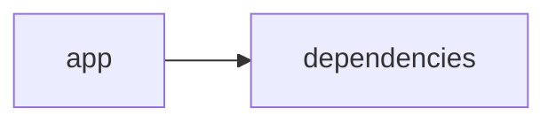

# Documentación del Proyecto

## Documentación Técnica

# VoC Analyst – Documentación Técnica para Desarrolladores

Esta documentación ha sido elaborada a partir del análisis del código y la estructura del repositorio. Aquí se describen la arquitectura general, los componentes principales, las APIs internas y las guías de desarrollo para que los desarrolladores puedan comprender, extender e integrar el sistema de forma efectiva.

---

## Tabla de Contenidos

1. [Resumen del Repositorio](#resumen-del-repositorio)
2. [Arquitectura General](#arquitectura-general)
3. [Componentes Principales](#componentes-principales)  
   3.1 [Aplicación Streamlit](#aplicación-streamlit)  
   3.2 [Módulo LLMBackend](#módulo-llmbackend)  
   3.3 [Procesamiento y Extracción de Archivos](#procesamiento-y-extracción-de-archivos)  
   3.4 [Análisis y Parseo de Conversaciones](#análisis-y-parseo-de-conversaciones)
4. [APIs Internas y Funciones Destacadas](#apis-internas-y-funciones-destacadas)
5. [Configuración y Dependencias](#configuración-y-dependencias)
6. [Guías de Desarrollo](#guías-de-desarrollo)  
   6.1 [Instalación y Ejecución](#instalación-y-ejecución)  
   6.2 [Extensión y Configuración del LLMBackend](#extensión-y-configuración-del-llmbackend)  
   6.3 [Pruebas y Validación](#pruebas-y-validación)
7. [Ejemplo de Diagrama de Arquitectura (Mermaid)](#ejemplo-de-diagrama-de-arquitectura-mermaid)

---

## 1. Resumen del Repositorio

El proyecto VoC Analyst es una aplicación orientada al análisis de la Voz del Cliente (Voice of Customer, VoC). Entre sus funcionalidades se incluyen:
- **Carga y procesamiento de archivos:** Especialmente archivos PDF, de los cuales se extrae texto.
- **Interfaz web interactiva:** Implementada con Streamlit para ofrecer una experiencia de usuario dinámica y visual.
- **Análisis con Modelos de Lenguaje (LLM):** Un módulo backend, denominado `LLMBackend`, se encarga de interactuar con diferentes proveedores (OpenAI, Anthropic, Google GenAI/Gemini) para realizar análisis de texto, extracción de insights, identificación de temas, análisis de sentimientos y emociones.

---

## 2. Arquitectura General

La arquitectura del sistema se compone de dos grandes bloques: la interfaz (frontend) y el módulo de análisis (backend). La siguiente imagen en formato Mermaid ilustra de forma simplificada el flujo de la aplicación:

```mermaid
graph LR
  App[Aplicación Streamlit] --> Deps[Dependencias y Librerías]
  App --> PDF[Procesamiento de Archivos PDF]
  App --> LLM[Modulo LLMBackend]
  LLM --> Proveedores[Proveedores LLM (OpenAI, Anthropic, Gemini)]
```

- **Aplicación Streamlit:** Se encarga de la interfaz de usuario, configuración de página, carga de archivos y visualización de resultados.
- **Módulo LLMBackend:** Responsable de la configuración e inicialización de clientes LLM y la ejecución de las consultas a los proveedores.
- **Procesamiento de Archivos PDF:** Módulo dedicado a extraer texto de archivos PDF para posterior análisis.

---

## 3. Componentes Principales

### 3.1 Aplicación Streamlit

- **Configuración Inicial:**  
  La aplicación inicia configurando la página con `st.set_page_config` para definir el título, icono, y el layout. También se inicializa el estado de la sesión mediante `st.session_state`, donde se guardan variables claves (por ejemplo: `analysis_results`, `run_id`, `uploaded_files_data` y `processing_complete`).

- **Carga y Procesamiento de Archivos:**  
  Se incluyen funciones como `extract_text_from_pdf(pdf_file)` para extraer el texto de documentos PDF mediante la librería `PyPDF2`. Además, existe lógica para validar el tamaño de archivos (archivo menor a 100 MB) y otras utilidades relacionadas.

### 3.2 Módulo LLMBackend

- **Objetivo:**  
  Este módulo ofrece la funcionalidad para configurar y conectar con proveedores de LLM (por ejemplo, OpenAI, Anthropic, y Google GenAI/Gemini), permitiendo realizar análisis avanzados sobre la información textual extraída.

- **Configuración de Modelos:**  
  Se define la clase `ModelConfig` (utilizando `@dataclass`) que permite especificar:
  - Proveedor (`provider`): Valor posible “openai”, “anthropic” o “gemini”.
  - Modelo concreto (`model`).
  - Clave API (`api_key`).
  - Parámetros de reintento (`max_retries` y `retry_delay`).

- **Inicialización del Cliente LLM:**  
  Mediante el método `_initialize_client()`, se comprueba el proveedor configurado y se instancia el cliente adecuado:
  - Para **OpenAI**: se utiliza `openai` o directamente `OpenAI`.
  - Para **Anthropic**: se utiliza el cliente `Anthropic`.
  - Para **Gemini/Google GenAI**: se instancia el cliente desde `genai.Client`.

- **Carga de Prompts:**  
  El módulo carga archivos o plantillas (posiblemente desde ficheros de configuración o rutas conocidas) para definir los prompts de parseo y análisis que se utilizarán en las consultas al LLM.

### 3.3 Procesamiento y Extracción de Archivos

- **Extracción de Texto:**  
  La función `extract_text_from_pdf(pdf_file)` utiliza la librería `PyPDF2` para:
  - Abrir el archivo PDF.
  - Iterar en cada página y extraer el texto.
  - Manejar excepciones y reportar errores mediante la interfaz Streamlit (con `st.error`).

- **Validación del Archivo:**  
  Función `validate_file_size(file)` para asegurar que el tamaño del archivo no exceda los 100 MB, evitando problemas de rendimiento o errores durante la carga.

### 3.4 Análisis y Parseo de Conversaciones

- **Objetivo del Análisis:**  
  El análisis se centra en extraer insights valiosos de conversaciones e interacciones de clientes. Esto incluye:
  - Descubrimiento de temas (keywords, etiquetas, descripciones y resúmenes).
  - Análisis a nivel de mensaje: asignación de tema, análisis de sentimientos (etiquetas "neg", "neu" o "pos" y puntajes continuos) y análisis de emociones (familias de emociones, intensidad y valencia).

- **Requisitos del Análisis (Ejemplo VoC Global Analysis):**  
  Se definen lineamientos para:
  - Identificar entre 5 a 20 temas con sus identificadores, etiquetas y palabras clave.
  - Proveer análisis detallado a nivel de cada mensaje, incluyendo el sentimiento y la clasificación emocional.

---

## 4. APIs Internas y Funciones Destacadas

### Funciones en el Frontend (Streamlit):

- **st.set_page_config():**  
  Configura la apariencia y estado inicial de la aplicación.

- **Funciones de Estado de Sesión:**  
  Variables en `st.session_state` para mantener el estado a través de la sesión:
  - `analysis_results`: Almacena los resultados del análisis.
  - `run_id`: Identificador único para cada ejecución de análisis.
  - `uploaded_files_data`: Datos de los archivos cargados.
  - `processing_complete`: Indicador para saber si el procesamiento ha finalizado.

### Funciones del Módulo LLMBackend:

- **ModelConfig:**  
  Define la configuración para la conexión con el proveedor LLM.

- **_initialize_client():**  
  Inicializa y retorna el cliente LLM adecuado según el proveedor especificado.

- **_load_parse_prompt() y _load_analyze_prompt():**  
  Métodos diseñados para cargar las plantillas o archivos de prompt necesarios para el parseo y análisis.

---

## 5. Configuración y Dependencias

### Lenguajes y Librerías:
- **Python:** Principal lenguaje de desarrollo.
- **Streamlit:** Para el desarrollo de la interfaz web interactiva.
- **Pandas:** Posible uso para manipulación de datos estructurados.
- **PyPDF2:** Para la extracción de texto en archivos PDF.
- **openai, anthropic, google.genai:** SDKs utilizados para la integración con proveedores de modelos de lenguaje.
- **Librerías Estándar:** `json`, `logging`, `time`, `datetime`, `uuid`, `zipfile`, `io`, `os`, y `typing` para funciones auxiliares.

### Dependencias Clave:
- El archivo `requirements.txt` (no mostrado pero implícito) deberá incluir las versiones requeridas de Streamlit, PyPDF2, openai, anthropic y google-genai.
- Configuración de claves API para cada uno de los proveedores LLM según se utilice.

---

## 6. Guías de Desarrollo

### 6.1 Instalación y Ejecución
1. **Clonar el Repositorio:**
   Ejecuta en terminal:
   > git clone <URL_DEL_REPOSITORIO>
2. **Instalar Dependencias:**
   Asegúrate de tener Python 3.8+ y ejecuta:
   > pip install -r requirements.txt
3. **Ejecutar la Aplicación:**
   Desde la raíz del repositorio, lanza la aplicación con:
   > streamlit run app.py
   (o el fichero principal de Streamlit)

### 6.2 Extensión y Configuración del LLMBackend
- **Agregar Nuevos Proveedores:**
  1. Actualiza la clase `LLMBackend` en el método `_initialize_client()` para incluir la instancia del nuevo proveedor.
  2. Actualiza la documentación interna de `ModelConfig` para soportar las nuevas configuraciones (clave API, modelo, etc.).
- **Modificar Prompts:**
  Edita los métodos `_load_parse_prompt()` y `_load_analyze_prompt()` para cambiar el comportamiento del análisis a través de la modificación de los templates.

### 6.3 Pruebas y Validación
- **Pruebas Unitarias:**
  Se recomienda crear pruebas unitarias para funciones críticas como:
  - Extracción de texto de PDFs.
  - Validación de tamaños de archivos.
  - Funcionalidad de inicialización del cliente LLM.
- **Pruebas de Integración:**
  Verificar el flujo completo desde la carga del archivo hasta la generación de resultados de análisis con los distintos proveedores LLM.
- **Logging y Manejo de Errores:**
  Aprovecha el sistema de logging para depurar respuestas y errores, examinando la salida en consola.

---

## 7. Ejemplo de Diagrama de Arquitectura (Mermaid)

A continuación se presenta un ejemplo de diagrama usando Mermaid para visualizar la relación entre los principales componentes:

```mermaid
graph LR
  A[Interfaz Streamlit] --> B[Procesamiento de Archivos (PDF)]
  A --> C[Estado de Sesión]
  C --> D[Resultados del Análisis]
  A --> E[LLMBackend]
  E --> F[Proveedor OpenAI]
  E --> G[Proveedor Anthropic]
  E --> H[Proveedor Gemini/GenAI]
```

Este diagrama ilustra la interacción entre la interfaz que provee la experiencia al usuario, el procesamiento de archivos, la persistencia del estado de sesión y la utilización del módulo de análisis LLM para conectar con distintos proveedores.

---

## Conclusión

VoC Analyst es una herramienta robusta que integra procesamiento de datos, análisis en lenguaje natural y una interfaz interactiva para ofrecer insights a partir de la Voz del Cliente. La arquitectura modular y el uso de componentes bien definidos (como el LLMBackend y funciones de procesamiento de PDFs) permiten extender y adaptar el sistema fácilmente, ya sea para incorporar nuevos análisis o nuevos proveedores LLM.

Con esta documentación se espera que los desarrolladores cuenten con la información necesaria para comprender, mantener y extender el proyecto de manera efectiva. Si surgen dudas adicionales o se requieren actualizaciones, se recomienda mantener la documentación y los comentarios en el código actualizados acorde a los cambios introducidos en el sistema.

--- 

Fin de la documentación técnica de VoC Analyst.


## Diagrama



---

## Guía de Usuario

# Guía del Usuario

Bienvenido a la aplicación de análisis y procesamiento de información. Esta guía le proporcionará una descripción general de la aplicación, explicará sus principales funcionalidades, ofrecerá instrucciones de uso y responderá las preguntas frecuentes.

---

## Descripción de la Aplicación

La aplicación es una herramienta basada en una **Interfaz Web Interactiva** desarrollada con *Streamlit*. Su propósito principal es facilitar el procesamiento y análisis de archivos PDF mediante el uso de modelos de lenguaje basados en Inteligencia Artificial (IA). Gracias a su diseño intuitivo, los usuarios pueden subir PDF para extraer y analizar información relevante de manera rápida y sencilla.

---

## Funcionalidades Principales

La aplicación integra varias funcionalidades clave que potencian el análisis de contenidos en archivos PDF:

- **Interfaz Web Intuitiva:**  
  Utilizando Streamlit, la app ofrece una interfaz de usuario amigable que permite la interacción en tiempo real y facilita el manejo de archivos y resultados de análisis.

- **Procesamiento de Archivos PDF:**  
  La herramienta permite la carga y procesamiento de documentos PDF. Internamente, utiliza técnicas avanzadas para extraer texto e identificar secciones relevantes.

- **Análisis con Modelos de Lenguaje (IA):**  
  Una vez extraído el contenido del PDF, la aplicación aplica modelos de lenguaje avanzados para analizar, interpretar y, en algunos casos, resumir o generar insights a partir de la información contenida en el documento.

- **Integración de Tecnologías Python y Bibliotecas de Análisis:**  
  La robustez del procesamiento y análisis se debe al uso de Python y a diversas bibliotecas especializadas, que aseguran precisión y eficiencia en cada operación.

---

## Cómo Usar la Aplicación

A continuación, se describen los pasos básicos para utilizar la herramienta:

1. **Acceso a la Aplicación:**  
   Ingrese a la interfaz web a través del endpoint designado. Una vez cargada la página, encontrará una interfaz limpia y directa.

2. **Carga del Archivo PDF:**  
   - Localice el botón de “Subir Archivo” en la página principal.
   - Seleccione el archivo PDF deseado desde su dispositivo.
   - Espere a que el sistema confirme la carga exitosa del archivo.

3. **Procesamiento y Análisis del Documento:**  
   - Tras la carga, la aplicación procederá a extraer el texto y procesar el contenido.
   - Se ejecutarán los modelos de lenguaje para analizar la información y generar resultados relevantes.

4. **Visualización de Resultados:**  
   - Los datos analizados se presentarán de manera clara y estructurada en la interfaz.
   - Podrá ver resúmenes, insights o secciones destacadas derivadas del análisis realizado por la IA.

5. **Exportación y Descarga (si aplica):**  
   - En algunos casos, se ofrece la opción de exportar los resultados en formatos compatibles para facilitar su uso posterior.
   - Utilice el botón de “Descargar Resultados” para guardar la información localmente.

---

## Preguntas Frecuentes (FAQ)

1. **¿Qué tipos de archivos PDF se pueden procesar?**  
   La aplicación ha sido optimizada para trabajar con documentos PDF estándar. Se recomienda utilizar archivos que contengan texto digital; aunque, en algunos casos, PDFs con imágenes pueden requerir procesamiento OCR adicional (no incluido de manera nativa).

2. **¿Es seguro cargar mis documentos a la aplicación?**  
   Sí, la seguridad es una prioridad. Los archivos cargados son procesados en el entorno seguro de la aplicación y, generalmente, no se almacenan a largo plazo. Revise la política de privacidad para más detalles.

3. **¿Qué sucede si el archivo PDF no se procesa correctamente?**  
   Si el sistema presenta dificultades para extraer o analizar la información, se aparecerá un mensaje de error. En este caso, podría intentar cargar otro archivo o verificar si el PDF cumple con los estándares requeridos.

4. **¿Puedo personalizar el análisis realizado por la IA?**  
   La versión actual de la herramienta está diseñada para ofrecer un análisis estandarizado. Para personalizaciones adicionales, podrían requerirse configuraciones avanzadas o el uso de APIs específicas.

5. **¿Qué tecnologías respaldan la aplicación?**  
   La aplicación se basa en Python, empleando Streamlit para la interfaz y diversas bibliotecas de análisis para el procesamiento del texto y ejecución de modelos de lenguaje.

6. **¿Cómo puedo reportar un problema o solicitar mejoras?**  
   Puede contactarnos a través del canal de soporte o enviar retroalimentación utilizando el formulario disponible en la sección “Contacto” de la aplicación.

---

## Recursos Adicionales

- **Documentación Técnica:**  
  Para usuarios avanzados, se dispone de una documentación técnica que detalla la estructura de archivos y el flujo de procesamiento dentro de la aplicación.

- **Actualizaciones y Notas de la Versión:**  
  Visite la sección de “Updates” en el sitio web para conocer las últimas mejoras, correcciones de errores y nuevas funcionalidades.

---

## Soporte y Contacto

Si tiene dudas adicionales o requiere asistencia personalizada, por favor contacte a nuestro soporte técnico:

- Correo Electrónico: soporte@app-ejemplo.com
- Foro de la Comunidad: [Foro de Usuarios](https://foro.app-ejemplo.com)

¡Gracias por utilizar nuestra herramienta de análisis y procesamiento de PDF! Esperamos que esta guía le haya sido de ayuda para aprovechar al máximo todas las funcionalidades de la aplicación.