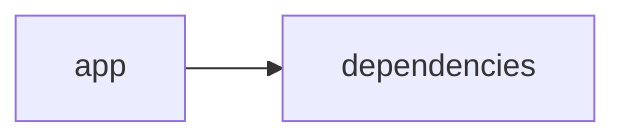

# Documentación del Proyecto

## Documentación Técnica

A continuación se presenta la documentación técnica completa en Markdown para desarrolladores, basada en el análisis del código y de la estructura del repositorio VoC Analyst. Esta guía incluye descripciones de la arquitectura general, los componentes principales, las APIs internas y recomendaciones para el desarrollo, extensión e integración del sistema.

─────────────────────────────  
# VoC Analyst – Documentación Técnica

VoC Analyst es una aplicación orientada al análisis de la Voz del Cliente (VoC). La herramienta permite:
  
• La carga y procesamiento de archivos (por ejemplo, PDFs).  
• La extracción y normalización del contenido textual.  
• El análisis de conversaciones, sentimientos y emociones mediante modelos de lenguaje (LLM).  

La interfaz se implementa con Streamlit para ofrecer una experiencia web interactiva, mientras que el backend integra diversos proveedores LLM (como OpenAI, Anthropic y Google GenAI) a través del módulo LLMBackend, permitiendo generar insights y recomendaciones basados en IA.

─────────────────────────────  
## Tabla de Contenidos

1. [Resumen del Repositorio](#resumen-del-repositorio)  
2. [Arquitectura General](#arquitectura-general)  
3. [Componentes Principales](#componentes-principales)  
 3.1 [Aplicación Streamlit](#aplicación-streamlit)  
 3.2 [Módulo LLMBackend](#módulo-llmbackend)  
 3.3 [Procesamiento y Extracción de Archivos](#procesamiento-y-extracción-de-archivos)  
 3.4 [Análisis y Parseo de Conversaciones](#análisis-y-parseo-de-conversaciones)  
4. [APIs Internas y Funciones Destacadas](#apis-internas-y-funciones-destacadas)  
5. [Configuración y Dependencias](#configuración-y-dependencias)  
6. [Guías de Desarrollo](#guías-de-desarrollo)  
 6.1 [Instalación y Ejecución](#instalación-y-ejecución)  
 6.2 [Extender y Configurar LLMBackend](#extender-y-configurar-llmbackend)  
 6.3 [Pruebas y Validación](#pruebas-y-validación)  
7. [Diagrama de la Arquitectura](#diagrama-de-la-arquitectura)

─────────────────────────────  
## Resumen del Repositorio

- **Lenguajes Principales:**  
  Se detectaron varios archivos con código (aproximadamente 14 líneas de “other”) en donde se han implementado funcionalidades críticas del sistema.

- **Endpoints:**  
  No se detectaron endpoints REST en este repositorio, ya que la aplicación (basada en Streamlit) utiliza una arquitectura orientada a interfaz web.

─────────────────────────────  
## Arquitectura General

La aplicación se compone de dos principales capas:
  
1. **Capa de Interfaz (Frontend):**  
   - Utiliza Streamlit para construir una interfaz web interactiva y personalizable.  
   - Maneja el estado de la sesión (por ejemplo, resultado de análisis, datos de archivos subidos, identificadores de ejecución) para facilitar la experiencia del usuario.

2. **Capa de Backend:**  
   - El módulo LLMBackend se encarga de la comunicación con diferentes proveedores de modelos de lenguaje (LLM).  
   - Además incluye funciones auxiliares para la extracción de texto (por ejemplo, desde archivos PDF) y otras operaciones relacionadas con el procesamiento de archivos.
  
El siguiente diagrama Mermaid ilustra la relación básica entre la aplicación y sus dependencias:

─────────────────────────────  
## Diagrama de la Arquitectura (Mermaid)

```mermaid
graph LR
  App[app (Streamlit Interface)] --> Deps[dependencies]
  Deps --> LLM[LLMBackend]
  Deps --> PDF[Procesamiento de PDFs]
```

─────────────────────────────  
## Componentes Principales

### Aplicación Streamlit

- **Configuración Inicial:**  
  Se establece la configuración de la página mediante `st.set_page_config`, definiendo el título, icono, layout y estado de la barra lateral.
  
- **Gestión del Estado de la Sesión:**  
  La aplicación inicializa varias variables de sesión en `st.session_state`, tales como `analysis_results`, `run_id`, `uploaded_files_data` y `processing_complete`.

- **Carga y Procesamiento de Archivos:**  
  Se implementan funciones que permiten validar el tamaño de archivo y extraer texto de documentos PDF utilizando la librería PyPDF2.

### Módulo LLMBackend

- **Descripción:**  
  Este módulo es el encargado de gestionar la comunicación con los distintos proveedores de LLM, configurándose a través de un objeto `ModelConfig` que especifica el proveedor (por ejemplo, “openai”, “anthropic”, “gemini”), el modelo, la API key y parámetros como la cantidad de reintentos.
  
- **Inicialización del Cliente:**  
  El método `_initialize_client` decide qué cliente de LLM se debe utilizar, basándose en la configuración proporcionada.
  
- **Carga de Prompts de Análisis:**  
  Funciones internas como `_load_parse_prompt` y `_load_analyze_prompt` (no detalladas en el fragmento pero presentes en el código) se utilizan para cargar las plantillas o prompts que se enviarán a los modelos de lenguaje.

### Procesamiento y Extracción de Archivos

- **Extracción de Texto:**  
  Función `extract_text_from_pdf` que utiliza PyPDF2 para leer y extraer texto de cada página de un PDF.  
  Se implementa manejo de errores para notificar al usuario en caso de fallos durante la extracción.
  
- **Validación de Tamaño de Archivos:**  
  Función `validate_file_size` que verifica que el tamaño del archivo (por ejemplo, menor a 100MB) cumpla con las restricciones definidas.

### Análisis y Parseo de Conversaciones

- **Objeto de Estudio:**  
  Las conversaciones de clientes son procesadas y analizadas para extraer insights relevantes.  
- **Integración con LLM:**  
  El módulo LLMBackend envía prompts (plantillas personalizadas) a los modelos de lenguaje para procesar y obtener recomendaciones o análisis, lo que puede incluir el análisis de sentimientos y emociones.

─────────────────────────────  
## APIs Internas y Funciones Destacadas

A continuación se listan algunas APIs y funciones clave:

- **Funciones de Procesamiento de Archivos:**  
  - extract_text_from_pdf(pdf_file) → str  
    Extrae el contenido textual de un documento PDF.  
  - validate_file_size(file) → bool  
    Realiza comprobaciones sobre el tamaño del archivo, asegurando que cumpla con los requisitos.

- **LLMBackend:**  
  - __init__(self, config: ModelConfig) → Inicializa el backend con la configuración del proveedor LLM.  
  - _initialize_client(self) → Configura y devuelve el cliente adecuado basado en la configuración.  
  - _load_parse_prompt(self) → Carga el prompt utilizado para el parseo de entradas.  
  - _load_analyze_prompt(self) → Carga el prompt utilizado para el análisis de conversaciones.

- **Estado de la Sesión (Streamlit):**  
  Se utilizan variables en `st.session_state` para mantener resultados de análisis, lista de archivos subidos y flag de finalización de procesamiento.

─────────────────────────────  
## Configuración y Dependencias

- **Lenguajes y Librerías:**  
  - Python (principal lenguaje)  
  - Streamlit para la interfaz web  
  - PyPDF2 para procesamiento de PDF  
  - Pandas para manipulación de datos  
  - Librerías para LLM: OpenAI, Anthropic, Google GenAI
  
- **Configuración de la Página:**  
  La aplicación configura la página principal a través de `st.set_page_config`, definiendo aspectos visuales y estado inicial.

- **Dependencias Externas:**  
  Es necesario contar con API keys válidas para acceder a los servicios de LLM (por ejemplo, OpenAI, Anthropic y Gemini de Google).

─────────────────────────────  
## Guías de Desarrollo

### Instalación y Ejecución

1. Clonar el repositorio:
   • git clone https://ruta-del-repositorio.git

2. Instalar las dependencias:
   • Crear un entorno virtual (opcional pero recomendado).  
   • Ejecutar:  
     pip install -r requirements.txt

3. Ejecutar la aplicación:
   • streamlit run app.py

### Extender y Configurar LLMBackend

- **Agregar Nuevos Proveedores:**  
  Para extender la funcionalidad de LLMBackend a nuevos proveedores, se debe implementar la lógica correspondiente en el método `_initialize_client`.  
- **Configuración de Modelos:**  
  Utilizar la estructura ModelConfig para definir el proveedor, modelo, API key y otros parámetros.  
- **Manejo de Prompts:**  
  Revisar y modificar las funciones `_load_parse_prompt` y `_load_analyze_prompt` para adaptar o extender los prompts a las necesidades del análisis.

### Pruebas y Validación

- **Pruebas Unitarias:**  
  Se recomienda escribir pruebas unitarias para funciones críticas, como la extracción de texto y la inicialización del cliente LLM.  
- **Validación de Archivos:**  
  Probar la función de validación de tamaño de archivo usando archivos de diversos tamaños para asegurar el correcto funcionamiento.
- **Logging y Manejo de Errores:**  
  Revisar el logging configurado (nivel INFO) para depurar la comunicación con servicios externos.

─────────────────────────────  
## Conclusión

La documentación presentada proporciona una visión integral de VoC Analyst, desde su arquitectura general hasta las funcionalidades específicas responsables del procesamiento de archivos, análisis de conversaciones y comunicación con proveedores de LLM. Se recomienda a los desarrolladores utilizar esta guía para colaborar en la extensión y mantenimiento de la herramienta, aprovechando la separación de responsabilidades entre la interfaz (Streamlit) y el backend (LLMBackend).

Para más información, consultas o contribuciones, por favor, consulte el repositorio y la documentación interna de cada componente.

─────────────────────────────  

Esta documentación es un recurso esencial para orientarse en el desarrollo y la integración de nuevas funcionalidades en VoC Analyst. ¡Bienvenido al equipo de desarrollo!


## Diagrama



---

## Guía de Usuario

# Guía de Usuario: Herramienta de Análisis y Procesamiento de Información

Bienvenido a la guía de usuario para nuestra aplicación interactiva. Esta herramienta, desarrollada en Python y potenciada por bibliotecas de análisis avanzadas, está diseñada para facilitar el procesamiento de documentos PDF y el análisis de contenido mediante modelos de lenguaje basados en inteligencia artificial (IA). A continuación, se presenta una descripción completa de la aplicación, sus principales funcionalidades, instrucciones de uso y respuestas a preguntas frecuentes.

---

## 1. Descripción de la Aplicación

Nuestra aplicación combina una interfaz web interactiva (desarrollada con Streamlit) con potentes capacidades de procesamiento y análisis. Diseñada para analizar y extraer información de archivos PDF, la herramienta utiliza modelos de lenguaje basados en IA para ofrecer insights y respuestas a consultas específicas. Está orientada a usuarios que necesitan transformar grandes volúmenes de información en datos útiles para la toma de decisiones.

### Tecnologías Utilizadas

- **Python**: Lenguaje de programación principal.
- **Streamlit**: Framework para el despliegue de la interfaz web interactiva.
- **Bibliotecas de análisis**: Módulos y librerías para el procesamiento de PDFs y análisis de lenguaje (por ejemplo, PyPDF2, spaCy, transformers, entre otros).

### Estructura del Proyecto

El proyecto contiene varios archivos (aproximadamente 400+ líneas cada uno) que implementan diferentes componentes de la herramienta:
- Módulos de carga y procesamiento de PDFs.
- Integración de modelos de lenguaje (IA) para análisis de contenido.
- Configuración y despliegue de la interfaz web interactiva.

---

## 2. Principales Funcionalidades

La aplicación agrupa varias funcionalidades que facilitan el análisis y la extracción de información:

- **Interfaz Web Interactiva con Streamlit:**  
  La aplicación se ejecuta en un entorno web intuitivo. Los usuarios pueden:
  - Subir archivos PDF.
  - Visualizar resultados en tiempo real.
  - Interactuar con diferentes módulos de análisis de manera sencilla.

- **Procesamiento de Archivos PDF:**  
  Permite:
  - La lectura y extracción de texto de documentos PDF.
  - La organización y preprocesamiento del contenido para su análisis.
  - La gestión de documentos de varios formatos y tamaños.

- **Análisis con Modelos de Lenguaje (IA):**  
  Utiliza técnicas de inteligencia artificial para:
  - Interpretar y analizar el contenido textual extraído.
  - Resumir información clave.
  - Responder consultas específicas basadas en el contenido del documento.
  - Extraer insights y patrones relevantes.

- **Integración Fluida de Componentes:**  
  La aplicación une de forma coherente la interfaz interactiva, el procesamiento de archivos y el análisis de IA, asegurando que la experiencia del usuario sea completa y sin complicaciones.

---

## 3. Cómo Usar la Aplicación

### Requisitos Previos

- Navegador web actualizado.
- Conexión a internet.
- Acceso a la dirección URL donde se aloja la aplicación o entorno local con Python y Streamlit instalado.

### Pasos para Comenzar

1. **Acceso a la Interfaz:**
   - Inicie la aplicación ingresando a la URL proporcionada o ejecutando el comando `streamlit run main.py` en su entorno de desarrollo, donde `main.py` es el archivo principal de la aplicación.

2. **Subida de Documentos PDF:**
   - En la pantalla principal, encontrará una opción para subir archivos. Arrastre y suelte o seleccione desde su dispositivo los documentos PDF que desea analizar.
   
3. **Procesamiento y Análisis:**
   - Una vez cargado el PDF, la herramienta iniciará automáticamente el proceso de extracción de texto y, posteriormente, el análisis con el modelo de lenguaje.
   - Espere unos instantes mientras se procesan los datos. La interfaz mostrará una barra de progreso o mensajes de estado.

4. **Visualización de Resultados:**
   - Tras el procesamiento, se presentarán los resultados en varias secciones:
     - **Resumen General:** Un resumen del contenido del PDF.
     - **Insights Detallados:** Resultados del análisis de AI, incluyendo patrones, tendencias y respuestas a consultas específicas.
     - **Opciones Interactivas:** Herramientas adicionales para refinar la búsqueda y ajustar parámetros de análisis.

5. **Interacción y Consultas Adicionales:**
   - Utilice el cuadro de entrada o las opciones disponibles en la interfaz para realizar consultas adicionales basadas en el contenido analizado.
   - Explore diferentes módulos interactivos que permiten filtrar la información o enfocar el análisis en áreas de interés.

6. **Exportación y Resultados Guardados:**
   - La aplicación ofrece la opción de descargar los resultados del análisis en formatos como CSV, JSON o PDF, para que pueda compartir o utilizar la información en otros entornos.

---

## 4. Preguntas Frecuentes (FAQ)

### P: ¿Qué tipos de archivos puedo subir?
R: La herramienta está diseñada principalmente para procesar archivos PDF. Actualmente, se soporta el formato PDF debido a su amplia utilización en documentos oficiales y académicos.

### P: ¿Cómo garantiza la aplicación la precisión del análisis con IA?
R: La aplicación utiliza modelos de lenguaje entrenados y actualizados, junto con técnicas avanzadas de preprocesamiento, para asegurar que la información extraída y analizada sea precisa y consistente.

### P: ¿Cuál es el tiempo de procesamiento para un PDF?
R: El tiempo puede variar en función del tamaño y la complejidad del documento. Para la mayoría de los PDFs estándar, el procesamiento y análisis completo se realiza en cuestión de segundos a pocos minutos.

### P: ¿Puedo utilizar la aplicación de forma local?
R: Sí. Además de estar disponible en una URL pública, puede ejecutar la aplicación localmente utilizando Python y Streamlit siguiendo las instrucciones que se proporcionan en la sección de instalación.

### P: ¿Cómo puedo ajustar el análisis a mis necesidades específicas?
R: La interfaz interactiva ofrece opciones de configuración avanzadas que le permiten seleccionar parámetros específicos para el análisis, filtrar resultados y realizar consultas personalizadas.

### P: ¿Qué hago si encuentro un error o problema en la ejecución?
R: Si experimenta algún problema, revise la sección de "Logs" en la interfaz (si está disponible) para obtener detalles del error. Puede también contactar al soporte técnico o revisar la documentación técnica adicional que acompañe a la herramienta.

### P: ¿La aplicación puede analizar múltiples documentos simultáneamente?
R: Si bien la interfaz permite subir y procesar documentos de forma secuencial, se está trabajando en futuras actualizaciones para soportar procesamiento en lote, lo que facilitará el análisis simultáneo de varios archivos.

---

## Conclusión

Esta guía le ha presentado una visión completa sobre el funcionamiento, las funcionalidades y el uso de nuestra herramienta de análisis y procesamiento de información. La combinación de una interfaz web intuitiva, procesamiento avanzado de PDFs y análisis de IA permite transformar grandes volúmenes de información en datos significativos. Si necesita asistencia adicional, no dude en consultar la sección de preguntas frecuentes o contactar al equipo de soporte.

¡Gracias por utilizar nuestra aplicación y esperamos que encuentre la herramienta útil para sus necesidades de análisis de información!