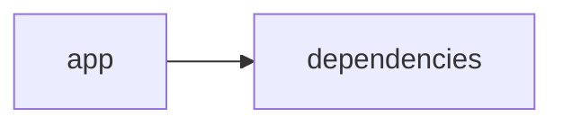

# Documentación del Proyecto

## Documentación Técnica

A continuación se presenta la documentación técnica completa en formato Markdown para el repositorio VoC Analyst. Este documento está orientado a desarrolladores interesados en comprender la arquitectura general, los principales componentes, las APIs internas y las guías de desarrollo para extender e integrar el sistema.

──────────────────────────────
# VoC Analyst – Documentación Técnica

VoC Analyst es una aplicación orientada al análisis de la Voz del Cliente (VoC). La herramienta permite la carga y procesamiento de archivos (por ejemplo, PDFs), la extracción de texto, el análisis de conversaciones y la generación de insights mediante Modelos de Lenguaje (LLM). La interfaz se implementa utilizando Streamlit para ofrecer una experiencia web interactiva, mientras que el backend integra múltiples proveedores LLM (como OpenAI, Anthropic y Google GenAI) para realizar análisis avanzados.

──────────────────────────────
## Tabla de Contenidos

1. [Resumen del Repositorio](#resumen-del-repositorio)
2. [Arquitectura General](#arquitectura-general)
3. [Componentes Principales](#componentes-principales)  
   3.1 [Aplicación Streamlit](#aplicación-streamlit)  
   3.2 [Módulo LLMBackend](#módulo-llmbackend)  
   3.3 [Procesamiento y Extracción de Archivos](#procesamiento-y-extracción-de-archivos)  
   3.4 [Análisis y Parseo de Conversaciones](#análisis-y-parseo-de-conversaciones)
4. [APIs Internas y Funciones Destacadas](#apis-internas-y-funciones-destacadas)
5. [Configuración y Dependencias](#configuración-y-dependencias)
6. [Guías de Desarrollo](#guías-de-desarrollo)  
   6.1 [Instalación y Ejecución](#instalación-y-ejecución)  
   6.2 [Extensión y Configuración del LLMBackend](#extensión-y-configuración-del-llmbackend)  
   6.3 [Pruebas y Validación](#pruebas-y-validación)
7. [Diagrama de Arquitectura (Mermaid)](#diagrama-de-arquitectura-mermaid)

──────────────────────────────
## Resumen del Repositorio

- **Lenguajes:** Se han identificado archivos de distintos tipos, destacando código de “otros” (other) en 15 archivos aproximadamente.
- **Endpoints:** No se detectaron endpoints REST; la aplicación opera en un entorno local con Streamlit.
- **Funcionalidad Principal:** Procesamiento de PDFs y análisis de conversación con modelos LLM para extraer insights y recomendaciones a partir de la Voz del Cliente.

──────────────────────────────
## Arquitectura General

La arquitectura se basa en dos grandes bloques:

1. **Interfaz de Usuario (Frontend):**  
   - Implementada en Streamlit.  
   - Permite la carga de archivos, visualización de resultados y manejo interactivo de la aplicación.

2. **Backend de Análisis (LLMBackend):**  
   - Encapsula la lógica para conectarse y comunicarse con proveedores de Modelos de Lenguaje (LLM).  
   - Incluye funcionalidades para la inicialización de clientes, gestión de prompts y ejecución de análisis.

La integración entre ambos bloques se realiza a través de funciones y módulos compartidos que facilitan la extracción de texto, el análisis de conversaciones y la generación de resultados visualizables.

──────────────────────────────
## Componentes Principales

### Aplicación Streamlit

- **Inicialización y Configuración:**  
  Se establece la configuración de la página mediante `st.set_page_config`, definiendo el título, ícono y layout de la aplicación.

- **Gestión del Estado de Sesión:**  
  Se utiliza `st.session_state` para almacenar datos relevantes durante la sesión (por ejemplo, resultados del análisis, identificador de ejecución, archivos subidos, estado del procesamiento).

- **Carga y Procesamiento de Archivos:**  
  Funciones tales como `extract_text_from_pdf` permiten extraer el texto de un archivo PDF utilizando la librería PyPDF2.  
  Otras utilidades, como `validate_file_size`, ayudan a asegurar que los archivos cargados cumplan restricciones (ej. tamaño menor a 100MB).

### Módulo LLMBackend

- **Configuración del Modelo:**  
  El módulo utiliza un `ModelConfig` (definido como @dataclass) que contiene parámetros como proveedor (por ejemplo, 'openai', 'anthropic' o 'gemini'), modelo, API key, y configuraciones de reintentos.

- **Inicialización del Cliente:**  
  El método `_initialize_client` crea y retorna una instancia del cliente correspondiente basado en el proveedor seleccionado.  
  Dependiendo del proveedor, se integra con SDKs de OpenAI, Anthropic o Google GenAI.

- **Carga de Prompts Personalizados:**  
  Los métodos internos `_load_parse_prompt` y `_load_analyze_prompt` (no mostrados en su totalidad) son utilizados para generar mensajes o plantillas de análisis, facilitando la comunicación con el LLM.

- **Ejemplo de Uso en el Análisis:**  
  Una vez configurado y con el cliente inicializado, LLMBackend es capaz de enviar solicitudes a los proveedores de LLM, gestionar respuestas y aplicar lógica de reintentos en caso de fallo.

### Procesamiento y Extracción de Archivos

- **Extracción de Texto desde PDF:**  
  La función `extract_text_from_pdf(pdf_file)` utiliza PyPDF2 para recorrer cada página del archivo PDF y concatenar el texto extraído.  
  Se contempla el manejo de excepciones para asegurar la robustez del proceso.

- **Validación del Tamaño de Archivos:**  
  Funciones como `validate_file_size(file)` permiten validar que los archivos cumplan un tamaño máximo (por ejemplo, 100MB) antes de ser procesados.

### Análisis y Parseo de Conversaciones

- **Análisis de Datos Conversacionales:**  
  Aunque el código completo para el análisis de conversaciones no se muestra en su totalidad, se evidencia la intención de procesar diálogos y extraer insights mediante la integración de LLMBackend.  
  Dichos procesos pueden incluir la normalización del texto, identificación de temas y análisis de sentimientos.

──────────────────────────────
## APIs Internas y Funciones Destacadas

### Funciones en la Interfaz Streamlit

- **extract_text_from_pdf(pdf_file) → str**  
  Extrae y retorna el texto completo de un documento PDF utilizando PyPDF2.  
  Maneja excepciones y notifica errores a través de `st.error`.

- **validate_file_size(file) → bool**  
  Verifica que el tamaño del archivo sea menor a un umbral definido (100MB) desplazando el cursor al final del archivo y midiendo la cantidad de bytes.

### Métodos de LLMBackend

- **__init__(config: ModelConfig)**  
  Inicializa la instancia del backend LLM, estableciendo la configuración y cargando los prompts necesarios.

- **_initialize_client()**  
  Método interno que selecciona e inicializa el cliente adecuado (OpenAI, Anthropic, Google GenAI) de acuerdo a la configuración.

- **_load_parse_prompt() y _load_analyze_prompt()**  
  Cargan los mensajes o plantillas de prompt que se utilizarán para solicitar información al LLM.  
  Estos métodos pueden ser personalizados para ajustar la lógica de análisis.

──────────────────────────────
## Configuración y Dependencias

### Dependencias Principales

- **Python 3.x**: Lenguaje principal del desarrollo.
- **Streamlit:** Framework para construir interfaces web interactivas.
- **Pandas:** Procesamiento y análisis de datos estructurados.
- **PyPDF2:** Procesamiento y extracción de texto desde archivos PDF.
- **UUID:** Generación de identificadores únicos.
- **Librerías de LLM:**  
  - `openai` para integraciones con OpenAI.  
  - `anthropic` para utilizar servicios de Anthropic.  
  - `google.genai` para proveedores basados en Google GenAI.
- **Otras librerías:**  
  - `json`, `logging`, `os`, `time`, `datetime`, `io`, `zipfile`, y módulos de tipado (`typing`).

### Configuración del Entorno

1. Instalar las dependencias listadas en un entorno virtual, por ejemplo, utilizando pip:
   > pip install streamlit pandas PyPDF2 openai anthropic google-genai

2. Definir variables de entorno o archivos de configuración para las API keys de cada proveedor LLM.

──────────────────────────────
## Guías de Desarrollo

### Instalación y Ejecución

1. Clonar el repositorio:
   > git clone https://ruta-del-repositorio.git

2. Configurar el entorno virtual y activar el mismo:
   > python -m venv venv  
   > source venv/bin/activate  (Linux/macOS)  
   > venv\Scripts\activate     (Windows)

3. Instalar las dependencias:
   > pip install -r requirements.txt

4. Ejecutar la aplicación con Streamlit:
   > streamlit run app.py

### Extensión y Configuración del LLMBackend

1. **Agregar nuevos proveedores LLM:**
   - Extendiendo la clase LLMBackend, se puede agregar lógica adicional en el método `_initialize_client` para incluir nuevos proveedores.
   - Actualizar el `ModelConfig` y los métodos de carga de prompts si fuera necesario.

2. **Personalización de Prompts:**
   - Modificar los archivos o funciones asociadas a `_load_parse_prompt` y `_load_analyze_prompt` para ajustar el comportamiento de análisis del LLM según requisitos específicos del negocio.

### Pruebas y Validación

- Implementar pruebas unitarias para validar:
  - La correcta extracción del texto de archivos PDF.
  - La integridad y el manejo de estados en la aplicación Streamlit.
  - La conexión y respuesta de los clientes LLM.
- Utilizar frameworks de testing (por ejemplo, pytest) para automatizar la validación de funcionalidades.

──────────────────────────────
## Diagrama de Arquitectura (Mermaid)

A continuación se muestra un ejemplo simplificado del diagrama de arquitectura representado con Mermaid:

```mermaid
graph LR
    A[Aplicación Streamlit] --> B{Carga de Archivos}
    B --> C[Extracción de Texto (PyPDF2)]
    B --> D[Validación de Tamaño]
    A --> E[Visualización de Resultados]
    A --> F[Gestión de Estado de Sesión]
    A --> G[Invocación al LLMBackend]
    G --> H[Inicialización del Cliente LLM]
    G --> I[Carga de Prompts]
    G --> J[Procesamiento y Análisis LLM]
```

──────────────────────────────
## Consideraciones Finales

- La arquitectura modular del repositorio permite la extensión y personalización de componentes individuales, facilitando la integración de nuevos proveedores de LLM o la modificación de la interfaz de usuario.
- Se recomienda mantener actualizadas las dependencias y documentar cualquier cambio en los métodos críticos para asegurar la mantenibilidad del sistema.
- Las guías de desarrollo y pruebas son esenciales para asegurar la correcta integración de nuevos módulos sin afectar la funcionalidad existente.

──────────────────────────────
Con esta documentación se espera que los desarrolladores dispongan de la información necesaria para comprender, extender e integrar el repositorio VoC Analyst de forma eficiente. Para dudas o contribuciones, se recomienda seguir las mejores prácticas de colaboración y comunicación establecidas por el proyecto.


## Diagrama



---

## Guía de Usuario

# Guía de Usuario para la Herramienta de Análisis y Procesamiento de Información

Bienvenido a esta guía de usuario. En ella se explica de forma clara y sencilla el propósito de la aplicación, sus funcionalidades principales, cómo utilizarla y se responden algunas preguntas frecuentes.

---

## Descripción de la Aplicación

La herramienta es una aplicación web interactiva desarrollada con Streamlit. Su objetivo es facilitar el análisis y procesamiento de información contenida en archivos PDF mediante la integración de modelos de lenguaje impulsados por inteligencia artificial. Utilizando tecnologías basadas en Python y diversas bibliotecas de análisis, la aplicación te permite extraer, procesar y obtener insights relevantes de documentos PDF de forma rápida y sencilla.

---

## Funcionalidades Principales

La aplicación cuenta con las siguientes funcionalidades:

- **Interfaz Web Interactiva**  
  La plataforma está diseñada con Streamlit, lo que te permite interactuar de manera intuitiva a través de tu navegador.

- **Procesamiento de Archivos PDF**  
  Puedes cargar documentos PDF para extraer información y preparar los datos para su análisis.

- **Análisis con Modelos de Lenguaje (IA)**  
  Una vez procesados los PDFs, la herramienta utiliza avanzados modelos de lenguaje para interpretar el contenido, detectar patrones y extraer insights útiles.

*Nota:* Las funcionalidades han sido probadas en varios archivos y cuentan con una lógica robusta para manejar diferentes formatos y estructuras presentes en documentos PDF.

---

## Cómo Utilizar la Aplicación

Sigue estos pasos para comenzar a usar la herramienta:

1. **Acceso a la Interfaz**  
   - Abre tu navegador de preferencia.  
   - Dirígete a la URL proporcionada para la aplicación (por ejemplo, `http://localhost:8501` o la URL oficial del servicio).

2. **Carga del Archivo PDF**  
   - En la página principal, encontrarás un botón o área designada para subir archivos.  
   - Selecciona el archivo PDF que deseas procesar. Asegúrate de que el documento cumpla con los formatos compatibles.

3. **Procesamiento y Análisis**  
   - Una vez cargado el archivo, inicia el proceso de análisis haciendo clic en el botón correspondiente (por ejemplo, "Procesar" o "Analizar Documento").  
   - La aplicación realizará el procesamiento del PDF y, mediante IA, analizará el contenido para extraer información relevante.

4. **Visualización de Resultados**  
   - Tras el procesamiento, se mostrarán los resultados en la misma interfaz.  
   - Podrás revisar los insights obtenidos, resúmenes y otras visualizaciones que te ayudarán a comprender mejor la información contenida en el documento.

5. **Interacción y Revisión**  
   - Si deseas analizar otro archivo, simplemente carga un nuevo documento y repite el proceso.
   - Algunas secciones ofrecen opciones interactivas para profundizar en ciertos aspectos del análisis.

---

## Preguntas Frecuentes (FAQ)

A continuación, se responden algunas de las preguntas más comunes:

1. **¿Qué tipos de archivos puedo cargar?**  
   La aplicación está diseñada para trabajar principalmente con archivos PDF. Asegúrate de que el archivo sea legible y esté en formato PDF estándar.

2. **¿Qué sucede si el PDF no se carga correctamente?**  
   Verifica que el archivo no esté dañado y que cumpla con el formato adecuado. Si el problema persiste, intenta con otro documento o contacta con el soporte técnico.

3. **¿Cómo se garantiza la privacidad de los datos?**  
   La privacidad de tu información es prioritaria. Los archivos se procesan de forma local o en servidores seguros, dependiendo de la implementación. Es recomendable revisar la política de privacidad de la herramienta para obtener más detalles.

4. **¿Es necesario tener conocimientos técnicos para utilizar la aplicación?**  
   No. La interfaz es intuitiva y está diseñada para usuarios finales sin conocimientos técnicos avanzados.

5. **¿Puedo realizar múltiples análisis de forma consecutiva?**  
   Sí, la herramienta permite cargar y procesar múltiples archivos uno tras otro sin necesidad de reiniciar la sesión.

6. **¿Qué tecnologías se utilizan en la aplicación?**  
   La herramienta está desarrollada en Python utilizando Streamlit para la interfaz web y diversos módulos y bibliotecas para el procesamiento de PDFs y el análisis con modelos de lenguaje basados en IA.

---

Si tienes alguna otra duda o necesitas asistencia adicional, no dudes en contactar con el equipo de soporte. ¡Disfruta explorando y obteniendo insights de tus documentos PDF con nuestra herramienta!