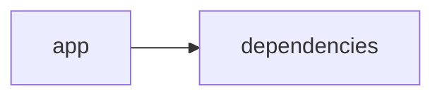
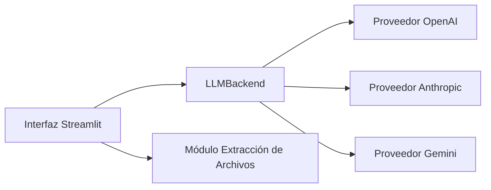

# Documentación del Proyecto

## Documentación Técnica

A continuación se presenta la documentación técnica completa en Markdown para desarrolladores del repositorio VoC Analyst. La documentación abarca la arquitectura general, los componentes principales, APIs internas y guías de desarrollo, con el objetivo de facilitar la comprensión, extensión e integración del sistema.

---

# VoC Analyst – Documentación Técnica

VoC Analyst es una aplicación orientada al análisis de la Voz del Cliente (VoC). Utiliza procesamiento de archivos (por ejemplo, PDF), extracción de texto, análisis de conversaciones y generación de insights mediante Modelos de Lenguaje (LLM). La interfaz de usuario se implementa con Streamlit, mientras que el backend integra múltiples proveedores LLM (como OpenAI, Anthropic y Google GenAI) para proveer análisis avanzados.

---

## Tabla de Contenidos

1. [Resumen del Repositorio](#resumen-del-repositorio)
2. [Arquitectura General](#arquitectura-general)
3. [Componentes Principales](#componentes-principales)  
   3.1 [Aplicación Streamlit](#aplicación-streamlit)  
   3.2 [Módulo LLMBackend](#módulo-llmbackend)  
   3.3 [Procesamiento y Extracción de Archivos](#procesamiento-y-extracción-de-archivos)  
   3.4 [Análisis y Parseo de Conversaciones](#análisis-y-parseo-de-conversaciones)
4. [APIs Internas y Funciones Destacadas](#apis-internas-y-funciones-destacadas)
5. [Configuración y Dependencias](#configuración-y-dependencias)
6. [Guías de Desarrollo](#guías-de-desarrollo)  
   6.1 [Instalación y Ejecución](#instalación-y-ejecución)  
   6.2 [Extensión y Configuración del LLMBackend](#extensión-y-configuración-del-llmbackend)  
   6.3 [Pruebas y Validación](#pruebas-y-validación)
7. [Diagrama de Arquitectura](#diagrama-de-arquitectura)

---

## Resumen del Repositorio

- **Lenguajes:**  
  - Se han identificado archivos clasificados como _other_ (aproximadamente 16 archivos), lo que indica la utilización de scripts y archivos de configuración.
  
- **Endpoints:**  
  - No se detectaron endpoints REST explícitos; la comunicación se lleva a cabo dentro del flujo de la aplicación web y el backend LLM.

- **Resumen de funcionalidades:**  
  - Procesamiento interactivo de archivos (por ejemplo, PDFs) mediante extracción de texto.  
  - Uso de modelos de lenguaje (LLM) para análisis y parseo de conversaciones.  
  - Interfaz de usuario implementada con Streamlit para visualización de resultados y configuración de análisis.

---

## Arquitectura General

La arquitectura de VoC Analyst se estructura en dos grandes bloques:

1. **Interfaz de Usuario (Frontend):**
   - Implementada completamente en Streamlit.
   - Se encarga de la carga de archivos, presentación de resultados y gestión del estado de la sesión.

2. **Backend para Análisis LLM:**
   - Integración con diversos proveedores de LLM a través del módulo LLMBackend.
   - Encapsula la lógica de análisis, comunicación con APIs externas y procesamiento de resultados.
  
La siguiente representación en Mermaid resume la relación principal entre la aplicación y sus dependencias:



---

## Componentes Principales

### Aplicación Streamlit

- **Descripción:**  
  La interfaz construida con Streamlit facilita la interacción del usuario, permitiendo:
  - Configuración de la página (título, icono, layout, barra lateral).
  - Carga y almacenamiento temporal de archivos y resultados mediante el estado de sesión.
  - Invocación de funciones para extraer textos (por ejemplo, de PDFs) y validar archivos.
  
- **Código Representativo:**

  ```python
  import streamlit as st
  import json
  import pandas as pd
  import time
  from datetime import datetime
  import uuid
  import zipfile
  import io
  import os
  from typing import List, Dict, Any, Optional
  import PyPDF2
  from llm_backend import LLMBackend, ModelConfig

  st.set_page_config(
      page_title="VoC Analyst - Análisis de Voz del Cliente con LLM",
      page_icon="📊",
      layout="wide",
      initial_sidebar_state="expanded"
  )

  if 'analysis_results' not in st.session_state:
      st.session_state.analysis_results = None
  if 'run_id' not in st.session_state:
      st.session_state.run_id = None
  if 'uploaded_files_data' not in st.session_state:
      st.session_state.uploaded_files_data = []
  if 'processing_complete' not in st.session_state:
      st.session_state.processing_complete = False

  def extract_text_from_pdf(pdf_file) -> str:
      """Extraer texto de archivo PDF"""
      try:
          pdf_reader = PyPDF2.PdfReader(pdf_file)
          text = ""
          for page in pdf_reader.pages:
              text += page.extract_text() + "\n"
          return text.strip()
      except Exception as e:
          st.error(f"Error al extraer texto de PDF: {str(e)}")
          return ""
  ```

### Módulo LLMBackend

- **Descripción:**  
  Encapsula y abstrae la comunicación con distintos proveedores de modelos de lenguaje. Permite configurar el proveedor, seleccionar modelo y gestionar reintentos en caso de fallos.
  
- **Componentes Clave:**
  - Clase `ModelConfig`: Define la configuración necesaria para la selección del modelo.
  - Clase `LLMBackend`: Inicializa el cliente LLM basado en la configuración y carga prompts personalizados para parseo y análisis.
  
- **Código Representativo:**

  ```python
  from dataclasses import dataclass
  import openai
  import anthropic
  from google import genai

  @dataclass
  class ModelConfig:
      """Configuration for LLM model selection"""
      provider: str  # 'openai', 'anthropic', 'gemini'
      model: str
      api_key: str
      max_retries: int = 3
      retry_delay: float = 1.0

  class LLMBackend:
      """Backend service for LLM-based VoC analysis"""
      
      def __init__(self, config: ModelConfig):
          self.config = config
          self.client = self._initialize_client()
          self.parse_prompt = self._load_parse_prompt()
          self.analyze_prompt = self._load_analyze_prompt()
      
      def _initialize_client(self):
          """Initialize the appropriate LLM client"""
          if self.config.provider == 'openai':
              return openai.OpenAI(api_key=self.config.api_key)
          elif self.config.provider == 'anthropic':
              return anthropic.Anthropic(api_key=self.config.api_key)
          elif self.config.provider == 'gemini':
              return genai.Client(api_key=self.config.api_key)
          else:
              raise ValueError(f"Unsupported provider: {self.config.provider}")
      
      def _load_parse_prompt(self) -> str:
          # Cargar o definir el prompt para la extracción de información de conversaciones
          return "Prompt de parseo de conversación"
      
      def _load_analyze_prompt(self) -> str:
          # Cargar o definir el prompt para el análisis de conversaciones y generación de insights
          return "Prompt de análisis de conversación"
      
      def analyze_text(self, text: str) -> Dict[str, Any]:
          """Ejecuta el análisis de VoC sobre el texto proporcionado"""
          # Ejemplo de proceso de análisis con manejo de reintentos
          retries = 0
          while retries < self.config.max_retries:
              try:
                  # Lógica de invocación al API de LLM con el prompt de análisis
                  result = self.client.create_completion(
                      engine=self.config.model,
                      prompt=(self.analyze_prompt + "\n" + text),
                      max_tokens=150
                  )
                  return result
              except Exception as e:
                  retries += 1
                  time.sleep(self.config.retry_delay)
                  logger.error(f"Error al analizar texto: {e}. Reintento {retries}")
          raise RuntimeError("Se superó el número máximo de reintentos para analizar el texto.")
  ```

### Procesamiento y Extracción de Archivos

- **Descripción:**  
  Módulo encargado de la carga y procesamiento de archivos. Se enfoca en extraer texto desde archivos PDF y validar el tamaño de los archivos.
  
- **Funciones Clave:**
  - `extract_text_from_pdf(pdf_file)`: Extrae y concatena el texto de cada página de un documento PDF.
  - `validate_file_size(file)`: Revisa que el tamaño del archivo no exceda el límite especificado (por ejemplo, 100 MB).

### Análisis y Parseo de Conversaciones

- **Descripción:**  
  Implementa la lógica para transformar y analizar conversaciones extraídas de archivos o entradas de usuario, permitiendo:
  - La normalización del texto.
  - La segmentación por temas.
  - La identificación de sentimientos y emociones.
  
- **Notas:**  
  La integración con LLMBackend es clave para trasladar la conversación procesada al modelo de lenguaje, el cual retorna insights y recomendaciones basadas en el análisis.

---

## APIs Internas y Funciones Destacadas

A continuación se listan las principales APIs y funciones que pueden ser de interés para la extensión o integración del proyecto:

- **LLMBackend.analyze_text(text: str) → Dict[str, Any]:**  
  Procesa el texto ingresado utilizando el prompt de análisis y retorna los resultados obtenidos del proveedor LLM.

- **extract_text_from_pdf(pdf_file) → str:**  
  Función auxiliar para extraer el contenido textual de un archivo PDF.  
  _Manejo de errores:_ Emite un mensaje de error mediante la interfaz Streamlit en caso de fallo en la extracción.

- **validate_file_size(file) → bool:**  
  Valida que el tamaño del archivo se encuentre dentro del rango permitido (por ejemplo, menor a 100 MB).

*Nota:* Otras funciones internas en el módulo de extracción y en la lógica de Streamlit permiten gestionar el estado de la sesión (por ejemplo, almacenamiento de resultados, generación de IDs únicos para cada análisis, etc.).

---

## Configuración y Dependencias

- **Dependencias principales:**  
  - Python 3.x  
  - Streamlit  
  - Pandas  
  - PyPDF2  
  - openai  
  - anthropic  
  - google-genai (dependiente de la integración con Google GenAI)

- **Instalación de dependencias:**  
  Se recomienda utilizar un entorno virtual. Un ejemplo utilizando pip:

  ```bash
  python -m venv env
  source env/bin/activate  # En Windows: env\Scripts\activate
  pip install -r requirements.txt
  ```

- **Configuración del proveedor LLM:**  
  Cada proveedor (OpenAI, Anthropic, Gemini) requiere una API key válida. Configure la instancia de ModelConfig, por ejemplo:

  ```python
  from llm_backend import ModelConfig, LLMBackend

  config = ModelConfig(
      provider="openai",  # O 'anthropic' / 'gemini'
      model="text-davinci-003",
      api_key="TU_API_KEY_AQUI"
  )
  llm_service = LLMBackend(config)
  ```

---

## Guías de Desarrollo

### Instalación y Ejecución

1. Clona el repositorio:

   ```bash
   git clone https://github.com/tu_usuario/voc-analyst.git
   cd voc-analyst
   ```

2. Crea un entorno virtual e instala las dependencias:

   ```bash
   python -m venv env
   source env/bin/activate  # En Windows: env\Scripts\activate
   pip install -r requirements.txt
   ```

3. Ejecuta la aplicación:

   ```bash
   streamlit run app.py
   ```

### Extensión y Configuración del LLMBackend

- Para agregar soporte a nuevos proveedores de LLM, extienda la función _initialize_client() en la clase LLMBackend.
- Asegúrese de definir nuevos prompts para parseo o análisis si es necesario.
- Pruebe siempre la conexión y respuesta del proveedor antes de despliegues en producción.

### Pruebas y Validación

- Incluya pruebas unitarias para funciones críticas, como:
  - Extracción de texto en archivos PDF.
  - Validación de tamaño y formato de archivos.
  - Resiliencia de la función analyze_text() con manejo de reintentos.
- Utilice herramientas de testing (por ejemplo, pytest) y cubra casos de éxito y escenarios de fallo.

---

## Diagrama de Arquitectura

El siguiente diagrama en Mermaid ilustra de forma simple la relación entre la aplicación principal y sus dependencias:



---

Con esta documentación, los desarrolladores cuentan con una vista integral de la arquitectura y el funcionamiento interno de VoC Analyst. Se recomienda profundizar en cada módulo mediante la lectura de los comentarios y la experimentación directa en el código para facilitar futuras extensiones y mantenimientos.


## Diagrama


---

## Guía de Usuario

# Guía del Usuario para la Herramienta de Análisis y Procesamiento de Información

Bienvenido a la aplicación basada en Streamlit, diseñada para facilitar el análisis y procesamiento de información a partir de archivos PDF utilizando modelos de lenguaje (IA). En esta guía, encontrarás una descripción de la aplicación, las principales funcionalidades, instrucciones de uso y respuestas a las preguntas frecuentes.

---

## 1. Descripción de la Aplicación

Esta herramienta combina una interfaz web interactiva creada con Streamlit, junto con potentes capacidades de procesamiento de archivos PDF y análisis mediante modelos de lenguaje basados en inteligencia artificial. El objetivo principal es ayudar a los usuarios a extraer, analizar y comprender la información contenida en documentos PDF de forma rápida y sencilla.

**Características clave:**
- Interfaz web fácil de usar.
- Procesamiento automático de archivos PDF.
- Análisis inteligente de contenido utilizando modelos de lenguaje.
- Visualización interactiva de resultados.

---

## 2. Funcionalidades Principales

### 2.1 Interfaz Web Interactiva con Streamlit
- **Navegación sencilla:** La aplicación cuenta con una interfaz intuitiva diseñada con Streamlit, permitiendo a los usuarios cargar archivos, iniciar procesos de análisis y visualizar resultados sin complicaciones.
- **Visualización dinámica:** Resultados y gráficos se actualizan en tiempo real conforme se realiza el procesamiento.

### 2.2 Procesamiento de Archivos PDF
- **Carga y extracción:** Permite al usuario subir documentos PDF. La herramienta extrae el texto y otras informaciones relevantes automáticamente.
- **Manejo de documentos extensos:** Ideal para trabajar tanto con documentos breves como con reportes extensos.

### 2.3 Análisis con Modelos de Lenguaje (IA)
- **Comprensión semántica:** Utiliza modelos de lenguaje avanzados para analizar el contenido extraído, identificando temas, patrones e información clave.
- **Generación de resúmenes:** Capacidad para ofrecer resúmenes y respuestas a consultas específicas basados en el contenido de los documentos.
- **Asistencia en toma de decisiones:** Ayuda a interpretar la información procesada, soportando la toma de decisiones basada en los datos contenidos en los archivos PDF.

---

## 3. Cómo Usar la Aplicación

### Paso 1: Acceso a la Interfaz Web
1. Abra un navegador web y acceda a la URL designada para la aplicación.
2. Espere a que la página cargue completamente. La interfaz principal de Streamlit se mostrará, presentando el menú de opciones.

### Paso 2: Cargar Archivos PDF
1. En la sección de carga de documentos, haga clic en el botón "Seleccionar archivo" y elija el PDF que desea analizar.
2. Confirme la subida del archivo. La aplicación comenzará a procesar el documento.

### Paso 3: Procesamiento y Análisis del documento
1. Una vez cargado el PDF, se realizará un procesamiento automático del texto.
2. La aplicación empleará modelos de lenguaje para analizar el contenido y generar resultados relevantes.
3. Espere unos momentos mientras se completa el análisis.

### Paso 4: Visualización y Exportación de Resultados
1. Revise los resultados mostrados en pantalla: resúmenes, gráficos y puntos destacados del análisis.
2. Opcionalmente, utilice las herramientas de filtrado y búsqueda para profundizar en áreas específicas del documento.
3. Si lo desea, exporte los resultados en formatos compatibles (por ejemplo, CSV, PDF o JSON).

---

## 4. Preguntas Frecuentes (FAQ)

### P: ¿Qué tipos de documentos puedo analizar?
R: Actualmente, la aplicación está optimizada para archivos en formato PDF. Se están explorando futuras incorporaciones para otros formatos.

### P: ¿Necesito tener conocimientos técnicos para usar la herramienta?
R: No, la interfaz está diseñada para ser sencilla e intuitiva. Con pasos claros y una navegación asistida, cualquier usuario sin experiencia técnica puede utilizar la aplicación sin dificultad.

### P: ¿Cuánto tiempo tarda el análisis de un documento?
R: La duración del procesamiento dependerá del tamaño y complejidad del PDF. Documentos más extensos pueden tomar unos minutos, mientras que archivos pequeños se procesan casi de inmediato.

### P: ¿Qué seguridad tiene mi información?
R: La aplicación está desarrollada en Python y utiliza bibliotecas robustas de análisis. Se han implementado medidas de seguridad para garantizar la privacidad de los documentos cargados, sin almacenar información sensible en servidores externos.

### P: ¿Cómo puedo obtener soporte o reportar un problema?
R: Si encuentra algún inconveniente o necesita asistencia adicional, por favor póngase en contacto con el equipo de soporte a través del formulario de contacto disponible en la sección "Ayuda" o envíe un correo a soporte@nombredeaplicacion.com.

### P: ¿Existen planes de agregar nuevas funcionalidades en el futuro?
R: Sí, el equipo de desarrollo está trabajando continuamente en actualizaciones para incorporar nuevas características, mejorar el rendimiento y ampliar la compatibilidad con otros formatos y análisis.

---

## 5. Conclusión

Esta herramienta es una solución integral para transformar, analizar y visualizar información contenida en documentos PDF con la ayuda de la inteligencia artificial. Esperamos que esta guía le permita aprovechar al máximo la aplicación. ¡Comience a explorar y optimice su proceso de análisis de información hoy mismo!

Si tiene más preguntas o necesita asistencia adicional, no dude en contactar al equipo de soporte.

--- 

¡Gracias por utilizar nuestra aplicación!