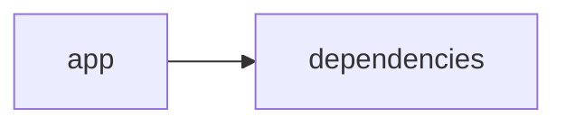

# Documentación del Proyecto

## Guía de Usuario
# Guía de Usuario: Herramienta de Análisis y Procesamiento de Información

Esta documentación te ayudará a conocer y utilizar la aplicación diseñada para facilitar el análisis y procesamiento de datos a través de una interfaz web interactiva. La herramienta integra funcionalidades de procesamiento de archivos PDF y análisis de texto con modelos de lenguaje basados en Inteligencia Artificial utilizando Python y sus bibliotecas.

---

## Descripción de la Aplicación

La aplicación es una solución integral que combina:
- **Interfaz Web Interactiva con Streamlit:** Permite la interacción en tiempo real y la visualización intuitiva de la información.
- **Procesamiento de Archivos PDF:** Facilita la carga, extracción y preprocesamiento de contenidos presentes en documentos PDF.
- **Análisis con Modelos de Lenguaje (IA):** Emplea algoritmos y modelos de lenguaje para interpretar y analizar el contenido extraído, ayudando a extraer conclusiones o clasificar la información.

Esta herramienta está diseñada para usuarios que requieren analizar grandes volúmenes de datos en forma de documentos y obtener insights de manera rápida y eficiente.

---

## Funcionalidades Principales

1. **Interfaz Web Interactiva con Streamlit:**  
   - Interfaz amigable y fácil de usar.
   - Visualización en tiempo real de los resultados.
   - Acceso desde cualquier navegador web.

2. **Procesamiento de Archivos PDF:**  
   - Carga y lectura de documentos PDF.
   - Extracción de texto e información relevante de los archivos.
   - Preprocesamiento del texto para preparar el análisis.

3. **Análisis con Modelos de Lenguaje (IA):**  
   - Empleo de modelos de lenguaje para interpretar el contenido textual.
   - Análisis semántico y de sentimientos.
   - Clasificación de la información y generación de resúmenes automáticos.

---

## Cómo Utilizar la Aplicación

### 1. Acceso a la Interfaz Web
- Ingresa a la URL proporcionada (por ejemplo, http://localhost:8501 si ejecutas la aplicación localmente).
- Se desplegará la interfaz de usuario basada en Streamlit.

### 2. Carga del Archivo PDF
- En la pantalla principal encontrarás un botón o sección para subir archivos.
- Arrastra y suelta el archivo PDF o selecciona uno desde tu sistema.
- La aplicación validará y cargará el documento.

### 3. Procesamiento y Análisis
- Una vez cargado el PDF, se iniciará el proceso de extracción y preprocesamiento del texto.
- Después de la extracción, los modelos de lenguaje analizarán el contenido.
- Los resultados del análisis, como resúmenes o clasificaciones, se mostrarán en la interfaz.

### 4. Visualización de Resultados
- Los resultados se presentan en formato visual (gráficos, resúmenes, tablas, etc.).
- Podrás interactuar con los resultados, por ejemplo, filtrando información o ampliando secciones específicas.
- Opcionalmente, será posible descargar los resultados o exportarlos para su posterior uso.

### 5. Finalizar la Sesión
- Una vez terminado el análisis, puedes cerrar la sesión o cargar un nuevo documento para realizar otro análisis.

---

## Preguntas Frecuentes (FAQs)

**1. ¿Qué tipos de archivos se pueden procesar?**  
La aplicación está optimizada para archivos PDF. En futuras versiones se evaluará la compatibilidad con otros formatos de documentos.

**2. ¿Cómo se protege la privacidad de mi información?**  
La aplicación procesa los documentos de forma local o en entornos seguros. Se recomienda revisar la política de privacidad para más detalles sobre el manejo de datos.

**3. ¿Necesito conocimientos técnicos para usar la herramienta?**  
No es necesario. La interfaz está diseñada para ser intuitiva y accesible para usuarios sin experiencia técnica.

**4. ¿Es posible realizar análisis en lote o procesar varios archivos a la vez?**  
La versión actual permite el procesamiento de un archivo PDF por sesión. Para análisis en lote, consulta la documentación avanzada o contacta con el soporte técnico.

**5. ¿Qué tipo de análisis de lenguaje realiza la aplicación?**  
La herramienta utiliza modelos de lenguaje avanzados para extraer resúmenes, interpretar sentimientos y clasificar información. La precisión del análisis dependerá del contenido y la complejidad del documento.

**6. ¿Puedo integrar esta herramienta en mi flujo de trabajo?**  
Sí, la aplicación puede integrarse en entornos que requieran análisis de documentos y procesamiento de información. Además, dispone de endpoints que permiten la comunicación con otros sistemas.

---

## Conclusión

Esta guía ofrece una visión general de las funciones y el uso de la herramienta de análisis y procesamiento de información. La interfaz intuitiva, combinada con las capacidades de procesamiento de PDF y análisis con IA, facilita la obtención de insights significativos a partir de documentos complejos.

Si tienes más preguntas o necesitas asistencia adicional, ¡no dudes en ponerte en contacto con el equipo de soporte!

## Documentación Técnica
# VoC Analyst – Documentación Técnica

VoC Analyst es una aplicación orientada al análisis de la Voz del Cliente (VoC). La herramienta permite la carga y procesamiento de archivos (por ejemplo, archivos PDF), la extracción de texto, el análisis de conversaciones y la generación de insights mediante Modelos de Lenguaje (LLM). La interfaz de usuario se construye con Streamlit, mientras que el backend integra múltiples proveedores LLM (como OpenAI, Anthropic y Google GenAI) para ofrecer análisis avanzados.

Esta documentación está diseñada para desarrolladores que deseen comprender, extender o mantener el sistema.

---

## Tabla de Contenidos

1. [Resumen del Repositorio](#resumen-del-repositorio)
2. [Arquitectura General](#arquitectura-general)
3. [Componentes Principales](#componentes-principales)  
   3.1 [Aplicación Streamlit](#aplicación-streamlit)  
   3.2 [Módulo LLMBackend](#módulo-llmbackend)  
   3.3 [Extracción y Procesamiento de Archivos](#extracción-y-procesamiento-de-archivos)  
   3.4 [Parser y Análisis de Conversaciones](#parser-y-análisis-de-conversaciones)
4. [APIs Internas y Funciones Destacadas](#apis-internas-y-funciones-destacadas)
5. [Configuración y Dependencias](#configuración-y-dependencias)
6. [Guías de Desarrollo](#guías-de-desarrollo)  
   6.1 [Instalación y Ejecución](#instalación-y-ejecución)  
   6.2 [Extender y Configurar LLMBackend](#extender-y-configurar-llmbackend)  
   6.3 [Pruebas y Validación](#pruebas-y-validación)
7. [Diagrama de Dependencias](#diagrama-de-dependencias)
8. [Consideraciones Finales](#consideraciones-finales)

---

## Resumen del Repositorio

- **Lenguajes:**  
  Se identifica el uso de múltiples lenguajes, principalmente Python, aunque se etiqueta como *other*.
  
- **Endpoints:**  
  No se han detectado endpoints expuestos, ya que la comunicación se da a través de la interfaz Streamlit y llamadas internas a la API de cada proveedor LLM.

- **Diagrama Mermaid de Dependencias:**

  ```mermaid
  graph LR
  App[app]-->Deps[dependencies]
  ```

---

## Arquitectura General

VoC Analyst se compone de dos capas principales:

1. **Capa de Presentación (Frontend):**  
   - Implementada en Streamlit.
   - Permite la interacción del usuario, carga de archivos, visualización de resultados y control del flujo de procesamiento de datos.

2. **Capa de Lógica y Análisis (Backend):**  
   - Incluye el módulo LLMBackend que se encarga de la integración con proveedores LLM.
   - Funciones de procesamiento y análisis de archivos (por ejemplo, extracción de texto de PDFs).
   - Parser y procesamiento de conversaciones para extraer insights y generar recomendaciones.

Esta separación facilita la escalabilidad y la integración de nuevos módulos o proveedores de LLM, permitiendo ampliar las funcionalidades sin afectar la interfaz de usuario.

---

## Componentes Principales

### 1. Aplicación Streamlit

- **Responsabilidad:**  
  Gestionar la interfaz de usuario, el estado de la sesión y la interacción directa del usuario con la aplicación.

- **Principales funcionalidades:**  
  - Configuración de la página (título, ícono, layout).
  - Manejo y validación de carga de archivos, por ejemplo, validando tamaños de archivos y extrayendo contenido de PDFs.
  - Actualización del estado de la aplicación mediante `st.session_state`.

- **Fragmento de Ejemplo:**

  ```python
  import streamlit as st
  import PyPDF2
  
  # Configuración de la página
  st.set_page_config(
      page_title="VoC Analyst - Análisis de Voz del Cliente con LLM",
      page_icon="📊",
      layout="wide",
      initial_sidebar_state="expanded"
  )
  
  # Inicializar el estado de la sesión
  if 'analysis_results' not in st.session_state:
      st.session_state.analysis_results = None
  if 'run_id' not in st.session_state:
      st.session_state.run_id = None
  if 'uploaded_files_data' not in st.session_state:
      st.session_state.uploaded_files_data = []
  if 'processing_complete' not in st.session_state:
      st.session_state.processing_complete = False
  
  def extract_text_from_pdf(pdf_file) -> str:
      """Extraer texto de archivo PDF"""
      try:
          pdf_reader = PyPDF2.PdfReader(pdf_file)
          text = ""
          for page in pdf_reader.pages:
              text += page.extract_text() + "\n"
          return text.strip()
      except Exception as e:
          st.error(f"Error al extraer texto de PDF: {str(e)}")
          return ""
  ```

### 2. Módulo LLMBackend

- **Responsabilidad:**  
  Actúa como puente entre la aplicación y los proveedores de Modelos de Lenguaje (LLM). Este módulo permite enviar solicitudes a la API del proveedor seleccionado (por ejemplo, OpenAI, Anthropic, Gemini de Google GenAI).

- **Componentes principales:**
  - **ModelConfig:**  
    Clase de configuración que define el proveedor del LLM, modelo a utilizar, API key y parámetros de reintento.
  
  - **LLMBackend:**  
    Clase que inicializa el cliente LLM según la configuración y prepara prompts para el parseo y análisis de datos.
  
- **Fragmento de Ejemplo:**

  ```python
  import logging
  from dataclasses import dataclass
  
  # LLM SDK imports
  import openai
  from openai import OpenAI
  import anthropic
  from anthropic import Anthropic
  from google import genai
  
  logging.basicConfig(level=logging.INFO)
  logger = logging.getLogger(__name__)
  
  @dataclass
  class ModelConfig:
      """Configuration for LLM model selection"""
      provider: str  # 'openai', 'anthropic', 'gemini'
      model: str
      api_key: str
      max_retries: int = 3
      retry_delay: float = 1.0
  
  class LLMBackend:
      """Backend service for LLM-based VoC analysis"""
      
      def __init__(self, config: ModelConfig):
          self.config = config
          self.client = self._initialize_client()
          self.parse_prompt = self._load_parse_prompt()
          self.analyze_prompt = self._load_analyze_prompt()
      
      def _initialize_client(self):
          """Initialize the appropriate LLM client"""
          if self.config.provider == 'openai':
              return OpenAI(api_key=self.config.api_key)
          elif self.config.provider == 'anthropic':
              return Anthropic(api_key=self.config.api_key)
          elif self.config.provider == 'gemini':
              return genai.Client(api_key=self.config.api_key)
          else:
              raise ValueError(f"Unsupported provider: {self.config.provider}")
      
      def _load_parse_prompt(self) -> str:
          # Cargar y/o definir el prompt que se utilizará para parsear conversaciones
          prompt = "Incluir las instrucciones de parseo aquí..."
          return prompt
      
      def _load_analyze_prompt(self) -> str:
          # Cargar y/o definir el prompt para el análisis de contenido y sentimientos
          prompt = "Incluir las instrucciones de análisis aquí..."
          return prompt
  
      def parse_conversation(self, conversation: str) -> Dict[str, Any]:
          # Implementación del cliente LLM para parsear el contenido de una conversación
          logger.info("Procesando parseo de conversación")
          # Lógica de reintento y manejo de peticiones a la API
          # ...
          return {"parsed": conversation}
  
      def analyze_text(self, text: str) -> Dict[str, Any]:
          # Implementación del cliente LLM para determinar insights del texto
          logger.info("Analizando texto")
          # Lógica para enviar el prompt y obtener respuesta desde el LLM
          # ...
          return {"analysis": text}
  ```

### 3. Extracción y Procesamiento de Archivos

- **Responsabilidad:**  
  Gestionar la carga, validación y extracción de contenido de archivos, centrándose inicialmente en archivos PDF.
  
- **Funciones clave:**
  - `extract_text_from_pdf`: Función para extraer el texto de cada página de un PDF.
  - `validate_file_size`: Asegura que el archivo no exceda el tamaño permitido (100MB).

- **Consideraciones:**  
  Estas funciones permiten la normalización de la entrada para asegurar que el contenido sea adecuado para su posterior análisis mediante LLM.

### 4. Parser y Análisis de Conversaciones

- **Responsabilidad:**  
  Recibir, parsear y analizar textos o diálogos (por ejemplo, conversaciones de clientes) para extraer insights, clasificar sentimientos, identificar emociones o detectar palabras clave.

- **Flujo de trabajo:**  
  1. Recibir el contenido (ej. texto extraído de un PDF o ingresado por el usuario).
  2. Utilizar un prompt predefinido para "parsear" la conversación.
  3. Analizar el texto mediante la función `analyze_text` del LLMBackend para obtener evaluaciones de sentimiento, tendencias o sugerencias.

---

## APIs Internas y Funciones Destacadas

Dentro de VoC Analyst se destacan las siguientes APIs y funciones:

- **LLMBackend.parse_conversation(conversation: str) -> Dict[str, Any]:**  
  Envía una petición al modelo LLM para transformar y extraer la información estructurada de una conversación.

- **LLMBackend.analyze_text(text: str) -> Dict[str, Any]:**  
  Procesa un bloque de texto y genera insights, tales como patrones de sentimiento o recomendaciones, a partir del análisis LLM.

- **extract_text_from_pdf(pdf_file) -> str:**  
  Extrae el contenido textual completa de un archivo PDF.

- **validate_file_size(file) -> bool:**  
  Verifica que el archivo a subir cumpla con la restricción de tamaño (menos de 100MB).

Estas funciones se pueden ampliar o modificar para adaptarse a nuevos requisitos o integrar otros proveedores de LLM.

---

## Configuración y Dependencias

### Dependencias Principales

- **Streamlit:** Para la creación de la interfaz web interactiva.
- **PyPDF2:** Para la lectura y extracción de texto de archivos PDF.
- **pandas:** (Opcional) Para manipulación y análisis de datos.
- **LLM SDKs:**
  - openai (OpenAI)
  - anthropic (Anthropic)
  - google.genai (Google Gemini)

### Instalación de Dependencias

Asegúrate de tener Python 3.8 o superior instalado. Usa `pip` para instalar las dependencias:

```bash
pip install streamlit pypdf2 pandas openai anthropic google-genai
```

> Nota: Revisa la documentación de cada SDK para confirmar la versión compatible y obtener detalles de configuración.

---

## Guías de Desarrollo

### Instalación y Ejecución

1. Clona el repositorio:

   ```bash
   git clone [URL_DEL_REPOSITORIO]
   cd voc-analyst
   ```

2. Instala las dependencias requeridas (ver sección de Configuración y Dependencias).

3. Ejecuta la aplicación en modo desarrollo:

   ```bash
   streamlit run app.py
   ```

   Esto levantará la interfaz web de la aplicación en el navegador.

### Extender y Configurar LLMBackend

- Para agregar un nuevo proveedor LLM, sigue estos pasos:
  1. Actualiza la clase `ModelConfig` para permitir la especificación del proveedor.
  2. En el método `_initialize_client()` de `LLMBackend`, añade la inicialización del cliente para el nuevo proveedor.
  3. Define o actualiza los prompts de análisis según las necesidades del nuevo modelo.

- Se recomienda implementar pruebas unitarias para validar la integración con nuevos proveedores.

### Pruebas y Validación

- Se deben crear pruebas que aseguren que:
  - El proceso de extracción de texto de archivos PDF funcione correctamente.
  - Las funciones de análisis (`parse_conversation` y `analyze_text`) retornen respuestas conformes, incluso en casos de error.
  - El manejo de estado en la interfaz (usando `st.session_state`) se realice de forma consistente durante el flujo de procesamiento.

- Utiliza frameworks como `pytest` para automatizar la ejecución de pruebas.

---

## Diagrama de Dependencias

A continuación se muestra un diagrama Mermaid que resume la relación principal entre la aplicación y sus dependencias:

```mermaid
graph LR
  A[Aplicación Streamlit] --> B[Procesamiento de Archivos]
  A --> C[Interfaz de Usuario]
  A --> D[LLMBackend]
  D --> E[Proveedor OpenAI]
  D --> F[Proveedor Anthropic]
  D --> G[Proveedor Gemini (Google GenAI)]
```

---

## Consideraciones Finales

- **Escalabilidad:**  
  La arquitectura modular (separación entre interfaz y backend) permite la integración de nuevos proveedores de LLM sin modificaciones significativas en la UI.

- **Manejo de Errores:**  
  Es fundamental implementar mecanismos robustos de manejo de errores, tanto en la extracción de texto como en la comunicación con los servicios LLM. La función `validate_file_size` y los bloques try/except en la función de extracción de texto son ejemplos fundamentales de esta práctica.

- **Seguridad:**  
  Asegúrate de proteger las API keys de cada proveedor LLM y evitar exponer información sensible en la configuración.

- **Documentación y Comentarios:**  
  La documentación en el código y en esta guía debe mantenerse actualizada para facilitar la colaboración y el mantenimiento a largo plazo del sistema.

---

Con esta documentación, los desarrolladores deben estar en capacidad de comprender la estructura del proyecto, sus componentes clave, y cómo extender o mantener la aplicación VoC Analyst. Para dudas adicionales o contribuciones, se recomienda revisar los comentarios en el código y los issues en el repositorio.


## Diagrama

