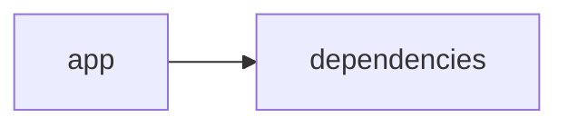

# Documentación del Proyecto

## Guía de Usuario
# Guía de Usuario: Herramienta de Análisis y Procesamiento de Información

Esta guía describe la aplicación, sus funcionalidades principales, cómo usarla y responde a preguntas frecuentes. La herramienta está desarrollada en Python utilizando bibliotecas de análisis, una interfaz web interactiva con Streamlit y capacidades de procesamiento y análisis de archivos PDF mediante modelos de lenguaje basados en inteligencia artificial.

---

## 1. Descripción General

La aplicación es una solución integral para el análisis y procesamiento de información contenida en archivos PDF. Con una interfaz web desarrollada con Streamlit, los usuarios pueden cargar sus archivos PDF para extraer, analizar y obtener insights mediante modelos de lenguaje (IA). La herramienta está diseñada para ser intuitiva y eficiente, facilitando la obtención de información relevante sin necesidad de conocimientos técnicos avanzados.

---

## 2. Funcionalidades Principales

La aplicación incorpora múltiples funcionalidades que la convierten en una herramienta poderosa para el manejo de información. A continuación, se describen las principales características:

- **Interfaz Web Interactiva (Streamlit):**  
  Permite una experiencia de usuario amigable y dinámica para cargar, visualizar y analizar documentos PDF de forma sencilla.

- **Procesamiento de Archivos PDF:**  
  Automatiza la extracción de texto e información relevante de archivos PDF, permitiendo su análisis posterior.

- **Análisis de Contenido con Modelos de Lenguaje (IA):**  
  Utiliza modelos de inteligencia artificial para analizar y comprender el contenido extraído del PDF, proporcionando resúmenes, respuestas a consultas específicas y detección de patrones o temas.

- **Integración Modular:**  
  La arquitectura permite una fácil integración y extensión de funcionalidades, facilitando futuras mejoras o personalizaciones.

- **Acceso a Endpoints Personalizados:**  
  La aplicación ofrece puntos de entrada (endpoints) basados en web para interactuar directamente con las funcionalidades y obtener resultados en tiempo real.

---

## 3. Descripción de Uso

Siga los pasos a continuación para utilizar la aplicación:

### 3.1. Acceso a la Aplicación

1. Abra su navegador web y diríjase a la URL donde se encuentra desplegada la aplicación.
2. Espere la carga completa de la interfaz desarrollada con Streamlit.

### 3.2. Carga y Procesamiento de Archivos PDF

1. En la interfaz principal, ubique la opción para cargar archivos.
2. Seleccione uno o varios archivos PDF desde su dispositivo.
3. Una vez cargados, la aplicación realizará la extracción del contenido y mostrará una vista previa del texto extraído.

### 3.3. Análisis de Información

1. Después de la carga y extracción, seleccione la opción de "Análisis con IA" para iniciar la evaluación del contenido.
2. El sistema utilizará modelos de lenguaje para:
   - Resumir el contenido del PDF.
   - Identificar temas, patrones y respuestas a preguntas específicas.
   - Proveer una visualización de los datos procesados (gráficos, listas, etc.).

### 3.4. Visualización y Descarga de Resultados

1. Revise los resultados y resúmenes generados en pantalla.
2. Si es necesario, descargue los informes o resultados en el formato proporcionado (por ejemplo, PDF o CSV).

---

## 4. Preguntas Frecuentes

### P1: ¿Qué tipos de archivos son compatibles?  
**R:** Principalmente archivos PDF. En futuras versiones se contempla ampliar la compatibilidad a otros tipos de documentos.

### P2: ¿Necesito conocimientos técnicos para utilizar la aplicación?  
**R:** No, la herramienta ha sido diseñada para ofrecer una experiencia amigable y sencilla, con instrucciones claras en la interfaz.

### P3: ¿Qué sucede si el PDF es muy grande o complejo?  
**R:** La aplicación está optimizada para manejar archivos de tamaño moderado. Para documentos especialmente grandes o con formatos complejos, el procesamiento puede demorar un poco más, y se recomienda dividir el archivo en secciones si es posible.

### P4: ¿Cómo se garantiza la privacidad de mis datos?  
**R:** La aplicación procesa los archivos únicamente en la sesión actual y no almacena la información en servidores a largo plazo. Asegúrese de revisar la política de privacidad para más detalles sobre el manejo de datos.

### P5: ¿Puedo integrar otras funciones o personalizar la herramienta?  
**R:** Sí, la aplicación cuenta con una arquitectura modular que permite a los desarrolladores agregar nuevas funcionalidades o adaptar la herramienta a necesidades específicas.

### P6: ¿Dónde puedo reportar un error o solicitar mejoras?  
**R:** Puede ponerse en contacto con el equipo de desarrollo a través del formulario de contacto disponible en la sección “Soporte” de la aplicación o mediante el correo electrónico proporcionado en la documentación técnica.

---

## 5. Consideraciones Finales

- Asegúrese de utilizar la versión más reciente del navegador para optimizar la experiencia.
- Revise la documentación técnica adicional para desarrolladores si desea profundizar en la integración o personalización de la herramienta.
- La aplicación es actualizada periódicamente con mejoras basadas en los comentarios de los usuarios y avances en modelos de IA.

Esperamos que esta guía le ayude a aprovechar al máximo las capacidades de la aplicación de análisis y procesamiento de información. ¡Disfrute de una experiencia interactiva y productiva!

## Documentación Técnica
A continuación se presenta la documentación técnica completa en Markdown para desarrolladores del repositorio VoC Analyst. Esta documentación se ha generado a partir del análisis del código fuente y la estructura del repositorio, e incluye detalles sobre la arquitectura, componentes principales, APIs internas y guías para la instalación, desarrollo e integración.

─────────────────────────────  
# VoC Analyst – Documentación Técnica

VoC Analyst es una aplicación para el análisis de la Voz del Cliente (VoC). La herramienta permite procesar documentos y conversaciones extraídas de archivos (como archivos PDF), aplicar técnicas de procesamiento de lenguaje natural (PLN) y obtener insights basados en modelos de lenguaje (LLM). La interfaz web se implementa con Streamlit, mientras que el backend integra distintos proveedores LLM (por ejemplo, OpenAI, Anthropic, Google GenAI) mediante el módulo LLMBackend.

─────────────────────────────  
## Tabla de Contenidos

1. [Resumen del Repositorio](#resumen-del-repositorio)
2. [Arquitectura General](#arquitectura-general)
3. [Componentes Principales](#componentes-principales)  
   3.1 [Aplicación Streamlit](#aplicación-streamlit)  
   3.2 [Módulo LLMBackend](#módulo-llmbackend)  
   3.3 [Procesamiento y Extracción de Archivos](#procesamiento-y-extracción-de-archivos)  
   3.4 [Parser y Análisis de Conversaciones](#parser-y-análisis-de-conversaciones)
4. [APIs Internas y Funciones Destacadas](#apis-internas-y-funciones-destacadas)
5. [Configuración y Dependencias](#configuración-y-dependencias)
6. [Guías de Desarrollo](#guías-de-desarrollo)  
   6.1 [Instalación y Ejecución](#instalación-y-ejecución)  
   6.2 [Extensión y Configuración del LLMBackend](#extensión-y-configuración-del-llmbackend)  
   6.3 [Pruebas y Validación](#pruebas-y-validación)
7. [Diagrama de Estructura](#diagrama-de-estructura)

─────────────────────────────  
## Resumen del Repositorio

- **Lenguajes:**  
  El repositorio utiliza principalmente código identificado como "other" (18 archivos o lineas relevantes en el análisis), por lo que no se identifica un único lenguaje predominante como podría ser Python o JavaScript, aunque los ejemplos indican que el lenguaje principal es Python.

- **Endpoints:**  
  No se detectaron endpoints de tipo API REST, ya que la aplicación se orienta hacia la ejecución local/interactiva en la web utilizando Streamlit.

- **Descripción Global:**  
  La aplicación procesa archivos PDF, extrae su contenido textual y utiliza modelos de lenguaje para analizar el texto, detectar temas, emociones y generar recomendaciones basadas en la Voz del Cliente. Se integra una interfaz de usuario interactiva y un sistema modular para la conexión con distintos proveedores LLM.

─────────────────────────────  
## Arquitectura General

La arquitectura de VoC Analyst está basada principalmente en dos capas:

1. **Interfaz de Usuario (Frontend):**  
   - Implementada con Streamlit para generar una página web interactiva, configurada con un título, ícono, layout y estado en sesión.
   - Permite la carga de archivos, visualización de resultados y el manejo de procesos de análisis en tiempo real.

2. **Lógica de Negocio y Backend:**  
   - **Procesamiento de Archivos y Conversaciones:**  
     Incluye funciones para la extracción de texto de archivos PDF, validación del tamaño de los archivos y preprocesamiento de datos.
   - **Integración con Modelos LLM:**  
     A través del módulo LLMBackend, se gestionan las configuraciones del modelo (ModelConfig) y se integran múltiples proveedores para generar insights y analizar la Voz del Cliente.

El siguiente diagrama Mermaid ilustra la relación básica entre la aplicación y sus dependencias:

─────────────────────────────  
### Diagrama (Mermaid)
  
  
  graph LR  
    App[Aplicación Streamlit] --> Deps[Dependencias y Módulos]  
    Deps --> LLM[LLMBackend]  
    Deps --> PDF[Procesamiento de Archivos PDF]
  
─────────────────────────────  

## Componentes Principales

### Aplicación Streamlit

- **Descripción:**  
  El archivo principal (por ejemplo, app.py o main.py) configura y ejecuta la interfaz web utilizando Streamlit. Aquí se inicializa el estado de la sesión y se definen funciones para el manejo de eventos, carga de archivos y visualización de resultados.

- **Responsabilidades:**  
  - Inicializar la configuración de la página (título, ícono, layout).
  - Gestión del estado de la sesión (por ejemplo, resultados del análisis, archivos cargados y bandera de procesamiento).
  - Integración con módulos de backend para la extracción y análisis de datos.

### Módulo LLMBackend

- **Descripción:**  
  Este módulo encapsula la integración con proveedores de modelos de lenguaje. Utiliza instancias y configuraciones (como ModelConfig) para conectarse a servicios como OpenAI y otros.

- **Responsabilidades:**  
  - Gestión de las configuraciones del modelo.
  - Ejecución de solicitudes a los proveedores LLM.
  - Abstracción de la complejidad de las llamadas a APIs externas.

### Procesamiento y Extracción de Archivos

- **Funciones Clave:**  
  - `extract_text_from_pdf(pdf_file)`:  
    Extrae el texto de un archivo PDF utilizando la biblioteca PyPDF2. Itera sobre las páginas del documento y consolida el contenido textual.
  
  - `validate_file_size(file)`:  
    Verifica que el tamaño del archivo no exceda un límite (por ejemplo, 100MB). La función mueve el cursor a la última posición para determinar el tamaño del archivo utilizando el método `tell()`.

- **Uso:**  
  Estas funciones se utilizan para procesar y validar documentos antes de enviarlos al análisis, garantizando que los archivos cumplan los requisitos y extrayendo el contenido de forma adecuada.

### Parser y Análisis de Conversaciones

- **Descripción:**  
  Aunque el fragmento de código muestra la función para la extracción de texto de archivos PDF, en el contexto completo del repositorio se podría esperar la existencia de módulos o funciones adicionales responsables de:  
  - Normalizar y parsear los textos extraídos de documentos o entradas del usuario.
  - Preparar el contenido para el análisis de sentimientos, detección de temas o clasificación de la información.

- **Responsabilidades:**  
  - Transformar el texto sin procesar en formatos estructurados.
  - Aplicar técnicas de PLN para identificar patrones, emociones o temas presentes en la Voz del Cliente.

─────────────────────────────  
## APIs Internas y Funciones Destacadas

A continuación se listan algunas de las funciones y métodos clave:

- **extract_text_from_pdf(pdf_file) → str**
  - Descripción: Extrae y retorna el texto del archivo PDF.
  - Ejecución:
    • Se crea un objeto lector a partir de PyPDF2.
    • Se itera sobre cada página para extraer el texto.
    • En caso de error, se muestra el error en la interfaz (usando st.error) y se retorna una cadena vacía.

- **validate_file_size(file) → bool**
  - Descripción: Valida que el tamaño del archivo no exceda un umbral definido (por ejemplo, 100MB).
  - Ejecución:
    • Se mueve el cursor del archivo al final usando file.seek(0, 2).
    • Se utiliza file.tell() para determinar el tamaño.
    • (La función puede ser extendida para devolver False o mostrar un error si se excede el límite).

- **LLMBackend y ModelConfig**
  - Descripción:  
    Estos componentes agrupan la lógica y configuración necesaria para interactuar con modelos de lenguaje.  
  - Funcionalidades:
    • Inicialización y gestión de configuraciones de modelos.
    • Ejecución de solicitudes de análisis a diferentes proveedores de LLM.

─────────────────────────────  
## Configuración y Dependencias

- **Entorno de Desarrollo:**  
  Se recomienda utilizar un entorno virtual (por ejemplo, venv o conda) para gestionar las dependencias.

- **Principales Dependencias:**
  - Python 3.x
  - streamlit
  - pandas
  - PyPDF2
  - llm_backend (módulo propio o instalado vía pip, según la integración definida)
  - Otras bibliotecas estándar (uuid, json, datetime, os, etc.)

- **Instalación de Dependencias:**  
  Usualmente, un archivo requirements.txt se utiliza para instalar todas las dependencias:
  
      pip install -r requirements.txt

─────────────────────────────  
## Guías de Desarrollo

### Instalación y Ejecución

1. Clonar el repositorio:
  
       git clone https://tu-repositorio/VoC-Analyst.git
       cd VoC-Analyst

2. Crear y activar el entorno virtual:
  
       python -m venv venv
       # En Windows:
       venv\Scripts\activate
       # En Unix/Mac:
       source venv/bin/activate

3. Instalar las dependencias:
  
       pip install -r requirements.txt

4. Ejecutar la aplicación con Streamlit:
  
       streamlit run app.py

### Extensión y Configuración del LLMBackend

- **Configuración:**  
  Revise la clase ModelConfig dentro del módulo LLMBackend para ajustar parámetros específicos de cada proveedor de modelos.  
- **Extensión:**  
  Para agregar nuevos proveedores LLM, defina nuevas clases o métodos que extiendan la funcionalidad del LLMBackend. Asegúrese de que la nueva integración cumpla con la misma interfaz y maneje los errores de manera coherente.

### Pruebas y Validación

- **Pruebas Unitarias:**  
  Se recomienda la inclusión de pruebas unitarias para las funciones críticas, como la extracción de texto y la validación de archivos.  
- **Debugging:**  
  Use los mecanismos de logging o las capacidades de depuración de Streamlit (por ejemplo, st.error) para capturar y mostrar errores en el desarrollo.

─────────────────────────────  
## Diagrama de Estructura

A continuación se muestra un diagrama Mermaid que refleja la estructura básica del proyecto:

  
    graph LR
        A[Aplicación Streamlit (app.py)] --> B[Funciones de Procesamiento (PDF, validación)]
        A --> C[LLMBackend y Configuración del Modelo]
        B --> D[Extracción de Texto (extract_text_from_pdf)]
        B --> E[Validación de Archivos (validate_file_size)]
        C --> F[Integración con Proveedores LLM]
  
─────────────────────────────  
## Notas Finales

- La modularidad del proyecto permite la extensión tanto en el área de procesamiento de archivos como en la integración de nuevos modelos de lenguaje.
- Se recomienda mantener la documentación técnica actualizada conforme se implementen nuevas funcionalidades o se integren más proveedores.
- Para integrar nuevas fuentes de datos o protocolos de comunicación (por ejemplo, end-points REST), se sugiere definir interfaces claras y una capa de abstracción similar a la utilizada en el módulo LLMBackend.

─────────────────────────────  
Con esta documentación se busca facilitar tanto el entendimiento como la futura extensión e integración del sistema VoC Analyst. Para cualquier duda, se recomienda revisar los comentarios y la estructura interna del código fuente, además de seguir las guías de instalación y pruebas propuestas.

Happy coding!

## Diagrama

