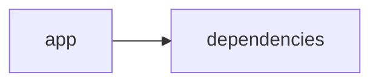

# Documentación del Proyecto

## Guía de Usuario
# Guía del Usuario: Herramienta de Análisis y Procesamiento de Información

Esta guía está diseñada para ayudar a los usuarios a comprender, utilizar y sacar el máximo provecho de la aplicación. La herramienta combina una interfaz web interactiva basada en Streamlit, la capacidad de procesamiento de archivos PDF y el análisis de contenido utilizando modelos de lenguaje basados en inteligencia artificial.

---

## 1. Descripción de la Aplicación

La aplicación permite analizar y procesar información contenida en archivos PDF de forma interactiva. Desarrollada en Python y apoyada en diversas bibliotecas especializadas, la herramienta proporciona:
 
- **Procesamiento de archivos PDF:** Extrae y organiza información de documentos en formato PDF.
- **Análisis avanzado mediante IA:** Emplea modelos de lenguaje para interpretar y analizar el contenido extraído.
- **Interfaz web interactiva:** Basada en Streamlit, la interfaz facilita una experiencia de usuario sencilla y dinámica, permitiendo la interacción directa con las funcionalidades del sistema.

Esta solución es ideal para usuarios que necesitan obtener insights de documentos en formato PDF sin profundos conocimientos técnicos.

---

## 2. Principales Funcionalidades

La aplicación incluye las siguientes funcionalidades clave:

- **Carga y procesamiento de PDFs:**  
  Permite subir archivos PDF, los cuales son procesados para extraer textos e información estructural.

- **Análisis inteligente del contenido:**  
  Utiliza modelos de lenguaje (IA) para interpretar y analizar la información extraída, facilitando desde búsquedas avanzadas hasta resúmenes y categorizaciones del contenido.

- **Interfaz interactiva en Streamlit:**  
  La página web interactiva permite visualizar el estado del procesamiento, resultados del análisis y opciones de personalización de la salida, todo en una experiencia de usuario amigable.

- **Visualización y exportación de resultados:**  
  Los resultados del análisis pueden ser visualizados en diferentes formatos e incluso exportarse para su posterior uso en otros sistemas o informes.

---

## 3. Cómo Utilizar la Aplicación

### Requisitos Previos

- Acceso a internet y un navegador web.
- Los archivos PDF que se deseen analizar.

### Pasos para Iniciar el Análisis

1. **Acceso a la Interfaz Web:**  
   Abra su navegador y diríjase a la URL proporcionada para la aplicación. Se presentará la interfaz de usuario basada en Streamlit.

2. **Carga de Archivos PDF:**  
   Dentro de la aplicación, encontrará un botón o sección para subir archivos PDF. Seleccione uno o varios archivos para iniciar el proceso de análisis.

3. **Procesamiento y Análisis Automático:**  
   Una vez subidos, la aplicación comenzará a procesar los PDFs. Verá indicadores de progreso que le informarán sobre el estado del procesamiento y el análisis.

4. **Visualización de Resultados:**  
   Al finalizar el análisis, se mostrarán los resultados en la misma interfaz. Esto incluye resúmenes, categorización de información y cualquier insight relevante obtenido a partir del contenido.

5. **Interacción y Personalización:**  
   La herramienta permite refinar la búsqueda o aplicar filtros adicionales según sus necesidades. Asimismo, es posible ajustar parámetros del análisis para obtener resultados más precisos.

6. **Exportación de Información:**  
   Si desea guardar o compartir los resultados, utilice las opciones de exportación disponibles (por ejemplo, exportar a CSV, PDF o copiar los resultados a su portapapeles).

---

## 4. Preguntas Frecuentes (FAQ)

**1. ¿Qué tipo de documentos puedo analizar?**  
Puedes analizar cualquier documento en formato PDF. La aplicación está diseñada para extraer y procesar textos de una amplia variedad de PDFs, siempre y cuando contengan información legible.

**2. ¿Necesito conocimientos técnicos para usar la aplicación?**  
No. La interfaz web interactiva está diseñada para ser intuitiva y amigable, permitiendo que usuarios sin experiencia técnica puedan realizar análisis con facilidad.

**3. ¿Cómo se protege la privacidad de mis documentos?**  
La aplicación procesa los documentos en el entorno definido por sus políticas de privacidad y protección de datos. Asegúrese de revisar la política de privacidad y términos de uso para conocer detalles sobre cómo se maneja la información.

**4. ¿Qué ocurre si un archivo PDF no se procesa correctamente?**  
Si un PDF no se procesa adecuadamente (por ejemplo, debido a formatos inusuales o errores en el documento), se mostrará un mensaje de error descriptivo. En ese caso, puede intentar convertir el archivo a un formato compatible o contactar al soporte técnico para mayor asistencia.

**5. ¿Puedo ajustar los parámetros del análisis de IA?**  
Dependiendo de la configuración de la aplicación, es posible que existan opciones avanzadas para ajustar algunos parámetros del análisis. Consulte la sección de “Ajustes Avanzados” en la interfaz para más detalles.

**6. ¿Cómo se actualizan los modelos de lenguaje?**  
El mantenimiento y actualización de los modelos de lenguaje es gestionado por el equipo de desarrollo, quienes implementan mejoras y actualizaciones de forma periódica para optimizar la precisión y eficacia del análisis.

---

## 5. Soporte y Contacto

Si encuentra algún problema o tiene alguna sugerencia, póngase en contacto con el equipo de soporte a través de:
- Correo electrónico: soporte@tuaplicacion.com
- Sitio web: [www.tuaplicacion.com/soporte](http://www.tuaplicacion.com/soporte)

Agradecemos cualquier comentario y trabajamos continuamente para mejorar la experiencia del usuario.

---

Esta guía pretende facilitar el uso de la herramienta y ayudar a los usuarios a obtener el máximo provecho del procesamiento y análisis de información. ¡Disfrute de una experiencia de análisis inteligente y eficaz!

## Documentación Técnica
A continuación se presenta la documentación técnica completa del proyecto VoC Analyst, orientada a desarrolladores. Este documento describe la arquitectura general, los componentes principales, las APIs internas y las guías para el desarrollo, la integración y el mantenimiento del sistema.

---

# VoC Analyst – Documentación Técnica

VoC Analyst es una aplicación para el análisis de la Voz del Cliente (VoC). La herramienta integra la carga y procesamiento de archivos (por ejemplo, archivos PDF) con análisis avanzado mediante Modelos de Lenguaje (LLM) para extraer insights a partir de conversaciones y documentos. La interfaz de usuario se implementa con Streamlit, proporcionando una experiencia interactiva y en tiempo real, mientras que el backend se conecta a proveedores LLM (tales como OpenAI, Anthropic y Google GenAI) para realizar el análisis semántico y la generación de recomendaciones.

---

## Tabla de Contenidos

1. [Resumen del Repositorio](#resumen-del-repositorio)
2. [Arquitectura General](#arquitectura-general)
3. [Componentes Principales](#componentes-principales)  
   3.1. [Aplicación Streamlit](#aplicación-streamlit)  
   3.2. [Módulo LLMBackend](#módulo-llmbackend)  
   3.3. [Procesamiento y Extracción de Archivos](#procesamiento-y-extracción-de-archivos)  
   3.4. [Parser y Análisis de Conversaciones](#parser-y-análisis-de-conversaciones)
4. [APIs Internas y Funciones Destacadas](#apis-internas-y-funciones-destacadas)
5. [Configuración y Dependencias](#configuración-y-dependencias)
6. [Guías de Desarrollo](#guías-de-desarrollo)  
   6.1. [Instalación y Ejecución](#instalación-y-ejecución)  
   6.2. [Extender y Configurar LLMBackend](#extender-y-configurar-llmbackend)  
   6.3. [Pruebas y Validación](#pruebas-y-validación)
7. [Consideraciones Finales](#consideraciones-finales)

---

## Resumen del Repositorio

- **Lenguajes:**  
  El proyecto contiene archivos escritos en diversos lenguajes (19 archivos con "other").  
- **Endpoints Detectados:**  
  No se han identificado endpoints REST o similares, dado que la aplicación se ejecuta como una interfaz web con Streamlit y opera principalmente de forma local o mediante conexiones directas a servicios LLM a través del backend.
- **Diagrama de Dependencias (Mermaid):**

  ► Diagrama:
  
  ```mermaid
  graph LR
    App[app] --> Deps[dependencies]
  ```

Este diagrama ilustra que la aplicación se basa en dependencias externas para funcionar correctamente, destacando la relación entre el módulo principal y sus librerías.

---

## Arquitectura General

La arquitectura de VoC Analyst se compone de los siguientes niveles:

1. **Interfaz de Usuario:**  
   Implementada con Streamlit, permite la carga de archivos, visualización de resultados y la interacción dinámica con el usuario. La configuración inicial (como el título de la página, el layout, y el estado de la sesión) se establece a través de Streamlit.

2. **Procesamiento y Extracción:**  
   Incluye funciones para la lectura y extracción de información desde archivos PDF (por ejemplo, la función que utiliza PyPDF2 para extraer el texto de cada página de un documento). Estas funciones sirven para normalizar entradas y facilitar el análisis posterior.

3. **Backend de Modelos de Lenguaje (LLM):**  
   El módulo LLMBackend (importado desde "llm_backend") es responsable de la interacción con modelos de lenguaje. Se espera que este módulo esté configurado para integrarse con múltiples proveedores de IA, permitiendo análisis semánticos y procesamiento del texto.

4. **Control de Flujo y Estado:**  
   Se hace uso del estado de sesión de Streamlit para mantener la persistencia de datos durante la ejecución (por ejemplo, resultados del análisis, identificador de ejecución, información de archivos cargados y bandera de procesamiento completado).

---

## Componentes Principales

### Aplicación Streamlit

- **Configuración de la Página:**  
  Se utiliza la función “st.set_page_config” para definir el título, el icono y otras propiedades de la interfaz.  
  Ejemplo:
  
  ► Código:
  ```python
  st.set_page_config(
      page_title="VoC Analyst - Análisis de Voz del Cliente con LLM",
      page_icon="📊",
      layout="wide",
      initial_sidebar_state="expanded"
  )
  ```

- **Manejo del Estado de Sesión:**  
  Se inicializan variables en “st.session_state” para mantener datos críticos como:
  - Resultados del análisis
  - Identificador de ejecución (run_id)
  - Datos de archivos cargados
  - Indicador de procesamiento completado

### Módulo LLMBackend

- **Integración con Proveedores LLM:**  
  El módulo “llm_backend” define clases y configuraciones para interactuar con modelos de lenguaje.  
  - La clase “LLMBackend” centraliza la lógica de conexión, envío de datos y recepción de respuestas de los modelos.
  - “ModelConfig” es utilizada para parametrizar cada proveedor LLM, facilitando la configuración y extensión del módulo.

- **Uso en la Aplicación:**  
  La importación de “LLMBackend” indica que este módulo se emplea en el procesamiento y análisis posterior a la extracción del texto, permitiendo que los modelos generen insights a partir del contenido textual procesado.

### Procesamiento y Extracción de Archivos

- **Extracción de Texto de Archivos PDF:**  
  Se utiliza el paquete "PyPDF2" para abrir y leer archivos PDF.  
  Función destacada:
  
  ► extract_text_from_pdf(pdf_file)
  ```python
  def extract_text_from_pdf(pdf_file) -> str:
      """Extraer texto de archivo PDF"""
      try:
          pdf_reader = PyPDF2.PdfReader(pdf_file)
          text = ""
          for page in pdf_reader.pages:
              text += page.extract_text() + "\n"
          return text.strip()
      except Exception as e:
          st.error(f"Error al extraer texto de PDF: {str(e)}")
          return ""
  ```
  
- **Validación de Tamaño de Archivo:**  
  Se implementa una función (incompleta en el fragmento) para comprobar que el tamaño del archivo no exceda un límite (por ejemplo, 100MB). La validación se lleva a cabo moviendo el cursor al final del archivo para determinar su tamaño.

### Parser y Análisis de Conversaciones

- **Procesamiento de Texto:**  
  Aunque no se detalla en el fragmento, se puede inferir que una vez extraído el contenido, se realiza un procesamiento adicional para normalizar y extraer información relevante de conversaciones, ya sea ejecutando algoritmos de análisis de sentimiento, clustering o clasificación semántica para detectar temas y emociones.

---

## APIs Internas y Funciones Destacadas

A continuación se listan algunas de las APIs y funciones clave que conforman la funcionalidad interna:

- ► extract_text_from_pdf(pdf_file)  
  Descripción: Extrae y concatena el texto de cada página de un PDF.  
  Retorno: Cadena de texto procesada.

- ► validate_file_size(file)  
  Descripción: Verifica que el tamaño del archivo no exceda un límite predefinido (ej., 100MB).  
  Detalle: Utiliza seek y tell para determinar el tamaño real del archivo.

- ► LLMBackend  
  Descripción: Clase que gestiona la comunicación y configuración de los modelos de lenguaje.  
  Nota: La interacción con múltiples proveedores de IA permite flexibilidad y escalabilidad en el análisis semántico.

*Nota:* Dado que no se han identificado endpoints REST, la integración principal se realiza mediante la interfaz de usuario de Streamlit y la parte interna del procesamiento de archivos y análisis LLM.

---

## Configuración y Dependencias

El proyecto requiere diversas librerías y dependencias para su correcto funcionamiento. A continuación se listan las dependencias principales:

- Python 3.8+ (o versión compatible)
- [Streamlit](https://streamlit.io/) – Para la interfaz web interactiva.
- [PyPDF2](https://pypi.org/project/PyPDF2/) – Para la extracción de texto de archivos PDF.
- [Pandas](https://pandas.pydata.org/) – Para manipulación y procesamiento de datos.
- [llm_backend] – Módulo interno para la integración con proveedores de modelos de lenguaje.
- Otras librerías incluidas en “dependencies” (se recomienda revisar el archivo requirements.txt o similar para conocer la lista completa).

Es importante asegurarse de tener instaladas todas las dependencias, ya sea utilizando pip o administradores de entornos virtuales.

---

## Guías de Desarrollo

### Instalación y Ejecución

1. Clonar el repositorio:
   ```bash
   git clone <URL-del-repositorio>
   cd <nombre-del-repositorio>
   ```
2. Crear y activar un entorno virtual (opcional pero recomendado):
   ```bash
   python -m venv venv
   source venv/bin/activate  # En Linux/Mac
   venv\Scripts\activate     # En Windows
   ```
3. Instalar las dependencias:
   ```bash
   pip install -r requirements.txt
   ```
4. Ejecutar la aplicación:
   ```bash
   streamlit run app.py
   ```

### Extender y Configurar LLMBackend

- Para integrar nuevos proveedores de modelos o ajustar parámetros, se recomienda actualizar la clase “LLMBackend” y el objeto “ModelConfig” dentro del módulo “llm_backend”.  
- Al extender esta funcionalidad, asegúrese de seguir el mismo patrón de manejo de solicitudes y respuestas, permitiendo así la integración transparente con la interfaz de usuario y otros módulos de la aplicación.

### Pruebas y Validación

- Se sugiere agregar pruebas unitarias para las funciones de extracción de texto (por ejemplo, pruebas para “extract_text_from_pdf”) y para la validación de archivos.
- Para validación de la integración con LLMBackend, se recomienda crear mocks de respuestas de proveedores LLM, de modo que se pueda verificar el flujo completo del procesamiento sin depender de respuestas en tiempo real.

---

## Consideraciones Finales

- La arquitectura modular del proyecto permite la extensión y mantenimiento de la aplicación.  
- Dado el rol central de Streamlit en la UI, es fundamental mantener el manejo de estado eficiente mediante “st.session_state”.
- La integración de múltiples proveedores LLM posibilita una alta flexibilidad, pero requiere también una adecuada configuración y gestión de las claves o credenciales de acceso a dichos servicios.
- Se recomienda revisar periódicamente las dependencias y actualizar las librerías cuando sea necesario para asegurar la compatibilidad y seguridad del sistema.

---

Esta documentación proporciona una descripción integral de VoC Analyst para desarrolladores. Se espera que facilite tanto la comprensión del funcionamiento interno del sistema como la extensión e integración de nuevas funcionalidades. Para cualquier duda o sugerencia, se recomienda consultar el repositorio y los comentarios presentes en el código fuente.

Happy coding!


## Diagrama

