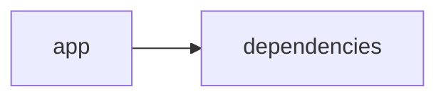

# Documentación del Proyecto

## Guía de Usuario
# Guía de Usuario para la Herramienta de Análisis y Procesamiento de Información

Esta guía describe cómo utilizar nuestra aplicación web interactiva, diseñada para procesar archivos PDF y analizarlos mediante modelos de lenguaje basados en inteligencia artificial. La aplicación ha sido desarrollada en Python utilizando Streamlit junto con diversas bibliotecas de análisis para ofrecer una experiencia intuitiva y eficiente.

---

## Descripción de la Aplicación

La herramienta permite a los usuarios:
- Cargar y procesar documentos en formato PDF.
- Extraer información relevante de los archivos mediante técnicas de procesamiento de lenguaje natural (PLN).
- Visualizar y analizar los resultados mediante una interfaz web intuitiva y dinámica.
- Aprovechar modelos de lenguaje (IA) para realizar análisis semántico y extraer insights significativos de los textos.

El objetivo principal es facilitar el análisis y procesamiento de grandes volúmenes de información contenida en documentos PDF, optimizando la toma de decisiones y la gestión de datos.

---

## Funcionalidades Principales

### 1. Interfaz Web Interactiva con Streamlit
- **Descripción:** La aplicación se ejecuta a través de un navegador web utilizando Streamlit. La interfaz es fácil de usar y permite la interacción directa con el usuario.
- **Beneficios:** No se requiere instalación compleja y la interfaz es amigable, permitiendo a los usuarios enfocarse en el análisis en lugar de la tecnología subyacente.

### 2. Procesamiento de Archivos PDF
- **Descripción:** Los usuarios pueden subir archivos PDF para ser procesados automáticamente.
- **Funciones Clave:**
  - Lectura y extracción de contenido de documentos PDF.
  - Conversión del contenido en texto para su posterior análisis.
- **Beneficios:** Automatiza la extracción de información, reduciendo el tiempo de procesamiento manual y minimizando errores.

### 3. Análisis con Modelos de Lenguaje (IA)
- **Descripción:** Una vez extraído el texto, se aplican modelos de lenguaje basados en inteligencia artificial para analizar y comprender el contenido.
- **Funciones Clave:**
  - Identificación de temas, palabras clave y patrones en el texto.
  - Resumen automático y elaboración de insights a partir del contenido.
- **Beneficios:** Permite obtener rápidamente un resumen o análisis profundo del contenido, ayudando en la toma de decisiones o en la generación de reportes.

---

## Cómo Utilizar la Aplicación

### Requisitos Previos
- Tener instalado Python y las bibliotecas necesarias (Streamlit, PyPDF2, modelos de lenguaje, entre otras).
- Acceso a la aplicación a través de un navegador web.

### Pasos para Empezar
1. **Iniciar la Aplicación:**
   - Ejecuta el comando en tu terminal o consola:
     ```
     streamlit run nombre_de_la_aplicacion.py
     ```
   - La aplicación se abrirá en tu navegador por defecto.

2. **Subir el Archivo PDF:**
   - En la interfaz, selecciona el botón de "Cargar Archivo" y busca el documento PDF que deseas analizar.
   - Una vez seleccionado, la aplicación comenzará a procesar el documento.

3. **Proceso de Análisis:**
   - Después de la carga, la aplicación extraerá el texto del PDF.
   - Se aplicarán modelos de lenguaje para analizar el contenido y generar un resumen o insights.
   - Los resultados se mostrarán en la misma interfaz.

4. **Visualizar los Resultados:**
   - La interfaz presentará los insights y resultados del análisis en diferentes secciones (gráficos, resúmenes de texto, palabras clave, etc.).
   - Los usuarios podrán interactuar con dichos resultados para obtener más detalles.

5. **Exportar Información (Opcional):**
   - Si lo requiere, se podrán exportar los resultados en formatos adicionales, como archivos CSV o PDF.

---

## Preguntas Frecuentes (FAQ)

### 1. ¿Qué hace esta herramienta?
La aplicación procesa archivos PDF y utiliza modelos de lenguaje basados en inteligencia artificial para extraer y analizar información, facilitando la obtención de insights y resúmenes automáticos.

### 2. ¿Qué tecnologías se utilizan en el desarrollo de la aplicación?
La herramienta está desarrollada en Python, empleando la biblioteca Streamlit para la interfaz web interactiva, junto con diversas bibliotecas de análisis (como PyPDF2 y herramientas de PLN).

### 3. ¿Necesito tener conocimientos de programación para utilizarla?
No, la interfaz intuitiva de Streamlit permite que cualquier usuario, incluso sin conocimientos técnicos avanzados, pueda cargar archivos y visualizar los resultados de forma sencilla.

### 4. ¿Qué tipos de archivos puedo subir?
Actualmente, la aplicación soporta el procesamiento de archivos en formato PDF. En futuras actualizaciones se considerará la inclusión de otros formatos.

### 5. ¿Cómo se garantiza la privacidad de mis documentos?
Todos los archivos y datos procesados se manejan localmente a menos que se configure lo contrario. Se recomienda no subir documentos sensibles a menos que se tenga plena confianza en el entorno de ejecución.

### 6. ¿Puedo integrar esta herramienta en mi flujo de trabajo existente?
Sí, el diseño modular y la utilización de APIs permiten integrar o adaptar la herramienta a diferentes entornos y flujos de trabajo personalizados.

---

## Conclusión

Esta herramienta busca facilitar el análisis y procesamiento de grandes volúmenes de información contenida en archivos PDF, utilizando una potente combinación de interfaz web interactiva, procesamiento automatizado y análisis basado en inteligencia artificial. Si tienes más preguntas o necesitas soporte adicional, no dudes en contactarnos a través de los canales de soporte indicados en la aplicación.

¡Disfruta de la experiencia analítica y optimiza tu flujo de trabajo con nuestra herramienta!


## Documentación Técnica
A continuación se presenta la documentación técnica completa en Markdown para desarrolladores del proyecto VoC Analyst, basado en el análisis del código fuente y la estructura encontrada en el repositorio.

---

# VoC Analyst – Documentación Técnica

VoC Analyst es una aplicación para el análisis de la Voz del Cliente (VoC), que integra procesamiento de archivos (por ejemplo, PDF), extracción de texto, análisis de conversaciones y generación de insights mediante Modelos de Lenguaje (LLM). La aplicación utiliza Streamlit para construir una interfaz web interactiva, mientras que el backend se encarga de la integración con distintos proveedores LLM (p. ej., OpenAI, Anthropic, Google GenAI) para impulsar sus capacidades analíticas.

---

## Tabla de Contenidos

1. [Resumen del Repositorio](#resumen-del-repositorio)
2. [Arquitectura General](#arquitectura-general)
3. [Componentes Principales](#componentes-principales)  
   3.1 [Aplicación Streamlit](#aplicación-streamlit)  
   3.2 [Módulo LLMBackend](#módulo-llmbackend)  
   3.3 [Procesamiento y Extracción de Archivos](#procesamiento-y-extracción-de-archivos)  
   3.4 [Parser y Análisis de Conversaciones](#parser-y-análisis-de-conversaciones)
4. [APIs Internas y Funciones Destacadas](#apis-internas-y-funciones-destacadas)
5. [Configuración y Dependencias](#configuración-y-dependencias)
6. [Guías de Desarrollo](#guías-de-desarrollo)  
   6.1 [Instalación y Ejecución](#instalación-y-ejecución)  
   6.2 [Extensión y Configuración del Módulo LLMBackend](#extensión-y-configuración-del-módulo-llmbackend)  
   6.3 [Pruebas y Validación](#pruebas-y-validación)
7. [Diagrama de Dependencias](#diagrama-de-dependencias)

---

## Resumen del Repositorio

- **Lenguajes Identificados:**  
  Se han identificado numerosos fragmentos de código en formatos “other” (19 archivos o líneas de código de distintos tipos).  
- **Endpoints:**  
  No se han detectado endpoints REST o de otro tipo propios del backend, lo que indica que la comunicación se realiza internamente a través de la interfaz Streamlit y llamadas directas a funciones.

---

## Arquitectura General

La aplicación sigue una arquitectura monolítica híbrida donde:

- **Frontend:**  
  Se implementa a través de Streamlit, ofreciendo una interfaz web interactiva para la carga de archivos, visualización de resultados y, en general, interacción usuario–aplicación en tiempo real.
  
- **Backend y Procesamiento:**  
  El procesamiento de archivos (por ejemplo, la extracción de texto de PDF) y la generación de insights se realizan en el mismo entorno mediante funciones y módulos internos. Entre estos destaca el módulo LLMBackend, el cual se encarga de interactuar con los modelos de lenguaje (LLM) para analizar el contenido y generar recomendaciones.

La comunicación entre dichos componentes se produce de forma directa mediante llamadas a funciones, sin necesidad de capas intermedias de red.

---

## Componentes Principales

### Aplicación Streamlit

- **Propósito:**  
  Proporcionar una interfaz gráfica accesible y en tiempo real para la interacción del usuario.
  
- **Características Clave:**
  - Configuración de la página (título, ícono, layout).
  - Inicialización del estado de la sesión (almacenamiento de resultados, identificadores de ejecución, archivos cargados, etc.).
  - Renderización de cargas de archivos, visualización de resultados y control de flujo de la aplicación.

- **Fragmento Relevante:**

  ► Configuración inicial de la página y estado de la sesión:
  ─────────────────────────────────────────────
  import streamlit as st
  st.set_page_config(
      page_title="VoC Analyst - Análisis de Voz del Cliente con LLM",
      page_icon="📊",
      layout="wide",
      initial_sidebar_state="expanded"
  )
  
  if 'analysis_results' not in st.session_state:
      st.session_state.analysis_results = None
  if 'run_id' not in st.session_state:
      st.session_state.run_id = None
  if 'uploaded_files_data' not in st.session_state:
      st.session_state.uploaded_files_data = []
  if 'processing_complete' not in st.session_state:
      st.session_state.processing_complete = False
  ─────────────────────────────────────────────

### Módulo LLMBackend

- **Propósito:**  
  Facilitar la integración y configuración de modelos de Lenguaje (LLM). Este módulo permite abstraer las llamadas a distintos proveedores de modelos LLM para el análisis de texto.

- **Características Clave:**
  - Configuración de modelos (a través de la clase ModelConfig o similar).
  - Centralización de la lógica para invocar diferentes APIs de LLM.
  - Manejo de la comunicación y el procesamiento de las respuestas.

- **Fragmentos (mencionados en los imports):**
  
  ► Importación del módulo:
  ─────────────────────────────────────────────
  from llm_backend import LLMBackend, ModelConfig
  ─────────────────────────────────────────────

### Procesamiento y Extracción de Archivos

- **Propósito:**  
  Permitir la carga de archivos (principalmente PDF), validación de tamaño y extracción de texto.

- **Funciones Clave:**

  - `extract_text_from_pdf(pdf_file)`:  
    Se encarga de leer un archivo PDF, recorrer sus páginas y extraer el texto.  
    - Manejo de excepciones y reporte de errores mediante la interfaz Streamlit.

  - `validate_file_size(file)`:  
    Función destinada a comprobar que el archivo no supere un límite predefinido (por ejemplo, 100 MB).

- **Fragmento Ilustrativo:**

  ► Extracción de texto de PDF:
  ─────────────────────────────────────────────
  def extract_text_from_pdf(pdf_file) -> str:
      """Extraer texto de archivo PDF"""
      try:
          pdf_reader = PyPDF2.PdfReader(pdf_file)
          text = ""
          for page in pdf_reader.pages:
              text += page.extract_text() + "\n"
          return text.strip()
      except Exception as e:
          st.error(f"Error al extraer texto de PDF: {str(e)}")
          return ""
  ─────────────────────────────────────────────

### Parser y Análisis de Conversaciones

- **Propósito:**  
  Una vez extraído el texto (por ejemplo, de archivos PDF), se procede a parsear y preprocesar el contenido para:
  - Normalizar el texto.
  - Detectar entidades, emociones o temas de interés.
  
- **Implementación:**
  - La lógica de parseo puede incluir la segmentación del texto en párrafos, oraciones o incluso en tokens para análisis posterior con el LLM.
  - Se pueden utilizar técnicas de NLP (procesamiento de lenguaje natural) para enriquecer el análisis.

---

## APIs Internas y Funciones Destacadas

Aunque la aplicación no expone endpoints REST, dispone de varias funciones internas y APIs locales relevantes:

- **extract_text_from_pdf(pdf_file) → str:**  
  Extrae y retorna el texto contenido en un archivo PDF. Maneja errores y devuelve una cadena vacía en caso de fallo.
  
- **validate_file_size(file) → bool:**  
  Verifica que el archivo (medido en bytes) no exceda el límite permitido (p. ej., 100 MB) antes de ser procesado (se observa la posición del puntero del archivo).

- **Interacción con LLMBackend:**  
  La clase LLMBackend, junto a la configuración de modelo (posiblemente gestionada a través de ModelConfig), centraliza la lógica para enviar solicitudes a proveedores de modelos de lenguaje y recibir respuestas analíticas.

Cada una de estas funciones se integra con el flujo general de Streamlit, permitiendo actualizar la interfaz en función del estado del análisis.

---

## Configuración y Dependencias

### Dependencias Clave

El proyecto se apoya en diversas librerías de Python. Algunas de las dependencias identificadas incluyen:

- **Streamlit:**  
  Para la creación y gestión de la interfaz web.
  
- **PyPDF2:**  
  Para la lectura y extracción de texto de archivos PDF.

- **Pandas:**  
  Posiblemente para la gestión y visualización de datos estructurados.

- **Llvm_backend (custom):**  
  Módulo dedicado a la integración con modelos de lenguaje (LLM).

- **Otros módulos estándar y de tipado:**  
  Como `json`, `time`, `datetime`, `uuid`, `zipfile`, `io`, `os` y `typing`.

### Configuración del Entorno

Para configurar el entorno de desarrollo:

1. Asegúrate de tener Python 3.8 o superior.
2. Instala las dependencias (usualmente definidas en un archivo requirements.txt o similar):

   ► Ejemplo de requirements.txt:
   ─────────────────────────────────────────────
   streamlit==1.XX.X
   PyPDF2==3.X.X
   pandas==1.X.X
   # y demás dependencias requeridas
   ─────────────────────────────────────────────

3. Configura las variables de entorno necesarias para las API keys o configuraciones específicas de LLM (si aplica).

---

## Guías de Desarrollo

### Instalación y Ejecución

1. Clona el repositorio:
   ► git clone https://tu-servidor/VoCAnalyst.git
2. Instala las dependencias:
   ► pip install -r requirements.txt
3. Ejecuta la aplicación:
   ► streamlit run app.py

### Extensión y Configuración del Módulo LLMBackend

- Revisa el archivo o módulo `llm_backend.py` para:
  - Configurar proveedores LLM.
  - Ajustar los parámetros de los modelos (por ejemplo, mediante una clase ModelConfig).
  - Integrar nuevos proveedores de servicios o personalizar la lógica de análisis según nuevas necesidades.

### Pruebas y Validación

- Se recomienda implementar pruebas unitarias para funciones críticas como:
  - `extract_text_from_pdf()`
  - `validate_file_size()`
  
- Utiliza frameworks como pytest para facilitar la validación y el mantenimiento del código.

- Verifica que la interfaz en Streamlit refleja correctamente el estado de análisis y reporta adecuadamente errores y advertencias.

---

## Diagrama de Dependencias

El siguiente diagrama Mermaid ilustra la relación básica entre los componentes principales de la aplicación:

```mermaid
graph LR
    A[app (Streamlit)] --> B[Procesamiento de Archivos]
    A --> C[Estado de Sesión y UI]
    B --> D[extract_text_from_pdf()]
    B --> E[validate_file_size()]
    A --> F[LLMBackend]
    F --> G[ModelConfig]
```

En este diagrama:

- La aplicación (A) utiliza funcionalidad de procesamiento (B) que a su vez se apoya en funciones específicas (D y E).
- Desde la interfaz se interactúa con el módulo LLMBackend (F), el cual utiliza configuraciones definidas en ModelConfig (G).

---

## Conclusión

La arquitectura de VoC Analyst está pensada para ofrecer una solución integral mediante la combinación de una interfaz web interactiva y un robusto backend para el análisis de datos de voz y conversación. Esta documentación técnica sirve como punto de partida para nuevos desarrolladores que deseen extender, integrar o mantener el proyecto.

Para cualquier duda o aporte adicional, se recomienda consultar el código fuente y los comentarios internos, que ofrecen detalles complementarios sobre la arquitectura y las decisiones de diseño.

Happy Coding!


## Diagrama

