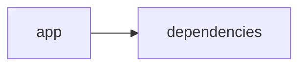

# Documentación del Proyecto

## Guía de Usuario
# Guía de Usuario: Herramienta de Análisis y Procesamiento de Información

Bienvenido a la guía de usuario de nuestra aplicación, diseñada para facilitar el análisis y procesamiento de información a partir de archivos PDF, utilizando una interfaz web interactiva y modelos de lenguaje (IA). Esta herramienta está desarrollada en Python, haciendo uso de bibliotecas especializadas en análisis de datos y procesamiento de documentos, y se ejecuta a través de Streamlit.

---

## Índice

1. [Descripción de la Aplicación](#descripción-de-la-aplicación)
2. [Principales Funcionalidades](#principales-funcionalidades)
3. [Cómo Utilizar la Aplicación](#cómo-utilizar-la-aplicación)
4. [Preguntas Frecuentes (FAQ)](#preguntas-frecuentes-faq)

---

## Descripción de la Aplicación

La aplicación es una herramienta versátil para el análisis y procesamiento de información contenida en documentos PDF. Gracias a una interfaz web interactiva basada en Streamlit, los usuarios pueden cargar sus archivos, ejecutar análisis complejos mediante modelos de lenguaje (IA) y visualizar los resultados de forma intuitiva. La aplicación ha sido desarrollada con el objetivo de simplificar procesos que, de otra manera, serían manuales y complejos, permitiendo extraer insights relevantes de grandes volúmenes de datos.

---

## Principales Funcionalidades

La herramienta integra las siguientes funcionalidades clave:

- **Interfaz Web Interactiva con Streamlit:**  
  Permite una experiencia de usuario intuitiva y accesible directamente desde el navegador. La interfaz es fácil de usar, facilitando la carga de archivos y la visualización de resultados.

- **Procesamiento de Archivos PDF:**  
  La aplicación puede leer y extraer información de archivos PDF. Se procesan los contenidos de estos documentos para ser analizados y presentados de forma estructurada.

- **Análisis con Modelos de Lenguaje (IA):**  
  Utiliza modelos de lenguaje avanzados para analizar el contenido extraído de los PDFs. Esto puede incluir la identificación de temas relevantes, resumen de textos, clasificación de información y extracción de datos significativos.

- **Integración y Visualización de Resultados:**  
  Tras el análisis, los resultados se muestran de forma clara y visual en la interfaz web, permitiendo a los usuarios interactuar con los datos de manera dinámica y tomar decisiones basadas en la información procesada.

---

## Cómo Utilizar la Aplicación

A continuación, se describen los pasos básicos para utilizar la herramienta:

1. **Acceso a la Aplicación:**
   - Abra su navegador y diríjase a la URL correspondiente a la aplicación.
   - Espere a que la interfaz de Streamlit cargue completamente.

2. **Carga de Archivos PDF:**
   - En la interfaz, encontrará una opción para seleccionar o arrastrar y soltar uno o varios archivos PDF.
   - Asegúrese de que los documentos cumplen con los formatos soportados (generalmente archivos en PDF).

3. **Procesamiento y Análisis:**
   - Una vez cargado el archivo, presione el botón para iniciar el análisis.
   - La aplicación extraerá el contenido del PDF y lo enviará al modelo de lenguaje configurado para su análisis.
   - Espere unos instantes mientras se procesan y analizan los datos.

4. **Visualización de Resultados:**
   - Los resultados del análisis se mostrarán en forma de gráficos, tablas o resúmenes de texto.
   - Explore las distintas pestañas o secciones de la interfaz para obtener información detallada.

5. **Interacción y Ajustes:**
   - Dependiendo de la configuración, puede haber opciones para filtrar, buscar o exportar los resultados.
   - Revise las opciones adicionales en el menú lateral para personalizar la visualización y el análisis.

6. **Cierre de Sesión y Guardado:**
   - Si la aplicación ofrece la opción de usuario, asegúrese de cerrar sesión correctamente al terminar.
   - Guarde o exporte los informes generados si es necesario.

---

## Preguntas Frecuentes (FAQ)

**P:** ¿Qué tipos de archivos se pueden procesar?  
**R:** Actualmente, la aplicación está optimizada para trabajar con archivos PDF. En futuras actualizaciones, se podrán incluir otros formatos.

**P:** ¿Requiero conocimientos técnicos para usar la herramienta?  
**R:** No, la aplicación ha sido diseñada para ser intuitiva y fácil de usar, incluso para usuarios sin experiencia técnica. La interfaz y los pasos guiados facilitan el proceso.

**P:** ¿Cómo se garantiza la seguridad de mis documentos?  
**R:** La aplicación procesa los archivos de forma local o en entornos seguros según la configuración del servidor. Le recomendamos revisar la política de privacidad y seguridad en la sección de Configuración.

**P:** ¿Qué ocurre si el archivo PDF no se procesa correctamente?  
**R:** Revise que el archivo no esté dañado y cumpla con el estándar PDF. En caso de persistir el problema, consulte la sección de soporte o contacte al equipo técnico.

**P:** ¿Puedo exportar los resultados del análisis?  
**R:** Sí, la interfaz ofrece opciones para exportar los resultados en distintos formatos (por ejemplo, CSV, PDF o imagen), dependiendo del tipo de análisis realizado.

**P:** ¿Cómo se actualiza la aplicación?  
**R:** Las actualizaciones se realizan de forma centralizada en el servidor. Los usuarios recibirán notificaciones sobre nuevas funcionalidades y mejoras en la interfaz de la aplicación.

---

Esperamos que esta guía le sea de utilidad para aprovechar al máximo todas las funcionalidades de la herramienta. Si tiene alguna otra duda o necesita asistencia adicional, por favor, consulte la sección de soporte o contacte directamente con el equipo de desarrollo. ¡Gracias por utilizar nuestro servicio!

## Documentación Técnica
A continuación se presenta la documentación técnica completa en Markdown para desarrolladores del proyecto VoC Analyst. Esta documentación se basa en el análisis del código fuente y la estructura del repositorio, y está enfocada en facilitar la comprensión, extensión e integración del sistema.

============================================
VoC Analyst – Documentación Técnica
============================================

VoC Analyst es una aplicación orientada al análisis de la Voz del Cliente (VoC). La herramienta permite:
• La carga y procesamiento de archivos (por ejemplo, documentos PDF).
• Extracción de texto y datos relevantes mediante técnicas de procesamiento de lenguaje natural.
• Análisis de conversaciones para extraer insights, sentimientos y patrones.
• Integración con Modelos de Lenguaje (LLM) para realizar análisis avanzados utilizando proveedores como OpenAI, Anthropic y Google GenAI.
• Visualización y manejo interactivo a través de una interfaz web implementada con Streamlit.

--------------------------------------------
Índice
--------------------------------------------
1. [Resumen del Repositorio](#resumen-del-repositorio)
2. [Arquitectura General](#arquitectura-general)
3. [Componentes Principales](#componentes-principales)  
   3.1 [Aplicación Streamlit](#aplicación-streamlit)  
   3.2 [Módulo LLMBackend](#módulo-llmbackend)  
   3.3 [Procesamiento y Extracción de Documentos](#procesamiento-y-extracción-de-documentos)  
   3.4 [Parser y Análisis de Conversaciones](#parser-y-análisis-de-conversaciones)
4. [APIs Internas y Funciones Destacadas](#apis-internas-y-funciones-destacadas)
5. [Configuración y Dependencias](#configuración-y-dependencias)
6. [Guías de Desarrollo](#guías-de-desarrollo)  
   6.1 [Instalación y Ejecución](#instalación-y-ejecución)  
   6.2 [Extensión y Configuración del LLMBackend](#extensión-y-configuración-del-llmbackend)  
   6.3 [Pruebas y Validación](#pruebas-y-validación)

--------------------------------------------
1. Resumen del Repositorio
--------------------------------------------

• Lenguajes:  
  - Se han detectado 21 ficheros de lenguaje “other” (sin una clasificación específica de lenguaje de programación).  
• Endpoints:  
  - No se detectaron endpoints expuestos (el proyecto se basa en una aplicación web con Streamlit).

Diagrama (Mermaid):
-----------------------------------------------------
graph LR
    App[app] --> Deps[dependencies]
-----------------------------------------------------

El diagrama muestra la dependencia principal entre la aplicación y sus dependencias externas.

--------------------------------------------
2. Arquitectura General
--------------------------------------------

La aplicación adopta una arquitectura modular que se compone de los siguientes niveles:

• Interfaz de Usuario (UI) – Implementada con Streamlit:
  - Permite la interacción en tiempo real con el usuario.
  - Configuración inicial de la sesión y manejo del estado (por ejemplo, datos de análisis, archivos cargados, identificadores de ejecución).

• Módulo de Procesamiento:
  - Funciones para la extracción y validación de datos, como la lectura de archivos PDF y validación de tamaños de archivo.
  - Preprocesamiento del texto extraído para su análisis posterior.

• Backend de Análisis (LLMBackend):
  - Integración con uno o varios proveedores de modelos de lenguaje (LLM).
  - Gestión de configuraciones de modelos y ejecución de análisis basados en inteligencia artificial.

• Comunicación Interna:
  - Uso de sesión (st.session_state) para mantener la consistencia de los datos durante la interacción del usuario.
  - Módulos internos que conectan el frontend con el backend mediante funciones y API internas.

--------------------------------------------
3. Componentes Principales
--------------------------------------------

A continuación se describe cada uno de los componentes más importantes del sistema:

### 3.1 Aplicación Streamlit
- Se encarga de configurar la interfaz web y gestionar la experiencia del usuario.
- Inicializa la configuración de la página (título, icono, layout) y el estado de la sesión para almacenar resultados, archivos y otros datos intermedios.
- Contiene funciones para cargar archivos, mostrar resultados y gestionar la interacción general.

Código de ejemplo (fragmento):
------------------------------------------------
import streamlit as st

# Configuración de la página
st.set_page_config(
    page_title="VoC Analyst - Análisis de Voz del Cliente con LLM",
    page_icon="📊",
    layout="wide",
    initial_sidebar_state="expanded"
)

# Inicializar el estado de la sesión
if 'analysis_results' not in st.session_state:
    st.session_state.analysis_results = None
if 'run_id' not in st.session_state:
    st.session_state.run_id = None
if 'uploaded_files_data' not in st.session_state:
    st.session_state.uploaded_files_data = []
if 'processing_complete' not in st.session_state:
    st.session_state.processing_complete = False
------------------------------------------------

### 3.2 Módulo LLMBackend
- Responsable de la integración con modelos de lenguaje (LLM).
- Maneja la configuración de modelos (por ejemplo, ModelConfig) y permite ejecutar análisis basados en inteligencia artificial.
- Este módulo abstrae la complejidad de interactuar con proveedores externos, facilitando la extensibilidad del backend.
- Se importa desde "llm_backend", lo que sugiere que la lógica de análisis está separada del código de la interfaz.

Ejemplo de importación:
------------------------------------------------
from llm_backend import LLMBackend, ModelConfig
------------------------------------------------

### 3.3 Procesamiento y Extracción de Documentos
- Incluye funciones especializadas para el procesamiento de archivos PDF, como extraer el texto de cada página.
- Valida requisitos como el tamaño del archivo antes de proceder con el procesamiento.
- Utiliza bibliotecas como PyPDF2 para la lectura y extracción de texto.

Ejemplo de función para extraer texto:
------------------------------------------------
def extract_text_from_pdf(pdf_file) -> str:
    """Extraer texto de archivo PDF"""
    try:
        pdf_reader = PyPDF2.PdfReader(pdf_file)
        text = ""
        for page in pdf_reader.pages:
            text += page.extract_text() + "\n"
        return text.strip()
    except Exception as e:
        st.error(f"Error al extraer texto de PDF: {str(e)}")
        return ""
------------------------------------------------

Función de validación del tamaño del archivo (fragmento):
------------------------------------------------
def validate_file_size(file) -> bool:
    """Validar que el tamaño del archivo sea menor a 100MB"""
    file.seek(0, 2)  # Mover al final del archivo
    size = file.tell()
    # Lógica para validar el tamaño (no se muestra la implementación completa)
------------------------------------------------

### 3.4 Parser y Análisis de Conversaciones
- Se espera que se incluya lógica para analizar y parsear conversaciones o documentos textuales, identificando patrones, sentimientos o elementos clave.
- La estructura modular permite ampliar la funcionalidad para soportar análisis de conversaciones de diferentes fuentes.
- El parser se integra con el módulo LLMBackend para obtener insights mediante modelos de lenguaje.

--------------------------------------------
4. APIs Internas y Funciones Destacadas
--------------------------------------------

Aunque la aplicación no expone endpoints RESTful, se define una serie de API internas y funciones clave para el procesamiento y análisis:

• extract_text_from_pdf(pdf_file):  
  - Función encargada de leer un archivo PDF y devolver el texto contenido en todas sus páginas.
  
• validate_file_size(file):  
  - Función para verificar que el tamaño del archivo no exceda un límite (p.ej., 100 MB) antes de proceder con su procesamiento.
  
• Uso de st.session_state:  
  - Permite almacenar y mantener la información de la sesión del usuario, facilitando el manejo de estados entre las diferentes interacciones.

• Integración con LLMBackend:  
  - El módulo LLMBackend permite enviar el texto extraído y configurado a un modelo de lenguaje para el análisis semántico, clasificación y generación de insights.

--------------------------------------------
5. Configuración y Dependencias
--------------------------------------------

Para ejecutar y desarrollar la aplicación, es necesario contar con las siguientes dependencias y configuraciones:

• Lenguaje: Python 3.x  
• Librerías principales:
  - streamlit: Para la interfaz web.
  - pandas: Para manipulación y análisis de datos.
  - PyPDF2: Para la lectura y extracción de contenido de archivos PDF.
  - datetime, uuid, zipfile, io, os y typing: Para diversas operaciones utilitarias.
  - json y time: Para operaciones de serialización y manejo de tiempos.
  - llm_backend: Módulo propio o dependiente que gestiona la integración con proveedores de LLM.

Se recomienda emplear un entorno virtual (virtualenv, conda, etc.) e instalar los requisitos mediante un archivo requirements.txt.

Ejemplo de requirements.txt:
------------------------------------------------
streamlit
pandas
PyPDF2
# Otros paquetes requeridos
------------------------------------------------

--------------------------------------------
6. Guías de Desarrollo
--------------------------------------------

### 6.1 Instalación y Ejecución
1. Clonar el repositorio:
   $ git clone <URL_del_repositorio>
2. Crear y activar un entorno virtual:
   $ python -m venv env
   $ source env/bin/activate   # En Linux/macOS
   $ env\Scripts\activate      # En Windows
3. Instalar las dependencias:
   $ pip install -r requirements.txt
4. Ejecutar la aplicación:
   $ streamlit run app.py

### 6.2 Extensión y Configuración del LLMBackend
• Para integrar un nuevo proveedor LLM o modificar la configuración existente, ubique el módulo “llm_backend” y revise la clase ModelConfig.  
• Asegúrese de seguir la interfaz definida para los métodos de análisis (por ejemplo, enviar texto y recibir resultados).  
• Actualice la configuración (por ejemplo, formular las API keys o endpoints) en un archivo de configuración o mediante variables de entorno.

### 6.3 Pruebas y Validación
• Se recomienda escribir pruebas unitarias para:
  - Validar la extracción de texto de archivos PDF.
  - Verificar la correcta manipulación y actualización del estado en st.session_state.
  - Testear las integraciones con el módulo LLMBackend.
• Utilice frameworks de testing como pytest para la automatización de pruebas.
• Configure un pipeline de integración continua (CI) para asegurar la calidad del código y la integración de nuevos features.

--------------------------------------------
Conclusiones
--------------------------------------------

La arquitectura modular de VoC Analyst permite separar claramente la lógica de interfaz, la extracción/procesamiento de datos y el análisis con modelos de lenguaje. Esta documentación técnica proporciona un punto de partida completo para que los desarrolladores puedan comprender, extender y mantener el sistema, asegurando la escalabilidad y facilidad de integración de nuevos módulos o proveedores de LLM.

Para cualquier consulta adicional o contribución, se recomienda revisar los comentarios en el código y los foros de discusión asociados al repositorio.

Happy Coding!

## Diagrama

