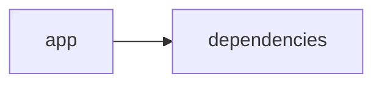

# Documentación del Proyecto

## Guía de Usuario
# Guía de Usuario: Herramienta de Análisis y Procesamiento de Información

Bienvenido a la guía de usuario para nuestra aplicación. Esta herramienta permite procesar archivos PDF y extraer información relevante utilizando modelos de lenguaje (IA), todo desde una interfaz web interactiva desarrollada con Streamlit. A continuación, encontrarás una descripción detallada de la aplicación, sus principales funcionalidades, instrucciones de uso y respuestas a preguntas frecuentes.

---

## 1. Descripción de la Aplicación

La aplicación está diseñada para facilitar el análisis y procesamiento de información contenida en archivos PDF. Gracias a la integración de modelos de lenguaje basados en inteligencia artificial, la aplicación puede extraer insights, resumir contenido y realizar análisis semánticos. Todo esto se encuentra accesible a través de una interfaz web amigable y sencilla de utilizar, implementada con Streamlit.

---

## 2. Principales Funcionalidades

La herramienta incluye las siguientes funcionalidades clave:

- **Interfaz Web Interactiva con Streamlit**
  - Permite a los usuarios subir archivos PDF y visualizar resultados de manera inmediata.
  - Ofrece controles intuitivos para interactuar con el análisis de datos.

- **Procesamiento de Archivos PDF**
  - Capacidad para cargar uno o varios archivos PDF.
  - Extracción de texto e información relevante de los documentos.

- **Análisis con Modelos de Lenguaje (IA)**
  - Utiliza inteligencia artificial para interpretar y analizar el contenido de los PDF.
  - Genera resúmenes, detecta temas y extrae insights críticos para la toma de decisiones.

---

## 3. Cómo Usar la Aplicación

### Requisitos Previos
- Asegúrate de tener acceso a un navegador web.
- Conexión a Internet para interactuar con la aplicación alojada en un servidor o localmente.

### Pasos para Empezar

1. **Acceder a la Aplicación**
   - Ingresa la URL o dirección local de la aplicación en tu navegador.
   
2. **Carga de Archivos PDF**
   - En la interfaz principal, busca el botón o área designada para subir archivos.
   - Selecciona uno o varios archivos PDF desde tu dispositivo.
   
3. **Procesamiento y Análisis**
   - Una vez cargado el archivo, la aplicación comenzará a extraer el texto y procesar la información.
   - Los modelos de lenguaje analizarán el contenido y prepararán un resumen o extraerán datos relevantes.
   
4. **Visualización de Resultados**
   - Los resultados del análisis se mostrarán en la misma página.
   - Podrás revisar un resumen del contenido, identificar palabras clave y explorar insights sugeridos por la IA.

5. **Interacciones Adicionales**
   - Utiliza las herramientas interactivas para profundizar en partes específicas del análisis.
   - Ajusta parámetros o solicita detalles adicionales si la interfaz lo permite.

---

## 4. Preguntas Frecuentes (FAQ)

**Q1: ¿Qué tipos de archivos puedo subir?**  
A: Actualmente, la aplicación soporta archivos en formato PDF. Se está evaluando la integración de otros formatos en futuras actualizaciones.

**Q2: ¿Cómo se manejan los datos subidos?**  
A: Los archivos se procesan temporalmente para extraer el contenido y realizar el análisis. Se implementan medidas de seguridad para proteger la privacidad de tus datos y se recomienda no subir información sensible.

**Q3: ¿Qué hacer si el análisis no se muestra correctamente?**  
A: Verifica que el archivo PDF no esté corrupto y cumpla con el formato estándar. Si el problema persiste, intenta recargar la página o contactar al soporte.

**Q4: ¿Puedo obtener un resumen automático del documento?**  
A: Sí, la aplicación utiliza modelos de lenguaje para generar resúmenes automáticos del contenido extraído del PDF.

**Q5: ¿La aplicación permite analizar múltiples documentos a la vez?**  
A: Sí, puedes subir varios archivos en una misma sesión. La aplicación procesará cada archivo individualmente y presentará los resultados de forma organizada.

**Q6: ¿Es necesario instalar algún software adicional para usar la herramienta?**  
A: No, solo necesitas un navegador web actualizado. La aplicación se ejecuta en la nube o localmente mediante Python y Streamlit según la configuración provista.

---

## 5. Soporte y Contacto

Si tienes alguna pregunta adicional o necesitas asistencia, por favor, contacta al equipo de soporte a través del correo electrónico: soporte@tudominio.com.

---

Esperamos que esta guía te ayude a sacar el máximo provecho de la herramienta. ¡Feliz análisis y procesamiento de información!

## Documentación Técnica
A continuación se presenta la documentación técnica completa en Markdown para desarrolladores del proyecto VoC Analyst. Este documento se basa en el análisis del código fuente y la estructura del repositorio, e incluye una descripción de la arquitectura, componentes principales, APIs internas y guías de desarrollo.

===============================================================
# VoC Analyst – Documentación Técnica

VoC Analyst es una aplicación pensada para el análisis de la Voz del Cliente (VoC). La solución permite la carga y procesamiento de archivos –principalmente PDFs–, la extracción de datos textuales y el uso de modelos de lenguaje (LLM) para analizar y extraer insights de conversaciones y documentos. La interfaz de usuario se implementa a través de Streamlit, proporcionando una experiencia web interactiva, mientras que el backend se integra con diversos proveedores LLM (como OpenAI, Anthropic o Google GenAI) para realizar análisis avanzados.

---------------------------------------------------------------
## Tabla de Contenidos

1. [Resumen del Repositorio](#resumen-del-repositorio)
2. [Arquitectura General](#arquitectura-general)
3. [Componentes Principales](#componentes-principales)
   - [Aplicación Streamlit](#aplicación-streamlit)
   - [Módulo LLMBackend](#módulo-llmbackend)
   - [Procesamiento de Archivos y Extracción de Texto](#procesamiento-de-archivos-y-extracción-de-texto)
   - [Parser y Análisis de Conversaciones](#parser-y-análisis-de-conversaciones)
4. [APIs Internas y Funciones Destacadas](#apis-internas-y-funciones-destacadas)
5. [Configuración y Dependencias](#configuración-y-dependencias)
6. [Guías de Desarrollo](#guías-de-desarrollo)
   - [Instalación y Ejecución](#instalación-y-ejecución)
   - [Extensión del Módulo LLMBackend](#extensión-del-módulo-llmbackend)
   - [Pruebas y Validación](#pruebas-y-validación)
7. [Consideraciones Finales](#consideraciones-finales)

---------------------------------------------------------------
## 1. Resumen del Repositorio

- **Lenguajes Principales:**  
  El repositorio contiene 22 archivos en otros lenguajes (notablemente Python para la implementación de la aplicación).
  
- **Endpoints:**  
  No se han detectado endpoints expuestos, ya que la interfaz se gestiona por medio de Streamlit en una aplicación web interactiva.

- **Diagrama de Dependencias (Mermaid):**

  ```mermaid
  graph LR
  App[app] --> Deps[dependencies]
  ```

---------------------------------------------------------------
## 2. Arquitectura General

La solución se compone de dos áreas principales:

- **Interfaz de Usuario:**  
  Implementada en Streamlit, esta capa se encarga de proporcionar una vista interactiva y dinámicamente actualizada del análisis y la información extraída de los documentos. Permite la carga de archivos, visualización de estados y despliegue de resultados en tiempo real.

- **Lógica de Negocio y Análisis:**  
  Incluye la gestión del procesamiento de archivos, extracción de texto (por ejemplo, mediante PyPDF2 para documentos PDF) y utilización de modelos de lenguaje para analizar y generar insights. La integración con el módulo LLMBackend permite conectar con diversos proveedores de LLM.

La división modular permite que:
- El frontend (Streamlit) se encargue de la interacción y visualización.
- El backend gestione la lógica de negocio, procesamiento de archivos y análisis del texto.  

---------------------------------------------------------------
## 3. Componentes Principales

### Aplicación Streamlit

- **Descripción:**  
  Es la entrada principal del usuario. Se encarga de configurar la página (por ejemplo, establecer el título, ícono, distribución y estado inicial de la sesión) y de renderizar la interfaz interactiva.

- **Funcionalidades Integradas:**  
  - Configurar la apariencia y comportamiento de la página con `st.set_page_config()`.
  - Inicializar variables de sesión para gestionar el estado de la aplicación (por ejemplo, resultados de análisis, identificadores únicos, datos de archivos subidos, estado de procesamiento).
  - Renderizar componentes gráficos y formularios para la carga y visualización de archivos.

### Módulo LLMBackend

- **Descripción:**  
  Este módulo se encarga de la integración con distintos proveedores de modelos de lenguaje (LLM).  
- **Responsabilidades:**  
  - Configuración y inicialización de modelos de análisis de lenguaje.
  - Envío de solicitudes a proveedores de LLM (OpenAI, Anthropic, Google GenAI, etc.) para procesamiento de texto.
  - Gestión y normalización de respuestas para su visualización en el frontend.
  
- **Componentes Relacionados:**  
  - Clases y funciones definidas en el archivo “llm_backend.py” (u otros similares), que permiten configurar y ejecutar los procesos de análisis.

### Procesamiento de Archivos y Extracción de Texto

- **Extracción de Texto en PDF:**  
  La función `extract_text_from_pdf(pdf_file) -> str` se encarga de:
  - Recibir un archivo PDF.
  - Procesar cada página utilizando la biblioteca PyPDF2.
  - Concatenar y retornar el texto extraído.
  
- **Validación de Archivos:**  
  Funciones como `validate_file_size(file) -> bool` se encargan de:
  - Verificar que el tamaño del archivo sea menor a un umbral definido (por ejemplo, 100MB).
  - Posiblemente, otras validaciones relacionadas con el formato o contenido del archivo.

### Parser y Análisis de Conversaciones

- **Descripción:**  
  Este módulo (aunque no se muestra completamente en los extractos proporcionados) se encarga de:
  - Procesar las conversaciones y detectar temáticas, emociones o patrones relevantes.
  - Preparar el texto extraído para ser enviado a los modelos LLM.
  - Normalizar o transformar la información de entrada para facilitar el análisis semántico y de sentimientos.

---------------------------------------------------------------
## 4. APIs Internas y Funciones Destacadas

La aplicación dispone de varias APIs internas y funciones clave que se utilizan en el flujo de procesamiento:

- **extract_text_from_pdf(pdf_file) -> str:**  
  - Función encargada de extraer el texto de un documento PDF utilizando PyPDF2.  
  - Maneja excepciones mostrando un mensaje de error en caso de fallas durante la extracción.

- **validate_file_size(file) -> bool:**  
  - Permite verificar que un archivo cargado cumpla con las restricciones de tamaño (por ejemplo, menor a 100MB).  
  - Utiliza operaciones de posicionamiento en el archivo para obtener su tamaño.

- **Variables de Estado (usando st.session_state):**  
  - Variables como `analysis_results`, `run_id`, `uploaded_files_data` y `processing_complete` se utilizan para mantener y gestionar el estado de la sesión en Streamlit durante el procesamiento y análisis.

- **Inicialización de la Página y Configuración de Streamlit:**  
  - La página se configura mediante la llamada a `st.set_page_config()` al inicio del código, estableciendo parámetros como el título, ícono y distribución.

---------------------------------------------------------------
## 5. Configuración y Dependencias

### Dependencias Principales

- Python 3.7+ (o superior)
- Bibliotecas utilizadas:
  - **Streamlit:** Para la creación de la interfaz web interactiva.
  - **PyPDF2:** Para la manipulación y extracción de texto de archivos PDF.
  - **Pandas:** Para la manipulación de datos (en caso de procesamiento adicional o visualización tabular).
  - **JSON & OS:** Para operaciones de manejo de datos y archivos.
  - **uuid:** Para la generación de identificadores únicos.
  - **zipfile e io:** Para la compresión y manejo de archivos en memoria.
  - **datetime & time:** Para operaciones relacionadas con la temporalidad de la sesión y procesos.
  - **typing:** Para la definición de tipos en anotaciones de funciones (List, Dict, Any, Optional).
  - **llm_backend:** Módulo propio o importado para la integración con modelos de lenguaje.

### Instalación de Dependencias

Para instalar las dependencias necesarias, se recomienda utilizar pip. Ejemplo:

  pip install streamlit PyPDF2 pandas

Si existen dependencias adicionales o específicas para el módulo LLMBackend, asegúrate de seguir las instrucciones provistas en el archivo README o en la documentación del proyecto.

---------------------------------------------------------------
## 6. Guías de Desarrollo

### Instalación y Ejecución

1. Clona el repositorio:

   git clone https://github.com/usuario/VoC-Analyst.git
   cd VoC-Analyst

2. Instala las dependencias:

   pip install -r requirements.txt

3. Ejecuta la aplicación:

   streamlit run app.py

### Extensión del Módulo LLMBackend

Para extender o modificar el comportamiento del análisis de lenguaje:

- Revisa el archivo “llm_backend.py” (o la ubicación correspondiente).
- Implementa nuevos métodos o configura distintos proveedores de LLM según los lineamientos establecidos.
- Asegúrate de mantener una interfaz consistente para la integración con el frontend y la gestión de respuestas.

### Pruebas y Validación

- Se recomienda incluir pruebas unitarias (utilizando frameworks como pytest) para las funciones críticas, especialmente para:
  - Extracción de texto de archivos (PDF).
  - Validación del tamaño de los archivos.
  - Procesamiento y normalización de datos antes de enviarlos a los LLM.
- Integra validaciones en el entorno local antes de desplegar actualizaciones a producción.

---------------------------------------------------------------
## 7. Consideraciones Finales

- La arquitectura modular permite la fácil integración de nuevos análisis y proveedores LLM, facilitando la extensión de funcionalidades.
- Se recomienda mantener la documentación actualizada conforme se realicen cambios o adiciones al código.
- Para mejoras en la interfaz o en el procesamiento de archivos, asegúrate de realizar pruebas de rendimiento dado que la aplicación podría procesar archivos de gran tamaño.

===============================================================
Con esta documentación, los desarrolladores contarán con una visión integral de VoC Analyst, facilitando la comprensión, extensión y mantenimiento del sistema. Si surgen nuevas funcionalidades o cambios significativos en el código, asegúrese de actualizar también esta documentación para reflejar las modificaciones.


## Diagrama

