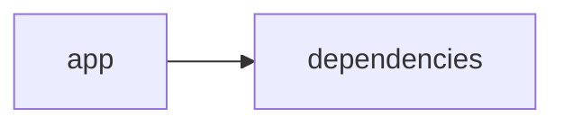

# Documentación del Proyecto

## Guía de Usuario
# Guía de Usuario: Herramienta de Análisis y Procesamiento de Información

Bienvenido a la guía de usuario para nuestra aplicación web interactiva. Esta herramienta ha sido diseñada para ayudarle a procesar archivos PDF y analizar su contenido utilizando modelos de lenguaje basados en IA. A continuación, se describe la aplicación, sus principales funcionalidades, cómo utilizarla y respuestas a las preguntas frecuentes más comunes.

---

## Índice

1. [Descripción de la Aplicación](#descripción-de-la-aplicación)
2. [Características Principales](#características-principales)
3. [Cómo Usar la Aplicación](#cómo-usar-la-aplicación)
4. [Preguntas Frecuentes (FAQ)](#preguntas-frecuentes-faq)

---

## Descripción de la Aplicación

La aplicación es una herramienta de análisis e interacción basada en la web desarrollada con Streamlit, que permite:

- **Visualización Interactiva:** Interfaz web sencilla y dinámica para interactuar con la información.
- **Procesamiento de Archivos PDF:** Capacidad de extraer y procesar el contenido de documentos PDF de forma rápida y eficiente.
- **Análisis con Modelos de Lenguaje (IA):** Emplea avanzados modelos de lenguaje para analizar, extraer insights y generar resultados útiles a partir del contenido de los PDFs.

Esta herramienta está implementada en Python, utilizando diversas bibliotecas especializadas para el análisis de datos y del lenguaje natural, lo que la hace robusta y versátil para distintos escenarios de uso.

---

## Características Principales

- **Interfaz Web Interactiva con Streamlit:**
  - Navegación intuitiva y fácil de usar.
  - Visualización de resultados en tiempo real.
  - Fácil integración de nuevos datos y ajustes de parámetros.

- **Procesamiento de Archivos PDF:**
  - Lectura y extracción automática del contenido de PDFs.
  - Soporte para múltiples archivos y procesamiento en lote.
  - Conservación del formato y estructura del contenido original.

- **Análisis con Modelos de Lenguaje (IA):**
  - Procesamiento y análisis avanzado de textos.
  - Identificación de patrones, temas y entidades relevantes.
  - Generación de resúmenes y respuestas basadas en consultas sobre el contenido.

- **Soporte para Análisis Complejo:**
  - Conectividad con modelos de lenguaje de vanguardia.
  - Ajuste y personalización de parámetros del análisis.
  - Optimización y escalabilidad para grandes volúmenes de datos.

---

## Cómo Usar la Aplicación

### 1. Acceso a la Interfaz

- Abra su navegador web y diríjase a la URL proporcionada para la aplicación.
- La pantalla principal mostrará un panel de navegación con las opciones de carga y análisis de archivos.

### 2. Carga de Archivos PDF

- Haga clic en el botón “Subir archivo” para seleccionar el archivo PDF o arrastre y suelte el documento en la zona designada.
- Espere a que el sistema procese el archivo. Se mostrará una notificación una vez que la carga y el procesamiento inicial hayan finalizado.

### 3. Análisis del Contenido

- Tras cargar el archivo, se activarán las opciones de análisis.
- Seleccione el tipo de análisis que desea realizar (por ejemplo, resumen, extracción de temas, búsqueda de palabras clave, etc.).
- Ajuste los parámetros según sus necesidades (por ejemplo, número de frases en el resumen, filtros de palabras, etc.).

### 4. Visualización y Exportación de Resultados

- Los resultados del análisis se mostrarán en la misma página, utilizando gráficos interactivos, tablas y otros elementos visuales.
- Puede exportar los resultados en diferentes formatos (por ejemplo, CSV, JSON, PDF) utilizando la opción de “Exportar” en el panel de resultados.

### 5. Ajuste y Personalización

- Use las opciones de configuración en la interfaz para ajustar aspectos del procesamiento (por ejemplo, idioma del análisis, nivel de detalle, etc.).
- Los cambios se reflejarán en tiempo real, permitiéndole experimentar y optimizar los resultados.

---

## Preguntas Frecuentes (FAQ)

### 1. ¿Qué tipos de archivos se pueden analizar?
Nuestra aplicación está optimizada para archivos PDF. Sin embargo, próximamente se podrán incorporar otros formatos. Por el momento, se recomienda convertir otros documentos a PDF.

### 2. ¿Cómo se garantiza la privacidad de los datos procesados?
La aplicación ha sido desarrollada siguiendo buenas prácticas de privacidad y seguridad. Todos los datos se procesan de manera local o en servidores seguros, según la configuración definida, y no se almacenan permanentemente sin su consentimiento.

### 3. ¿Puedo procesar varios archivos a la vez?
Sí, la aplicación permite el procesamiento por lotes. Puede seleccionar y cargar varios archivos PDF consecutivamente para análisis en conjunto.

### 4. ¿Es necesario conocer programación para usar la aplicación?
No, la interfaz de usuario ha sido diseñada para que cualquier persona pueda utilizarla sin necesidad de conocimientos técnicos en programación. Las opciones y configuraciones se encuentran organizadas de manera intuitiva.

### 5. ¿Qué hacer si el análisis no arroja los resultados esperados?
- Revise la calidad del PDF: asegúrese de que el contenido sea legible y esté bien estructurado.
- Verifique los parámetros de análisis seleccionados.
- Consulte la sección de ayuda o contacte con el soporte técnico para obtener asistencia adicional.

### 6. ¿Cómo se actualizan los modelos de lenguaje y bibliotecas de análisis?
La aplicación se actualiza periódicamente para incorporar mejoras y nuevas funciones. Se recomienda estar atento a las actualizaciones y notas de la versión publicadas en nuestro portal oficial.

---

Con esta guía esperamos haberle ofrecido una visión clara y práctica de cómo interactuar con nuestra herramienta para el análisis y procesamiento de información basada en PDF y modelos de lenguaje. ¡Esperamos que esta aplicación le sea de gran utilidad! 

Si tiene más preguntas o necesita asistencia adicional, no dude en contactarnos.

## Documentación Técnica
A continuación se presenta la documentación técnica completa en formato Markdown para desarrolladores, basada en el análisis del código del proyecto VoC Analyst.

---

# VoC Analyst – Documentación Técnica para Desarrolladores

VoC Analyst es una aplicación orientada al análisis de la Voz del Cliente (VoC) que permite procesar archivos (por ejemplo, PDFs), extraer información textual y realizar análisis avanzado mediante modelos de lenguaje (LLM). La interfaz de usuario se implementa con Streamlit, mientras que el backend integra distintos proveedores LLM (como OpenAI, Anthropic y Google GenAI) para generar insights y recomendaciones accionables.

---

## Tabla de Contenidos

1. [Resumen del Repositorio](#resumen-del-repositorio)
2. [Arquitectura General](#arquitectura-general)
3. [Componentes Principales](#componentes-principales)  
  3.1 [Aplicación Frontend con Streamlit](#aplicación-frontend-con-streamlit)  
  3.2 [Módulo LLMBackend](#módulo-llmbackend)  
  3.3 [Procesamiento de Archivos y Extracción de Texto](#procesamiento-de-archivos-y-extracción-de-texto)  
  3.4 [Gestión del Estado y Flujo de Procesamiento](#gestión-del-estado-y-flujo-de-procesamiento)
4. [APIs Internas y Funciones Destacadas](#apis-internas-y-funciones-destacadas)
5. [Configuración y Dependencias](#configuración-y-dependencias)
6. [Guías de Desarrollo](#guías-de-desarrollo)  
  6.1 [Instalación y Ejecución](#instalación-y-ejecución)  
  6.2 [Extensión y Configuración del LLMBackend](#extensión-y-configuración-del-llmbackend)  
  6.3 [Pruebas y Validación](#pruebas-y-validación)
7. [Esquema del Repositorio](#esquema-del-repositorio)

---

## Resumen del Repositorio

- **Lenguajes:**  
  - Otros (aproximadamente 23 archivos de código, mayoritariamente Python).

- **Endpoints:**  
  - No se encuentran endpoints tipo API REST expuestos; la aplicación es ejecutada localmente mediante Streamlit, lo que permite la interacción vía navegador.

- **Diagrama Simplificado (Mermaid):**

  (Utiliza el siguiente diagrama para visualizar la relación entre los componentes principales)
  
  ```mermaid
  graph LR
    App[app] --> Deps[dependencies]
  ```

---

## Arquitectura General

El sistema cuenta con una arquitectura distribuida en dos grandes bloques:

1. **Frontend – Interfaz de Usuario con Streamlit:**  
   - La interfaz se configura y ejecuta mediante Streamlit, permitiendo la carga de archivos, la visualización de resultados y la interacción en tiempo real a través de un navegador web.
   - Se aprovecha el estado de sesión de Streamlit para gestionar variables importantes (como archivos cargados, resultados de análisis y procesos en ejecución).

2. **Backend – Procesamiento y Análisis:**  
   - El procesamiento de archivos (por ejemplo, archivos PDF) se realiza utilizando librerías como PyPDF2 y pandas.
   - La integración de modelos de lenguaje se efectúa a través del módulo LLMBackend, que abstrae la comunicación con proveedores de IA para análisis avanzado.

El siguiente diagrama ilustra la división básica de responsabilidades:

```mermaid
graph TD
    A[Usuario/Cliente] --> B[Interfaz Streamlit]
    B --> C[Procesamiento de Archivos]
    C --> D[Extracción de Texto (PDF)]
    D --> E[Análisis con LLMBackend]
    E --> F[Generación de Insights]
```

---

## Componentes Principales

### Aplicación Frontend con Streamlit

- **Configuración Inicial:**  
  - Se utiliza `st.set_page_config` para definir el título, el icono, el layout y el estado inicial de la barra lateral.
  - Gestión del estado con `st.session_state` para almacenar variables clave:
    - `analysis_results`
    - `run_id`
    - `uploaded_files_data`
    - `processing_complete`

- **Interfaz Interactiva:**  
  - Permite la carga de archivos, muestra mensajes de error y actualiza la UI conforme se procesan los datos.

### Módulo LLMBackend

- **Propósito:**  
  - Facilita la comunicación y configuración de modelos de lenguaje (LLM) para realizar análisis de textos.
  
- **Configuración:**  
  - Importación y uso de clases y configuraciones definidas en el módulo (`LLMBackend`, `ModelConfig`).
  
- **Integración:**  
  - Este módulo posibilita la incorporación de distintos proveedores de inteligencia artificial, permitiendo a la aplicación adaptarse a diferentes requisitos de análisis semántico y generación de insights.

### Procesamiento de Archivos y Extracción de Texto

- **Extracción de Texto de PDFs:**  
  - La función `extract_text_from_pdf(pdf_file)` utiliza PyPDF2 para leer y extraer texto de cada página de un documento PDF.
  - Manejo de excepciones para gestionar errores durante la extracción de texto.

- **Validación de Archivos:**  
  - Funciones (como `validate_file_size(file)`) que se encargan de validar el tamaño y otros parámetros del archivo antes de proceder con su procesamiento.
  
  *Nota:* En el fragmento de código se observa una validación basada en el tamaño (por ejemplo, asegurarse de que el archivo no exceda 100 MB).

### Gestión del Estado y Flujo de Procesamiento

- **Estado de Sesión:**  
  - Se inicializan variables en `st.session_state` para almacenar resultados y controlar el flujo de la aplicación.
  
- **Pipeline de Procesamiento:**  
  - Los datos se cargan, se valida el archivo y se extrae el texto.
  - Posteriormente, el texto es enviado al backend (módulo LLMBackend) para su análisis.
  - Finalmente, los resultados se almacenan y se presentan en la interfaz de usuario.

---

## APIs Internas y Funciones Destacadas

Aunque la aplicación no expone APIs REST, cuenta con diversas funciones y métodos que actúan como “APIs internas” para la integración entre módulos:

- **extract_text_from_pdf(pdf_file) → str:**  
  - Descripción: Extrae y concatena texto de cada página de un archivo PDF.
  - Entrada: Un objeto de archivo PDF.
  - Salida: Cadena de texto extraído o mensaje de error.

- **validate_file_size(file) → bool:**  
  - Descripción: Valida que el archivo no exceda un tamaño configurado (por ejemplo, 100 MB).
  - Entrada: Un objeto de archivo.
  - Salida: Valor booleano indicando si el archivo es válido o no.

- **Interacción con LLMBackend:**  
  - Los métodos definidos en el módulo LLMBackend y las configuraciones en ModelConfig se utilizan para inicializar y enviar peticiones a modelos de lenguaje.  
  - Estos métodos son críticos para el análisis semántico y la generación de insights.

---

## Configuración y Dependencias

### Dependencias Clave

El proyecto depende de varias librerías de Python, entre las cuales destacan:

- **Streamlit:** Para la creación de la interfaz web interactiva.
- **PyPDF2:** Para la lectura y extracción de contenido de archivos PDF.
- **pandas:** Para el manejo y procesamiento de datos estructurados.
- **datetime, uuid, time:** Para gestionar fechas, identificadores únicos y temporización de procesos.
- **io, os:** Para la manipulación de flujos de datos y operaciones del sistema.
- **typing:** Para la declaración de tipos en funciones y mejorar la legibilidad del código.
- **llm_backend:** Módulo interno encargado de la comunicación con proveedores de modelos de lenguaje (debe incluir clases como LLMBackend y ModelConfig).

### Instalación

Para instalar las dependencias necesarias, se recomienda el uso de un entorno virtual y el administrador de paquetes pip. Un ejemplo de archivo requirements.txt podría ser:

```
streamlit
PyPDF2
pandas
llm_backend  # Asegúrese de que este paquete está disponible o forme parte del repositorio.
```

---

## Guías de Desarrollo

### Instalación y Ejecución

1. Clonar el repositorio:

   • git clone https://github.com/usuario/VoC-Analyst.git

2. Crear y activar un entorno virtual (opcional pero recomendado):

   • python -m venv env  
   • En Windows: env\Scripts\activate  
   • En Unix/Mac: source env/bin/activate

3. Instalar las dependencias:

   • pip install -r requirements.txt

4. Ejecutar la aplicación:

   • streamlit run app.py

   Esto abrirá la aplicación en el navegador, permitiendo la interacción y carga de archivos.

### Extensión y Configuración del LLMBackend

- **Integrar nuevos proveedores LLM:**  
  Para extender la funcionalidad del LLMBackend, se pueden agregar nuevos módulos que implementen la interfaz definida por ModelConfig. Esto facilitará la incorporación de otros proveedores de IA.

- **Configuración de Modelos:**  
  Revise las clases y configuraciones en `llm_backend` para adaptar parámetros como tokens, endpoints, y claves de API según sus necesidades.

- **Pruebas Locales:**  
  Se recomienda desarrollar pruebas unitarias para cada método central (por ejemplo, validación de archivos, extracción de texto y comunicación con el LLM).

### Pruebas y Validación

- **Pruebas Unitarias y de Integración:**  
  Implemente pruebas para asegurar que:
  - Los archivos PDF se procesen correctamente.
  - La comunicación con el módulo LLMBackend es estable.
  - La gestión del estado en Streamlit se realice de forma correcta.
  
- **Manejo de Errores:**  
  Asegúrese de capturar y mostrar errores de forma comprensible en la interfaz utilizando métodos como `st.error`.

---

## Esquema del Repositorio

La organización del repositorio es la siguiente:

```
VoC-Analyst/
├── app.py                   # Entrada principal de la aplicación (Streamlit)
├── llm_backend.py           # Módulo que gestiona la integración con modelos de lenguaje
├── utils/                   # Utilidades y funciones auxiliares (por ejemplo, validación y extracción)
│   ├── file_processing.py   # Funciones para manipulación y validación de archivos
│   └── pdf_extractor.py     # Funciones para extracción de texto de PDFs
├── requirements.txt         # Dependencias del proyecto
├── README.md                # Documentación general del proyecto
└── tests/                   # Pruebas unitarias e integración
```

Este esquema puede variar conforme se expanda la aplicación, pero proporciona una base clara para entender la estructura del proyecto.

---

## Consideraciones Finales

- La aplicación se centra en el análisis interactivo y en la generación de insights a partir de documentos PDF y conversaciones.
- Se recomienda mantener la documentación actualizada conforme se integren nuevas funcionalidades o se modifique el flujo de datos.
- La integración flexible del módulo LLMBackend permite adaptarse a múltiples proveedores de Inteligencia Artificial, facilitando la extensión o migración futura.

Con esta documentación, se pretende facilitar a los desarrolladores la comprensión, mantenimiento y extensión de VoC Analyst. Si surgen dudas adicionales o se requiere soporte, se recomienda revisar los comentarios en el código fuente o ponerse en contacto con el equipo de desarrollo.

--- 

¡Bienvenido al desarrollo y mejora continua de VoC Analyst!


## Diagrama

