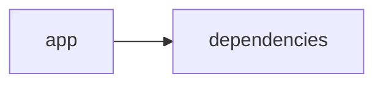

# Documentación del Proyecto

## Guía de Usuario
# Guía de Usuario: Herramienta de Análisis y Procesamiento de Información

Esta guía está diseñada para proporcionar una comprensión completa de la aplicación, sus funcionalidades principales, instrucciones de uso y respuestas a preguntas frecuentes. La herramienta utiliza Python y bibliotecas de análisis, aprovechando Streamlit para ofrecer una interfaz web interactiva. Además, incorpora modelos de lenguaje (IA) para analizar y procesar información contenida en archivos PDF.

---

## Tabla de Contenidos

1. [Descripción de la Aplicación](#descripción-de-la-aplicación)
2. [Funcionalidades Principales](#funcionalidades-principales)
3. [Cómo Utilizar la Aplicación](#cómo-utilizar-la-aplicación)
4. [Preguntas Frecuentes (FAQ)](#preguntas-frecuentes-faq)

---

## Descripción de la Aplicación

La aplicación es una herramienta de análisis y procesamiento de información que permite a los usuarios extraer, analizar y visualizar textos de archivos PDF. Utilizando una interfaz web interactiva desarrollada con Streamlit, junto con modelos de lenguaje (IA) para el procesamiento semántico, la herramienta facilita la búsqueda y evaluación de información relevante en documentos PDF.  
 
Entre las tecnologías implementadas se encuentran:
- **Python**: Lenguaje principal para el backend y desarrollo de funcionalidades.
- **Streamlit**: Framework para crear la interfaz web interactiva.
- **Bibliotecas de Análisis**: Utilizadas para el procesamiento y análisis de archivos PDF y textos, así como para la integración y uso de modelos de lenguaje.

La aplicación integra diferentes módulos, con archivos fuente (de aproximadamente 419 a 486 líneas de código cada uno) que gestionan la interfaz, el procesamiento de archivos PDF y la comunicación con los modelos de IA.

---

## Funcionalidades Principales

La herramienta se centra en tres funcionalidades principales:

1. **Interfaz Web Interactiva con Streamlit**  
   - Proporciona una experiencia de usuario intuitiva y visual.
   - Permite cargar archivos PDF, configurar parámetros de análisis y visualizar resultados.

2. **Procesamiento de Archivos PDF**  
   - Capacidad para leer y extraer texto de archivos PDF.
   - Preprocesamiento de datos extraídos para prepararlos para análisis posteriores.
   - Manejo de múltiples archivos y procesamiento en lote.

3. **Análisis con Modelos de Lenguaje (IA)**  
   - Uso de modelos de lenguaje para analizar y comprender el contenido textual.
   - Realización de tareas como resumen de contenido, extracción de palabras clave y análisis semántico.
   - Generación de insights basados en el contenido del documento.

---

## Cómo Utilizar la Aplicación

Sigue estos pasos para comenzar a utilizar la herramienta de análisis y procesamiento de información:

### 1. Instalación y Configuración

- **Requisitos Previos**:  
  - Python 3.7 o superior.
  - Instalación de Streamlit.  
  - Dependencias adicionales listadas en el archivo `requirements.txt`.

- **Instalación de Dependencias**:
  1. Clona el repositorio o descarga el código fuente.
  2. Abre una terminal en el directorio del proyecto.
  3. Ejecuta el siguiente comando para instalar las dependencias:
     > pip install -r requirements.txt

### 2. Ejecución de la Aplicación

- Para iniciar la aplicación, ejecuta el siguiente comando en la terminal:
  > streamlit run [nombre_del_archivo_principal].py

- Una vez iniciado el servidor, se abrirá la interfaz web en el navegador en la dirección habitual (por ejemplo, `http://localhost:8501`).

### 3. Uso de la Interfaz

- **Carga de Archivos PDF**:  
  - En la interfaz, utiliza el botón de "Cargar PDF" para seleccionar uno o varios archivos desde tu dispositivo.
  - Los archivos cargados se listarán en la interfaz para su posterior procesamiento.

- **Configuración del Análisis**:  
  - Selecciona las opciones de análisis disponibles, tales como el tipo de resumen o la extracción de palabras clave.
  - Configura parámetros adicionales si es necesario (por ejemplo, nivel de detalle o filtros de contenido).

- **Visualización y Descarga de Resultados**:  
  - Los resultados del procesamiento y análisis se mostrarán en secciones dedicadas.
  - Puedes exportar o descargar los resultados para su posterior uso o revisión.

---

## Preguntas Frecuentes (FAQ)

**1. ¿Qué tipos de archivos son compatibles?**  
La aplicación está diseñada principalmente para procesar archivos en formato PDF. Próximamente se evaluará la compatibilidad con otros formatos de documentos.

**2. ¿Cómo se garantiza la precisión del análisis realizado por la IA?**  
El análisis se basa en modelos de lenguaje avanzados entrenados con grandes conjuntos de datos. Sin embargo, se recomienda revisar los resultados generados, especialmente en textos con contenido muy técnico o especializado.

**3. ¿Puedo procesar múltiples archivos a la vez?**  
Sí, la herramienta permite la carga y el análisis de múltiples archivos PDF en una sola sesión. Los usuarios pueden cargar varios documentos y procesarlos de manera secuencial o en lote.

**4. ¿Es posible personalizar los parámetros de análisis?**  
Definitivamente. La interfaz web permite configurar opciones como el nivel de detalle y el tipo de análisis (resumen, extracción de palabras clave, análisis semántico), permitiendo a los usuarios adaptar la herramienta a sus necesidades específicas.

**5. ¿Qué debo hacer si la aplicación no responde o encuentro algún error?**  
- Verifica que todas las dependencias están correctamente instaladas.
- Revisa la consola de Streamlit para identificar posibles mensajes de error.
- Consulta la documentación del proyecto o contacta al equipo de soporte proporcionando detalles del problema y mensajes de error.

**6. ¿Cómo se protegen mis archivos y datos subidos a la aplicación?**  
La privacidad y seguridad de los datos son prioritarias. La aplicación procesa los datos localmente en tu dispositivo o en un entorno controlado, sin almacenar información de manera persistente a menos que se configure explícitamente.

---

Esta guía proporciona la información esencial para comenzar a utilizar la herramienta de análisis y procesamiento de información. Si tienes alguna duda o necesitas asistencia adicional, por favor contacta al equipo de soporte o consulta la documentación técnica avanzada incluida en el repositorio del proyecto.

## Documentación Técnica
A continuación se presenta la documentación técnica en formato Markdown para desarrolladores, basada en el análisis del código fuente y la estructura del repositorio VoC Analyst.

===============================================================
VoC Analyst – Documentación Técnica
===============================================================

VoC Analyst es una aplicación orientada al análisis de la Voz del Cliente (VoC). Su funcionalidad abarca la carga y procesamiento de archivos (principalmente PDF), extracción de texto, análisis de conversaciones y la generación de insights mediante modelos de lenguaje (LLM). La interfaz se implementa utilizando Streamlit para ofrecer una experiencia web interactiva, mientras que el backend se integra con proveedores de LLM para realizar tareas avanzadas de análisis e interpretación.

---------------------------------------------------------------
Tabla de Contenidos
---------------------------------------------------------------
1. [Resumen del Repositorio](#1-resumen-del-repositorio)
2. [Arquitectura General](#2-arquitectura-general)
3. [Componentes Principales](#3-componentes-principales)  
 3.1 [Aplicación Web con Streamlit](#31-aplicación-web-con-streamlit)  
 3.2 [Módulo LLMBackend](#32-módulo-llmbackend)  
 3.3 [Procesamiento y Extracción de Archivos](#33-procesamiento-y-extracción-de-archivos)  
 3.4 [Parser y Análisis de Conversaciones](#34-parser-y-análisis-de-conversaciones)
4. [APIs Internas y Funciones Destacadas](#4-apis-internas-y-funciones-destacadas)
5. [Configuración y Dependencias](#5-configuración-y-dependencias)
6. [Guías de Desarrollo](#6-guías-de-desarrollo)  
 6.1 [Instalación y Ejecución](#61-instalación-y-ejecución)  
 6.2 [Extensión y Configuración de LLMBackend](#62-extensión-y-configuración-de-llmbackend)  
 6.3 [Pruebas y Validación](#63-pruebas-y-validación)
7. [Diagrama de Componentes](#7-diagrama-de-componentes)

---------------------------------------------------------------
1. Resumen del Repositorio
---------------------------------------------------------------

- Lenguajes: Se ha identificado la categoría “other” (24 archivos), lo que indica que se utilizan múltiples tipos de archivos y scripts (ej. Python).
- Endpoints: No se han detectado endpoints REST explícitos, ya que la mayor parte de la interacción se produce mediante la interfaz web de Streamlit.
- Funcionalidad:  
  • Extracción de texto de archivos PDF mediante PyPDF2.  
  • Procesamiento de archivos y validación de tamaño.  
  • Manejo del estado de la sesión en Streamlit para gestionar resultados y procesos en curso.  
  • Integración con módulos que implementan funcionalidades de modelos de lenguaje (LLM) para análisis avanzados.

---------------------------------------------------------------
2. Arquitectura General
---------------------------------------------------------------

La arquitectura del sistema se puede describir de la siguiente manera:

- La capa de presentación está implementada en Streamlit, lo que facilita la interacción en tiempo real con el usuario.  
- La lógica de negocio incluye:
  • Procesamiento y validación de archivos (por ejemplo, extracción de texto desde PDFs).  
  • Integración con el módulo LLMBackend, que permite la interacción con diversos proveedores de modelos de lenguaje (por ejemplo, OpenAI, Anthropic y Google GenAI).  
- El flujo de datos se soporta mediante el mantenimiento del estado de sesión en Streamlit para almacenar resultados de análisis y datos temporales.

El siguiente diagrama Mermaid ilustra de forma básica la relación entre la aplicación y sus dependencias:

---------------------------------------------------------------
Diagrama (Mermaid)
---------------------------------------------------------------
  
  graph LR
      App[app] --> Deps[dependencies]

---------------------------------------------------------------
3. Componentes Principales
---------------------------------------------------------------

### 3.1. Aplicación Web con Streamlit

- Utiliza Streamlit para crear una interfaz web interactiva y dinámica.  
- Configuración inicial de la página mediante la función st.set_page_config, donde se establece el título, el icono, el layout y el estado inicial de la barra lateral.
- Gestión del estado de la sesión mediante st.session_state para almacenar datos críticos como:  
  • analysis_results  
  • run_id  
  • uploaded_files_data  
  • processing_complete

### 3.2. Módulo LLMBackend

- Integrado a través de la importación:  
  import LLMBackend, ModelConfig  
- Este módulo es el encargado de configurar y gestionar el uso de modelos de lenguaje en el backend.  
- Permite la conexión con distintos proveedores LLM para realizar tareas de análisis semántico, clasificación, generación de insights y más.

### 3.3. Procesamiento y Extracción de Archivos

- Función principal: extract_text_from_pdf  
  - Se encarga de leer archivos PDF utilizando la librería PyPDF2.  
  - Itera sobre las páginas del documento y extrae el texto.
  - Implementa manejo de excepciones para informar sobre errores durante la extracción.
- Función de validación (validate_file_size):  
  - Comprueba que el tamaño del archivo no exceda el límite definido (por ejemplo, 100MB).  
  - Permite una verificación previa antes del procesamiento intensivo de datos.

### 3.4. Parser y Análisis de Conversaciones

- Procesa conversaciones de clientes a partir de los textos extraídos.  
- Normaliza y segmenta el contenido para facilitar el análisis mediante modelos de lenguaje.
- Posiblemente incluye reglas o patrones para identificar temas, sentimientos y emociones, lo que permite generar insights accionables.

---------------------------------------------------------------
4. APIs Internas y Funciones Destacadas
---------------------------------------------------------------

La aplicación cuenta con diversas funciones internas que forman parte de su "API interna". Las siguientes son algunas de las funciones clave:

- extract_text_from_pdf(pdf_file) → str  
  • Descripción: Extrae texto de un archivo PDF y lo retorna como una cadena.  
  • Manejo de errores: Utiliza un bloque try/except para capturar y mostrar errores en la interfaz (st.error).

- validate_file_size(file) → bool  
  • Descripción: Verifica que el tamaño del archivo no exceda el límite máximo permitido (por ejemplo, 100MB).  
  • Notas: Se reposiciona el cursor en el archivo para medir el tamaño completo.

- Funciones relacionadas con el manejo del estado de la sesión en Streamlit, que controlan variables como:  
  • analysis_results  
  • run_id  
  • uploaded_files_data  
  • processing_complete

- Módulo LLMBackend (y su clase o funciones asociadas)  
  • Proporcionan métodos para configurar y ejecutar solicitudes a los modelos de lenguaje.
  • Permiten la configuración de parámetros y modelos mediante estructuras como ModelConfig.

Cada función y módulo está diseñado para facilitar el procesamiento modular y escalable del análisis de voz del cliente.

---------------------------------------------------------------
5. Configuración y Dependencias
---------------------------------------------------------------

El proyecto se apoya en las siguientes dependencias y configuraciones:

- Python 3.7 o superior  
- Dependencias principales:
  • streamlit  
  • pandas  
  • PyPDF2  
  • llm_backend (módulo interno o paquete desarrollado para interactuar con los modelos LLM)
  • (otras dependencias de análisis y procesamiento, tales como json, uuid, zipfile, io, os, datetime)
- Archivo de requerimientos: Se recomienda mantener un archivo requirements.txt con la lista y versiones de dependencias, por ejemplo:

  # requirements.txt
  streamlit==x.y.z
  pandas==x.y.z
  PyPDF2==x.y.z
  llm_backend==x.y.z

- Variables de entorno:  
Si el módulo LLMBackend necesita claves o configuraciones específicas (por ejemplo, API keys), se deben definir como variables de entorno o en archivos de configuración seguros.

---------------------------------------------------------------
6. Guías de Desarrollo
---------------------------------------------------------------

### 6.1. Instalación y Ejecución

Pasos básicos para instalar y ejecutar la aplicación:

1. Clonar el repositorio:
  git clone https://ruta.al.repositorio/VocAnalyst.git  
  cd VocAnalyst

2. Crear un entorno virtual (recomendado):
  python -m venv venv  
  source venv/bin/activate  # En Windows: venv\Scripts\activate

3. Instalar las dependencias:
  pip install -r requirements.txt

4. Ejecutar la aplicación:
  streamlit run app.py  
  (Nota: Asegúrate de que app.py o el archivo principal se encuentre en la raíz del repositorio)

### 6.2. Extensión y Configuración de LLMBackend

- Revisa el módulo LLMBackend para entender la configuración de modelos de lenguaje.  
- Para agregar o modificar un proveedor de LLM:
  • Examinar la clase ModelConfig y adaptarla a las necesidades del nuevo proveedor.  
  • Asegurarse de manejar adecuadamente la autenticación (por ejemplo, API keys) y la gestión de respuestas.

### 6.3. Pruebas y Validación

- Se recomienda incluir pruebas unitarias para:
  • Validar el correcto funcionamiento de la función extract_text_from_pdf.
  • Comprobar la validez del tamaño de archivos mediante validate_file_size.
  • Asegurar que la integración de LLMBackend se realice sin errores de comunicación.

- Utiliza frameworks de pruebas como pytest para automatizar las pruebas.

---------------------------------------------------------------
7. Diagrama de Componentes
---------------------------------------------------------------

El siguiente diagrama proporciona una visión simplificada de la relación entre los componentes principales de la aplicación:

  graph LR
   App[Aplicación Streamlit] --> PDF[Extracción/Procesamiento de Archivos]
   App --> LLM[Integración LLMBackend]
   PDF --> Parser[Parser y Análisis de Conversaciones]

---------------------------------------------------------------
Consideraciones Finales
---------------------------------------------------------------

- La arquitectura modular facilita la extensión y mantenimiento del sistema.  
- Se recomienda agregar documentación inline y pruebas unitarias para cada nuevo componente o función.  
- La separación de la lógica de presentación (Streamlit) y el procesamiento (LLMBackend, Parser) permite una escalabilidad y adaptabilidad a futuras necesidades analíticas.

Esta documentación técnica debe servir como guía para desarrolladores que deseen comprender, extender o integrar nuevas funcionalidades en el repositorio VoC Analyst.

---------------------------------------------------------------
Fin de la Documentación Técnica
---------------------------------------------------------------

Con esta documentación, se espera facilitar la incorporación de desarrolladores al proyecto, promoviendo buenas prácticas de desarrollo y mantenibilidad del código.

## Diagrama

