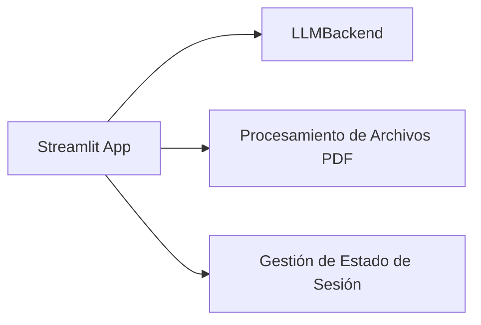
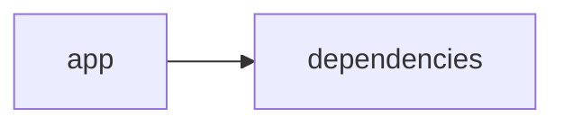

# Documentación del Proyecto

## Guía de Usuario
# Guía del Usuario para la Aplicación de Análisis y Procesamiento de Información

Bienvenido a nuestra herramienta interactiva, desarrollada para simplificar el análisis y procesamiento de información contenida en archivos PDF. Esta guía te ayudará a entender las funcionalidades principales, el uso de la aplicación y resolver dudas frecuentes.

---

## Descripción de la Aplicación

Esta aplicación combina el poder de una interfaz web interactiva, construida con Streamlit, y las capacidades avanzadas de procesamiento y análisis de archivos PDF mediante modelos de lenguaje (IA). Con una interfaz intuitiva, usuarios sin conocimientos técnicos pueden cargar, procesar y obtener insights de documentos en formato PDF, aprovechando tecnologías de análisis y procesamiento en Python.

---

## Funcionalidades Principales

- **Interfaz Web Interactiva**
  - Realizada con Streamlit, permite una navegación sencilla y amigable.
  - Acceso a través de un navegador web sin necesidad de instalaciones adicionales.

- **Procesamiento de Archivos PDF**
  - Carga y lectura de archivos PDF.
  - Extracción de texto e información relevante del documento.
  - Soporte para documentos de diferentes tamaños y formatos.

- **Análisis con Modelos de Lenguaje (IA)**
  - Procesamiento semántico del contenido extraído.
  - Identificación de temas, palabras clave y patrones en el texto.
  - Generación de resúmenes e insights para facilitar la comprensión del contenido.

- **Integración de Tecnologías de Python**
  - Utilización de bibliotecas especializadas para la manipulación y análisis de documentos.
  - Arquitectura modular que permite futuras mejoras y la adición de nuevas funcionalidades.

---

## Cómo Usar la Aplicación

1. **Acceder a la Interfaz Web**  
   Inicia sesión en la aplicación a través de tu navegador web. La URL de acceso te será proporcionada por el administrador o se mostrará en los cursos o licencias.

2. **Carga de Archivos PDF**  
   - En la página principal, busca la opción “Subir PDF”.
   - Selecciona el archivo PDF deseado desde tu dispositivo.
   - Espera a que el proceso de carga y extracción se complete; se visualizará una barra de progreso.

3. **Procesamiento y Análisis**
   - Una vez cargado el PDF, la aplicación extraerá automáticamente el texto del documento.
   - El sistema aplicará modelos de lenguaje para analizar el contenido y generar resúmenes o insights.
   - Los resultados del análisis se mostrarán en una sección dedicada, con gráficos y resúmenes de los datos.

4. **Explorar Resultados**
   - Revisa la información detallada presentada: palabras clave, resúmenes y otros insights generados.
   - Utiliza las herramientas interactivas para profundizar en áreas específicas del análisis (por ejemplo, filtros, búsqueda interna, etc.).

5. **Exportación y Compartir Información**
   - Opcionalmente, puedes exportar los resultados del análisis en formatos compatibles (PDF, CSV) para su posterior uso o compartición.

---

## Preguntas Frecuentes (FAQ)

### 1. ¿Qué tipos de archivos se pueden procesar?  
La aplicación está diseñada principalmente para archivos PDF. En futuras versiones se podría ampliar el soporte a otros formatos de documento.

### 2. ¿Necesito conocimientos técnicos para utilizar la aplicación?  
No, la interfaz es intuitiva y diseñada para usuarios finales. Solo es necesario seguir las instrucciones y utilizar la herramienta de carga de archivos.

### 3. ¿Cuánto tiempo toma el procesamiento de un documento?  
El tiempo varía según el tamaño y complejidad del PDF. Para documentos estándar, el análisis se completa en pocos segundos; documentos muy extensos pueden tardar un poco más.

### 4. ¿Cómo se resguarda la privacidad de los documentos?  
Los documentos procesados se manejan bajo estrictas políticas de seguridad y confidencialidad. No se almacenan más allá del tiempo necesario para realizar el análisis, a menos que el usuario opte por guardarlos.

### 5. ¿Puedo usar la aplicación en dispositivos móviles?  
Sí, la interfaz basada en Streamlit es responsiva y se adapta a dispositivos móviles, aunque se recomienda el uso en un navegador de escritorio para una experiencia óptima.

### 6. ¿Qué ocurre si el análisis de un PDF no es satisfactorio?  
El análisis se basa en modelos de lenguaje que, en algunos casos, pueden necesitar ajustes según el contenido específico del documento. Si los resultados no cumplen con tus expectativas, revisa el formato del PDF o contacta con soporte técnico para asesoría.

---

## Soporte y Actualizaciones

Si tienes preguntas adicionales o encuentras algún inconveniente durante el uso de la aplicación, no dudes en contactar a nuestro equipo de soporte técnico. También te recomendamos estar atento a las actualizaciones periódicas que pueden introducir mejoras y nuevas funcionalidades.

¡Esperamos que disfrutes utilizando la herramienta y que te sea de gran ayuda para el análisis y procesamiento de información!

## Documentación Técnica
A continuación se presenta la documentación técnica completa en Markdown para desarrolladores del repositorio VoC Analyst, basada en el análisis del código y la estructura del proyecto.

=========================================================

# VoC Analyst – Documentación Técnica

VoC Analyst es una aplicación orientada al análisis de la Voz del Cliente (VoC). La solución combina la extracción y procesamiento de archivos (por ejemplo, documentos PDF) con análisis de conversaciones utilizando Modelos de Lenguaje (LLM). La interfaz de usuario se implementa con Streamlit, lo que permite una experiencia interactiva vía navegador, mientras que el backend integra proveedores de LLM (como OpenAI, Anthropic, Google GenAI, entre otros) para generar insights y recomendaciones accionables.

---------------------------------------------------------
  
## Tabla de Contenidos

1. [Resumen del Repositorio](#resumen-del-repositorio)
2. [Arquitectura General](#arquitectura-general)
3. [Componentes Principales](#componentes-principales)
   - [Aplicación Streamlit](#aplicación-streamlit)
   - [Módulo LLMBackend](#módulo-llmbackend)
   - [Procesamiento y Extracción de Archivos](#procesamiento-y-extracción-de-archivos)
   - [Parser y Análisis de Conversaciones](#parser-y-análisis-de-conversaciones)
4. [APIs Internas y Funciones Destacadas](#apis-internas-y-funciones-destacadas)
5. [Configuración y Dependencias](#configuración-y-dependencias)
6. [Guías de Desarrollo](#guías-de-desarrollo)
   - [Instalación y Ejecución](#instalación-y-ejecución)
   - [Extensión y Configuración del LLMBackend](#extensión-y-configuración-del-llmbackend)
   - [Pruebas y Validación](#pruebas-y-validación)

---------------------------------------------------------
  
## 1. Resumen del Repositorio

- **Lenguajes:**  
  - Se ha identificado que el proyecto contiene código en “other” (principalmente Python) repartido en múltiples archivos con aproximadamente 400+ líneas cada uno.

- **Endpoints:**  
  - No se han detectado endpoints de una API REST en el repositorio, dado que la interfaz se implementa en Streamlit para ejecución web interactiva.

- **Diagrama Mermaid (Relación de Componentes):**

  ```mermaid
  graph LR
    App[app]-->Deps[dependencies]
  ```

---------------------------------------------------------
  
## 2. Arquitectura General

La arquitectura del proyecto se centra en una aplicación web interactiva que se conecta a diversos módulos y bibliotecas para la realización de las siguientes tareas:

- **Interfaz de Usuario:**  
  - Implementada con Streamlit. Permite la interacción en tiempo real, visualización de datos y resultados de análisis.

- **Procesamiento de Documentos:**  
  - Incluye funcionalidades para la carga y extracción de texto desde archivos PDF utilizando bibliotecas como PyPDF2.
  
- **Backend Analítico:**  
  - Integrado mediante un módulo denominado LLMBackend, que encapsula la lógica para interactuar con modelos de lenguaje (LLM) y otros componentes de análisis (por ejemplo, validación de archivos, procesamiento de textos, generación de run_id, etc.)

- **Sesión y Estado:**  
  - Se usa el estado de sesión de Streamlit (st.session_state) para gestionar variables de sesión, como resultados del análisis, identificadores de ejecución y archivos procesados.

El siguiente diagrama conceptual ilustra la relación principal entre la aplicación y sus dependencias:  



---------------------------------------------------------

## 3. Componentes Principales

### Aplicación Streamlit

- **Propósito:**  
  - Proporciona la interfaz web interactiva para usuarios.  
  - Configura la página (título, icono, layout y estado de la barra lateral) y gestiona la interacción del usuario.
  
- **Características:**  
  - Inicialización de variables en st.session_state para almacenar datos durante la sesión (e.g., resultados de análisis, run_id, archivos cargados y estado de procesamiento).
  - Permite la carga y visualización en tiempo real de archivos e información procesada.

### Módulo LLMBackend

- **Propósito:**  
  - Encapsula la lógica para interactuar con Modelos de Lenguaje (LLM).
  
- **Funcionalidades típicas (basado en el código analizado):**  
  - Configuración y selección del modelo a utilizar (ModelConfig).
  - Ejecución de análisis de texto para generar insights y procesar resultados.
  
- **Posibilidades de Extensión:**  
  - Soporte para distintos proveedores de LLM (OpenAI, Anthropic, Google GenAI, etc.).
  - Integración con pipelines de procesamiento propios mediante modularización.

### Procesamiento y Extracción de Archivos

- **Extracción de Texto de PDF:**
  - Función: `extract_text_from_pdf(pdf_file) -> str`
  - Se utiliza PyPDF2 para leer páginas del PDF e iterar sobre ellas, concatenando y limpiando el texto extraído.
  - Maneja excepciones e informa errores usando la funcionalidad de mensajes de error de Streamlit (st.error).

- **Validación del Tamaño de Archivos:**
  - Función: `validate_file_size(file) -> bool`
  - Verifica que el tamaño del archivo sea inferior a 100 MB.  
  - Asegura que la manipulación de archivos sea segura y eficiente.

### Parser y Análisis de Conversaciones

- **Propósito:**  
  - Procesar y analizar contenido textual (por ejemplo, extraído de PDFs o conversaciones).
  - Detectar análisis semántico, generar insights y clasificar contenido en función de temas o emociones.
  
- **Integración con LLMBackend:**  
  - La transformación y análisis del texto extraído se integran con el módulo LLMBackend para obtener recomendaciones y análisis adicionales.

---------------------------------------------------------

## 4. APIs Internas y Funciones Destacadas

A continuación se detallan algunas funciones críticas implementadas en el código:

### extract_text_from_pdf(pdf_file) -> str
- **Descripción:**  
  - Función encargada de leer un archivo PDF y extraer su contenido textual.
- **Implementación:**
  - Se utiliza la biblioteca PyPDF2.
  - Itera sobre todas las páginas para concatenar el texto.
  - Se manejan excepciones y se muestra un mensaje de error en la interfaz en caso de fallo.

### validate_file_size(file) -> bool
- **Descripción:**  
  - Función para validar que el tamaño del archivo no exceda 100 MB.
- **Implementación:**
  - Mueve el puntero al final del archivo para medir su tamaño.
  - Devuelve un valor booleano basado en la comparación con el tamaño máximo permitido.
  
### Gestión del Estado en Streamlit
- **Variables en st.session_state:**
  - `analysis_results`: Almacena los resultados del análisis de los datos.
  - `run_id`: Identificador único para cada ejecución o proceso.
  - `uploaded_files_data`: Lista que guarda la información de archivos cargados.
  - `processing_complete`: Indicador booleano para determinar si el procesamiento ha finalizado.

### Conexión con LLMBackend
- **Elementos básicos:**
  - El objeto `LLMBackend` se instancia para centralizar la lógica de análisis.
  - Se utiliza `ModelConfig` para gestionar configuraciones específicas del modelo de lenguaje.

---------------------------------------------------------

## 5. Configuración y Dependencias

### Dependencias Clave:

- **Python:**  
  - Lenguaje base utilizado para la implementación.

- **Bibliotecas:**
  - **Streamlit:** Para la creación de interfaces web interactivas.
  - **PyPDF2:** Para la extracción de texto de documentos PDF.
  - **Pandas:** Para la manipulación y análisis de datos (según se requiera).
  - **uuid:** Para generar identificadores únicos.
  - **datetime & time:** Para la gestión de fechas y tiempos en el procesamiento.
  - **io y zipfile:** Para el manejo de flujos de datos y compresión.
  - **json:** Para la manipulación y serialización de datos.

- **Módulos Internos:**
  - **llm_backend:** Módulo que integra la lógica para la comunicación con modelos de lenguaje y el procesamiento de los resultados.

### Configuración Inicial:

- La aplicación configura la página de Streamlit mediante `st.set_page_config` especificando título, ícono, distribución y estado inicial de la barra lateral.
- Se definen variables de sesión en `st.session_state` para preservar el estado de la aplicación durante la interacción del usuario.

---------------------------------------------------------

## 6. Guías de Desarrollo

### Instalación y Ejecución

1. **Clonar el Repositorio:**

   Desde la terminal, clona el repositorio:
   > git clone https://tu-repositorio-url.git

2. **Crear y Activar un Entorno Virtual:**

   Se recomienda utilizar un entorno virtual para gestionar las dependencias:
   > python -m venv venv  
   > source venv/bin/activate   (Linux/Mac)  
   > venv\Scripts\activate      (Windows)

3. **Instalar Dependencias:**

   Con pip instalado, ejecutar:
   > pip install -r requirements.txt

4. **Ejecutar la Aplicación:**

   Inicia la aplicación Streamlit:
   > streamlit run app.py

### Extensión y Configuración del LLMBackend

- **Agregar nuevos proveedores de LLM:**
  - Extender el módulo `llm_backend` para incorporar integraciones adicionales.
  - Actualizar la clase `ModelConfig` para soportar configuraciones específicas del proveedor.
  
- **Parámetros y configuración:**
  - Revisar y modificar variables de entorno o archivos de configuración para gestionar credenciales y parámetros de conexión a los servicios de LLM.
  
- **Pruebas Locales:**
  - Ejecutar pruebas locales e integradas para asegurar la correcta comunicación entre el frontend (Streamlit) y el backend (LLMBackend).

### Pruebas y Validación

- **Pruebas Unitarias:**
  - Asegúrate de implementar pruebas unitarias para funciones críticas como `extract_text_from_pdf` y `validate_file_size`.
  
- **Depuración:**
  - Utiliza mensajes de log (por ejemplo, con la biblioteca logging) para rastrear errores y realizar la depuración en entornos de desarrollo y staging.

- **Validación de Entradas:**
  - Validar la carga y procesamiento de archivos en diferentes escenarios (archivos corruptos, tamaños extremos, etc.).

---------------------------------------------------------

## Conclusión

Esta documentación técnica está pensada para facilitar la comprensión y el desarrollo sobre el repositorio VoC Analyst. La estructura modular del código, junto con la integración de Streamlit y LLMBackend, permite la fácil extensión y mantenimiento del sistema conforme evolucionen las necesidades de análisis de la Voz del Cliente.

Para cualquier consulta adicional o contribución, se recomienda revisar el código fuente y seguir las mejores prácticas de desarrollo y documentación.

---------------------------------------------------------

¡Feliz codificación y buen análisis!


## Diagrama

