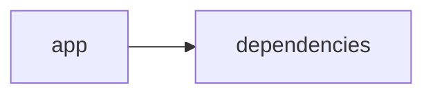

# Documentación del Proyecto

## Guía de Usuario
# Guía de Usuario

Bienvenido a nuestra herramienta de análisis y procesamiento de información, diseñada para ayudarte a extraer insights valiosos de documentos PDF, conversaciones y opiniones de clientes utilizando inteligencia artificial. Esta guía te acompañará en cada paso para que puedas aprovechar al máximo todas sus funcionalidades sin necesidad de conocimientos técnicos profundos.

---

## 📱 ¿Qué es esta aplicación?

- **Propósito principal**:  
  Permitir a los usuarios procesar archivos PDF, analizar conversaciones y opiniones de clientes mediante modelos de lenguaje (IA) para obtener información relevante y accionable.

- **Problema que resuelve**:  
  Facilita la extracción y comprensión de grandes volúmenes de información en documentos y comunicaciones, ayudándote a identificar tendencias, emociones y necesidades de tus clientes de forma rápida y eficaz.

- **Beneficios clave**:  
  - Análisis automatizado y rápido de documentos y conversaciones.  
  - Detección de sentimientos y emociones para entender mejor a tus clientes.  
  - Interfaz intuitiva y amigable basada en Streamlit que elimina la complejidad técnica.  
  - Toma de decisiones informada a partir de insights generados por modelos de IA.

- **Audiencia objetivo**:  
  Profesionales de análisis de datos, equipos de atención al cliente, departamentos de marketing y cualquier usuario que necesite procesar y extraer información valiosa de documentos y comunicaciones.

---

## ✨ Funcionalidades Principales

### 1. Interfaz Web Interactiva con Streamlit  
- **¿Qué hace?**:  
  Proporciona una plataforma visual y fácil de usar para interactuar con la aplicación y sus análisis.  
- **¿Cuándo usarla?**:  
  Cada vez que necesites cargar documentos, revisar resultados de análisis o configurar opciones del programa.  
- **¿Cómo acceder?**:  
  Abre tu navegador web y navega a la URL proporcionada para la aplicación.  
- **Resultado esperado**:  
  Visualizarás una interfaz clara con menús, botones y secciones organizadas que facilitan el flujo de trabajo.

### 2. Procesamiento de Archivos PDF  
- **¿Qué hace?**:  
  Permite cargar y extraer texto e información de archivos PDF.  
- **¿Cuándo usarla?**:  
  Cuando tengas documentos en formato PDF que necesites analizar o procesar para extraer datos.  
- **¿Cómo acceder?**:  
  Selecciona la opción “Cargar PDF” en el menú principal, elige tu archivo y confirma la carga.  
- **Resultado esperado**:  
  El contenido del PDF se mostrará en pantalla y estará listo para ser analizado.

### 3. Análisis con Modelos de Lenguaje (IA)  
- **¿Qué hace?**:  
  Utiliza inteligencia artificial para interpretar el texto y extraer insights relevantes.  
- **¿Cuándo usarla?**:  
  Después de cargar un documento o una conversación, para obtener resúmenes, identificar temas clave o generar insights automáticos.  
- **¿Cómo acceder?**:  
  Una vez procesado el archivo PDF o ingresada la conversación, selecciona “Analizar con IA”.  
- **Resultado esperado**:  
  Verás un resumen y análisis de la información, con recomendaciones y puntos destacados.

### 4. Análisis de Conversaciones  
- **¿Qué hace?**:  
  Examina diálogos y conversaciones para identificar patrones, temas recurrentes y aspectos importantes.  
- **¿Cuándo usarla?**:  
  Cuando necesites analizar interacciones de atención al cliente, reuniones o chats.  
- **¿Cómo acceder?**:  
  Ingresa el texto de la conversación o carga el archivo correspondiente y selecciona “Analizar Conversación”.  
- **Resultado esperado**:  
  Se presentarán gráficos y listados con los temas más discutidos y las conclusiones principales.

### 5. Análisis de Sentimientos y Emociones  
- **¿Qué hace?**:  
  Detecta y clasifica las emociones expresadas en textos utilizando análisis de sentimientos.  
- **¿Cuándo usarla?**:  
  Ideal para evaluar la satisfacción del cliente, el tono de una conversación o la actitud en opiniones.  
- **¿Cómo acceder?**:  
  Tras cargar o ingresar el texto, selecciona “Analizar Sentimientos”.  
- **Resultado esperado**:  
  Aparecerá un informe con indicadores visuales (como gráficos de barras o pastel) que muestran la distribución de sentimientos positivos, negativos y neutros.

### 6. Análisis de Voz del Cliente (VoC)  
- **¿Qué hace?**:  
  Procesa las opiniones y comentarios de los clientes para entender sus percepciones y necesidades.  
- **¿Cuándo usarla?**:  
  Cuando tengas datos de encuestas, reseñas o feedback de clientes que necesiten ser interpretados.  
- **¿Cómo acceder?**:  
  Selecciona la opción “Analizar Voz del Cliente” y carga el archivo o ingresa el texto correspondiente.  
- **Resultado esperado**:  
  Se generará un reporte con los insights clave sobre la experiencia del cliente, destacando áreas de mejora y aspectos positivos.

---

## 🚀 Cómo Empezar

### Primer Uso

1. **Requisitos previos**:  
   - Tener acceso a un navegador web actualizado.  
   - Contar con archivos PDF o textos de conversación listos para analizar.  

2. **Acceso inicial**:  
   - Ingresa la URL proporcionada de la aplicación en tu navegador.

3. **Configuración básica**:  
   - No es necesaria una configuración compleja; la interfaz es intuitiva.  
   - Revisa las opciones de menú para familiarizarte con las herramientas disponibles.

4. **Primera tarea recomendada**:  
   - Comienza cargando un archivo PDF y utiliza el análisis con IA para obtener un resumen del contenido.

### Flujo Típico de Uso

1. **Paso 1**:  
   Inicia sesión en la aplicación a través del navegador.

2. **Paso 2**:  
   Selecciona la funcionalidad deseada (por ejemplo, “Cargar PDF” o “Analizar Conversación”).

3. **Paso 3**:  
   Sigue los pasos en pantalla para cargar tu archivo o ingresar tu texto.

4. **Paso 4**:  
   Ejecuta el análisis (IA, sentimientos, voz del cliente, etc.) y revisa el informe generado.

---

## 💡 Casos de Uso Comunes

### Escenario 1: Análisis de un Reporte en PDF  
**Situación**: Necesitas extraer información clave de un informe extenso.  
**Pasos**:  
1. Carga el archivo PDF en la interfaz.  
2. Selecciona “Procesar PDF” y luego “Analizar con IA”.  
3. Revisa el resumen y los insights presentados para identificar los puntos importantes.

### Escenario 2: Revisión de Conversaciones de Atención al Cliente  
**Situación**: Deseas evaluar la efectividad de un equipo de soporte.  
**Pasos**:  
1. Ingresa o carga las transcripciones de las conversaciones.  
2. Selecciona “Analizar Conversación”.  
3. Observa los patrones y temas recurrentes que puedan indicar áreas de mejora.

### Escenario 3: Evaluación de Sentimientos en Opiniones de Clientes  
**Situación**: Quieres conocer la percepción de los clientes sobre un producto o servicio.  
**Pasos**:  
1. Carga o ingresa las reseñas y comentarios.  
2. Selecciona “Analizar Sentimientos”.  
3. Revisa el reporte y los gráficos que muestran el balance entre opiniones positivas, negativas y neutras.

### Escenario 4: Diagnóstico de la Voz del Cliente  
**Situación**: Necesitas identificar áreas críticas y oportunidades de mejora a partir del feedback de clientes.  
**Pasos**:  
1. Carga el archivo o ingresa el feedback recibido.  
2. Selecciona “Analizar Voz del Cliente”.  
3. Analiza el reporte para entender las necesidades y expectativas de tus clientes.

---

## ❓ Preguntas Frecuentes

**P: ¿Cómo inicio la aplicación por primera vez?**  
R: Abre tu navegador, ingresa a la URL proporcionada y sigue las instrucciones en pantalla para comenzar.

**P: ¿Qué hago si no puedo cargar mi archivo PDF?**  
R: Verifica que el archivo esté completo y en formato PDF. Si el problema persiste, intenta actualizar tu navegador o comunícate con soporte.

**P: ¿Es seguro usar la funcionalidad de análisis con IA?**  
R: Sí, la aplicación procesa los datos localmente en tu navegador o servidor sin compartir información personal en redes externas. Consulta nuestra política de privacidad para más detalles.

**P: ¿Qué limitaciones tiene la aplicación?**  
R:  
- No soporta formatos de archivo diferentes a PDF para el procesamiento de documentos.  
- El análisis de sentimientos y emociones se basa en modelos de lenguaje y puede no captar matices muy específicos.  
- Requiere conexión a internet para cargar y procesar los datos en la interfaz web.

---

## 🆘 Solución de Problemas

### Problema: El archivo PDF no se carga correctamente  
**Síntomas**:  
- No se muestra el contenido del archivo.  
- Recibes un mensaje de error al intentar cargar el PDF.

**Causa probable**:  
- El archivo podría estar corrupto o en un formato incompatible.

**Solución**:  
1. Verifica que el archivo sea un PDF válido.  
2. Asegúrate de tener una conexión estable a internet.  
3. Intenta recargar la página y volver a cargar el archivo.

---

### Problema: Los resultados del análisis con IA parecen incompletos  
**Síntomas**:  
- Falta de información en el resumen.  
- Resultados parciales en los reportes de sentimiento o conversación.

**Causa probable**:  
- El contenido analizado puede ser insuficiente o demasiado complejo para el modelo.

**Solución**:  
1. Revisa que el texto cargado esté completo y sin errores.  
2. Intenta ejecutar nuevamente el análisis.  
3. Si el problema persiste, contacta al soporte.

---

### Problema: La interfaz web no responde  
**Síntomas**:  
- Lentitud en la carga de la página.  
- Botones que no funcionan al hacer clic.

**Causa probable**:  
- Problemas de conexión a internet o alta demanda en el servidor.

**Solución**:  
1. Verifica tu conexión a internet.  
2. Actualiza la página y vuelve a intentarlo.  
3. Si el problema continúa, informa a soporte para investigar posibles interrupciones en el servicio.

---

## 📞 Soporte y Contacto

- **¿Necesitas ayuda adicional?**  
  Comunícate con nuestro equipo de soporte a través del correo: soporte@tuanalisisapp.com

- **¿Encontraste un error?**  
  Reporta cualquier fallo en la aplicación enviando un correo a: reportes@tuanalisisapp.com

- **¿Tienes sugerencias?**  
  Envíanos tus comentarios y sugerencias a: feedback@tuanalisisapp.com

---

Esperamos que esta guía te sea de gran ayuda para aprovechar todas las funcionalidades que ofrece nuestra aplicación. ¡Disfruta explorando y analizando tu información de manera sencilla y efectiva!

## Documentación Técnica
# Documentación Técnica

Esta documentación técnica está dirigida a desarrolladores y profesionales que requieran comprender, extender y mantener el sistema VoC Analyst. Se detalla la arquitectura del sistema, el stack tecnológico empleado, los componentes principales, las APIs internas, el modelo de datos, la guía de desarrollo y los puntos de atención.

---

## 🏗️ Arquitectura del Sistema

- **Patrón Arquitectónico Utilizado:**  
  La aplicación sigue una arquitectura modular monolítica, donde la interfaz de usuario (Frontend) se implementa con Streamlit y se integra de forma directa con la lógica de negocio (Backend) que incluye módulos de procesamiento, análisis de texto, y conexión con múltiples proveedores de Modelos de Lenguaje (LLM).  
  Se evidencia una clara separación entre:
  - La capa de Presentación: Interfaz interactiva, manejo de estado y visualización de resultados.
  - La capa de Lógica y Procesamiento: Extracción de texto, validación de archivos, parsing de conversaciones y conexión con proveedores de IA.

- **Diagrama de Componentes:**  
  A continuación se presenta un diagrama Mermaid que resume la estructura del sistema y la relación entre sus módulos:
  
  ```mermaid
  graph LR
      A[Interfaz Streamlit (Frontend)] --> B[Procesamiento y Validación de Archivos]
      A --> C[LLMBackend (Lógica de Negocio)]
      C --> D[Proveedores LLM (OpenAI, Anthropic, Gemini)]
      B --> E[Parser y Análisis de Conversaciones]
  ```

- **Flujo de Datos Principal:**  
  1. El usuario interactúa con la interfaz web (Streamlit) para cargar archivos PDF.
  2. Se ejecutan funciones de validación y extracción de texto mediante PyPDF2.
  3. El texto extraído es enviado al módulo de procesamiento (Parser) para normalizar la conversación y redactar información sensible (PII).
  4. El módulo LLMBackend utiliza la configuración (ModelConfig) para enviar prompts a uno o más proveedores LLM y obtener insights (análisis de sentimiento, temas, recomendaciones, etc.).
  5. Los resultados se integran y se muestran en la interfaz de usuario.

- **Dependencias Críticas:**  
  - Streamlit: Permite la creación de la interfaz web interactiva.  
  - PyPDF2: Utilizado para la extracción de texto de archivos PDF.  
  - Pandas: Para la manipulación y visualización de datos tabulares.  
  - Proveedores LLM (OpenAI, Anthropic, Google GenAI): Proveen motores de análisis de lenguaje e inteligencia artificial.
  
---

## 📋 Stack Tecnológico

- **Lenguajes:**  
  Principalmente Python, con scripts y configuraciones catalogadas como "other".

- **Frameworks / Librerías:**  
  - **Streamlit:** (Versión >= 1.49.1) Para la interfaz web.
  - **PyPDF2:** (Versión >= 3.0.1) Para la lectura y extracción de texto desde PDFs.
  - **Pandas:** (Versión >= 2.3.2) Para el manejo de datos.
  - **openai:** Para integrar modelos de lenguaje de OpenAI.
  - **anthropic:** Para la integración con modelos de Anthropic.
  - **google-genai:** Para integrar modelos como Gemini de Google GenAI.
  - **Librerías estándar de Python:** json, os, time, datetime, uuid, zipfile, io, typing.

- **Base de Datos:**  
  No se utiliza base de datos relacional en este proyecto; todo el procesamiento y almacenamiento se realiza de forma transitoria en la sesión (st.session_state).

- **APIs Externas:**  
  Se integran servicios de terceros a través de los proveedores de LLM (por ejemplo, APIs de OpenAI, Anthropic y Google GenAI).

- **Infraestructura:**  
  La aplicación se despliega como una aplicación web simple utilizando Streamlit. Puede correr en servidores locales o en contenedores Docker para despliegues en la nube.

---

## 🔧 Componentes Principales

### 1. Aplicación Streamlit

- **Propósito:**  
  Gestiona la interfaz de usuario, la carga de archivos, la visualización de resultados y el manejo del estado de la sesión.
  
- **Ubicación:**  
  Principalmente en el archivo principal (por ejemplo, `app.py`) y módulos asociados en el directorio `app/`.

- **Interfaces:**  
  - Inicialización de la página con `st.set_page_config`.
  - Uso de `st.session_state` para almacenar:
    - `analysis_results`
    - `run_id`
    - `uploaded_files_data`
    - `processing_complete`
  - Funciones auxiliares de carga:  
    - `extract_text_from_pdf(pdf_file) → str`
    - `validate_file_size(file) → bool`

- **Dependencias:**  
  Requiere Streamlit, PyPDF2 y Pandas.

---

### 2. Módulo LLMBackend

- **Propósito:**  
  Encapsula la lógica de integración con proveedores de modelos de lenguaje (LLM) para analizar texto y generar insights (análisis de sentimientos, temas y recomendaciones).

- **Ubicación:**  
  Se encuentra en el módulo `llm_backend.py`.

- **Interfaces / Métodos Expuestos:**
  - **ModelConfig:**  
    Clase de configuración que define:
    - `provider`: Tipo de proveedor (ej. "openai", "anthropic", "gemini").
    - `model`: Modelo a utilizar.
    - `api_key`: Clave para la autenticación.
    - `max_retries` y `retry_delay`: Parámetros para la gestión de reintentos.
  - **LLMBackend:**  
    Métodos claves:
    - `__init__(config: ModelConfig)`: Inicializa el cliente configurado.
    - `_initialize_client()`: Selecciona e instancia el cliente del proveedor adecuado.
    - `_load_parse_prompt()`: Carga el prompt para parsear conversaciones.
    - `_load_analyze_prompt()`: Carga el prompt para análisis de conversaciones.
    - `analyze_text(text: str) → Dict[str, Any]`: Envía el texto a la API LLM y retorna la respuesta.

- **Dependencias:**  
  Integraciones con las librerías de OpenAI, Anthropic y Google GenAI.

---

### 3. Parser de Conversaciones y Análisis

- **Propósito:**  
  Procesar y normalizar el contenido extraído (por ejemplo, de PDFs) para estructurarlo en un formato JSON que facilite el análisis semántico y la generación de insights.
  
- **Ubicación:**  
  Se encuentra en módulos dedicados a parsing dentro del proyecto (posiblemente en un directorio `parser/` o integrado en `app.py`).

- **Interfaces:**  
  - Funciones para dividir el texto en turnos de conversación.
  - Métodos para identificar metadatos: `conversation_id`, `agent_id`, timestamps, etc.
  - Funciones para redactar información sensible (PII) reemplazándola con etiquetas estandarizadas ([EMAIL], [PHONE], [CARD], [ID]).

- **Dependencias:**  
  Puede utilizar expresiones regulares y utilidades de Python para la manipulación de cadenas.

---

## 🚀 APIs y Endpoints

- **APIs Internas:**  
  - **Función: extract_text_from_pdf(pdf_file) → str:**  
    Extrae el contenido textual del PDF usando PyPDF2, notifica errores a través de `st.error` y retorna el texto procesado.
  
  - **Función: validate_file_size(file) → bool:**  
    Verifica que el archivo no exceda el límite de tamaño (por ejemplo, 100 MB).
  
  - **LLMBackend.analyze_text(text: str) → Dict[str, Any]:**  
    Envía el texto a analizar mediante el proveedor LLM y retorna la respuesta procesada.

- **Endpoints:**  
  No se han definido endpoints HTTP, ya que la comunicación se realiza a nivel de la aplicación mediante la interfaz de Streamlit y llamadas directas a funciones en el backend.

---

## 💾 Modelo de Datos

- **Entidades Principales:**  
  La principal entidad a modelar es la conversación, que se estructura en un formato JSON y puede contener:
  
  - `conversation_id`: Identificador único de la conversación.
  - `messages`: Lista de objetos que representan cada turno de la conversación. Cada mensaje puede incluir:
    - `sender`: Rol del emisor (cliente, agente o desconocido).
    - `timestamp`: Marca de tiempo del mensaje.
    - `content`: Texto del mensaje (previamente redactado de PII si es necesario).
    - `metadata`: Información adicional (ej. canal, duración, etc.).

- **Esquemas de Entrada y Salida:**  
  - **Entrada:** Archivos PDF o cadenas de texto con transcripciones.
  - **Salida:** JSON estructurado con los campos mencionados, el cual es utilizado para generar gráficos, tablas y demás insights mediante la interfaz.

- **Validaciones:**  
  - Asegurar que el archivo contiene solo una conversación.
  - Verificar que se extrae texto válido.
  - Redactar correctamente la información sensible.

- **Transformaciones de Datos:**  
  Los textos extraídos son normalizados, segmentados en turnos de conversación y se aplica redacción de PII para proteger datos sensibles antes de ser analizados por el LLM.

---

## 🛠️ Guía de Desarrollo

### Configuración del Entorno

1. **Prerrequisitos:**
   - Python 3.8 o superior.
   - Acceso a Internet (para llamadas a proveedores LLM, si corresponde).
  
2. **Instalación:**
   - Clonar el repositorio:
     ```bash
     git clone https://github.com/tu_usuario/VoC-Analyst.git
     cd VoC-Analyst
     ```
   - Crear y activar un entorno virtual:
     ```bash
     python -m venv venv
     source venv/bin/activate    # Linux/Mac
     venv\Scripts\activate       # Windows
     ```
   - Instalar las dependencias:
     ```bash
     pip install -r requirements.txt
     ```

3. **Variables de entorno:**
   - Configurar las API keys para cada proveedor de LLM (por ejemplo, definir variables de entorno `OPENAI_API_KEY`, `ANTHROPIC_API_KEY`, `GEMINI_API_KEY`).

### Estructura de Código

La estructura del proyecto se organiza de la siguiente manera:

```
VoC-Analyst/
├── app/
│   ├── app.py                # Punto de entrada de la aplicación Streamlit
│   ├── parser.py             # Funciones de parsing de conversaciones
│   └── utils.py              # Funciones auxiliares (extracción, validación, etc.)
├── llm_backend.py            # Módulo para integración con proveedores LLM
├── requirements.txt          # Dependencias del proyecto
└── README.md                 # Documentación general
```

### Estándares de Código

- **Convenciones de Naming:**  
  Se utilizan nombres descriptivos en minúsculas para archivos y funciones (por ejemplo, `extract_text_from_pdf`).
  
- **Patrones Recomendados:**  
  Se sigue el paradigma modular y se utiliza el patrón de inyección de dependencias para la configuración del LLMBackend.
  
- **Testing:**  
  Se recomienda utilizar frameworks como `pytest` para implementar pruebas unitarias y de integración en módulos críticos (extracción de texto, parsing y comunicación con LLM).

---

## 🔍 Puntos de Atención

- **Limitaciones Conocidas:**  
  - La aplicación requiere que los PDF tengan texto seleccionable; PDFs basados en imágenes podrían requerir OCR.
  - Procesar archivos muy grandes (cercanos a 100 MB) podría afectar el rendimiento.
  
- **Consideraciones de Rendimiento:**  
  - Optimizar el procesamiento en lote de archivos para mejorar la eficiencia.
  - Gestionar adecuadamente los reintentos y retardo en las solicitudes a proveedores LLM para evitar sobrecargas.

- **Aspectos de Seguridad:**  
  - Proteger las API keys utilizando variables de entorno y no exponerlas en el código.
  - Redactar información sensible (PII) antes de enviar datos a terceros.
  
- **Mejoras Sugeridas (TODOs):**  
  - Implementar soporte para más formatos de entrada (por ejemplo, TXT).
  - Ampliar la funcionalidad de análisis para incluir OCR en PDFs basados en imagen.
  - Desarrollar una capa de caching de resultados para mejorar el rendimiento en análisis repetitivos.

---

## Diagrama del Sistema

El siguiente diagrama Mermaid resume la interacción principal entre los componentes de la aplicación:

```mermaid
graph LR
    A[Interfaz Streamlit] --> B[Extracción y Validación de Archivos]
    B --> C[Parser de Conversaciones]
    A --> D[LLMBackend]
    D --> E[Proveedores LLM (OpenAI, Anthropic, Gemini)]
```

---

## Conclusión

Esta documentación técnica ofrece una visión integral de VoC Analyst, explicando cómo se estructura la aplicación, los componentes clave involucrados y las pautas para el desarrollo y mantenimiento del sistema. Se recomienda a los desarrolladores nuevos revisar detenidamente cada sección, así como los comentarios en el código para comprender las decisiones implementadas.

Para dudas adicionales o aportes al proyecto, revise el sistema de issues del repositorio o contacte al equipo de desarrollo.

---

## Diagrama


Happy Coding!


## Diagrama

