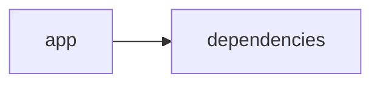

# Documentación del Proyecto

## Guía de Usuario
# Guía de Usuario

Bienvenido a tu herramienta para análisis y procesamiento de información. Esta guía te ayudará a conocer, usar y sacar el máximo provecho a la aplicación de forma sencilla y práctica.

---

## 📱 ¿Qué es esta aplicación?

- **Propósito principal**:  
  Facilitar el análisis y la extracción de información clave de archivos PDF, conversaciones y opiniones, utilizando inteligencia artificial para ofrecer resultados claros y accionables.

- **Problema que resuelve**:  
  Ayuda a interpretar grandes volúmenes de información (documentos, conversaciones y opiniones de clientes) de forma rápida y precisa, permitiéndote identificar tendencias, sentimientos y detalles importantes.

- **Beneficios clave**:  
  • Ahorro de tiempo en el procesamiento y análisis de documentos.  
  • Interpretación automatizada de conversaciones y opiniones.  
  • Confiabilidad y precisión en el análisis de sentimientos, emociones y Voz del Cliente (VoC).

- **Audiencia objetivo**:  
  Profesionales, analistas y equipos de atención al cliente que necesiten transformar grandes volúmenes de datos en insights útiles para la toma de decisiones.

---

## ✨ Funcionalidades Principales

### Interfaz Web Interactiva con Streamlit
- **¿Qué hace?**:  
  Proporciona una plataforma visual e intuitiva para interactuar con la aplicación y sus funcionalidades, facilitando la navegación y el uso.

- **¿Cuándo usarla?**:  
  Siempre que necesites realizar análisis o cargar documentos; su diseño te guía en cada paso.

- **¿Cómo acceder?**:  
  Abre la aplicación en tu navegador web; la interfaz se carga automáticamente mostrando las opciones disponibles.

- **Resultado esperado**:  
  Una pantalla amigable con menús y botones claros para iniciar procesos y ver resultados.

### Procesamiento de Archivos PDF
- **¿Qué hace?**:  
  Permite cargar y leer archivos PDF para extraer el contenido de texto que será procesado y analizado.

- **¿Cuándo usarla?**:  
  Cuando necesites analizar información contenida en documentos PDF, como reportes, informes o manuales.

- **¿Cómo acceder?**:  
  Selecciona la opción "Cargar PDF" en la interfaz, elige el archivo desde tu dispositivo y presiona "Procesar".

- **Resultado esperado**:  
  El sistema mostrará el contenido extraído y listo para ser analizado en las siguientes funcionalidades.

### Análisis con Modelos de Lenguaje (IA)
- **¿Qué hace?**:  
  Utiliza inteligencia artificial para interpretar y extraer conclusiones del texto procesado, identificando temas, palabras clave y patrones.

- **¿Cuándo usarla?**:  
  Ideal para obtener un resumen automático o insights sobre documentos y textos largos.

- **¿Cómo acceder?**:  
  Una vez procesado el PDF o cargado el texto, selecciona la opción "Analizar con IA" y espera unos segundos a que se genere el análisis.

- **Resultado esperado**:  
  Un resumen o reporte con los principales temas, palabras clave y conclusiones extraídas del contenido.

### Análisis de Conversaciones
- **¿Qué hace?**:  
  Examina diálogos y registros de conversación para identificar patrones, temas recurrentes y comportamientos en la comunicación.

- **¿Cuándo usarla?**:  
  Útil en el análisis de interacciones en centros de atención al cliente o en redes sociales.

- **¿Cómo acceder?**:  
  Ingresa el registro o transcripción de la conversación en el espacio asignado y haz clic en "Analizar Conversación".

- **Resultado esperado**:  
  Un informe que resalta los puntos clave, respuestas frecuentes y posibles áreas de mejora en la comunicación.

### Análisis de Sentimientos y Emociones
- **¿Qué hace?**:  
  Detecta el tono y las emociones expresadas en textos o conversaciones, indicando si la percepción es positiva, negativa o neutral.

- **¿Cuándo usarla?**:  
  Cuando desees conocer cómo se sienten los clientes o usuarios respecto a un servicio, producto o tema específico.

- **¿Cómo acceder?**:  
  Después de procesar un texto o conversación, selecciona la opción "Analizar Sentimientos" y espera el resultado.

- **Resultado esperado**:  
  Un gráfico o resumen que muestra la distribución de sentimientos y una breve interpretación de los resultados.

### Análisis de Voz del Cliente (VoC)
- **¿Qué hace?**:  
  Se enfoca en captar y analizar la retroalimentación directa del cliente para identificar fortalezas, áreas de mejora y oportunidades estratégicas.

- **¿Cuándo usarla?**:  
  Ideal para equipos de marketing, ventas y atención al cliente que busquen mejorar la experiencia de usuario a través de la retroalimentación.

- **¿Cómo acceder?**:  
  Selecciona la opción "Análisis VoC" en la interfaz, ingresa la retroalimentación o carga el archivo correspondiente y ejecuta el análisis.

- **Resultado esperado**:  
  Un reporte con insights claros y accionables sobre lo que los clientes valoran o desean mejorar en el servicio/producto ofrecido.

---

## 🚀 Cómo Empezar

### Primer Uso

1. **Requisitos previos**:  
   - Disponer de un navegador web actualizado.
   - Tener los archivos PDF o conversaciones que deseas analizar, ya sea en tu dispositivo o en formato digital.

2. **Acceso inicial**:  
   - Ingresa a la URL de la aplicación en tu navegador.
   - La página de inicio te ofrecerá un recorrido rápido por las opciones disponibles.

3. **Configuración básica** (si aplica):  
   - Selecciona el idioma de preferencia y revisa las opciones de visualización.
   - No se requiere configuración técnica adicional.

4. **Primera tarea recomendada**:  
   - Carga un archivo PDF sencillo que contenga texto claro y realiza el primer análisis con IA para familiarizarte con el proceso.

### Flujo Típico de Uso

1. **Paso 1**:  
   Accede a la interfaz web de la aplicación y elige la opción que deseas utilizar (por ejemplo, "Cargar PDF").

2. **Paso 2**:  
   Sube el archivo o introduce el texto/conversación que quieras analizar. Explora las funcionalidades que te guían en el proceso.

3. **Paso 3**:  
   Revisa el informe o los resultados generados por la aplicación. Si es necesario, ajusta filtros o vuelve a procesar el documento para obtener información más detallada.

---

## 💡 Casos de Uso Comunes

### Escenario 1: Análisis de Reportes de Ventas
**Situación**:  
Necesitas extraer insights de un informe de ventas en PDF para detectar tendencias y áreas de mejora.

**Pasos**:  
1. Carga el archivo PDF en la aplicación.  
2. Ejecuta el análisis con modelos de lenguaje para extraer palabras clave y temas.  
3. Revisa el resumen y actúa en base a los insights obtenidos.

### Escenario 2: Evaluación de Conversaciones de Atención al Cliente
**Situación**:  
Deseas mejorar la calidad del servicio al cliente analizando las interacciones directas.

**Pasos**:  
1. Ingresa o sube las transcripciones de las conversaciones.  
2. Utiliza la funcionalidad "Analizar Conversación" para detectar temas y patrones.  
3. Revisa el informe para identificar áreas de mejora en la comunicación del equipo.

### Escenario 3: Medición del Sentimiento del Cliente en Redes Sociales
**Situación**:  
Quieres conocer cómo se sienten los usuarios acerca de un nuevo producto.

**Pasos**:  
1. Recopila comentarios y opiniones en texto.  
2. Utiliza la opción "Analizar Sentimientos" para procesar los datos.  
3. Observa el gráfico de sentimientos y utiliza la información para afinar estrategias de marketing.

### Escenario 4: Recopilación y Evaluación de la Voz del Cliente (VoC)
**Situación**:  
Necesitas recoger y analizar la retroalimentación directa de tus clientes para ajustar tu servicio.

**Pasos**:  
1. Ingresa la retroalimentación de los clientes o carga los archivos correspondientes.  
2. Ejecuta la funcionalidad "Análisis VoC".  
3. Analiza el reporte y diseña planes de acción basados en la información obtenida.

---

## ❓ Preguntas Frecuentes

**P: ¿Cómo cargo mis archivos PDF en la aplicación?**  
R: Solo debes hacer clic en la opción "Cargar PDF" en la interfaz, seleccionar el archivo de tu dispositivo y presionar "Procesar". La aplicación extraerá y mostrará el contenido.

**P: ¿Qué hago si el análisis con IA no me genera resultados claros?**  
R: Revisa que el texto del documento esté correctamente formateado y, si persiste el problema, vuelve a cargar el archivo o prueba con otro documento. Asegúrate de seguir los pasos indicados en la guía.

**P: ¿Es seguro usar esta herramienta para analizar la Voz del Cliente?**  
R: Sí, la aplicación está diseñada para manejar tu información con altos estándares de seguridad y privacidad, asegurando que tus datos se procesen de forma confidencial.

**P: ¿Cuáles son las limitaciones principales?**  
R: La herramienta se centra en el análisis de información textual. No puede procesar otros tipos de archivos (como imágenes sin texto) ni reemplazar el juicio humano en decisiones críticas.

---

## 🆘 Solución de Problemas

### Problema: El archivo PDF no se carga correctamente
**Síntomas**:  
- La aplicación muestra un mensaje de error o no se visualiza el documento completo.

**Causa probable**:  
- El archivo puede estar dañado o no ser compatible.

**Solución**:  
1. Verifica que el PDF esté completo y no dañado.  
2. Asegúrate de que el archivo tenga texto seleccionable (no imágenes escaneadas sin OCR).  
3. Vuelve a cargar el documento siguiendo las instrucciones de "Cargar PDF".

---

### Problema: El análisis con IA se demora demasiado
**Síntomas**:  
- La respuesta tarda en generarse o se queda cargando.

**Causa probable**:  
- Pueden existir muchos datos o una conexión lenta.

**Solución**:  
1. Prueba con un documento más corto para verificar el funcionamiento.  
2. Revisa tu conexión a internet y asegúrate de tener una red estable.  
3. Si el problema persiste, recarga la página y vuelve a intentarlo.

---

### Problema: No aparecen resultados en el análisis de conversaciones o sentimientos
**Síntomas**:  
- Los informes llegan vacíos o sin información relevante.

**Causa probable**:  
- El texto ingresado podría no contener suficiente información o estar mal formateado.

**Solución**:  
1. Asegúrate de que la transcripción o comentario tenga contenido claro y estructurado.  
2. Verifica que estés utilizando la funcionalidad correcta para el tipo de análisis que necesitas.  
3. Si persiste, consulta el apartado de Preguntas Frecuentes o contacta soporte.

---

## 📞 Soporte y Contacto

- **¿Necesitas ayuda adicional?**  
  Puedes contactar al equipo de soporte a través del correo: soporte@tuaplicacion.com

- **¿Encontraste un error?**  
  Utiliza la opción "Reportar un error" en la aplicación o envía un correo a: errores@tuaplicacion.com

- **¿Tienes sugerencias?**  
  ¡Nos encanta escuchar tu opinión! Envíanos tus sugerencias y feedback a: feedback@tuaplicacion.com

---

Esta guía está diseñada para que, sin necesidad de conocimientos técnicos, puedas aprovechar al máximo cada funcionalidad de la aplicación. Disfruta de una experiencia sencilla y productiva en el análisis y procesamiento de información. ¡Bienvenido!

## Documentación Técnica
A continuación se muestra la documentación técnica completa en Markdown, organizada según la estructura requerida y basada en el análisis del código y la información disponible del repositorio.

------------------------------------------------------------

# Documentación Técnica

Esta documentación está orientada a desarrolladores y profesionales interesados en comprender, mantener y extender la aplicación VoC Analyst. Se detalla la arquitectura general, el stack tecnológico, los componentes principales, las “APIs internas” (funciones clave) y la guía de desarrollo, así como la descripción necesaria para la correcta utilización y personalización del sistema.

------------------------------------------------------------

## 🏗️ Arquitectura del Sistema

- **Patrón arquitectónico utilizado:**  
  La aplicación adopta una arquitectura modular monolítica “híbrida”, en la que se integran la interfaz de usuario (Frontend) y el procesamiento/negocio (Backend) en una única aplicación. La UI se implementa con Streamlit, mientras que el procesamiento de archivos, extracción de texto y la integración con modelos de lenguaje (LLM) se realizan en módulos internos.

- **Diagrama de componentes:**  
  A continuación se presenta un diagrama Mermaid que resume la relación entre las principales partes de la aplicación:

  ```mermaid
  graph LR
      A[Aplicación Streamlit] --> B[Procesamiento de Archivos]
      A --> C[Estado de Sesión y UI]
      B --> D[Extracción de Texto (PyPDF2)]
      B --> E[Validación de Archivos]
      A --> F[LLMBackend]
      F --> G[ModelConfig & Clientes LLM]
      B --> H[Parser de Conversaciones]
  ```

  - **A:** Representa la UI desarrollada con Streamlit.
  - **B:** Componente responsable de la extracción y validación de archivos.
  - **C:** Gestión del estado de sesión (st.session_state) para almacenar resultados, IDs y datos de archivos.
  - **D y E:** Funciones de extracción (usando PyPDF2) y validación (tamaño, etc.) de archivos.
  - **F y G:** El módulo LLMBackend plantea la abstracción para comunicarse con distintos proveedores de LLM mediante la configuración (ModelConfig).
  - **H:** Módulo de parser y análisis que se encarga de normalizar las conversaciones, segmentar mensajes y redactar información sensible.

- **Flujo de datos principal entre componentes:**  
  1. El usuario carga uno o varios archivos (preferiblemente PDF) mediante la interfaz Streamlit.  
  2. Se ejecutan funciones de validación (por ejemplo, `validate_file_size`) y extracción de texto (con `extract_text_from_pdf` utilizando PyPDF2).  
  3. El texto extraído se procesa, en algunos casos pasando por un parser que segmenta la conversación, identifica metadatos y redacta PII (información sensible).  
  4. La capa de negocio utiliza el módulo LLMBackend, que mediante la configuración (ModelConfig) y las funciones _load_parse_prompt/_load_analyze_prompt, envía el contenido a los proveedores LLM (OpenAI, Anthropic, Gemini) para análisis avanzado (resumen, detección de temas, sentimiento, recomendaciones, etc.).  
  5. Los resultados se almacenan en st.session_state y se muestran en la interfaz (paneles de KPIs, gráficas de temas, asignación de mensajes, exportación de resultados, etc.).

- **Dependencias críticas y su propósito:**  
  - **Streamlit:** Facilita la creación de una interfaz web interactiva y la gestión del estado de la sesión.  
  - **PyPDF2:** Se utiliza para interpretar y extraer el contenido textual de documentos PDF.  
  - **Pandas:** Permite la manipulación y visualización tabular de datos, útil para mostrar resúmenes y tablas de análisis.  
  - **LLM SDKs (openai, anthropic, google-genai):** Estas librerías permiten la integración con servicios de modelos de lenguaje e inteligencia artificial, responsables del procesamiento semántico y la generación de insights a partir del contenido textual.

------------------------------------------------------------

## 📋 Stack Tecnológico

- **Lenguajes:**  
  Principalmente Python (interpretable como “other” en la clasificación del repositorio).

- **Frameworks y Librerías:**  
  - **Streamlit:** (>=1.49.1) para la creación de la interfaz web interactiva.  
  - **PyPDF2:** (>=3.0.1) para la extracción de texto desde archivos en PDF.  
  - **Pandas:** (>=2.3.2) para el manejo de datos y la presentación a través de dataframes.  
  - **LLM SDKs:**  
    - `openai`: para la integración con modelos de OpenAI.  
    - `anthropic`: para conectar con proveedores de Anthropic.  
    - `google-genai`: para la integración con Google GenAI (Gemini).  
  - Otras librerías estándar: `json`, `os`, `time`, `uuid`, `zipfile`, `io`, y `typing`.

- **Base de datos:**  
  No se utiliza una base de datos relacional; el procesamiento y almacenamiento de datos se realiza de forma transitoria mediante st.session_state.

- **APIs externas:**  
  Se integran servicios externos mediante llamadas a APIs de proveedores LLM, tales como OpenAI, Anthropic y Google GenAI.

- **Infraestructura:**  
  La aplicación se despliega como una aplicación web simple (puede ejecutarse localmente, en servidores o en contenedores Docker) mediante Streamlit.

------------------------------------------------------------

## 🔧 Componentes Principales

### 1. Aplicación Streamlit

- **Propósito:**  
  Gestionar la interfaz de usuario, la carga de archivos, la visualización de resultados y el estado de la sesión.

- **Ubicación:**  
  Principalmente en el archivo de entrada (por ejemplo, `app.py`) y módulos auxiliares en el directorio `app/`.

- **Interfaces:**  
  - Configuración de la página mediante `st.set_page_config`.  
  - Uso de `st.session_state` para almacenar variables como:
    - `analysis_results`: Resultados obtenidos del análisis.
    - `run_id`: Identificador único de la ejecución.
    - `uploaded_files_data`: Datos y metadatos de los archivos subidos.
    - `processing_complete`: Indicador del estado final del procesamiento.
  - Funciones auxiliares:
    - `extract_text_from_pdf(pdf_file) → str`: Extrae el contenido textual de un PDF.  
    - `validate_file_size(file) → bool`: Valida que el tamaño del archivo no supere los 100 MB.

- **Dependencias:**  
  Requiere Streamlit, PyPDF2 y Pandas para su funcionamiento.

---

### 2. Módulo LLMBackend

- **Propósito:**  
  Gestionar la integración con proveedores de modelos de lenguaje (LLM) y enviar solicitudes para analizar el texto extraído.

- **Ubicación:**  
  En el archivo `llm_backend.py`.

- **Interfaces / Métodos Expuestos:**
  - **ModelConfig:**  
    Una clase de configuración que incluye campos como:
    - `provider`: Proveedor (ej. "openai", "anthropic", "gemini").
    - `model`: Modelo específico a utilizar.
    - `api_key`: Clave para la autenticación.
    - `max_retries` y `retry_delay`: Parámetros para reintentos en caso de fallo.
  - **LLMBackend:**  
    Métodos clave:
    - `__init__(config: ModelConfig)`: Inicializa la conexión y carga los prompts.
    - `_initialize_client()`: Selecciona e instancia el cliente adecuado basado en el proveedor.
    - `_load_parse_prompt()` y `_load_analyze_prompt()`: Cargan los prompts necesarios para el parseo y análisis.
    - `analyze_text(text: str) → Dict[str, Any]`: Envía el texto a analizar y devuelve los insights generados por el modelo LLM.

- **Dependencias:**  
  Utiliza las librerías específicas para cada proveedor (openai, anthropic, google-genai).

---

### 3. Procesamiento y Extracción de Archivos

- **Propósito:**  
  Gestionar la carga, validación y extracción de texto de archivos, enfocado principalmente en archivos PDF.

- **Funciones Clave:**
  - `extract_text_from_pdf(pdf_file) → str`:  
    Recorrido de cada página del PDF para extraer el contenido.  
    Incluye manejo de errores a través de bloques try/except y notificación al usuario.
  - `validate_file_size(file) → bool`:  
    Verifica que el tamaño del archivo no exceda 100 MB (se usa la búsqueda de la posición final del puntero).

---

### 4. Parser y Análisis de Conversaciones

- **Propósito:**  
  Procesar el contenido textual extraído para:
  - Normalizar la conversación.
  - Extraer metadatos (por ejemplo, `conversation_id`, timestamps, roles de los interlocutores).
  - Redactar información sensible (PII) reemplazándola por etiquetas estándar (ej. [EMAIL], [PHONE], [CARD], [ID]).

- **Implementación:**  
  Se aplican técnicas de procesamiento de lenguaje natural (NLP) para segmentar el texto, identificar patrones y generar un JSON estructurado que será utilizado para generar insights y visualizaciones.

---

## 🚀 APIs y Endpoints

**Nota:** Aunque la aplicación no expone endpoints REST, cuenta con “APIs internas” (funciones) que permiten la orquestación del flujo de procesamiento y análisis:

- **Función:** `extract_text_from_pdf(pdf_file) → str`  
  Extrae el contenido textual de un archivo PDF usando PyPDF2, notificando errores a través de la interfaz de Streamlit.

- **Función:** `validate_file_size(file) → bool`  
  Comprueba que el tamaño del archivo subido sea menor a 100 MB.

- **Método:** `LLMBackend.analyze_text(text: str) → Dict[str, Any]`  
  Envía el contenido textual a través del modelo LLM configurado y devuelve un diccionario con los resultados del análisis (por ejemplo, insights, resumen, puntuaciones de sentimiento, temas, etc.).

- **Parser de Conversaciones:**  
  Función o conjunto de funciones que segmentan la entrada en turnos de conversación, identifican metadatos y transforman el texto en un formato estructurado.

------------------------------------------------------------

## 💾 Modelo de Datos

- **Entidades Principales:**
  - **Conversación:**  
    Representada en un JSON estructurado con campos como:
    - `conversation_id`: Identificador único.
    - `messages`: Lista de mensajes, cada uno con:
      - `sender`: Rol del emisor (cliente, agente o desconocido).
      - `timestamp`: Momento en que se envió el mensaje.
      - `content`: Texto del mensaje (con PII redactada).
      - `metadata`: Datos adicionales (canal, duración, etc.).

- **Esquemas de Entrada y Salida:**  
  - **Entrada:** Documentos PDF o cadenas de texto a analizar.
  - **Salida:** Estructuras JSON que agrupan mensajes, insights, temas y recomendaciones.

- **Validaciones y Transformaciones:**  
  - Validar que el texto no esté vacío y se pueda procesar correctamente.  
  - Redactar información sensible utilizando patrones (regex) para reemplazar datos como emails, teléfonos, etc.

------------------------------------------------------------

## 🛠️ Guía de Desarrollo

### Configuración del Entorno

1. **Prerrequisitos:**  
   - Python 3.8 o superior.
   - Acceso a Internet para la comunicación con APIs externas de LLM (si se utiliza en modo producción).

2. **Instalación:**
   - Clonar el repositorio:
     ```bash
     git clone https://github.com/tu_usuario/VoC-Analyst.git
     cd VoC-Analyst
     ```
   - Crear y activar un entorno virtual:
     ```bash
     python -m venv venv
     source venv/bin/activate    # En Linux/Mac
     venv\Scripts\activate       # En Windows
     ```
   - Instalar las dependencias:
     ```bash
     pip install -r requirements.txt
     ```

3. **Variables de Entorno:**  
   - Configura las variables (por ejemplo, `OPENAI_API_KEY`, `ANTHROPIC_API_KEY`, `GEMINI_API_KEY`) para el uso seguro de las APIs de LLM.
   
---

### Estructura del Código

El repositorio se organiza generalmente en la siguiente estructura:

```
VoC-Analyst/
├── app/
│   ├── app.py                # Punto de entrada de la aplicación (interfaz Streamlit)
│   ├── parser.py             # Funciones para parsear y analizar conversaciones
│   └── utils.py              # Utilidades (extracción de texto, validación, etc.)
├── llm_backend.py            # Módulo para integración y configuración de proveedores LLM
├── requirements.txt          # Lista de dependencias
└── README.md                 # Documentación general
```

---

### Estándares de Código y Patrones Recomendados

- **Convenciones de Naming:**  
  Se recomienda utilizar nombres descriptivos en minúsculas y guiones bajos para funciones y archivos (por ejemplo, `extract_text_from_pdf`).

- **Patrones de Diseño:**  
  Se sigue un enfoque modular en la separación de la lógica de UI (Streamlit) y la lógica de negocio (LLMBackend, Parser).  
  Se recomienda inyectar configuraciones (por ejemplo, ModelConfig) para mantener la flexibilidad y la escalabilidad del sistema.

- **Estrategia de Testing:**  
  Implementar pruebas unitarias y de integración utilizando frameworks como pytest para:
  - Validar la extracción de texto.
  - Probar la validación del tamaño de archivos.
  - Simular peticiones al módulo LLMBackend y asegurar la correcta gestión de reintentos y respuestas.
  
---

## 🔍 Puntos de Atención

- **Limitaciones Conocidas:**
  - La aplicación depende de la capacidad de extracción de texto de archivos PDF; documentos basados en imágenes pueden requerir OCR.
  - Los análisis realizados por modelos de lenguaje pueden depender de la calidad y claridad del texto extraído.
  
- **Consideraciones de Rendimiento:**
  - Procesar archivos muy grandes (cercanos a 100MB) puede ralentizar la aplicación.
  - Es recomendable implementar procesamiento en lote o caching para análisis repetitivos.

- **Aspectos de Seguridad:**
  - Proteger las API keys utilizando variables de entorno.
  - Redactar información sensible (PII) antes de enviar datos a proveedores externos.

- **TODOs y Mejoras Sugeridas:**
  - Ampliar soporte a otros formatos de archivo (por ejemplo, TXT).
  - Integrar OCR para PDFs basados en imágenes.
  - Implementar una capa de caching para mejorar el rendimiento de análisis repetitivos.
  
---

## Diagrama de Dependencias

El siguiente diagrama Mermaid resume la interacción y relaciones entre los componentes principales del sistema:

```mermaid
graph LR
    A[Aplicación Streamlit] --> B[Procesamiento e Extracción de Archivos]
    A --> C[Estado de Sesión y UI]
    B --> D[Funciones: extract_text_from_pdf, validate_file_size]
    A --> E[LLMBackend]
    E --> F[ModelConfig y Clientes LLM (OpenAI, Anthropic, Gemini)]
    B --> G[Parser de Conversaciones y Redacción de PII]
```

---

## 🔧 Guía de Desarrollo (Resumen)

1. **Configuración del Entorno:**  
   Clona el repositorio, activa el entorno virtual e instala las dependencias.

2. **Ejecución de la Aplicación:**  
   Ejecuta `streamlit run app/app.py` para iniciar la interfaz.

3. **Extensión y Configuración:**  
   - Modifica `llm_backend.py` para integrar nuevos proveedores o ajustar los prompts de análisis.  
   - Actualiza el modelo y la configuración mediante la clase ModelConfig.

4. **Testing y Validación:**  
   Implementa y ejecuta pruebas unitarias con pytest para funciones críticas; asegúrate de que la UI refleje correctamente el estado.

5. **Mantenimiento y Buenas Prácticas:**  
   Siguiendo el enfoque modular y documentando cada cambio, se facilita la colaboración y la escalabilidad del proyecto.

------------------------------------------------------------

## Guía de Usuario

Esta guía de usuario está diseñada para el uso final de la aplicación, explicando paso a paso cómo interactuar con la herramienta.

### 1. Acceso a la Aplicación

- Abre tu navegador web y accede a la URL asignada (por ejemplo, http://localhost:8501 si ejecutas la aplicación localmente).

### 2. Carga del Archivo PDF

- En la pantalla principal, utiliza el botón “Cargar Archivo” para seleccionar el documento PDF que deseas analizar.
- Una vez seleccionado, la aplicación iniciará un proceso de extracción de texto y validación del tamaño.

### 3. Ejecución del Análisis

- Tras la carga, puedes iniciar el análisis haciendo clic en “Analizar con LLM”. (Nota: se requiere proporcionar una API key válida para acceder a los modelos LLM.)
- La aplicación procesará el contenido:
  - Extraerá el texto del PDF.
  - Aplicará el parser para segmentar la conversación y redactar la información sensible.
  - Enviará el contenido al proveedor LLM configurado para que genere insights (resúmenes, detección de temas, análisis de sentimiento y recomendaciones).

### 4. Visualización de Resultados

- Una vez finalizado el análisis, se mostrarán los resultados en diferentes secciones:
  - Indicadores clave (KPIs) como Net Promoter Score (NPS), CSAT y puntajes de sentimiento.
  - Temas descubiertos, listados en tablas y secciones expandibles que muestran descripciones y resúmenes.
  - Asignación de mensajes, donde se muestran extractos de la conversación junto con la clasificación de sentimientos.
  
### 5. Exportación de Resultados

- La interfaz permite exportar los resultados completos en formatos como JSON o CSV para uso externo o análisis adicional.

### Preguntas Frecuentes (FAQ)

**¿Qué tipos de archivos puedo procesar?**  
Actualmente, la herramienta soporta archivos PDF con texto seleccionable. Se evaluará el soporte para otros formatos en futuras versiones.

**¿Necesito conocimientos técnicos para usar la aplicación?**  
No. La interfaz es intuitiva y cuenta con instrucciones claras para cada paso. Cualquier usuario podrá cargar documentos y visualizar los resultados sin necesidad de conocimientos avanzados.

**¿Cómo se protege la privacidad de mi información?**  
Los documentos se procesan de manera local o en entornos seguros y la información sensible se redirige mediante técnicas de redacción antes de enviarla a modelos externos.

**¿Qué hago si el análisis falla o se muestra un error?**  
Verifica que el archivo PDF esté en buen estado. Si el problema persiste, consulta la sección de soporte o contacta al equipo técnico para asistencia.

------------------------------------------------------------

## Conclusión

Esta documentación técnica y la guía de usuario tienen como objetivo proporcionar una visión completa del sistema VoC Analyst, abarcando tanto aspectos de desarrollo como de uso final. Gracias a su arquitectura modular y la integración con modelos de lenguaje, la aplicación permite extraer insights valiosos a partir de interacciones y documentos, facilitando la toma de decisiones y el análisis de la voz del cliente.

Para dudas, mejoras o contribuciones, se recomienda revisar el código fuente y consultar la sección de issues del repositorio.

------------------------------------------------------------

## Diagrama del Sistema



------------------------------------------------------------

Happy Coding!  
¡Buena suerte y que disfrutes de una experiencia de análisis poderosa y eficiente con VoC Analyst!


## Diagrama

