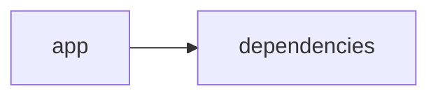

# Documentación del Proyecto

## Guía de Usuario
# Guía de Usuario

Bienvenido a esta guía diseñada para ayudarte a sacar el máximo provecho de nuestra herramienta de análisis y procesamiento de información. Aquí encontrarás información amigable y pasos claros para comenzar a trabajar con la aplicación.

---

## 📱 ¿Qué es esta aplicación?

- **Propósito principal**:  
  Esta aplicación facilita el análisis y procesamiento de información a través de una interfaz web interactiva. Permite cargar archivos PDF, analizarlos usando modelos de lenguaje basados en inteligencia artificial y extraer insights de conversaciones, sentimientos, emociones y la Voz del Cliente (VoC).  

- **Problema que resuelve**:  
  Ayuda a empresas y profesionales que necesitan procesar grandes volúmenes de información textual de manera rápida y precisa, extrayendo datos relevantes para la toma de decisiones, sin la necesidad de conocimientos técnicos avanzados.

- **Beneficios clave**:  
  • Obtén resúmenes y análisis profundos de documentos PDF y conversaciones.  
  • Detecta sentimientos y emociones presentes en los textos.  
  • Analiza la Voz del Cliente para comprender mejor las necesidades y opiniones de tus usuarios.  
  • Interfaz intuitiva que hace todo el proceso sencillo y accesible.

- **Audiencia objetivo**:  
  Profesionales, equipos de atención al cliente, analistas de datos y empresas que requieran profundizar en el contenido de documentos y conversaciones para optimizar estrategias y mejorar la experiencia del usuario.

---

## ✨ Funcionalidades Principales

### Interfaz Web Interactiva (Streamlit)
- **¿Qué hace?**:  
  Proporciona una experiencia visual e interactiva para navegar por todas las funciones de la aplicación de forma sencilla y accesible.
  
- **¿Cuándo usarla?**:  
  Cada vez que necesites analizar documentos o revisar resultados de análisis, esta interfaz será tu punto de acceso principal para interactuar con la herramienta.

- **¿Cómo acceder?**:  
  1. Abre tu navegador web.  
  2. Ingresa la URL proporcionada para la aplicación.  
  3. Interactúa con los menús y secciones disponibles.
  
- **Resultado esperado**:  
  Una pantalla limpia y organizada con botones y opciones que te permiten cargar archivos, elegir análisis y visualizar resultados de manera inmediata.

---

### Procesamiento de Archivos PDF
- **¿Qué hace?**:  
  Permite cargar archivos PDF y extraer el contenido textual necesario para el análisis posterior.
  
- **¿Cuándo usarla?**:  
  Utilízala cuando dispongas de documentos en formato PDF que necesites analizar o extraer información relevante.
  
- **¿Cómo acceder?**:  
  1. Dentro de la interfaz principal, selecciona la opción “Cargar PDF”.  
  2. Elige el archivo PDF desde tu dispositivo.  
  3. Confirma la carga para iniciar su procesamiento.
  
- **Resultado esperado**:  
  Visualización del contenido del PDF en la aplicación, listo para ser analizado o convertido en insights.

---

### Análisis con Modelos de Lenguaje (IA)
- **¿Qué hace?**:  
  Emplea inteligencia artificial para analizar y extraer patrones, temas y respuestas significativas del contenido textual.
  
- **¿Cuándo usarla?**:  
  Cuando desees obtener un entendimiento más profundo del contenido, identificar temas recurrentes o resumir grandes volúmenes de texto.
  
- **¿Cómo acceder?**:  
  1. Luego de cargar un documento PDF o texto, selecciona la opción “Análisis IA”.  
  2. Configura los parámetros del análisis si lo deseas.  
  3. Inicia el análisis y espera a que se muestren los resultados.
  
- **Resultado esperado**:  
  Un informe resumido con insights, temas detectados y patrones relevantes extraídos del texto analizado.

---

### Análisis de Conversaciones
- **¿Qué hace?**:  
  Examina registros de conversaciones (chat, correos, foros) para identificar interacciones, temas y patrones en la comunicación.
  
- **¿Cuándo usarla?**:  
  Al analizar diálogos o comunicaciones de equipos y clientes para comprender mejor el flujo de comunicación y detectar áreas de mejora.
  
- **¿Cómo acceder?**:  
  1. Selecciona “Análisis de Conversaciones” en la interfaz.  
  2. Carga o introduce el contenido de la conversación.  
  3. Ejecuta el análisis y revisa los insights.
  
- **Resultado esperado**:  
  Visualización de los componentes clave de la conversación, destacando temas y patrones de comunicación.

---

### Análisis de Sentimientos y Emociones
- **¿Qué hace?**:  
  Evalúa el contenido textual para determinar el tono emocional y los sentimientos expresados (positivo, negativo, neutral).
  
- **¿Cuándo usarla?**:  
  Es útil cuando necesitas entender la reacción emocional de los usuarios, clientes o del público objetivo a un tema o producto.
  
- **¿Cómo acceder?**:  
  1. Tras cargar un texto o conversación, selecciona la opción “Análisis de Sentimientos”.  
  2. Configura el análisis si es necesario.  
  3. Inicia el proceso y revisa los resultados.
  
- **Resultado esperado**:  
  Un reporte gráfico y resumido que muestra la distribución de sentimientos y emociones a lo largo del documento o conversación analizada.

---

### Análisis de Voz del Cliente (VoC)
- **¿Qué hace?**:  
  Extrae y analiza las opiniones y comentarios de los clientes para ofrecer una visión clara de las percepciones y necesidades del público.
  
- **¿Cuándo usarla?**:  
  Cuando necesites conocer en detalle qué opinan tus clientes de tus productos/servicios, y detectar áreas de mejora o tendencias en el feedback.
  
- **¿Cómo acceder?**:  
  1. Dirígete a la sección “Voz del Cliente” en la interfaz.  
  2. Carga los datos de feedback o conecta la fuente de comentarios.  
  3. Ejecuta el análisis y revisa los insights.
  
- **Resultado esperado**:  
  Un informe que resalta los comentarios más recurrentes, puntos de dolor y aspectos positivos valorados por los clientes.

---

## 🚀 Cómo Empezar

### Primer Uso
1. **Requisitos previos**:  
   - Conexión estable a internet.  
   - Navegador web actualizado.  
   - Documentos PDF o textos listos para analizar (si ya tienes datos a la mano).

2. **Acceso inicial**:  
   - Ingresa a la URL de la aplicación en tu navegador.  
   - Si es necesario, crea una cuenta o inicia sesión.

3. **Configuración básica**:  
   - Familiarízate con el menú principal y las opciones de carga de documentos.  
   - Configura los parámetros de análisis (opcional) según tu preferencia.

4. **Primera tarea recomendada**:  
   - Carga un archivo PDF y prueba el “Análisis IA” para ver cómo se transforma el contenido en insights útiles.

---

### Flujo Típico de Uso
1. **Paso 1**:  
   Ingresa a la interfaz web y selecciona la opción para cargar un PDF o texto.

2. **Paso 2**:  
   Una vez cargado el contenido, elige el tipo de análisis que deseas (IA, conversaciones, sentimientos o VoC).

3. **Paso 3**:  
   Revisa el informe generado en pantalla, que incluirá resúmenes, gráficos y puntos destacados del análisis realizado.

---

## 💡 Casos de Uso Comunes

### Escenario 1: Análisis de Reportes de Clientes
**Situación**: Necesitas identificar áreas de mejora y aspectos destacados en el feedback recibido de los clientes.  
**Pasos**: 
1. Carga los documentos PDF o registros de conversaciones con clientes.  
2. Selecciona "Análisis de Voz del Cliente" y "Análisis de Sentimientos".  
3. Revisa el informe para detectar opiniones recurrentes y emociones predominantes.

### Escenario 2: Evaluación de Comunicaciones Internas
**Situación**: Quieres mejorar la comunicación dentro de tu equipo.  
**Pasos**: 
1. Ingresa a la opción "Análisis de Conversaciones".  
2. Sube el registro de chats o correos internos.  
3. Identifica patrones y temas comunes para tomar medidas de mejora.

### Escenario 3: Resumen Automático de Documentos
**Situación**: Tienes varios reportes y documentos largos y necesitas un resumen rápido.  
**Pasos**: 
1. Carga cada documento PDF en la sección correspondiente.  
2. Selecciona "Análisis IA" para que el sistema resuma la información.  
3. Utiliza el resumen generado para reuniones o informes ejecutivos.

---

## ❓ Preguntas Frecuentes

**P: ¿Cómo puedo cargar un archivo PDF para su análisis?**  
R: Desde el menú principal, selecciona "Cargar PDF", busca el archivo en tu dispositivo y confirma la carga. El contenido se mostrará en pantalla listo para ser analizado.

**P: ¿Qué hago si el análisis no muestra resultados?**  
R: Verifica que el documento haya sido cargado correctamente. Si el problema persiste:
   1. Revisa tu conexión a internet.
   2. Intenta recargar la página.
   3. Consulta la sección de solución de problemas.

**P: ¿Es seguro subir mis documentos a la plataforma?**  
R: Sí. La aplicación utiliza protocolos de seguridad y encriptación para proteger tus datos y garantizar la confidencialidad de la información.

**P: ¿Cuáles son las limitaciones principales?**  
R:  
- No se recomienda cargar documentos en formatos distintos a PDF para el procesamiento.  
- Los análisis son tan precisos como la calidad del contenido proporcionado; textos con errores o poco claros pueden afectar los resultados.  
- No sustituye el análisis humano en casos complejos que requieran interpretación contextual profunda.

---

## 🆘 Solución de Problemas

### Problema: El PDF no se carga
**Síntomas**:  
- La aplicación muestra un mensaje de error o no reconoce el archivo.

**Causa probable**:  
- El archivo puede estar corrupto o en un formato incompatible.

**Solución**:  
1. Verifica que el archivo esté en formato PDF y que no esté dañado.  
2. Intenta cargar otro documento para descartar problemas específicos del archivo.

---

### Problema: Los resultados del análisis son lentos o incompletos
**Síntomas**:  
- El proceso de análisis se interrumpe o dura más de lo esperado.

**Causa probable**:  
- Conexión a internet inestable o archivos demasiado extensos.

**Solución**:  
1. Asegúrate de tener una conexión estable.  
2. Intenta dividir documentos muy extensos en partes más pequeñas y analiza cada tramo por separado.

---

### Problema: La interfaz no responde a los comandos
**Síntomas**:  
- Los botones o enlaces no funcionan correctamente.

**Causa probable**:  
- Error temporal en la aplicación o en el navegador.

**Solución**:  
1. Refresca la página o reinicia el navegador.  
2. Si el problema persiste, cierra sesión y vuelve a iniciar.  
3. Consulta la sección de soporte para reportar el error.

---

## 📞 Soporte y Contacto

- **¿Necesitas ayuda adicional?**  
  Puedes comunicarte con nuestro equipo de soporte enviando un correo a soporte@tuaplicacion.com o utilizando el chat en línea disponible en la plataforma.

- **¿Encontraste un error?**  
  Reporta cualquier anomalía a través del formulario “Reportar un Error” disponible en el menú de ayuda de la aplicación.

- **¿Tienes sugerencias?**  
  Tu feedback es importante para nosotros. Envía tus sugerencias a feedback@tuaplicacion.com.

---

Gracias por confiar en nuestra herramienta para optimizar el análisis y procesamiento de información. ¡Esperamos que esta guía te sea útil y disfrutes de la experiencia de usuario!

## Documentación Técnica
A continuación se presenta la documentación técnica completa en Markdown para el repositorio VoC Analyst. Esta guía está orientada tanto a desarrolladores que deseen comprender, mantener y extender el sistema como a quienes necesiten conocer en detalle la arquitectura, los componentes y las buenas prácticas de desarrollo.

------------------------------------------------------------

# Documentación Técnica

Esta documentación describe la arquitectura, el stack tecnológico, los componentes principales, las APIs internas, el modelo de datos, la guía de desarrollo y los puntos de atención del sistema VoC Analyst.

------------------------------------------------------------

## 🏗️ Arquitectura del Sistema

- **Patrón Arquitectónico Utilizado:**  
  Se emplea un enfoque monolítico modular. La interfaz de usuario (Frontend) se implementa en Streamlit y se integra directamente con la lógica de negocio (Backend). Se ha obtenido una separación clara entre:
  - **Capa de Presentación:** Gestionada por Streamlit, la cual permite la carga de archivos, visualización interactiva y manejo del estado de la sesión.
  - **Capa de Procesamiento y Análisis:** Incluye módulos encargados de la extracción de texto desde archivos PDF, el procesamiento de conversaciones (normalización, partición en turnos y redacción de información sensible) y la integración con proveedores de Modelos de Lenguaje (LLM).

- **Diagrama de Componentes (Mermaid):**

  ```mermaid
  graph LR
      A[Interfaz Streamlit] --> B[Procesamiento & Validación de Archivos]
      A --> C[Gestión de Estado (st.session_state)]
      B --> D[Extracción de Texto (PyPDF2)]
      B --> E[Parser de Conversaciones y Redacción de PII]
      A --> F[LLMBackend]
      F --> G[Proveedores LLM (OpenAI, Anthropic, Gemini)]
  ```

- **Flujo de Datos Principal:**  
  1. El usuario carga uno o más archivos PDF (u otros formatos de texto) a través de la interfaz web en Streamlit.  
  2. Se ejecuta la validación (por ejemplo, verificación del tamaño del archivo con `validate_file_size`) y se extrae el contenido textual (usando `extract_text_from_pdf` con PyPDF2).  
  3. El texto extraído es procesado mediante funciones de parsing que normalizan la conversación, segmentan los mensajes y redactan la información sensible (PII).  
  4. La capa de negocio utiliza el módulo LLMBackend para enviar el contenido a los proveedores configurados (usando la clase ModelConfig y métodos como `analyze_text`) y obtener insights, resúmenes y análisis de sentimientos.  
  5. Los resultados se almacenan en el estado de sesión (`st.session_state`) y se presentan de manera interactiva en la interfaz (con visualizaciones, tablas y mensajes).

- **Dependencias Críticas:**  
  - **Streamlit:** Facilita la creación de la interfaz web interactiva y la gestión del estado en tiempo real.  
  - **PyPDF2:** Utilizada para la extracción de texto de archivos PDF.  
  - **Pandas:** Ayuda en el manejo de datos y generación de DataFrames para la visualización.  
  - **LLM SDKs (openai, anthropic, google-genai):** Permiten la integración con distintos proveedores de Modelos de Lenguaje para el análisis de conversaciones y extracción de insights.

------------------------------------------------------------

## 📋 Stack Tecnológico

- **Lenguajes:**  
  Principalmente Python (clasificado como "other" en el repositorio), utilizado para el backend, procesamiento de archivos y scripts de la aplicación.

- **Frameworks / Librerías:**  
  - **Streamlit:** Para la creación de la interfaz web interactiva.  
  - **PyPDF2:** (>=3.0.1) Para extraer el contenido textual de documentos PDF.  
  - **Pandas:** (>=2.3.2) Para manipulación y visualización de datos.  
  - **LLM SDKs:**  
    - `openai` – Para integrar modelos de OpenAI.  
    - `anthropic` – Para la integración con los servicios de Anthropic.  
    - `google-genai` – Para conectar con Google Gemini u otros modelos de Google.

- **Base de Datos:**  
  No se utiliza una base de datos tradicional; el procesamiento se realiza en memoria y el almacenamiento se gestiona de forma transitoria a través de `st.session_state`.

- **APIs Externas:**  
  Se realiza la integración con APIs de proveedores de Modelos de Lenguaje (LLM), tales como OpenAI, Anthropic y Google GenAI, para el análisis semántico y la generación de insights.

- **Infraestructura:**  
  La aplicación se puede ejecutar en entornos locales, servidores o contenedores Docker. Se despliega como una aplicación web simple mediante Streamlit.

------------------------------------------------------------

## 🔧 Componentes Principales

### 1. Aplicación Streamlit

- **Propósito:**  
  Gestionar la interfaz de usuario, la carga de archivos y la presentación de resultados. Se encarga también de la inicialización del estado de la sesión para almacenar resultados, identificadores de ejecución y datos subidos.

- **Ubicación:**  
  Generalmente en el archivo de entrada (por ejemplo, `app.py`) y módulos auxiliarmente ubicados en el directorio `app/`.

- **Interfaces / Métodos Expuestos:**
  - **Configuración de la Página:** Uso de `st.set_page_config` para definir título, ícono, layout y estado inicial del sidebar.
  - **Gestión del Estado:** Uso de `st.session_state` para almacenar variables como:
    - `analysis_results` (resultados del análisis).
    - `run_id` (identificador único de la ejecución).
    - `uploaded_files_data` (datos y metadatos de archivos subidos).
    - `processing_complete` (indicador del estado del proceso).
  - **Funciones Auxiliares:**  
    - `extract_text_from_pdf(pdf_file) → str`  
      Extrae el contenido textual de un archivo PDF utilizando PyPDF2.
    - `validate_file_size(file) → bool`  
      Verifica que el archivo no exceda el tamaño máximo permitido (100 MB).

- **Dependencias Internas:**  
  Requiere Streamlit, PyPDF2, Pandas y otras librerías básicas de Python (os, time, uuid, etc.).

---

### 2. Módulo LLMBackend

- **Propósito:**  
  Encapsular la lógica de integración con proveedores de modelos de lenguaje. Este módulo se encarga de:
  - Inicializar la conexión con el proveedor configurado.
  - Cargar prompts específicos para parseo y generación de análisis.
  - Gestionar la comunicación con el servicio LLM y manejar reintentos en caso de fallo.

- **Ubicación:**  
  Se encuentra en el archivo `llm_backend.py`.

- **Interfaces / Métodos Expuestos:**
  - **ModelConfig:**  
    Clase que define parámetros como:
    - `provider`: Tipo de proveedor (por ejemplo, "openai", "anthropic" o "gemini").
    - `model`: Nombre o versión del modelo.
    - `api_key`: Clave de autenticación.
    - `max_retries` y `retry_delay`: Parámetros para la gestión de reintentos.
  - **LLMBackend:**  
    Métodos clave:
    - `__init__(config: ModelConfig)`: Inicializa la instancia con la configuración dada.
    - `_initialize_client()`: Selecciona e instancia el cliente adecuado según el proveedor.
    - `_load_parse_prompt()` y `_load_analyze_prompt()`: Cargan los textos de prompt para parseo y análisis.
    - `analyze_text(text: str) → Dict[str, Any]`: Envía el texto a analizar y recibe la respuesta con insights y análisis.

- **Dependencias Externas:**  
  Utiliza las librerías específicas de cada proveedor (openai, anthropic, google-genai).

---

### 3. Parser de Conversaciones y Análisis

- **Propósito:**  
  Procesar y estructurar las conversaciones extraídas de archivos PDF o entradas de usuario. Entre sus responsabilidades se encuentran:
  - **Normalización y Estructuración:** Convertir el texto crudo en un JSON estructurado con campos como `conversation_id`, `messages`, `sender`, `timestamp` y `metadata`.
  - **Redacción de PII:** Buscar y reemplazar información sensible (como correos, números telefónicos, tarjetas, etc.) por etiquetas estándar (por ejemplo, “[EMAIL]”, “[PHONE]”).
  - **Detección de Metadatos:** Extraer información adicional como el idioma, ID de la conversación, duración, canal de comunicación, etc.

- **Requisitos de Análisis:**  
  - Procesar únicamente un archivo que contenga una única conversación.
  - Generar identificadores y clasificaciones (por ejemplo, detección de sentimiento, emociones y temas destacados).

- **Implementación:**  
  Este módulo puede estar distribuido en funciones independientes (por ejemplo, en `parser.py` o funciones integradas en `app.py`) que se invocan tras la extracción del texto.

------------------------------------------------------------

## 🚀 APIs y Endpoints

**Nota:**  
Aunque la aplicación no expone endpoints REST públicos, se han implementado “APIs internas” – funciones y métodos que orquestan el flujo de procesamiento:

- **Función:** `extract_text_from_pdf(pdf_file) → str`  
  Extrae texto de un PDF utilizando PyPDF2, con manejo de excepciones mediante `st.error`.

- **Función:** `validate_file_size(file) → bool`  
  Verifica que el archivo subido no exceda el límite de 100 MB.

- **Método:** `LLMBackend.analyze_text(text: str) → Dict[str, Any]`  
  Envía la cadena de texto a analizar (combinado con prompt de análisis) y retorna un diccionario con los resultados e insights.

- **Parser de Conversaciones:**  
  Funciones que transforman la conversación en un formato normalizado (JSON) con redacción de PII y extracción de metadatos relevantes.

------------------------------------------------------------

## 💾 Modelo de Datos

- **Entidades Principales:**
  - **Conversación:**  
    Representada internamente como un JSON que incluye:
    - `conversation_id`: Identificador único.
    - `messages`: Lista de mensajes, donde cada mensaje contiene:
      - `sender`: Rol del emisor (cliente, agente, desconocido).
      - `timestamp`: Marca de tiempo (si se detecta).
      - `content`: Texto del mensaje, ya procesado y con PII redactada.
      - `metadata`: Información adicional (por ejemplo, canal, duración, etc.).

- **Transformaciones de Datos y Validaciones:**  
  - Validación de que el texto extraído no esté vacío.
  - Redacción de PII utilizando expresiones regulares.
  - Segmentación de la conversación en turnos y asignación de roles y metadatos.

------------------------------------------------------------

## 🛠️ Guía de Desarrollo

### Configuración del Entorno

1. **Prerrequisitos:**
   - Python 3.8 o superior.
   - Conexión a Internet (para llamadas a APIs de proveedores LLM, si se utiliza en producción).

2. **Instalación:**
   - Clonar el repositorio:
     ```bash
     git clone https://github.com/tu_usuario/VoC-Analyst.git
     cd VoC-Analyst
     ```
   - Crear y activar un entorno virtual:
     ```bash
     python -m venv venv
     source venv/bin/activate    # En Linux/Mac
     venv\Scripts\activate       # En Windows
     ```
   - Instalar las dependencias:
     ```bash
     pip install -r requirements.txt
     ```

3. **Variables de Entorno:**
   - Configurar las API keys necesarias para cada proveedor LLM mediante variables de entorno (por ejemplo, `OPENAI_API_KEY`, `ANTHROPIC_API_KEY`, `GEMINI_API_KEY`).

---

### Estructura del Código

La organización del proyecto es la siguiente:

```
VoC-Analyst/
├── app/
│   ├── app.py                # Punto de entrada de la aplicación (interfaz Streamlit)
│   ├── parser.py             # Funciones para parsear y procesar conversaciones
│   └── utils.py              # Funciones auxiliares (extracción de texto, validaciones, etc.)
├── llm_backend.py            # Módulo para integración y configuración de proveedores LLM
├── requirements.txt          # Lista de dependencias
└── README.md                 # Documentación general y guía de usuario
```

---

### Estándares de Código

- **Convenciones de Naming:**  
  Se utilizan nombres descriptivos en minúsculas con guiones bajos para funciones y nombres de archivos.  
- **Patrones Recomendados:**  
  Se utiliza un enfoque modular, separando estrictamente la lógica de interfaz (Streamlit) de la lógica de negocio (LLMBackend y Parser).  
- **Testing:**  
  Se recomienda la implementación de pruebas unitarias (por ejemplo, usando pytest) para:
  - Validar la extracción de texto de archivos.
  - Probar las validaciones de tamaño de archivo y manejo de excepciones.
  - Simular peticiones al módulo LLMBackend y verificar la respuesta de análisis.

---

## 🔍 Puntos de Atención

- **Limitaciones Conocidas:**
  - La aplicación depende de la capacidad de extracción de texto de los PDFs. Archivos basados en imágenes pueden requerir OCR.
  - El proceso de análisis a través de LLM puede verse afectado por la calidad y formatación del texto extraído.
  - Análisis en lote aún se encuentra en una modalidad optimizada para procesar múltiples archivos de forma secuencial (aunque se ha implementado procesamiento en lote en el backend, se debe considerar la carga de archivos muy grandes).
  
- **Consideraciones de Rendimiento:**
  - Procesar archivos muy grandes (cercanos a 100 MB) puede ralentizar la aplicación.  
  - Se recomienda implementar caché o procesamiento asíncrono en futuras versiones.

- **Aspectos de Seguridad:**
  - Proteger las API keys utilizando variables de entorno y otros mecanismos de seguridad.
  - Redactar adecuadamente la información sensible (PII) antes de enviar datos a proveedores externos.

- **Mejoras Sugeridas (TODOs):**
  - Ampliar el soporte a otros formatos de entrada (por ejemplo, TXT).
  - Integrar OCR para PDFs basados en imágenes.
  - Desarrollar más controles de validación y manejo de errores para garantizar la robustez del sistema.

------------------------------------------------------------

## 📄 Guía de Usuario (Breve)

Aunque la presente documentación técnica está orientada a desarrolladores, a continuación se detalla brevemente el flujo básico de uso para los usuarios finales:

1. **Acceso a la Aplicación:**  
   Ingrese a la URL indicada y acceda a la interfaz de Streamlit.

2. **Carga de Archivos:**  
   Utilice la opción “Subir Archivo” para seleccionar y cargar el PDF deseado.

3. **Inicio del Análisis:**  
   Una vez verificados y procesados los archivos, inicie el análisis (“Analizar con LLM”). Espere a que se genere el reporte.

4. **Visualización y Exportación:**  
   Revise los resultados presentados en el panel, que incluyen los insights, métricas de sentimiento, temas detectados y recomendaciones. Exporte los resultados si fuera necesario para informes o análisis adicionales.

------------------------------------------------------------

## Diagrama del Sistema

El siguiente diagrama Mermaid resume la relación y el flujo entre los componentes principales del sistema:

```mermaid
graph LR
    A[Interfaz Streamlit] --> B[Extracción y Validación de Archivos]
    B --> C[Parser de Conversaciones y Redacción de PII]
    A --> D[LLMBackend]
    D --> E[Proveedores LLM (OpenAI, Anthropic, Gemini)]
```

------------------------------------------------------------

## Conclusión

Esta documentación técnica proporciona una visión completa de VoC Analyst: su arquitectura modular, el stack tecnológico, los componentes clave (Interfaz, LLMBackend, Parser de Conversaciones) y la guía de desarrollo necesaria para realizar modificaciones o extensiones en el sistema. Se recomienda mantener actualizada la documentación conforme se realicen cambios y mejoras en el proyecto.

¡Feliz desarrollo y que disfrutes de una experiencia poderosa en el análisis de la Voz del Cliente!

------------------------------------------------------------

## Diagrama



## Diagrama
```mermaid
graph LR\nApp[app]-->Deps[dependencies]\n
```
