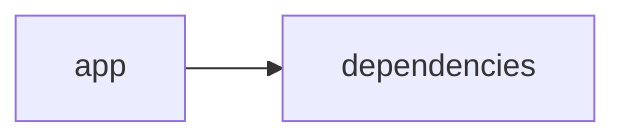

# Documentación del Proyecto

## Guía de Usuario
# Guía de Usuario

## 📱 ¿Qué es esta aplicación?
Esta herramienta es una solución interactiva basada en web, desarrollada con Streamlit, que te ayuda a procesar y analizar información contenida en documentos PDF y conversaciones. Utiliza modelos de lenguaje de inteligencia artificial para extraer insights y detectar sentimientos, emociones y la Voz del Cliente (VoC) de forma rápida y precisa.

- **Propósito principal**: Facilitar el análisis y procesamiento de datos en archivos PDF y textos conversacionales, permitiendo obtener reportes e insights de valor sin necesidad de conocimientos técnicos avanzados.
- **Problema que resuelve**: Elimina la complejidad de procesar grandes volúmenes de información en diferentes formatos, ayudándote a transformar datos sin estructurar en información accionable para optimizar procesos y mejorar la atención al cliente.
- **Beneficios clave**:
  - Obtención automatizada de insights y análisis de sentimientos.
  - Detección de emociones y tendencias en conversaciones.
  - Procesamiento eficiente de documentos PDF.
  - Interfaz amigable e interactiva que simplifica la experiencia.
- **Audiencia objetivo**: Profesionales de análisis de datos, equipos de atención al cliente, departamentos de marketing, y cualquiera que requiera transformar grandes volúmenes de información en insights prácticos.

## ✨ Funcionalidades Principales

### Interfaz Web Interactiva con Streamlit
- **¿Qué hace?**: Permite acceder a todas las herramientas de análisis de forma visual, con botones, menús y gráficas fáciles de entender.
- **¿Cuándo usarla?**: Cada vez que necesites revisar, interactuar o modificar algún análisis, o simplemente buscar información mediante un entorno intuitivo.
- **¿Cómo acceder?**: Ingresa a la URL de la aplicación desde tu navegador web.
- **Resultado esperado**: Visualización clara de todas las opciones y herramientas disponibles, con navegación sencilla por secciones y resultados gráficos en pantalla.

### Procesamiento de Archivos PDF
- **¿Qué hace?**: Extrae y convierte el contenido de documentos PDF para su análisis.
- **¿Cuándo usarla?**: Cuando dispongas de reportes, facturas, investigaciones u otros documentos en PDF que quieras transformar en datos procesables.
- **¿Cómo acceder?**: Selecciona la opción “Procesar PDF” en la interfaz, carga el archivo deseado desde tu computadora y presiona “Enviar”.
- **Resultado esperado**: Visualización del contenido extraído en formato de texto, listo para ser analizado por la herramienta.

### Análisis con Modelos de Lenguaje (IA)
- **¿Qué hace?**: Analiza el contenido textual utilizando inteligencia artificial para extraer patrones, identificar temas y detectar palabras clave.
- **¿Cuándo usarla?**: Al trabajar con textos largos o documentos complejos y cuando necesites extraer insights de manera automatizada.
- **¿Cómo acceder?**: Una vez procesado el documento o ingresado el texto, selecciona “Analizar con IA” y espera a que el sistema genere el reporte.
- **Resultado esperado**: Un resumen detallado de temas, palabras clave y patrones encontrados en el contenido.

### Análisis de Conversaciones
- **¿Qué hace?**: Revisa transcripciones de conversaciones (chat, llamadas, etc.) para identificar puntos importantes y áreas de mejora.
- **¿Cuándo usarla?**: Cuando necesites evaluar la calidad de la atención al cliente, el desempeño de un equipo de ventas o la satisfacción general a partir de interacciones.
- **¿Cómo acceder?**: Sube el archivo de transcripción o copia el texto en el área designada y elige “Analizar Conversación”.
- **Resultado esperado**: Un reporte con aspectos destacados de la comunicación, temas recurrentes y valoraciones sobre la interacción.

### Análisis de Voz del Cliente (VoC)
- **¿Qué hace?**: Extrae insights específicos relacionados con la experiencia del cliente, identificando comentarios positivos, negativos y áreas de oportunidad.
- **¿Cuándo usarla?**: Úsala cuando busques entender mejor las necesidades y percepciones de tus clientes, o para mejorar productos y servicios.
- **¿Cómo acceder?**: Selecciona la opción “Análisis VoC” en la interfaz, carga las fuentes de feedback de clientes y ejecuta el análisis.
- **Resultado esperado**: Un informe identificando sentimientos y sugerencias clave, con recomendaciones para mejorar la experiencia del cliente.

### Análisis de Sentimientos y Emociones
- **¿Qué hace?**: Evalúa el tono emocional en los textos, detectando sentimientos positivos, negativos o neutros y resaltando emociones predominantes.
- **¿Cuándo usarla?**: Cuando necesites comprender la percepción emocional en comunicaciones internas o externas, como evaluaciones de servicio o feedback en redes sociales.
- **¿Cómo acceder?**: Tras cargar el contenido (ya sea de PDF o conversaciones), selecciona “Análisis de Sentimientos” y espera a que se procese el contenido.
- **Resultado esperado**: Un gráfico o reporte que ilustra la distribución de sentimientos y emociones, facilitando la toma de decisiones basada en la experiencia del usuario.

## 🚀 Cómo Empezar

### Primer Uso
1. **Requisitos previos**: Asegúrate de contar con una conexión a Internet, un navegador actualizado y los archivos (PDF, transcripciones, etc.) que deseas analizar.
2. **Acceso inicial**: Ingresa a la URL de la aplicación desde tu navegador preferido.
3. **Configuración básica**: Regístrate o inicia sesión si es necesario. Configura tus preferencias de idioma y visualización.
4. **Primera tarea recomendada**: Sube un documento PDF o ingresa una conversación para experimentar el proceso de análisis desde la extracción de información hasta la visualización de insights.

### Flujo Típico de Uso
1. **Paso 1**: Ingresa a la aplicación a través de tu navegador y familiarízate con la interfaz.
2. **Paso 2**: Selecciona el tipo de análisis que deseas realizar (por ejemplo, “Procesar PDF” o “Analizar Conversación”).
3. **Paso 3**: Sube o ingresa el contenido a analizar y ejecuta la herramienta de IA.
4. **Paso 4**: Revisa el resultado en la pantalla, donde se mostrarán los insights, gráficos y reportes generados.
5. **Paso 5**: Utiliza la información para tomar decisiones o acciones basadas en los análisis obtenidos.

## 💡 Casos de Uso Comunes

### Escenario 1: Extracción y análisis de Información en Documentos PDF
**Situación**: Necesitas analizar grandes volúmenes de información contenida en reportes mensuales u otros documentos PDF.
**Pasos**:
1. Selecciona “Procesar PDF” en la aplicación.
2. Sube el documento y ejecuta el análisis.
3. Revisa el contenido extraído y utiliza “Analizar con IA” para obtener temas y palabras clave.

### Escenario 2: Detección de Sentimientos en Conversaciones de Atención al Cliente
**Situación**: Quieres evaluar la calidad del servicio al cliente mediante la detección de sentimientos en conversaciones previas.
**Pasos**:
1. Carga la transcripción de la conversación mediante la opción “Analizar Conversación”.
2. Ejecuta el “Análisis de Sentimientos” para detectar emociones y tonos.
3. Examina el reporte para identificar áreas de mejora en la atención al cliente.

### Escenario 3: Análisis de Voz del Cliente (VoC) para Mejorar Productos
**Situación**: Recibes constantemente feedback de clientes en diversos formatos y deseas extraer insights para optimizar tus productos.
**Pasos**:
1. Selecciona “Análisis VoC” en la interfaz.
2. Sube o inserta el contenido de feedback.
3. Observa el informe generado, enfocado en comentarios y sugerencias que pueden influir en cambios de producto o servicio.

### Escenario 4: Evaluación de Emociones en Redes Sociales y Encuestas
**Situación**: Estás analizando opiniones en redes sociales o encuestas y necesitas identificar emociones predominantes.
**Pasos**:
1. Inserta el contenido textual a través de la opción “Analizar con IA” o “Análisis de Sentimientos”.
2. Ejecuta el proceso para extraer sentimientos y emociones.
3. Utiliza el gráfico o reporte resultante para ajustar tu estrategia de comunicación.

## ❓ Preguntas Frecuentes

**P: ¿Cómo subo un archivo PDF a la aplicación?**  
R: En la interfaz principal, selecciona la opción “Procesar PDF”, haz clic en “Cargar archivo”, elige el documento PDF en tu equipo y presiona “Enviar”.

**P: ¿Qué hago si el documento no se procesa correctamente?**  
R: Verifica que el archivo esté en formato PDF y que no esté dañado. Si el problema persiste, reinicia la aplicación o contacta al soporte para asistencia.

**P: ¿Es seguro usar esta herramienta para análisis de datos confidenciales?**  
R: Sí, la aplicación emplea medidas de seguridad básicas para proteger tu información. Sin embargo, se recomienda no subir documentos extremadamente sensibles sin realizar las debidas evaluaciones de seguridad.

**P: ¿Cuáles son las limitaciones principales de la aplicación?**  
R: 
- La aplicación no admite formatos de archivos distintos a PDF para el procesamiento documental.
- Los análisis dependen de la calidad del texto proporcionado.
- No se actualiza en tiempo real a medida que se modifican los documentos.

## 🆘 Solución de Problemas

### Problema: El archivo PDF no se carga o procesa
**Síntomas**: El botón de “Enviar” no responde o aparece un error de carga.  
**Causa probable**: El archivo puede estar dañado, en un formato no compatible o haber problemas de conexión a Internet.  
**Solución**:  
1. Verifica que el archivo esté en formato PDF y que se abra correctamente en otro visor.  
2. Asegúrate de tener una conexión estable a Internet.  
3. Si el problema persiste, intenta recargar la página o contacta al soporte.

### Problema: Los resultados del análisis no aparecen
**Síntomas**: Después de ejecutar el análisis, la pantalla sigue en blanco o muestra mensajes de error.  
**Causa probable**: Puede deberse a una interrupción temporal en el servicio o a datos de baja calidad.  
**Solución**:  
1. Revisa que el contenido ingresado esté completo y sin errores.  
2. Recarga la aplicación y vuelve a intentarlo.  
3. Consulta el apartado de soporte si el problema continúa.

### Problema: Tiempo de respuesta lento durante el análisis
**Síntomas**: El análisis tarda mucho en completarse y la interfaz parece no responder.  
**Causa probable**: El volumen de información es muy grande o la conexión a Internet es lenta.  
**Solución**:  
1. Intenta analizar archivos o conversaciones de tamaño reducido.  
2. Verifica tu conexión a Internet.  
3. Para análisis muy intensivos, considera realizar el proceso en horarios de menor congestión.

## 📞 Soporte y Contacto
- **¿Necesitas ayuda adicional?** Si tienes dudas o requieres asistencia, por favor contacta al equipo de soporte a través del correo soporte@tuempresa.com.
- **¿Encontraste un error?** Reporta cualquier fallo o comportamiento inusual en la aplicación enviando un correo a errores@tuempresa.com, incluyendo una descripción del problema y, si es posible, capturas de pantalla.
- **¿Tienes sugerencias?** Tus opiniones son importantes para nosotros. Puedes enviar feedback y sugerencias a feedback@tuempresa.com.

--- 

Esta guía está diseñada para que disfrutes de una experiencia sencilla y efectiva al analizar y procesar tus documentos e interacciones. ¡Explora la aplicación y sácale el máximo provecho a tus datos!

## Documentación Técnica
# Documentación Técnica

Esta documentación está orientada a desarrolladores y profesionales que necesiten comprender, mantener y extender la aplicación VoC Analyst. Se detalla la arquitectura del sistema, el stack tecnológico, los componentes principales, las APIs internas, el modelo de datos, la guía de desarrollo y los puntos de atención, siguiendo la estructura requerida.

---

## 🏗️ Arquitectura del Sistema

- **Patrón Arquitectónico Utilizado:**  
  La aplicación implementa una arquitectura modular monolítica “híbrida”. La Capa de Presentación (Frontend) se implementa con Streamlit para ofrecer una experiencia web interactiva; la Capa de Lógica de Negocio y Análisis (Backend) se encarga de procesar archivos (por ejemplo, PDF), de extraer y normalizar el contenido de las conversaciones y de comunicarse con diferentes proveedores de Modelos de Lenguaje (LLM) como OpenAI, Anthropic y Google GenAI.

- **Diagrama de Componentes:**  
  El siguiente diagrama Mermaid muestra la relación general entre los componentes:

  ```mermaid
  graph LR
      A[Interfaz Streamlit] --> B[Procesamiento y Validación de Archivos]
      A --> C[Gestión del Estado (st.session_state)]
      B --> D[Extracción de Texto (PyPDF2)]
      B --> E[Funciones de Parser y Redacción de PII]
      A --> F[LLMBackend]
      F --> G[Proveedores LLM (OpenAI, Anthropic, Gemini)]
  ```

- **Flujo de Datos Principal:**  
  1. El usuario accede a la aplicación mediante una interfaz web (Streamlit).  
  2. Se cargan archivos (principalmente PDFs); se validan (por ejemplo, comprobando que el tamaño sea menor a 100MB) y se extrae el contenido utilizando PyPDF2.  
  3. El texto extraído se envía al módulo de parser, que normaliza la conversación, segmenta mensajes y redacta datos sensibles (PII).  
  4. La Capa de Negocio utiliza el módulo LLMBackend para enviar el contenido a proveedores LLM mediante prompts preconfigurados, obteniendo análisis (resúmenes, temas, sentimientos, recomendaciones, etc.).  
  5. Los resultados se almacenan en `st.session_state` y se muestran en la interfaz de usuario en paneles y visualizaciones interactivas.

- **Dependencias Críticas y su Propósito:**  
  - **Streamlit:** Construye la interfaz web interactiva y gestiona el estado de la sesión.  
  - **PyPDF2:** Extrae el contenido textual de archivos PDF.  
  - **Pandas:** Facilita la manipulación y visualización de datos en formato tabular.  
  - **LLM SDKs (openai, anthropic, google-genai):** Integran y conectan la aplicación con distintos proveedores de modelos de lenguaje para el análisis avanzado.

---

## 📋 Stack Tecnológico

- **Lenguajes:**  
  Principalmente Python (clasificado en “other” en el repositorio).

- **Frameworks y Librerías:**  
  - **Streamlit:** (>= 1.49.1) para crear la interfaz web interactiva.  
  - **PyPDF2:** (>= 3.0.1) para la extracción de texto desde archivos PDF.  
  - **Pandas:** (>= 2.3.2) para el manejo y presentación de datos.  
  - **LLM SDKs:**  
     - `openai` para conectarse a OpenAI.  
     - `anthropic` para acceder a modelos de Anthropic.  
     - `google-genai` para la integración con Google Gemini.  
  - **Librerías estándares:** json, os, time, datetime, uuid, zipfile, io, typing.

- **Base de Datos:**  
  No se utiliza una base de datos tradicional; la aplicación gestiona el almacenamiento temporal de datos en memoria a través de `st.session_state`.

- **APIs Externas:**  
  Se integra con las APIs de proveedores LLM (OpenAI, Anthropic y Google GenAI) para realizar análisis de lenguaje e inteligencia artificial.

- **Infraestructura:**  
  La aplicación se despliega como una aplicación web simple mediante Streamlit; es compatible con ejecuciones locales, en servidores o en contenedores Docker.

---

## 🔧 Componentes Principales

### 1. Aplicación Streamlit

- **Propósito:**  
  Gestionar la interfaz de usuario, la carga y procesamiento de archivos, y la visualización interactiva de los resultados. Se encarga de inicializar y actualizar el estado de la sesión a través de `st.session_state`.

- **Ubicación:**  
  El punto de entrada principal es, por ejemplo, `app.py` dentro del directorio `app/`.

- **Interfaces y Funcionalidades:**  
  - Configuración de la página mediante `st.set_page_config` (título, icono, layout y sidebar).  
  - Gestión del estado de la sesión para variables clave como `analysis_results`, `run_id`, `uploaded_files_data` y `processing_complete`.
  - Funciones auxiliares de carga y procesamiento:
    - `extract_text_from_pdf(pdf_file) → str`: Extrae y concatena el texto de cada página de un PDF.  
    - `validate_file_size(file) → bool`: Verifica que el tamaño del archivo no supere 100MB.

- **Ejemplo de Código:**

  ```python
  import streamlit as st
  import PyPDF2

  st.set_page_config(
      page_title="VoC Analyst - Análisis de Voz del Cliente con LLM",
      page_icon="📊",
      layout="wide",
      initial_sidebar_state="expanded"
  )

  if 'analysis_results' not in st.session_state:
      st.session_state.analysis_results = None
  if 'run_id' not in st.session_state:
      st.session_state.run_id = None
  if 'uploaded_files_data' not in st.session_state:
      st.session_state.uploaded_files_data = []
  if 'processing_complete' not in st.session_state:
      st.session_state.processing_complete = False

  def extract_text_from_pdf(pdf_file) -> str:
      """Extraer texto de archivo PDF"""
      try:
          pdf_reader = PyPDF2.PdfReader(pdf_file)
          text = ""
          for page in pdf_reader.pages:
              text += page.extract_text() + "\n"
          return text.strip()
      except Exception as e:
          st.error(f"Error al extraer texto de PDF: {str(e)}")
          return ""
  ```

---

### 2. Módulo LLMBackend

- **Propósito:**  
  Gestionar la integración con proveedores de modelos de lenguaje (LLM) para analizar la información extraída. Permite configurar dinámicamente el proveedor y modelo a utilizar, enviar prompts y gestionar la comunicación con la API correspondiente.

- **Ubicación:**  
  Se encuentra en el archivo `llm_backend.py` ubicado en la raíz del proyecto.

- **Interfaces y Funcionalidades:**  
  - **ModelConfig:**  
    Define la configuración necesaria para identificar el proveedor LLM, el modelo a usar, la API key y parámetros de reintentos.
    
    ```python
    from dataclasses import dataclass

    @dataclass
    class ModelConfig:
        """Configuración para la selección del modelo LLM"""
        provider: str  # 'openai', 'anthropic', 'gemini'
        model: str
        api_key: str
        max_retries: int = 3
        retry_delay: float = 1.0
    ```
  
  - **LLMBackend:**  
    Implementa métodos para:
    - Inicializar el cliente LLM apropiado mediante `_initialize_client()`.
    - Cargar prompts para el parsing (`_load_parse_prompt()`) y el análisis (`_load_analyze_prompt()`).
    - Procesar el texto con el método `analyze_text(text: str) → Dict[str, Any]`.
    
    ```python
    class LLMBackend:
        """Servicio backend para el análisis VoC basado en LLM"""
        
        def __init__(self, config: ModelConfig):
            self.config = config
            self.client = self._initialize_client()
            self.parse_prompt = self._load_parse_prompt()
            self.analyze_prompt = self._load_analyze_prompt()
        
        def _initialize_client(self):
            """Inicializa el cliente LLM correspondiente basado en la configuración"""
            if self.config.provider == 'openai':
                return openai.OpenAI(api_key=self.config.api_key)
            elif self.config.provider == 'anthropic':
                return anthropic.Anthropic(api_key=self.config.api_key)
            elif self.config.provider == 'gemini':
                return genai.Client(api_key=self.config.api_key)
            else:
                raise ValueError(f"Proveedor no soportado: {self.config.provider}")
    ```

---

### 3. Parser de Conversaciones y Análisis

- **Propósito:**  
  Procesar y normalizar el contenido textual extraído, transformándolo en un formato estructurado (por ejemplo, JSON) para facilitar el análisis posterior mediante modelos de lenguaje. La funcionalidad incluye:
  - **Extracción de metadatos:** Derivar identificadores de conversación, timestamps, roles de interlocutores y otros.
  - **Redacción de PII:** Detectar y reemplazar información sensible (emails, teléfonos, tarjetas) por etiquetas estándar ([EMAIL], [PHONE], [CARD], [ID]).
  - **Validación del Contenido:** Asegurar que el documento contenga una única conversación y que los datos sean consistentes.

- **Ejemplo de Requerimientos del Parser:**

  ```
  ## VoC Conversation Parser

  Transformar el texto crudo de una interacción en un JSON estructurado:
  - Detectar conversation_id basado en el nombre del archivo o metadatos.
  - Separar la conversación en turnos, identificando el rol (cliente, agente, desconocido).
  - Redactar información sensible usando patrones de expresiones regulares.
  ```

---

## 🚀 APIs y Endpoints

Aunque la aplicación no expone endpoints REST públicos, posee APIs internas a nivel funcional que permiten orquestar el proceso de análisis:

- **Función: extract_text_from_pdf(pdf_file) → str:**  
  Extrae el contenido textual desde un archivo PDF y gestiona errores.

- **Función: validate_file_size(file) → bool:**  
  Verifica que el tamaño del archivo sea menor a 100MB.

- **Método: LLMBackend.analyze_text(text: str) → Dict[str, Any]:**  
  Envía el texto y el prompt de análisis al proveedor LLM, procesando la respuesta para generar insights y recomendaciones.

- **Parser de Conversaciones:**  
  Funciones internas que transforman la conversación en un JSON estructurado, listo para ser analizado.

---

## 💾 Modelo de Datos

- **Entidades Principales:**
  - **Conversación:**  
    Representada como un JSON que puede incluir:
    - `conversation_id`: Identificador único.
    - `messages`: Lista de mensajes, donde cada mensaje contiene:
      - `sender`: Rol del emisor (cliente, agente, desconocido).
      - `timestamp`: Momento de envío del mensaje.
      - `content`: Texto del mensaje, con redacción de PII procesada.
      - `metadata`: Información adicional (canal, duración, etc.).
  
- **Transformaciones y Validaciones:**
  - Validar que el texto extraído sea no vacío y esté correctamente formateado.
  - Redactar la información sensible utilizando expresiones regulares y reglas definidas.
  - Estructurar los datos en un formato JSON para ser consumido por módulos de visualización y análisis.

---

## 🛠️ Guía de Desarrollo

### 1. Configuración del Entorno

1. **Prerrequisitos:**
   - Python 3.8 o superior.
   - Acceso a Internet (para la conexión con proveedores LLM en producción).

2. **Instalación:**
   - Clonar el repositorio:
     ```bash
     git clone https://github.com/tu_usuario/VoC-Analyst.git
     cd VoC-Analyst
     ```
   - Crear y activar un entorno virtual:
     ```bash
     python -m venv venv
     source venv/bin/activate    # En Linux/Mac
     venv\Scripts\activate       # En Windows
     ```
   - Instalar las dependencias:
     ```bash
     pip install -r requirements.txt
     ```

3. **Variables de Entorno:**
   - Configure las API keys para los proveedores LLM utilizando variables de entorno, por ejemplo:  
     - `OPENAI_API_KEY`  
     - `ANTHROPIC_API_KEY`  
     - `GEMINI_API_KEY`

---

### 2. Estructura del Código

La estructura de directorios es la siguiente:

```
VoC-Analyst/
├── app/
│   ├── app.py                # Punto de entrada de la aplicación (Streamlit)
│   ├── parser.py             # Funciones de parsing y análisis de conversaciones
│   └── utils.py              # Funciones auxiliares (extracción de texto, validación, etc.)
├── llm_backend.py            # Módulo para integración con proveedores LLM
├── requirements.txt          # Lista de dependencias
└── README.md                 # Documentación general y guía de usuario
```

---

### 3. Estándares de Código y Pruebas

- **Convenciones de Naming:**  
  Usar nombres descriptivos en minúsculas y con guiones bajos para archivos y funciones.
  
- **Patrones de Diseño:**  
  Seguir la separación de la lógica de UI (Streamlit) de la lógica de negocio (LLMBackend, Parser).  
  Utilizar inyección de dependencias para la configuración de proveedores LLM.
  
- **Pruebas y Validación:**  
  Implementar pruebas unitarias con frameworks como pytest para:
  - Validar la extracción de texto de archivos PDF.
  - Probar la función de validación del tamaño de archivo.
  - Simular peticiones al módulo LLMBackend para confirmar la correcta comunicación y manejo de reintentos.
  
- **Manejo de Errores y Logs:**  
  Registrar los errores usando el módulo logging y notificar al usuario mediante la interfaz Streamlit.

---

## 🔍 Puntos de Atención

- **Limitaciones Conocidas:**
  - La extracción de texto se basa en PyPDF2; documentos basados en imágenes pueden requerir OCR.
  - El análisis con LLM depende de la calidad del texto extraído y de la correcta configuración de la API key.
  
- **Consideraciones de Rendimiento:**
  - El procesamiento de archivos muy grandes (cerca de 100MB) puede afectar la respuesta de la aplicación.
  - Se recomienda optimizar el procesamiento en lote o implementar una capa de caching en futuros desarrollos.
  
- **Aspectos de Seguridad:**
  - Proteger las API keys mediante variables de entorno y no exponerlas en el código fuente.
  - Redactar la información sensible (PII) antes de enviarla a proveedores externos.
  
- **Mejoras Sugeridas (TODOs):**
  - Ampliar el soporte a otros formatos de archivo (por ejemplo, TXT).
  - Integrar capacidad OCR para archivos PDF basados en imagen.
  - Implementar procesamiento asíncrono y/o en lote para mejorar el rendimiento en análisis repetitivos.

---

## Guía de Usuario

Aunque la presente documentación técnica está orientada a desarrolladores, se incluye a continuación una breve guía de usuario para comprender el flujo básico de la aplicación:

1. **Acceso a la Aplicación:**  
   Abre tu navegador y visita la URL de la aplicación; la interfaz de Streamlit se mostrará con todas las opciones disponibles.

2. **Carga de Archivos:**  
   Usa el botón “Subir Archivo” para cargar tu documento PDF. La aplicación validará y extraerá el contenido automáticamente.

3. **Ejecución del Análisis:**  
   Una vez procesado el archivo, activa el análisis mediante el botón “Analizar con LLM”. El contenido se enviará al módulo LLMBackend y se mostrará un informe de resultados.

4. **Visualización de Resultados:**  
   Los resultados (insights, gráficas, resúmenes y recomendaciones) se mostrarán dinámicamente en la pantalla. Puedes explorar detalles mediante secciones expandibles y opciones de filtrado.

5. **Exportación y Uso:**  
   Si deseas guardar o exportar los resultados, utiliza las opciones de descarga disponibles en el panel de resultados.

---

## Diagrama del Sistema

El siguiente diagrama Mermaid resume la estructura y flujo de la aplicación:

```mermaid
graph LR
    A[Interfaz Streamlit] --> B[Procesamiento de Archivos]
    A --> C[Gestión del Estado (st.session_state)]
    B --> D[Extracción de Texto y Validación]
    A --> E[LLMBackend]
    E --> F[Proveedores LLM (OpenAI, Anthropic, Gemini)]
    B --> G[Parser de Conversaciones y Redacción de PII]
```

---

Con esta documentación se espera que desarrolladores y colaboradores puedan comprender la estructura, funcionamiento, y pautas de mantenimiento y extensión de VoC Analyst. Se recomienda mantener actualizada la documentación conforme se realicen cambios y mejoras en el proyecto.

¡Feliz codificación y éxito en el análisis de la Voz del Cliente!

---

## Diagrama Final



## Diagrama
```mermaid
graph LR\nApp["app"]-->Deps["dependencies"]\n
```
