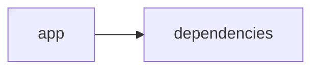

# Documentación del Proyecto

## Guía de Usuario
# Guía de Usuario

Bienvenido a nuestra aplicación, una herramienta especializada en el análisis y procesamiento de información a partir de diferentes fuentes. A continuación te mostramos cómo sacarle el máximo provecho.

---

## 📱 ¿Qué es esta aplicación?

- **Propósito principal**:  
  Esta aplicación está diseñada para simplificar y automatizar el análisis de información proveniente de archivos PDF, conversaciones y datos de clientes, utilizando modelos de lenguaje basados en inteligencia artificial y analizando sentimientos y emociones.

- **Problema que resuelve**:  
  Los usuarios a menudo necesitan extraer insights relevantes de documentos extensos, conversaciones y feedback de clientes. Nuestra herramienta procesa y analiza estos datos de forma rápida y precisa, ayudándote a tomar decisiones informadas sin tener que hacerlo manualmente.

- **Beneficios clave**:  
  - Reducción significativa del tiempo de análisis.
  - Obtención de insights profundos sobre el sentimiento y las emociones en la comunicación.
  - Mejora en la toma de decisiones basada en datos reales.
  - Interfaz intuitiva y fácil de usar para cualquier usuario.

- **Audiencia objetivo**:  
  Profesionales de análisis de datos, equipos de atención al cliente, responsables de marketing y cualquier persona que necesite extraer información útil de documentos y conversaciones complejas.

---

## ✨ Funcionalidades Principales

### 1. Interfaz Web Interactiva con Streamlit
- **¿Qué hace?**:  
  Proporciona un entorno amigable y visual para interactuar con la aplicación, acceder a funcionalidades y ver resultados de manera inmediata.
  
- **¿Cuándo usarla?**:  
  Al iniciar la aplicación y cada vez que necesites navegar entre las distintas opciones de análisis.
  
- **¿Cómo acceder?**:  
  Abre tu navegador favorito e ingresa la URL provista, o accede a través del acceso directo en tu escritorio.
  
- **Resultado esperado**:  
  Verás una interfaz clara con menús y botones que te permitirán cargar archivos y seleccionar los tipos de análisis de datos.

### 2. Procesamiento de Archivos PDF
- **¿Qué hace?**:  
  Permite subir y extraer contenido de documentos PDF para facilitar su análisis y transformación en datos estructurados.
  
- **¿Cuándo usarla?**:  
  Cuando desees analizar documentos, reportes o cualquier archivo en formato PDF.
  
- **¿Cómo acceder?**:  
  Desde la interfaz web, selecciona la opción “Subir PDF” y arrastra o selecciona el archivo deseado.
  
- **Resultado esperado**:  
  El contenido del PDF se mostrará procesado y listo para que puedas aplicarle las demás funciones de análisis.

### 3. Análisis con Modelos de Lenguaje (IA)
- **¿Qué hace?**:  
  Utiliza inteligencia artificial para procesar el texto de los documentos y generar insights relevantes, como resúmenes y detección de temas.
  
- **¿Cuándo usarla?**:  
  Cuando necesites comprender rápidamente el contenido de un documento o extraer información clave sin leerlo por completo.
  
- **¿Cómo acceder?**:  
  Después de subir un PDF, selecciona la opción “Analizar con IA” en el menú de resultados.
  
- **Resultado esperado**:  
  Obtendrás reportes con resúmenes, palabras clave y una interpretación del contenido.

### 4. Análisis de Conversaciones
- **¿Qué hace?**:  
  Evalúa y extrae patrones de interacción de archivos de conversación, ayudando a identificar temas comunes y áreas de mejora.
  
- **¿Cuándo usarla?**:  
  Al trabajar con transcripciones de reuniones, chats o cualquier intercambio textual entre personas.
  
- **¿Cómo acceder?**:  
  Desde la interfaz, elige “Analizar Conversaciones” y sube el archivo correspondiente.
  
- **Resultado esperado**:  
  Verás una representación visual de los temas y patrones principales en la conversación.

### 5. Análisis de Voz del Cliente (VoC)
- **¿Qué hace?**:  
  Recoge y analiza feedback de clientes para entender sus opiniones, necesidades y emociones respecto a productos o servicios.
  
- **¿Cuándo usarla?**:  
  En situaciones donde deseas evaluar la satisfacción del cliente y descubrir oportunidades de mejora.
  
- **¿Cómo acceder?**:  
  Selecciona “Análisis de Voz del Cliente” y carga el archivo o ingresa los comentarios recogidos.
  
- **Resultado esperado**:  
  Obtendrás un informe detallado con insights sobre la experiencia del cliente.

### 6. Análisis de Sentimientos y Emociones
- **¿Qué hace?**:  
  Analiza el tono y las emociones presentes en textos o conversaciones, identificando sentimientos positivos, negativos o neutros.
  
- **¿Cuándo usarla?**:  
  Cuando necesites evaluar el impacto emocional de un contenido o entender mejor la reacción de la audiencia.
  
- **¿Cómo acceder?**:  
  Después de procesar un contenido (PDF o conversación), selecciona la opción “Analizar Sentimientos y Emociones”.
  
- **Resultado esperado**:  
  Se mostrará un gráfico o reporte que clasifica el contenido según diferentes categorías emocionales.

---

## 🚀 Cómo Empezar

### Primer Uso
1. **Requisitos previos**:  
   - Conexión a internet.
   - Archivo(s) PDF o datos de conversación listos para analizar.
   
2. **Acceso inicial**:  
   - Abre tu navegador e ingresa la URL asignada para acceder a la interfaz de la aplicación.
   
3. **Configuración básica**:  
   - No requiere configuración compleja. Sigue las instrucciones en pantalla para familiarizarte con el menú y las opciones.
   
4. **Primera tarea recomendada**:  
   - Sube un documento PDF y realiza un análisis básico con IA para ver cómo se procesan y presentan los datos.

### Flujo Típico de Uso
1. **Paso 1**: Inicia sesión en la aplicación accediendo a la interfaz web.
2. **Paso 2**: Sube el archivo PDF o el documento de conversación a analizar.
3. **Paso 3**: Selecciona la opción deseada (por ejemplo, “Analizar con IA”, “Analizar Conversaciones” o “Análisis de Voz del Cliente”).
4. **Paso 4**: Revisa el informe o los gráficos generados y obtén insights prácticos para tu toma de decisiones.

---

## 💡 Casos de Uso Comunes

### Escenario 1: Análisis Rápido de Documentos Extensos
**Situación**:  
Tienes un informe largo en PDF y necesitas extraer las partes más relevantes sin leer todo el documento.

**Pasos**: 
1. Sube el documento PDF desde la interfaz web.
2. Selecciona la opción “Analizar con IA”.
3. Revisa el resumen y las palabras clave generadas.

**Resultado final**:  
Obtienes un resumen conciso y puntos clave del documento que te permiten tomar decisiones rápidamente.

### Escenario 2: Evaluación de Conversaciones de Soporte al Cliente
**Situación**:  
Deseas entender las preguntas y preocupaciones frecuentes de tus clientes a partir de transcripciones de chats.

**Pasos**: 
1. Sube las transcripciones de las conversaciones.
2. Selecciona “Analizar Conversaciones”.
3. Observa los temas comunes y patrones en las interacciones.

**Resultado final**:  
Identificas áreas de mejora en el servicio al cliente y ajustas tus estrategias de atención.

### Escenario 3: Medición de la Emoción en Feedback de Clientes
**Situación**:  
Recibes múltiples comentarios de clientes y necesitas evaluar el sentimiento general para ajustar la estrategia de marketing.

**Pasos**: 
1. Ingresa el feedback de los clientes en la sección “Análisis de Voz del Cliente”.
2. Selecciona “Analizar Sentimientos y Emociones”.
3. Revisa el gráfico emocional y el reporte detallado.

**Resultado final**:  
Comprendes el estado emocional de tus clientes y optimizas tus campañas de marketing.

---

## ❓ Preguntas Frecuentes

**P: ¿Cómo se asegura la confidencialidad de mis documentos?**  
R: La aplicación procesa los datos de manera segura y confidencial. No se almacenan datos sensibles más allá de la sesión activa, garantizando tu privacidad.

**P: ¿Qué hago si mi PDF no se carga correctamente?**  
R: Verifica que el archivo esté en formato PDF y que no esté dañado. Si el problema persiste, reinicia la aplicación y vuelve a intentarlo.

**P: ¿Puedo usar la aplicación sin tener conocimientos técnicos?**  
R: Sí, la aplicación está diseñada para ser intuitiva y fácil de usar. Cada paso cuenta con instrucciones claras y la interfaz es amigable.

**P: ¿Cuáles son las limitaciones principales?**  
R:  
- No puede procesar archivos que no estén en formato PDF.
- La precisión del análisis depende de la calidad del texto original.
- Puede haber limitaciones en el tamaño del archivo a subir en cada sesión.

---

## 🆘 Solución de Problemas

### Problema: El PDF no se carga correctamente
- **Síntomas**:  
  Mensaje de error al intentar subir el archivo o el archivo no aparece en la lista de documentos.
- **Causa probable**:  
  El archivo podría estar dañado o no cumplir con el formato requerido.
- **Solución**:  
  1. Verifica que el archivo sea un PDF válido.  
  2. Asegúrate de que el tamaño no exceda el límite permitido.  
  3. Si el problema continúa, inténtalo en otro navegador o reinicia la aplicación.

### Problema: Resultados de análisis inexactos o incompletos
- **Síntomas**:  
  Los informes generados no reflejan adecuadamente el contenido del documento.
- **Causa probable**:  
  El contenido del archivo puede incluir errores tipográficos, formatos inusuales o ser muy extenso.
- **Solución**:  
  1. Revisa el documento y asegúrate de que el texto sea claro y bien formateado.  
  2. Intenta dividir el documento en secciones más pequeñas y analiza cada una por separado.  
  3. Consulta la sección de ayuda para ajustar parámetros o mejorar la calidad del texto.

### Problema: La interfaz presenta lentitud o errores de carga
- **Síntomas**:  
  Retrasos en la respuesta de la página o mensajes de error al navegar.
- **Causa probable**:  
  Problemas temporales de conectividad o alta demanda en el servidor.
- **Solución**:  
  1. Verifica tu conexión a internet.  
  2. Espera unos minutos y vuelve a intentarlo.  
  3. Si persiste, contacta al soporte técnico.

---

## 📞 Soporte y Contacto

- **¿Necesitas ayuda adicional?**  
  Puedes contactarnos a través del correo soporte@tuapp.com, donde nuestro equipo te asistirá con cualquier duda o inconveniente.

- **¿Encontraste un error?**  
  Reporta el problema mediante el formulario de feedback disponible en la interfaz o envía un correo a reportes@tuapp.com con el detalle del error.

- **¿Tienes sugerencias?**  
  Nos encantaría saber tu opinión. Envía tus comentarios y sugerencias a feedback@tuapp.com para ayudarnos a mejorar la aplicación.

---

Esperamos que esta guía te sea útil y disfrutes de todas las funcionalidades de nuestra herramienta para transformar y analizar tus datos de manera fácil y efectiva. ¡Bienvenido y éxito en tu análisis!

## Documentación Técnica
A continuación se presenta la documentación técnica completa en Markdown, organizada según la estructura obligatoria solicitada:

------------------------------------------------------------
# Documentación Técnica

Esta documentación está orientada a desarrolladores y profesionales que deseen comprender, mantener y extender la aplicación “VoC Analyst”. La herramienta procesa archivos (por ejemplo, PDFs) para extraer y analizar la “Voz del Cliente” a través de modelos de lenguaje (LLM). La interfaz se implementa con Streamlit y el backend integra múltiples proveedores LLM (OpenAI, Anthropic y Google GenAI).

------------------------------------------------------------
## 🏗️ Arquitectura del Sistema

- **Patrón arquitectónico utilizado:**  
  Se utiliza un enfoque monolítico modular. La capa de presentación se implementa con Streamlit, que gestiona la interfaz de usuario, la carga de archivos y la visualización interactiva. La lógica de negocio se encarga de la extracción y procesamiento de datos (por ejemplo, extrayendo texto de PDFs y parseando conversaciones) y de la integración con proveedores LLM mediante un módulo denominado “LLMBackend”.
  
- **Diagrama de componentes:**  
  A continuación se presenta un diagrama Mermaid que representa la relación entre los componentes principales:
  
  ```mermaid
  graph LR
      A[Interfaz Streamlit] --> B[Módulo de Procesamiento y Validación]
      A --> C[Manejo del Estado (st.session_state)]
      B --> D[Extracción de Texto (PyPDF2)]
      B --> E[Parser y Redacción de PII]
      A --> F[LLMBackend]
      F --> G[Proveedores LLM (OpenAI, Anthropic, Gemini)]
  ```

- **Flujo de datos principal entre componentes:**  
  1. El usuario carga uno o varios archivos (por ejemplo, PDFs) a través de la interfaz de Streamlit.  
  2. Se valida el tamaño del archivo y se extrae el contenido textual mediante funciones como “extract_text_from_pdf” (usando PyPDF2).  
  3. El texto extraído se procesa; se parsea la conversación, se normaliza el contenido y se redacta la información sensible (PII).  
  4. La capa de negocio utiliza el módulo “LLMBackend” para enviar prompts a los proveedores LLM y obtener insights (análisis de sentimientos, detección de temas, etc.).  
  5. Los resultados se almacenan en el estado de la sesión (`st.session_state`) y se presentan de forma interactiva en la interfaz.

- **Dependencias críticas y su propósito:**  
  - **Streamlit:** Facilita la creación de la interfaz web interactiva y la gestión del estado de la sesión.  
  - **PyPDF2:** Extrae el contenido textual de documentos PDF.  
  - **Pandas:** Permite el manejo y visualización de datos tabulares (por ejemplo, para mostrar resúmenes o tablas de análisis).  
  - **LLM SDKs (openai, anthropic, google-genai):** Proveen la capacidad de análisis avanzado del contenido textual y la generación de insights mediante modelos de lenguaje.

------------------------------------------------------------
## 📋 Stack Tecnológico

- **Lenguajes:**  
  - Principalmente Python (se clasifica como “other” en el repositorio).

- **Frameworks / Librerías:**  
  - **Streamlit:** (>=1.49.1) para la interfaz web interactiva.  
  - **PyPDF2:** (>=3.0.1) para extraer el contenido textual de PDFs.  
  - **Pandas:** (>=2.3.2) para la manipulación y visualización de datos.  
  - **LLM SDKs:**  
    - `openai` para integrar modelos de OpenAI.  
    - `anthropic` para conectar con modelos de Anthropic.  
    - `google-genai` para la integración con Google GenAI (Gemini).  
  - **Librerías estándar de Python:** json, os, time, datetime, uuid, zipfile, io, typing.

- **Base de datos:**  
  No se utiliza una base de datos tradicional. El procesamiento y almacenamiento temporal de datos se maneja en memoria mediante `st.session_state`.

- **APIs externas:**  
  Se integran APIs de proveedores LLM (OpenAI, Anthropic y Google GenAI) para realizar análisis semántico avanzados.

- **Infraestructura:**  
  La aplicación se despliega como una aplicación web simple mediante Streamlit y puede ejecutarse en entornos locales, servidores o contenedores Docker.

------------------------------------------------------------
## 🔧 Componentes Principales

### 1. Aplicación Streamlit

- **Propósito:**  
  Gestionar la interfaz de usuario, la carga y validación de archivos, y la presentación interactiva de los resultados. Se usa para configurar la página, inicializar el estado de sesión (por ejemplo, `analysis_results`, `run_id`, `uploaded_files_data`, `processing_complete`), y coordinar funciones de extracción de texto.

- **Ubicación:**  
  El punto de entrada principal suele ser un archivo como `app.py` dentro del directorio principal o en la carpeta `app/`.

- **Interfaces y Métodos Expuestos:**  
  - Configuración de la página mediante `st.set_page_config`.  
  - Funciones auxiliares:
    - `extract_text_from_pdf(pdf_file) → str`: Recorre cada página de un PDF y concatena el texto extraído.  
    - `validate_file_size(file) → bool`: Verifica que el archivo no exceda un tamaño predefinido (por ejemplo, 100 MB).

- **Ejemplo de Código:**

  ```python
  import streamlit as st
  import PyPDF2

  st.set_page_config(
      page_title="VoC Analyst - Análisis de Voz del Cliente con LLM",
      page_icon="📊",
      layout="wide",
      initial_sidebar_state="expanded"
  )

  if 'analysis_results' not in st.session_state:
      st.session_state.analysis_results = None
  if 'run_id' not in st.session_state:
      st.session_state.run_id = None
  if 'uploaded_files_data' not in st.session_state:
      st.session_state.uploaded_files_data = []
  if 'processing_complete' not in st.session_state:
      st.session_state.processing_complete = False

  def extract_text_from_pdf(pdf_file) -> str:
      """Extraer texto de archivo PDF"""
      try:
          pdf_reader = PyPDF2.PdfReader(pdf_file)
          text = ""
          for page in pdf_reader.pages:
              text += page.extract_text() + "\n"
          return text.strip()
      except Exception as e:
          st.error(f"Error al extraer texto de PDF: {str(e)}")
          return ""
  ```

---

### 2. Módulo LLMBackend

- **Propósito:**  
  Gestiona la integración con proveedores de modelos de lenguaje (LLM) y permite el análisis avanzado del contenido extraído. Este módulo facilita la selección dinámica del proveedor, la inicialización del cliente mediante una clase de configuración, y el manejo de solicitudes y respuestas.

- **Ubicación:**  
  Se encuentra en el archivo `llm_backend.py` en la raíz del repositorio.

- **Interfaces y Métodos Expuestos:**  
  - **ModelConfig:**  
    Es un dataclass que define la configuración del modelo, incluyendo atributos tales como:
    - `provider`: Tipo de proveedor (ejemplo, "openai", "anthropic" o "gemini").
    - `model`: Modelo a utilizar.
    - `api_key`: Clave para autenticación.
    - `max_retries` y `retry_delay`: Parámetros para reintentos en caso de fallo.
  
  - **LLMBackend:**  
    Contiene métodos tales como:
    - `__init__(config: ModelConfig)`: Inicializa el backend con la configuración proporcionada.
    - `_initialize_client()`: Selecciona e instancia el cliente adecuado según el proveedor.
    - `_load_parse_prompt()` y `_load_analyze_prompt()`: Cargan los prompts que se usarán para el parseo y análisis del contenido.
    - `analyze_text(text: str) → Dict[str, Any]`: Envía el texto a analizar y retorna los insights generados por el modelo LLM.

- **Ejemplo de Código:**

  ```python
  from dataclasses import dataclass
  import openai
  import anthropic
  from google import genai

  @dataclass
  class ModelConfig:
      provider: str  # 'openai', 'anthropic', 'gemini'
      model: str
      api_key: str
      max_retries: int = 3
      retry_delay: float = 1.0

  class LLMBackend:
      def __init__(self, config: ModelConfig):
          self.config = config
          self.client = self._initialize_client()
          self.parse_prompt = self._load_parse_prompt()
          self.analyze_prompt = self._load_analyze_prompt()
      
      def _initialize_client(self):
          if self.config.provider == 'openai':
              return openai.OpenAI(api_key=self.config.api_key)
          elif self.config.provider == 'anthropic':
              return anthropic.Anthropic(api_key=self.config.api_key)
          elif self.config.provider == 'gemini':
              return genai.Client(api_key=self.config.api_key)
          else:
              raise ValueError(f"Proveedor no soportado: {self.config.provider}")
      
      def _load_parse_prompt(self) -> str:
          return "Prompt de parseo de conversación"
      
      def _load_analyze_prompt(self) -> str:
          return "Prompt de análisis de conversación"
      
      def analyze_text(self, text: str) -> dict:
          # Ejemplo simplificado de análisis; se debe implementar manejo de reintentos y comunicación real con la API
          response = self.client.create_completion(
              engine=self.config.model,
              prompt=f"{self.analyze_prompt}\n{text}",
              max_tokens=150
          )
          return {"analysis": response}
  ```

---

### 3. Módulo de Conversación y Parser

- **Propósito:**  
  Procesar y normalizar el contenido textual extraído de documentos o ingresado por el usuario. Entre sus responsabilidades se incluyen:
  - Convertir el texto en un formato estructurado (por ejemplo, JSON) que contenga la información de la conversación.
  - Extraer metadatos esenciales (conversation_id, timestamps, roles de interlocutores, etc.).
  - Redactar información sensible (PII) reemplazándola por etiquetas estándar (por ejemplo, `[EMAIL]`, `[PHONE]`, `[CARD]`, `[ID]`).

- **Requerimientos y Proceso:**  
  - Identificar la conversación a partir de metadatos o el nombre del archivo.  
  - Dividir el texto en turnos (mensajes) asignando el rol correspondiente.  
  - Aplicar expresiones regulares para detectar y redactar datos sensibles.

------------------------------------------------------------
## 🚀 APIs y Endpoints

Aunque la aplicación no expone endpoints REST públicos, dispone de “APIs internas” mediante las funciones y métodos que orquestan el procesamiento:

- **Función: extract_text_from_pdf(pdf_file) → str**  
  Extrae el contenido textual de un archivo PDF utilizando PyPDF2 y retorna el texto limpio.

- **Función: validate_file_size(file) → bool**  
  Verifica que el archivo subido no supere el límite de 100MB.

- **Método: LLMBackend.analyze_text(text: str) → dict**  
  Envía el texto a analizar al modelo LLM configurado y retorna un diccionario con los resultados obtenidos (por ejemplo, resumen, análisis de sentimiento, identificación de temas).

- **Parser de Conversaciones:**  
  Funciones internas (no expuestas como endpoints públicos) que transforman la transcripción en un JSON estructurado, listo para la llamada a LLM y posterior visualización.

------------------------------------------------------------
## 💾 Modelo de Datos

- **Entidades Principales:**

  - **Conversación:**  
    Representada en un formato JSON que contiene:
    - `conversation_id`: Identificador único de la conversación.
    - `messages`: Lista de mensajes, donde cada mensaje contiene:
      - `sender`: Identifica el rol del emisor (cliente, agente, u otro).  
      - `timestamp`: Marca temporal del mensaje (si aplica).
      - `content`: Texto del mensaje, con información sensible redactada.
      - `metadata`: Datos adicionales como canal, duración u otros atributos.

- **Transformaciones y Validaciones:**  
  - Verificar que el contenido extraído no esté vacío.  
  - Redactar información sensible utilizando reglas predefinidas (por ejemplo, con expresiones regulares).  
  - Estructurar el resultado para facilitar el análisis y la visualización en la interfaz.

------------------------------------------------------------
## 🛠️ Guía de Desarrollo

### Configuración del Entorno

1. **Prerrequisitos:**  
   - Python 3.8 o superior.  
   - Conexión a Internet para acceder a las APIs de proveedores LLM en producción.

2. **Instalación:**
   - Clonar el repositorio:
     ```bash
     git clone https://github.com/tu_usuario/voc-analyst.git
     cd voc-analyst
     ```
   - Crear y activar un entorno virtual:
     ```bash
     python -m venv venv
     source venv/bin/activate    # En Linux/Mac
     venv\Scripts\activate       # En Windows
     ```
   - Instalar las dependencias:
     ```bash
     pip install -r requirements.txt
     ```

3. **Variables de entorno:**  
   - Configure las API keys para los proveedores LLM mediante variables de entorno, por ejemplo:  
     - `OPENAI_API_KEY`  
     - `ANTHROPIC_API_KEY`  
     - `GEMINI_API_KEY`

### Estructura del Código

El repositorio se organiza de la siguiente manera:

```
VoC-Analyst/
├── app/
│   ├── app.py                # Entrada principal (interfaz Streamlit)
│   ├── parser.py             # Funciones para procesar y parsear conversaciones
│   └── utils.py              # Funciones auxiliares (extracción, validación, etc.)
├── llm_backend.py            # Módulo para integración con proveedores LLM
├── requirements.txt          # Dependencias del proyecto
└── README.md                 # Documentación general
```

### Extender y Configurar LLMBackend

- Para agregar un nuevo proveedor LLM, modifique el método `_initialize_client()` en la clase LLMBackend e incluya la lógica para la instancia del cliente.
- Actualice o defina nuevos prompts a través de `_load_parse_prompt()` y `_load_analyze_prompt()` para adaptar la herramienta a nuevos requerimientos.
- Se recomienda escribir pruebas unitarias para validar la integración del nuevo proveedor.

### Pruebas y Validación

- Implemente tests unitarios (por ejemplo, con pytest) para:
  - Validar la extracción de texto de archivos PDF.
  - Probar la función validate_file_size().
  - Simular la comunicación con los proveedores LLM y verificar la correcta generación de insights.
- Utilice logs y manejo de excepciones en cada módulo para facilitar la depuración y el monitoreo.

------------------------------------------------------------
## 🔍 Puntos de Atención

- **Limitaciones Conocidas:**  
  - La extracción de texto depende de la capacidad de PyPDF2; archivos PDF basados en imágenes pueden requerir OCR.  
  - El rendimiento al procesar archivos muy grandes (cercanos a 100MB) podría verse afectado.  
  - Los análisis del modelo LLM dependen de la calidad del texto extraído y la correcta configuración de los prompts.
  
- **Consideraciones de Rendimiento:**  
  - Es recomendable implementar procesamiento en lote o técnicas de caching para análisis repetitivos de documentos grandes.  
  - Ajustar los parámetros de reintentos (`max_retries` y `retry_delay`) en la configuración de ModelConfig para asegurar una conexión robusta con el proveedor LLM.
  
- **Aspectos de Seguridad:**  
  - Proteja las API keys utilizando variables de entorno y archivos de configuración seguros.  
  - Redacte adecuadamente la información sensible (PII) antes de procesarla o enviarla a proveedores externos.

- **Mejoras Sugeridas / TODOs:**  
  - Ampliar el soporte a formatos adicionales (por ejemplo, TXT).  
  - Integrar OCR para trabajar con PDFs basados en imágenes.  
  - Mejorar la modularidad y la documentación inline para facilitar la incorporación de nuevos proveedores.

------------------------------------------------------------
## Diagrama del Sistema

El siguiente diagrama Mermaid resume la relación principal entre la aplicación y sus dependencias:

```mermaid
graph LR
    A[Interfaz Streamlit] --> B[Módulo de Procesamiento y Validación]
    B --> C[Extracción de Texto y Parser]
    A --> D[LLMBackend]
    D --> E[Proveedores LLM (OpenAI, Anthropic, Gemini)]
```

------------------------------------------------------------
## Consideraciones Finales

- Mantenga la documentación actualizada a medida que se realizan cambios o se añaden nuevas funcionalidades.
- Siga buenas prácticas de codificación y asegúrese de realizar pruebas en cada actualización para prevenir regresiones.
- Para cualquier duda o contribución, consulte la sección de issues del repositorio o contacte directamente al equipo de desarrollo.

------------------------------------------------------------
## Guía de Usuario

Esta sección está destinada a los usuarios finales para explicar de forma breve el uso de la aplicación:

1. **Acceso a la Aplicación:**  
   Abra la URL proporcionada en su navegador para acceder a la interfaz de Streamlit.

2. **Carga y Procesamiento de Archivos:**  
   Utilice el botón “Subir Archivo” para cargar un PDF. Espere a que la aplicación extraiga y procese el contenido.

3. **Análisis de Contenido:**  
   Después de cargar el archivo, inicie el análisis haciendo clic en “Analizar con LLM”. La herramienta procesará el texto y generará un informe con insights, resúmenes y recomendaciones.

4. **Visualización y Exportación:**  
   Revise los resultados en el panel de control, donde se mostrarán gráficos, tablas y métricas clave. Opcionalmente, exporte los resultados a formatos compatibles (por ejemplo, JSON o CSV).

5. **Soporte:**  
   Si tiene problemas o preguntas, consulte la sección “Soporte” o “FAQ” en la aplicación, o contacte al equipo de asistencia según las instrucciones disponibles.

------------------------------------------------------------
Happy Coding y ¡éxito en el análisis de la Voz del Cliente!

------------------------------------------------------------
## Diagrama Final


Esta documentación técnica y la guía de usuario han sido diseñadas para proporcionar una visión integral del sistema VoC Analyst, facilitando tanto su uso como su extensión y mantenimiento.


## Diagrama
```mermaid
graph LR\nApp["app"]-->Deps["dependencies"]\n
```
