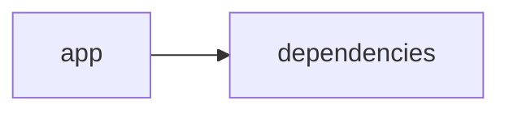

# Documentación del Proyecto

## Guía de Usuario
# Guía de Usuario

Bienvenido a nuestra herramienta de análisis y procesamiento de información. A continuación, te ofrecemos una guía práctica para que aproveches al máximo todas las funcionalidades que hemos desarrollado para facilitar el manejo y análisis de archivos y datos.

---

## 📱 ¿Qué es esta aplicación?

- **Propósito principal**: Esta aplicación te permite procesar archivos PDF, analizar conversaciones y extraer insights de la Voz del Cliente (VoC) utilizando modelos de lenguaje basados en IA, todo a través de una interfaz web interactiva desarrollada con Streamlit.
- **Problema que resuelve**: Facilita el trabajo con grandes volúmenes de información y documentos, permitiendo transformar datos en insights accionables sin necesidad de conocimientos técnicos avanzados.
- **Beneficios clave**:
  - Conversión y análisis de archivos PDF de manera rápida y precisa.
  - Extracción de información relevante de conversaciones y opiniones de clientes.
  - Visualización intuitiva de resultados en una interfaz web amigable.
  - Automatización del análisis mediante modelos de lenguaje, ahorrando tiempo y recursos.
- **Audiencia objetivo**: Personas y equipos que trabajan en áreas de atención al cliente, análisis de datos, marketing y gestión de documentos, que buscan optimizar la comprensión de grandes volúmenes de información de manera sencilla y eficiente.

---

## ✨ Funcionalidades Principales

### Interfaz Web Interactiva con Streamlit
- **¿Qué hace?**: Ofrece un entorno web amigable donde podrás interactuar con las demás funcionalidades de la aplicación.
- **¿Cuándo usarla?**: Al iniciar la aplicación o cuando quieras visualizar y manipular los resultados del análisis.
- **¿Cómo acceder?**: Inicia la aplicación en tu navegador siguiendo el enlace o dirección IP proporcionada.
- **Resultado esperado**: Una interfaz limpia e intuitiva que te permite navegar y usar las demás herramientas sin complicaciones.

### Procesamiento de Archivos PDF
- **¿Qué hace?**: Permite cargar y extraer contenido de archivos PDF para que pueda ser analizado.
- **¿Cuándo usarla?**: Cuando tengas un documento PDF del que necesites extraer datos o información para su análisis posterior.
- **¿Cómo acceder?**: Desde la interfaz principal, selecciona la opción “Cargar PDF”, y sigue las instrucciones para subir el archivo.
- **Resultado esperado**: El contenido del PDF se muestra en pantalla y se prepara para análisis, con datos estructurados y listos para ser procesados.

### Análisis con Modelos de Lenguaje (IA)
- **¿Qué hace?**: Utiliza modelos de lenguaje basados en IA para interpretar y extraer insights de textos y documentos.
- **¿Cuándo usarla?**: Cuando necesites obtener un resumen, identificar temas clave o entender profundamente el contenido de un documento.
- **¿Cómo acceder?**: Selecciona la opción “Analizar Texto” o “Ejecutar IA” desde el menú principal una vez que el contenido esté cargado.
- **Resultado esperado**: Se desplegarán insights, resúmenes y puntos clave del texto analizado, facilitando la toma de decisiones.

### Análisis de Conversaciones
- **¿Qué hace?**: Analiza transcripciones o registros de conversaciones para identificar patrones, emociones y temas recurrentes.
- **¿Cuándo usarla?**: Úsala cuando tengas datos de llamadas, chats o cualquier forma de comunicación que requiera un análisis profundo.
- **¿Cómo acceder?**: Dentro de la interfaz, elige “Analizar Conversaciones”, sube la transcripción o registro, y ejecuta la herramienta.
- **Resultado esperado**: Se presentará un informe con visualizaciones y métricas que resuman los puntos clave de las conversaciones analizadas.

### Análisis de Voz del Cliente (VoC)
- **¿Qué hace?**: Examina los comentarios, opiniones y feedback de los clientes para entender su experiencia y satisfacción.
- **¿Cuándo usarla?**: Cuando recolectes feedback de clientes y necesites identificar áreas de mejora o puntos fuertes en el servicio.
- **¿Cómo acceder?**: Desde el menú principal, selecciona “Análisis VoC”, carga o introduce el feedback, y ejecuta el análisis.
- **Resultado esperado**: Obtendrás un informe detallado que resalta tendencias y sentimientos predominantes en las opiniones de los clientes.

---

## 🚀 Cómo Empezar

### Primer Uso
1. **Requisitos previos**:  
   - Acceso a un navegador web moderno.  
   - Tener listos los archivos PDF, transcripciones o feedback para análisis.
2. **Acceso inicial**:  
   - Ingresa a la aplicación a través del enlace o dirección IP proporcionada por tu administrador.
3. **Configuración básica**:  
   - Acepta cualquier configuración inicial o permisos que se te soliciten.
4. **Primera tarea recomendada**:  
   - Carga un documento PDF o una transcripción y prueba la funcionalidad de “Procesamiento de Archivos PDF” para familiarizarte con la herramienta.

### Flujo Típico de Uso
1. **Paso 1**: Ingresa a la aplicación mediante tu navegador.
2. **Paso 2**: Selecciona la funcionalidad deseada (por ejemplo, “Cargar PDF” para procesar un documento).
3. **Paso 3**: Sigue las instrucciones en pantalla para subir y analizar tu archivo.
4. **Paso 4**: Revisa los resultados del análisis y utiliza las visualizaciones interactivas para profundizar en la información.

---

## 💡 Casos de Uso Comunes

### Escenario 1: Análisis de un Reporte en PDF
**Situación**: Tienes un reporte en PDF que contiene información detallada de ventas.  
**Pasos**: 
1. Selecciona “Procesamiento de Archivos PDF” desde la interfaz.
2. Carga el archivo y espera a que se extraiga el contenido.
3. Usa “Análisis con Modelos de Lenguaje” para obtener un resumen y resaltar los puntos clave.
**Resultado final**: Un resumen claro de las tendencias de ventas y áreas de oportunidad.

### Escenario 2: Evaluación de Feedback de Clientes
**Situación**: Requieres entender la satisfacción del cliente a partir de sus comentarios.  
**Pasos**: 
1. Accede a “Análisis de Voz del Cliente (VoC)”.
2. Sube o introduce el feedback recogido.
3. Ejecuta el análisis para identificar temas y sentimientos predominantes.
**Resultado final**: Un informe que resalta las áreas positivas y las oportunidades de mejora basadas en las opiniones de los usuarios.

### Escenario 3: Revisión de Conversaciones del Soporte
**Situación**: Deseas evaluar las interacciones en el servicio de atención al cliente.  
**Pasos**: 
1. Ve a “Análisis de Conversaciones”.
2. Carga la transcripción del chat o llamadas.
3. Analiza los patrones y problemáticas recurrentes.
**Resultado final**: Un diagnóstico con insights para mejorar la calidad del servicio al cliente.

---

## ❓ Preguntas Frecuentes

**P: ¿Cómo cargo un archivo PDF para su procesamiento?  
R:** En la pantalla principal, selecciona “Cargar PDF”, elige el archivo desde tu dispositivo y confirma la carga. Asegúrate de que el archivo esté en formato PDF.

**P: ¿Qué sucede si el análisis tarda demasiado tiempo?  
R:** Revisa tu conexión a Internet y asegúrate de que el archivo no sea excesivamente grande. Si el problema persiste, reinicia la aplicación o contacta al soporte.

**P: ¿Es seguro cargar documentos confidenciales en la aplicación?  
R:** Sí, la aplicación utiliza medidas de seguridad para proteger tu información. Sin embargo, te recomendamos evitar subir documentos altamente sensibles si existen dudas sobre la seguridad en tu red.

**P: ¿Qué limitaciones tiene la aplicación?  
R:**  
- No está diseñada para procesar archivos en otros formatos que no sean PDF.  
- No sustituye a un análisis humano en situaciones complejas que requieran interpretación avanzada.  
- La precisión del análisis depende de la calidad del texto y de la transcripción.

---

## 🆘 Solución de Problemas

### Problema: El archivo PDF no se carga correctamente
**Síntomas**: La aplicación muestra un error o no responde al intentar cargar el archivo.  
**Causa probable**: El archivo puede estar dañado o no ser un PDF válido.  
**Solución**:  
1. Verifica que el archivo esté en buen estado y sea un PDF.  
2. Intenta cargar otro archivo para descartar problemas generales.  
3. Si el error persiste, reinicia la aplicación y vuelve a intentarlo.

### Problema: El análisis tarda demasiado en completarse
**Síntomas**: La herramienta de análisis permanece en “cargando” por un tiempo inusualmente largo.  
**Causa probable**: El archivo o la conversación puede ser muy grande o contener errores de formato.  
**Solución**:  
1. Considera dividir el contenido en partes más pequeñas.  
2. Revisa la conexión a Internet y reinicia la aplicación si es necesario.

### Problema: Resultados del análisis incompletos o incorrectos
**Síntomas**: La salida del análisis no coincide con la información esperada o muestra datos incompletos.  
**Causa probable**: Puede deberse a un formato inadecuado del contenido o a limitaciones del modelo de lenguaje.  
**Solución**:  
1. Asegúrate de que el contenido esté bien estructurado y sin errores.  
2. Vuelve a ejecutar el análisis y revisa la documentación del servicio para sugerencias adicionales.

---

## 📞 Soporte y Contacto
- **¿Necesitas ayuda adicional?**  
  Comunícate con nuestro equipo de soporte enviando un correo a soporte@ejemplo.com o utilizando el chat en vivo disponible en la aplicación.
- **¿Encontraste un error?**  
  Reporta cualquier fallo o comportamiento inesperado a través de la opción “Reportar un Error” en el menú de la aplicación.
- **¿Tienes sugerencias?**  
  Envíanos tus comentarios y sugerencias a feedback@ejemplo.com para seguir mejorando la experiencia de usuario.

---

Esta guía está pensada para ayudarte a comenzar y aprovechar todas las funcionalidades de la herramienta de forma rápida y sencilla. ¡Esperamos que encuentres esta aplicación útil y fácil de usar!

## Documentación Técnica
# Documentación Técnica

La presente documentación está orientada a desarrolladores y equipos técnicos que requieran comprender, mantener y extender la aplicación VoC Analyst. A continuación se detalla la arquitectura general, el stack tecnológico, los componentes principales, las “APIs internas”, el modelo de datos, la guía de desarrollo y aspectos críticos a tener en cuenta.

---

## 🏗️ Arquitectura del Sistema

- **Patrón arquitectónico utilizado:**  
  VoC Analyst adopta una arquitectura modular monolítica de tipo “híbrido”. La aplicación se compone de dos bloques principales:
  - **Capa de Presentación (Frontend):**  
    Implementada completamente con Streamlit. Se encarga de la interacción con el usuario, la carga de archivos, la visualización interactiva de resultados y la gestión del estado mediante `st.session_state`.
  - **Capa de Lógica y Análisis (Backend):**  
    Esta capa procesa la información mediante módulos para extracción y transformación de texto (mediante PyPDF2), parser de conversaciones y normalización (incluyendo redacción de información sensible o PII) y la integración con proveedores de Modelos de Lenguaje (LLM) como OpenAI, Anthropic y Google GenAI.

- **Diagrama de componentes (Mermaid):**

  ```mermaid
  graph LR
      A[Interfaz Streamlit (Frontend)] --> B[Procesamiento y Validación de Archivos]
      A --> C[Gestión del Estado (st.session_state)]
      B --> D[Extracción de Texto (PyPDF2)]
      B --> E[Parser y Redacción de PII]
      A --> F[LLMBackend (Lógica de Negocio)]
      F --> G[Proveedores LLM (OpenAI, Anthropic, Gemini)]
  ```

- **Flujo de datos principal:**  
  1. El usuario carga uno o varios archivos (por ejemplo, PDFs) a través de la interfaz web.  
  2. Las funciones de validación (por ejemplo, `validate_file_size`) y extracción (`extract_text_from_pdf`) se encargan de procesar los archivos.  
  3. El contenido extraído es enviado al módulo de parser para normalizar y redactar la información confidencial (PII).  
  4. El módulo **LLMBackend** establece la comunicación con el proveedor LLM configurado, enviando prompts y recibiendo insights, análisis de sentimientos, detección de temas y recomendaciones.  
  5. Los resultados se almacenan en `st.session_state` y se muestran interactivamente al usuario.

- **Dependencias críticas y propósito:**  
  - **Streamlit:** Crea la interfaz web interactiva y gestiona el estado de la sesión.  
  - **PyPDF2:** Extrae el contenido textual de archivos PDF.  
  - **Pandas:** Facilita la manipulación y visualización de datos (tablas, DataFrames, etc.).  
  - **LLM SDKs (openai, anthropic, google-genai):** Permiten la integración con proveedores de modelos de lenguaje para análisis semántico avanzado.  
  - **Librerías adicionales:** json, os, time, datetime, uuid, zipfile, io, typing (para utilidades y manejo de datos).

---

## 📋 Stack Tecnológico

- **Lenguajes:**  
  Principalmente Python (catalogado en “other” en el repositorio).

- **Frameworks y Librerías:**  
  - **Streamlit** (>= 1.49.1): Para la creación de la interfaz web interactiva.
  - **PyPDF2** (>= 3.0.1): Para extraer el contenido textual de los documentos PDF.
  - **Pandas** (>= 2.3.2): Para manipulación y visualización de datos.
  - **SDKs de LLM:**  
    - `openai`: Para integrar modelos de OpenAI.
    - `anthropic`: Para conectar con proveedores de Anthropic.
    - `google-genai`: Para integrar modelos de Google GenAI (Gemini).
  - Librerías estándar: json, os, time, datetime, uuid, zipfile, io, typing.

- **Base de Datos:**  
  No se utiliza una base de datos relacional tradicional. El almacenamiento de datos se maneja de forma transitoria en memoria mediante `st.session_state`.

- **APIs externas:**  
  La aplicación se integra con las APIs de proveedores LLM (OpenAI, Anthropic y Google GenAI), mediante llamadas directas desde el módulo LLMBackend.

- **Infraestructura:**  
  La aplicación se despliega como una aplicación web simple, ejecutable en entornos locales, servidores o contenedores Docker.

---

## 🔧 Componentes Principales

### 1. Aplicación Streamlit

- **Propósito:**  
  Proveer la interfaz de usuario interactiva para:
  - Configurar la aplicación.
  - Cargar y validar archivos.
  - Visualizar resultados generados a partir del análisis.

- **Ubicación:**  
  Principalmente en el archivo `app.py` ubicado en la raíz o en el directorio `app/`, junto con módulos auxiliares como `parser.py` y `utils.py`.

- **Interfaces y Métodos Expuestos:**  
  - **Configuración de Página:** Configurada mediante `st.set_page_config`.
  - **Gestión del Estado:** Uso de `st.session_state` para variables como:
    - `analysis_results`: Contiene los resultados del análisis.
    - `run_id`: Identificador único para cada ejecución.
    - `uploaded_files_data`: Lista de archivos procesados con sus metadatos.
    - `processing_complete`: Indicador booleano sobre la finalización del proceso.
  - **Funciones Auxiliares:**
    - `extract_text_from_pdf(pdf_file) → str`: Recorre cada página del PDF para extraer y concatenar el texto.
    - `validate_file_size(file) → bool`: Verifica que el archivo no exceda el tamaño máximo permitido (por ejemplo, 100MB).

- **Dependencias:**  
  Utiliza Streamlit, PyPDF2, Pandas y utilidades de Python (os, time, etc.).

---

### 2. Módulo LLMBackend

- **Propósito:**  
  Facilitar la integración con proveedores de Modelos de Lenguaje (LLM) para analizar y generar insights a partir del texto. Permite la configuración dinámica del proveedor, modelo y manejo de reintentos.

- **Ubicación:**  
  Se encuentra en el archivo `llm_backend.py` en la raíz del repositorio.

- **Interfaces y Métodos Expuestos:**
  - **ModelConfig:**  
    Clase de configuración con los siguientes atributos:
    - `provider`: Proveedor elegido (ejemplo: "openai", "anthropic", "gemini").
    - `model`: Modelo específico a emplear.
    - `api_key`: Clave de autenticación.
    - `max_retries` y `retry_delay`: Parámetros para reintentos en caso de fallos.
  
  - **LLMBackend:**  
    Métodos destacados:
    - `__init__(config: ModelConfig)`: Inicializa el servicio configurado.
    - `_initialize_client()`: Selecciona y retorna la instancia del cliente LLM según el proveedor.
    - `_load_parse_prompt()` y `_load_analyze_prompt()`: Cargan o definen los prompts utilizados para parsear la conversación y generar análisis.
    - `analyze_text(text: str) → Dict[str, Any]`: Envía el texto a analizar y retorna un diccionario con los insights generados por el modelo LLM.
  
- **Dependencias:**  
  Utiliza las librerías específicas para cada proveedor (openai, anthropic, google-genai).

---

### 3. Parser y Procesamiento de Conversaciones

- **Propósito:**  
  Procesar y normalizar las conversaciones extraídas de los archivos (o ingresadas manualmente), para estructurarlas y prepararlas para el análisis LLM. Esto incluye:
  - **Extracción y Normalización:** Dividir el texto en turnos de conversación, identificar roles (cliente, agente, desconocido) y extraer metadatos como timestamps.
  - **Redacción de PII:** Detectar y reemplazar información sensible (como correos, teléfonos, tarjetas) por etiquetas estándar (por ejemplo, `[EMAIL]`, `[PHONE]`).
  - **Generación de JSON Estructurado:** Convertir la conversación en un formato estructurado que permita la inmediata integración con los módulos de análisis y visualización.

- **Ubicación y Organización:**  
  Generalmente se encuentra en un archivo denominado `parser.py` o integrado en módulos de procesamiento dentro de `app/`.

- **Dependencias y Requisitos:**  
  Se apoya en expresiones regulares y utilidades propias de Python para la transformación y la redacción de PII.

---

## 🚀 APIs y Endpoints

Aunque no existe una API REST externa, la aplicación dispone de “APIs internas” definidas a nivel de funciones y métodos que orquestan el procesamiento:

- **extract_text_from_pdf(pdf_file) → str:**  
  Función que extrae el contenido textual del PDF utilizando PyPDF2. Maneja excepciones y reporta errores mediante `st.error`.

- **validate_file_size(file) → bool:**  
  Verifica que el archivo subido tenga un tamaño inferior al límite permitido (100MB).

- **LLMBackend.analyze_text(text: str) → Dict[str, Any]:**  
  Método que envía el texto combinado con el prompt de análisis al proveedor LLM y retorna el resultado (insights, análisis de sentimientos, temas, recomendaciones, etc.).

- **Funciones del Parser:**  
  Transforman la conversación en un formato JSON estructurado, normalizando la información y asegurando la protección de la PII.

---

## 💾 Modelo de Datos

- **Entidad Principal: Conversación**  
  Representada internamente en formato JSON con las siguientes propiedades:
  - `conversation_id`: Identificador único de la conversación.
  - `messages`: Lista de mensajes en la conversación, donde cada mensaje incluye:
    - `sender`: Rol del emisor (cliente, agente, desconocido).
    - `timestamp`: Momento del mensaje (si está disponible).
    - `content`: Texto del mensaje, con la PII ya redactada.
    - `metadata`: Información adicional (canal, duración, etc.).

- **Transformaciones y Validaciones:**  
  - Se valida que el texto sea no vacío y se normalice correctamente.
  - Se aplican reglas de redacción para anonimizar datos sensibles.
  - Se estructura la salida para integrarla con el análisis y la visualización.

---

## 🛠️ Guía de Desarrollo

### 6.1 Configuración del Entorno

1. **Prerrequisitos:**  
   - Tener instalado Python 3.8 o superior.
   - Conexión a Internet para acceder a las APIs de los proveedores LLM en producción.
  
2. **Instalación:**  
   - Clonar el repositorio:
     ```bash
     git clone https://github.com/tu_usuario/voc-analyst.git
     cd voc-analyst
     ```
   - Crear y activar un entorno virtual:
     ```bash
     python -m venv env
     source env/bin/activate     # En Linux/Mac
     env\Scripts\activate        # En Windows
     ```
   - Instalar las dependencias:
     ```bash
     pip install -r requirements.txt
     ```

3. **Variables de Entorno:**  
   Configura las API keys mediante variables de entorno, por ejemplo:
   - `OPENAI_API_KEY`
   - `ANTHROPIC_API_KEY`
   - `GEMINI_API_KEY`

---

### 6.2 Estructura del Código

La organización del repositorio es la siguiente:

```
VoC-Analyst/
├── app/
│   ├── app.py                # Punto de entrada de la aplicación (interfaz Streamlit)
│   ├── parser.py             # Funciones de parseo y procesamiento de conversaciones
│   └── utils.py              # Funciones auxiliares (extracción de texto, validación, etc.)
├── llm_backend.py            # Módulo para la integración con proveedores LLM
├── requirements.txt          # Lista de dependencias
└── README.md                 # Documentación general y guía de usuario
```

- **Estándares de Código:**
  - Se emplean nombres descriptivos en minúsculas y con guiones bajos.
  - Se sigue el patrón de separación entre la lógica de la interfaz (Streamlit) y la lógica de negocio (LLMBackend, Parser).
  - Se recomienda escribir pruebas unitarias para funciones críticas con frameworks como pytest.

---

### 6.3 Pruebas y Validación

- **Pruebas Unitarias:**  
  Se debe cubrir la extracción de texto (extract_text_from_pdf), la validación del tamaño del archivo (validate_file_size) y la interacción con el módulo LLMBackend (analyze_text).

- **Validación de Integración:**  
  Simular peticiones al proveedor LLM para asegurar que:
  - Los prompts se carguen correctamente.
  - Se maneje el número correcto de reintentos ante fallos.
  
- **Manejo de Errores y Logging:**  
  Registrar errores y excepciones utilizando el módulo logging, facilitando la depuración en producción.

---

## Diagrama del Sistema

El siguiente diagrama ilustra la relación general entre la interfaz de usuario, el módulo LLMBackend y el parser de conversaciones:

```mermaid
graph LR
    A[Interfaz Streamlit] --> B[Procesamiento de Archivos]
    B --> C[Parser y Normalización de Conversaciones]
    A --> D[LLMBackend]
    D --> E[Proveedores LLM (OpenAI, Anthropic, Gemini)]
```

---

## 🔍 Puntos de Atención

- **Limitaciones Conocidas:**
  - La extracción de texto depende de la calidad de los PDFs; documentos basados en imágenes pueden requerir OCR.
  - El rendimiento puede verse afectado al procesar archivos muy extensos (cercanos a 100MB).
  - La precisión de los análisis de modelos LLM depende de la claridad y formato del texto extraído.

- **Consideraciones de Rendimiento:**
  - Se recomienda implementar procesamiento en lote o técnicas de caching para análisis repetitivos.
  - Ajustar los parámetros de reintentos (`max_retries` y `retry_delay`) para asegurar mayor estabilidad en la comunicación con el LLM.

- **Aspectos de Seguridad:**
  - Proteger las API keys utilizando variables de entorno.
  - Redactar la información sensible (PII) antes de enviar datos a proveedores externos.
  - Revisar y actualizar continuamente la política de privacidad y manejo de datos.

- **TODOs y Mejoras Sugeridas:**
  - Ampliar el soporte a otros formatos de archivo (por ejemplo, TXT).
  - Integrar OCR para PDFs basados en imágenes.
  - Mejorar la modularidad de las funciones de parseo y manejo de errores.

---

## Guía de Usuario

Esta guía está orientada a usuarios finales que deseen aprovechar la herramienta para analizar documentos y extraer insights de sus datos.

### Acceso y Uso Básico

1. **Acceso a la Aplicación:**
   - Abra un navegador web y diríjase a la URL designada para la aplicación (ejemplo: http://localhost:8501).

2. **Carga de Archivos PDF:**
   - Use el botón “Subir Archivo” para seleccionar y cargar un archivo PDF.
   - Espere a que el contenido sea procesado y extraído; se mostrará un resumen del estado.

3. **Análisis con IA:**
   - Una vez procesado el archivo, haga clic en “Iniciar Análisis” para que la herramienta envíe el contenido a los modelos de lenguaje.
   - La herramienta analizará el contenido y generará un informe interactivo que incluye insights, análisis de sentimientos y recomendaciones.

4. **Visualización de Resultados:**
   - Consulte los paneles de resultados para ver indicadores clave (KPI), análisis de temas y recomendaciónes.
   - Utilice opciones de filtrado y exploración para profundizar en la información.
   - Exporte los resultados en formato JSON o CSV si lo necesita.

### Preguntas Frecuentes (FAQ)

**¿Qué tipos de archivos se pueden procesar?**  
Actualmente, se soportan archivos PDF. Próximamente se evaluará la compatibilidad con otros formatos.

**¿Es necesario tener conocimientos técnicos para usar la herramienta?**  
No, la aplicación está diseñada para ser intuitiva y accesible incluso para usuarios sin experiencia previa en análisis de datos o programación.

**¿Qué ocurre si el análisis no arroja resultados?**  
Verifique que el archivo cargado esté en buen estado y que contenga texto seleccionable. Si el problema persiste, contacte al soporte técnico.

**¿Cómo se garantiza la seguridad de la información?**  
La herramienta procesa los datos en memoria y no almacena información sensible de forma persistente. Además, se recomienda revisar la política de privacidad para más detalles.

**¿Puedo recibir asistencia en caso de problemas?**  
Sí, consulte la sección de “Ayuda” en la aplicación o comuníquese con el equipo de soporte.

---

Esta documentación técnica y guía de usuario tienen como objetivo brindar una visión completa tanto para desarrolladores como para usuarios finales, facilitando la utilización y el mantenimiento de VoC Analyst. Para cualquier consulta adicional o sugerencia de mejora, por favor contacte al equipo de desarrollo.

---

## Diagrama


¡Feliz codificación y éxito en el análisis de la Voz del Cliente!


## Diagrama
```mermaid
graph LR\nApp["app"]-->Deps["dependencies"]\n
```
