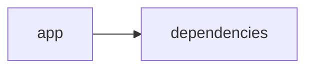

# Documentación del Proyecto

## Guía de Usuario
# Guía de Usuario

Bienvenido a tu nueva herramienta de análisis y procesamiento de información. Esta guía te ayudará a aprovechar al máximo todas las funcionalidades que ofrece la aplicación.

---

## 📱 ¿Qué es esta aplicación?

- **Propósito principal:**  
  Esta aplicación te permite procesar y analizar archivos PDF, conversaciones y registros de Voz del Cliente (VoC) a través de una intuitiva interfaz web. Utiliza modelos de lenguaje (IA) para extraer insights valiosos de tus datos.

- **Problema que resuelve:**  
  Facilita la extracción de información relevante de documentos y registros de comunicación, eliminando la necesidad de revisar manualmente grandes volúmenes de datos y permitiendo una toma de decisiones más rápida y fundamentada.

- **Beneficios clave:**  
  - Ahorro de tiempo al automatizar el análisis de documentos y conversaciones.  
  - Mayor precisión en la identificación de tendencias y áreas de mejora.  
  - Visualización clara y accesible de los resultados a través de una interfaz amigable.

- **Audiencia objetivo:**  
  Ideal para empresas y profesionales que manejan grandes volúmenes de documentación, equipos de atención al cliente y áreas de mejora continua, analítica de datos y control de calidad.

---

## ✨ Funcionalidades Principales

### Interfaz Web Interactiva con Streamlit
- **¿Qué hace?**  
  Proporciona una plataforma fácil de usar para interactuar con todas las herramientas de la aplicación.
  
- **¿Cuándo usarla?**  
  Úsala cada vez que necesites cargar archivos, configurar análisis o visualizar resultados.
  
- **¿Cómo acceder?**  
  Ingresa a la aplicación a través de tu navegador web utilizando la URL proporcionada e inicia sesión con tus credenciales.
  
- **Resultado esperado:**  
  Visualizarás un panel de control completo con menús y opciones claras para comenzar tu análisis.

### Procesamiento de Archivos PDF
- **¿Qué hace?**  
  Permite subir y procesar documentos PDF, extrayendo el texto y otros elementos relevantes para su análisis.
  
- **¿Cuándo usarla?**  
  Cuando necesites analizar información contenida en archivos PDF, como reportes, facturas o documentación técnica.
  
- **¿Cómo acceder?**  
  Dentro del panel principal, selecciona la opción “Cargar PDF” y sigue los pasos para subir tu archivo.
  
- **Resultado esperado:**  
  El sistema mostrará el contenido del PDF listo para ser analizado, indicando cualquier posible error en la lectura.

### Análisis con Modelos de Lenguaje (IA)
- **¿Qué hace?**  
  Utiliza inteligencia artificial para interpretar y extraer insights relevantes del texto procesado.
  
- **¿Cuándo usarla?**  
  Cada vez que se necesite obtener un resumen, detectar patrones o identificar palabras clave en tus documentos.
  
- **¿Cómo acceder?**  
  Selecciona la opción “Analizar Texto” tras haber cargado y procesado tus documentos.
  
- **Resultado esperado:**  
  Recibirás un resumen o un listado de insights destacados extraídos automáticamente de tu documento.

### Análisis de Conversaciones
- **¿Qué hace?**  
  Analiza diálogos y registros de comunicación para identificar temas, emociones y tendencias en las conversaciones.
  
- **¿Cuándo usarla?**  
  Al trabajar con transcripciones de reuniones, chats de atención al cliente o cualquier otro registro de comunicación verbal o escrita.
  
- **¿Cómo acceder?**  
  Dentro del menú principal, elige “Analizar Conversaciones” y carga el archivo o ingresa el texto de la conversación.
  
- **Resultado esperado:**  
  Obtendrás un análisis visual y textual de los temas tratados en las conversaciones, con recomendaciones o insights destacados.

### Análisis de Voz del Cliente (VoC)
- **¿Qué hace?**  
  Se enfoca en evaluar y resumir los comentarios y opiniones de tus clientes, identificando necesidades y áreas de mejora.
  
- **¿Cuándo usarla?**  
  Al recopilar feedback de clientes, encuestas post-servicio o cualquier interacción que refleje la experiencia del cliente.
  
- **¿Cómo acceder?**  
  En el menú principal, selecciona “Analizar VoC” y sigue las instrucciones para subir o ingresar el feedback.
  
- **Resultado esperado:**  
  Verás un informe con los puntos más relevantes de la experiencia de tus clientes, ayudándote a tomar acciones para mejorar el servicio.

---

## 🚀 Cómo Empezar

### Primer Uso

1. **Requisitos previos:**  
   - Tener acceso a una conexión a Internet.  
   - Contar con los archivos PDF o datos de conversaciones que desees analizar.

2. **Acceso inicial:**  
   - Ingresa a la aplicación mediante la URL proporcionada.  
   - Realiza el inicio de sesión utilizando tu usuario y contraseña.

3. **Configuración básica:**  
   - Configura tus preferencias de idioma y notificaciones si aplica.  
   - Familiarízate con el panel de control y la ubicación de cada funcionalidad.

4. **Primera tarea recomendada:**  
   - Sube un archivo PDF y prueba el procesamiento y análisis de texto para ver cómo se generan los insights.

### Flujo Típico de Uso

1. **Paso 1:** Inicia sesión e introduce al panel principal de la aplicación.
2. **Paso 2:** Selecciona la funcionalidad que necesites (por ejemplo, “Cargar PDF”).
3. **Paso 3:** Sigue las instrucciones en pantalla para subir el archivo o ingresar el texto.
4. **Paso 4:** Revisa los resultados en el panel de análisis: verás resúmenes, insights y recomendaciones de manera clara y visual.

---

## 💡 Casos de Uso Comunes

### Escenario 1: Análisis de Reportes Financieros
**Situación:**  
Necesitas extraer información esencial de reportes PDF extensos para tomar decisiones estratégicas.

**Pasos:**  
1. Ingresa a la opción “Cargar PDF”.  
2. Sube el informe financiero.  
3. Utiliza “Analizar Texto” para extraer resúmenes y puntos clave.  
4. Revisa el informe resumido para identificar tendencias.

### Escenario 2: Evaluación de Conversaciones de Atención al Cliente
**Situación:**  
Quieres identificar las áreas de mejora en el servicio al cliente a partir de las conversaciones con tus agentes.

**Pasos:**  
1. Selecciona “Analizar Conversaciones”.  
2. Carga la transcripción de las interacciones.
3. Observa el análisis que destaca temas recurrentes y emociones.
4. Utiliza la información para mejorar protocolos de atención.

### Escenario 3: Recopilación de Voz del Cliente (VoC)
**Situación:**  
Requieres recoger y analizar las opiniones de los clientes sobre un nuevo producto o servicio.

**Pasos:**  
1. Accede a “Analizar VoC”.  
2. Ingresa o sube el feedback recibido a través de encuestas.
3. Analiza el informe que muestra puntos fuertes y áreas a mejorar.
4. Planifica acciones basadas en los insights recabados.

---

## ❓ Preguntas Frecuentes

**P: ¿Cómo puedo estar seguro de que los datos analizados son precisos?**  
R: La aplicación utiliza modelos de lenguaje avanzados para proporcionar análisis precisos. Revisa siempre el informe final y, en caso de dudas, consulta la sección de soporte.

**P: ¿Qué debo hacer si el PDF no se procesa correctamente?**  
R: Verifica que el archivo PDF esté en buen estado y cumpla con los requisitos. Si el problema persiste, consulta la sección de solución de problemas.

**P: ¿Es seguro subir información sensible a la aplicación?**  
R: Sí, la aplicación cuenta con medidas de seguridad para proteger tus datos. Se recomienda familiarizarse con las políticas de privacidad para mayor tranquilidad.

**P: ¿Cuáles son las limitaciones principales de la aplicación?**  
R:  
- No procesa archivos en formatos distintos a PDF.  
- El análisis depende de la calidad del texto extraído.  
- No está diseñada para editar documentos, solo para analizarlos.

---

## 🆘 Solución de Problemas

### Problema: El archivo PDF no se carga correctamente
- **Síntomas:**  
  Mensaje de error al intentar subir el archivo o ausencia de respuesta después de la carga.
- **Causa probable:**  
  El archivo puede estar dañado o en un formato incompatible.
- **Solución:**  
  Verifica que el archivo PDF esté en buenas condiciones y vuelva a intentarlo. Si el problema continúa, revisa las especificaciones soportadas o contacta al soporte.

### Problema: El análisis de lenguaje no genera resultados claros
- **Síntomas:**  
  El informe de análisis aparece vacío o con información poco útil.
- **Causa probable:**  
  El texto ingresado puede tener errores de formato o estar incompleto.
- **Solución:**  
  Revisa el contenido del archivo o transcripción, corrige posibles errores y vuelve a ejecutar el análisis.

### Problema: Dificultad para acceder a la interfaz de usuario
- **Síntomas:**  
  La página web no carga o muestra errores de conexión.
- **Causa probable:**  
  Problemas de conexión a internet o mantenimiento del servidor.
- **Solución:**  
  Confirma tu conexión a internet y, si el problema persiste, intenta acceder más tarde o contacta al soporte técnico.

---

## 📞 Soporte y Contacto

- **¿Necesitas ayuda adicional?**  
  Puedes comunicarte con el equipo de soporte a través del correo soporte@tuaplicacion.com.
  
- **¿Encontraste un error?**  
  Reporta el incidente utilizando el formulario de "Reportar Error" disponible en la aplicación.
  
- **¿Tienes sugerencias?**  
  Envíanos tu feedback a feedback@tuaplicacion.com para ayudarnos a mejorar.

---

Esperamos que esta guía te sea de gran utilidad para aprovechar al máximo todas las funcionalidades de la aplicación. ¡Muchas gracias por confiar en nosotros!

## Documentación Técnica
A continuación se muestra la documentación técnica completa en Markdown, estructurada según lo solicitado, basada en el análisis del código y las muestras entregadas:

----------------------------------------------------------------
# Documentación Técnica

Esta documentación técnica está orientada a desarrolladores y equipos técnicos que necesiten comprender, mantener y extender la aplicación VoC Analyst. Se describen la arquitectura del sistema, el stack tecnológico, los componentes principales, las “APIs internas”, el modelo de datos, las guías de desarrollo y los puntos de atención críticos.

----------------------------------------------------------------
## 🏗️ Arquitectura del Sistema

- **Patrón Arquitectónico Utilizado:**  
  La aplicación adopta una arquitectura modular monolítica “híbrida” en la que se integran la interfaz de usuario (Frontend) y la lógica de negocio (Backend) en una única solución.  
  - La **Capa de Presentación** se implementa con Streamlit, la cual se encarga de la carga de archivos, la interacción con el usuario, la visualización de resultados y la gestión del estado de la sesión mediante `st.session_state`.
  - La **Capa de Lógica y Análisis** abarca la extracción y procesamiento de archivos (por ejemplo, utilizando PyPDF2 para extraer texto de PDFs) y el módulo LLMBackend, que integra múltiples proveedores de modelos de lenguaje (LLM) como OpenAI, Anthropic y Google GenAI, para analizar y generar insights del contenido.

- **Diagrama de Componentes:**  
  La siguiente representación en Mermaid ilustra la relación general entre los componentes:
  
  ```mermaid
  graph LR
      A[Interfaz Streamlit (Frontend)] --> B[Procesamiento y Validación de Archivos]
      A --> C[Gestión del Estado (st.session_state)]
      B --> D[Extracción de Texto (PyPDF2)]
      B --> E[Parser y Redacción de PII]
      A --> F[LLMBackend (Lógica de Negocio)]
      F --> G[Proveedores LLM (OpenAI, Anthropic, Gemini)]
  ```

- **Flujo de Datos Principal:**  
  1. El usuario carga uno o varios archivos (por ejemplo, PDFs) a través de la interfaz web.  
  2. Se validan los archivos (por ejemplo, con `validate_file_size`) y se extrae el contenido textual mediante funciones como `extract_text_from_pdf` (que utiliza PyPDF2).  
  3. El texto extraído se procesa a través del parser, que normaliza la conversación, segmenta mensajes y redacta datos sensibles (PII).  
  4. La lógica de negocio usa el módulo LLMBackend (configurado mediante ModelConfig) para enviar el contenido a los proveedores de LLM y obtener insights (análisis de sentimientos, detección de temas, recomendaciones, etc.).  
  5. Los resultados se almacenan en `st.session_state` y se presentan en la UI a través de gráficos, tablas y paneles interactivos.

- **Dependencias Críticas y su Propósito:**  
  - **Streamlit:** Proporciona la interfaz web interactiva y la gestión del estado en tiempo real.  
  - **PyPDF2:** Extrae el contenido textual de los documentos PDF.  
  - **Pandas:** Facilita la manipulación y visualización de datos (por ejemplo, mostrando tableros y resúmenes en DataFrames).  
  - **LLM SDKs (openai, anthropic, google-genai):** Permiten la integración y conexión con proveedores de modelos de lenguaje para realizar análisis semántico avanzado.  
  - Otras librerías estándar (json, os, time, datetime, uuid, zipfile, io, typing) son utilizadas para operaciones de entrada/salida, manipulación de datos y manejo de excepciones.

----------------------------------------------------------------
## 📋 Stack Tecnológico

- **Lenguajes:**  
  Principalmente Python (aunque se etiqueta como “other” en el repositorio).

- **Frameworks y Librerías:**  
  - **Streamlit:** (>= 1.49.1) – Implementación de la interfaz web interactiva.  
  - **PyPDF2:** (>= 3.0.1) – Extracción de texto en documentos PDF.  
  - **Pandas:** (>= 2.3.2) – Manipulación y presentación de datos.  
  - **LLM SDKs:**  
    - `openai` – Para integrar modelos de OpenAI.  
    - `anthropic` – Para conectarse a proveedores de Anthropic.  
    - `google-genai` – Para integración con Google Gemini o modelos GenAI.
  - **Librerías estándar:** json, os, time, datetime, uuid, zipfile, io, typing.

- **Base de Datos:**  
  No se utiliza una base de datos tradicional; el almacenamiento de datos se maneja de forma transitoria en memoria utilizando el objeto `st.session_state`.

- **APIs Externas:**  
  La aplicación integra las APIs de proveedores LLM (OpenAI, Anthropic y Google GenAI) para realizar el análisis semántico y generar insights.

- **Infraestructura:**  
  La aplicación se despliega como una aplicación web simple mediante Streamlit y puede ejecutarse en entornos locales, servidores o contenedores Docker.

----------------------------------------------------------------
## 🔧 Componentes Principales

### 1. Aplicación Streamlit

- **Propósito:**  
  Gestiona la interfaz de usuario y la interacción directa del usuario con la aplicación. Se encarga de:
  - Configurar la página (título, ícono, layout).
  - Permitir la carga de archivos y almacenar los datos en `st.session_state`.
  - Invocar funciones de procesamiento, extracción de texto y visualización de resultados.

- **Ubicación:**  
  Generalmente en el archivo de entrada principal, por ejemplo, `app.py` (ubicado en la raíz o en el directorio `app/`) junto con módulos de apoyo como `utils.py` o `parser.py`.

- **Interfaces y Métodos Expuestos:**  
  - Configuración de la página mediante `st.set_page_config`.  
  - Uso de `st.session_state` para variables clave como `analysis_results`, `run_id`, `uploaded_files_data` y `processing_complete`.
  - Funciones auxiliares como:
    - `extract_text_from_pdf(pdf_file) → str`
    - `validate_file_size(file) → bool`

- **Dependencias:**  
  Requiere Streamlit, PyPDF2, Pandas y librerías estándar de Python.

---

### 2. Módulo LLMBackend

- **Propósito:**  
  Encapsular la integración con los proveedores de modelos de lenguaje (LLM) y gestionar la comunicación para realizar el análisis de texto.  
  Permite configurar de forma dinámica el proveedor y modelo a través de la clase `ModelConfig`.

- **Ubicación:**  
  Se encuentra en el archivo `llm_backend.py` (ubicado en la raíz del repositorio).

- **Interfaces y Métodos Expuestos:**  
  - **ModelConfig:**  
    – Atributos:  
      - `provider`: Selecciona el proveedor (ej. "openai", "anthropic", "gemini").
      - `model`: Modelo específico a utilizar.
      - `api_key`: Clave de API para autenticación.
      - `max_retries` y `retry_delay`: Parámetros de reintentos.
  - **LLMBackend:**  
    – Métodos:  
      - `__init__(config: ModelConfig)`: Inicializa el backend con la configuración proporcionada.
      - `_initialize_client()`: Instancia el cliente del proveedor LLM seleccionado.
      - `_load_parse_prompt()` y `_load_analyze_prompt()`: Cargan los prompts predefinidos.
      - `analyze_text(text: str) → Dict[str, Any]`: Envía el texto a analizar y retorna un diccionario con los insights.

- **Dependencias:**  
  Utiliza las librerías específicas para cada proveedor (openai, anthropic, google-genai) y las dependencias estándar de Python.

---

### 3. Procesamiento y Extracción de Archivos

- **Propósito:**  
  Gestiona la carga, validación y extracción del contenido textual de archivos, en especial documentos PDF.  
  Se enfoca en:
  - Validar que el tamaño del archivo sea inferior a 100MB (usando `validate_file_size`).
  - Extraer el texto del PDF con `extract_text_from_pdf` (utilizando PyPDF2).

- **Ejemplo de Función:**

  ```python
  def extract_text_from_pdf(pdf_file) -> str:
      """Extraer texto de archivo PDF"""
      try:
          pdf_reader = PyPDF2.PdfReader(pdf_file)
          text = ""
          for page in pdf_reader.pages:
              text += page.extract_text() + "\n"
          return text.strip()
      except Exception as e:
          st.error(f"Error al extraer texto de PDF: {str(e)}")
          return ""
  ```

- **Responsabilidades:**  
  Garantizar la correcta extracción de contenido y proporcionar mensajes de error adecuados en caso de fallo.

---

### 4. Análisis y Parseo de Conversaciones

- **Propósito:**  
  Procesar y normalizar las conversaciones extraídas de los archivos o ingresadas manualmente. Esto incluye:
  - Segmentar el texto en turnos de conversación.
  - Detectar y extraer metadatos (por ejemplo, conversation_id, timestamps, roles de interlocutores).
  - Redactar información sensible (PII), reemplazando patrones como correos, teléfonos o identificadores por etiquetas estándar (por ejemplo, [EMAIL], [PHONE]).

- **Requisitos y Flujo:**  
  - Identificar la conversación a partir del nombre del archivo o metadatos insertados.  
  - Dividir el contenido en mensajes consecutivos y asignar roles a cada uno.  
  - Realizar transformaciones para anonimizar datos sensibles.

----------------------------------------------------------------
## 🚀 APIs y Endpoints

Aunque la aplicación no expone endpoints REST públicos, se definen “APIs internas” mediante funciones y métodos que orquestan el procesamiento. Entre los principales se indican:

- **Función:** `extract_text_from_pdf(pdf_file) → str`  
  Extrae el texto de documentos PDF, usando PyPDF2 y manejando errores mediante notificaciones en la interfaz (st.error).

- **Función:** `validate_file_size(file) → bool`  
  Verifica que el tamaño del archivo sea inferior a 100MB y evita el procesamiento de archivos demasiado grandes.

- **Método:** `LLMBackend.analyze_text(text: str) → Dict[str, Any]`  
  Envía el texto, junto con un prompt de análisis, al proveedor de LLM seleccionado y retorna un diccionario con los resultados (insights, análisis de sentimiento, detección de temas, etc.).

- **Funciones del Parser de Conversaciones:**  
  Transforman el contenido conversacional en un formato estructurado (por ejemplo, JSON) con redacción de datos sensibles y extracción de metadatos importantes.

----------------------------------------------------------------
## 💾 Modelo de Datos

- **Entidades Principales: Conversación**  
  La información se estructura en formato JSON con los siguientes componentes:
  - `conversation_id`: Identificador único de la conversación.
  - `messages`: Lista de mensajes, donde cada mensaje incluye:
    - `sender`: Rol del emisor (cliente, agente, desconocido).
    - `timestamp`: Momento del mensaje.
    - `content`: Texto del mensaje (con PII redactada).
    - `metadata`: Información adicional (por ejemplo, canal de comunicación, duración).
    
- **Transformaciones y Validaciones:**  
  - Se valida que el contenido extraído sea no vacío y correctamente estructurado.
  - Se redacta la información sensible mediante expresiones regulares o técnicas similares.
  - El resultado final se organiza en un JSON homogéneo para facilitar su consumo en capas de análisis y visualización.

----------------------------------------------------------------
## 🛠️ Guía de Desarrollo

### Configuración del Entorno

1. **Prerrequisitos:**  
   - Python 3.8 o superior.
   - Conexión a Internet para realizar llamadas a APIs de proveedores LLM (en producción).
2. **Instalación:**  
   - Clonar el repositorio:
     ```bash
     git clone https://github.com/tu_usuario/voc-analyst.git
     cd voc-analyst
     ```
   - Crear y activar un entorno virtual:
     ```bash
     python -m venv env
     source env/bin/activate    # En Linux/Mac
     env\Scripts\activate       # En Windows
     ```
   - Instalar las dependencias:
     ```bash
     pip install -r requirements.txt
     ```

3. **Variables de Entorno:**  
   Configure las API keys para cada proveedor LLM (por ejemplo, `OPENAI_API_KEY`, `ANTHROPIC_API_KEY`, `GEMINI_API_KEY`) mediante variables de entorno.

---

### Estructura de Código

El proyecto se organiza con la siguiente estructura de directorios:

```
VoC-Analyst/
├── app/                  # Contiene la interfaz y módulos de procesamiento
│   ├── app.py          # Punto de entrada de la aplicación (Streamlit)
│   ├── parser.py       # Funciones de parseo y normalización de conversaciones
│   └── utils.py        # Funciones auxiliares (extracción de texto, validación, etc.)
├── llm_backend.py      # Módulo para integración con proveedores LLM
├── requirements.txt    # Lista de dependencias
└── README.md           # Documentación general y guía de usuario
```

---

### Estándares de Código

- **Convenciones de Naming:**  
  Se utilizan nombres descriptivos en minúsculas y con guiones bajos para archivos, funciones y variables (por ejemplo, `extract_text_from_pdf`).
- **Patrón de Separación:**  
  Se separa la lógica de presentación (UI con Streamlit) de la lógica de negocio y análisis (LLMBackend, Parser).
- **Testing:**  
  Se recomienda implementar pruebas unitarias (por ejemplo, utilizando pytest) para validar funciones clave como:
  - Extracción de texto en archivos PDF.
  - Validación de tamaño de archivos.
  - Resiliencia de la integración con proveedores LLM (analyze_text con reintentos).
- **Manejo de Errores y Logging:**  
  Cada módulo debe implementar manejo de errores robusto (try/except) y registrar eventos críticos para facilitar la depuración.

---

## 🔍 Puntos de Atención

- **Limitaciones Conocidas:**  
  - La extracción de texto depende de la calidad de los documentos PDF; archivos basados en imágenes podrían necesitar OCR.
  - La precisión del análisis LLM depende de la claridad y el formato del texto extraído.
  - La aplicación actualmente procesa un solo archivo por cada operación; el procesamiento en lote se encuentra en evaluación.
  
- **Consideraciones de Rendimiento:**  
  - El procesamiento de archivos muy grandes (cercanos a 100 MB) puede ralentizar la aplicación.
  - Se recomienda implementar procesamiento asíncrono y/o caching para análisis repetitivos o en lote.
  
- **Aspectos de Seguridad:**  
  - Proteja las API keys utilizando variables de entorno y evitando exponerlas en el código.
  - La redacción de PII es fundamental para prevenir la exposición de datos sensibles.
  
- **TODOs y Mejoras Sugeridas:**  
  - Ampliar el soporte a otros formatos de archivos (por ejemplo, TXT).
  - Integrar OCR para documentos PDF escaneados o basados en imágenes.
  - Refinar la modularidad del código para facilitar la incorporación de nuevos proveedores LLM.
  - Mejorar el manejo de errores y realizar más pruebas de integración en entornos de alta demanda.

----------------------------------------------------------------
## Diagrama de Arquitectura

El siguiente diagrama en Mermaid ofrece un resumen visual de la interacción entre la interfaz de usuario y los módulos de procesamiento:

```mermaid
graph LR
    A[Interfaz Streamlit] --> B[Procesamiento de Archivos]
    B --> C[Parser y Redacción de PII]
    A --> D[LLMBackend]
    D --> E[Proveedores LLM (OpenAI, Anthropic, Gemini)]
```

----------------------------------------------------------------
## Conclusión

Esta documentación técnica proporciona una visión integral del sistema VoC Analyst, abarcando desde la arquitectura y el stack tecnológico hasta la descripción detallada de cada componente, las APIs internas y las guías de desarrollo. Se recomienda que los desarrolladores consulten esta documentación y los comentarios en el código para facilitar la extensión y el mantenimiento del sistema.

Para consultas adicionales o aportes al proyecto, por favor revisen el repositorio de issues o contacten al equipo de desarrollo.

----------------------------------------------------------------
## Diagrama Final



----------------------------------------------------------------
# Guía de Usuario

Esta guía está diseñada para ayudar a los usuarios a sacar el máximo provecho de la herramienta de análisis y procesamiento de información basada en IA.

## 1. ¿Qué es esta aplicación?

La aplicación está orientada a la conversión, análisis y extracción de insights de documentos PDF y conversaciones. Utiliza modelos de lenguaje avanzados para interpretar el contenido y generar reportes que apoyan la toma de decisiones.

- **Propósito principal:**  
  Facilitar el procesamiento de documentos y análisis de interacciones para obtener datos accionables sin necesidad de conocimientos técnicos especializados.

- **Beneficios clave:**  
  - Automatización en el procesamiento de grandes volúmenes de datos.  
  - Resúmenes y análisis de sentimientos y temas.  
  - Interfaz intuitiva para visualizar y exportar resultados.

## 2. Principales Funcionalidades

- **Interfaz Web Interactiva:**  
  Acceda a la aplicación desde su navegador y utilice una interfaz sencilla para cargar archivos y visualizar resultados.

- **Procesamiento de Archivos PDF:**  
  Cargue documentos en formato PDF para extraer el contenido textual, garantizando que el archivo no exceda el límite de 100MB.

- **Análisis con Modelos de Lenguaje (IA):**  
  Una vez procesado el PDF, la aplicación analizará el texto para extraer temas, detectar sentimientos y generar recomendaciones.

- **Visualización y Exportación:**  
  Revise los resultados en paneles interactivos y exporte los datos para su posterior análisis (por ejemplo, en formato JSON o CSV).

## 3. Cómo Utilizar la Aplicación

1. **Acceso a la Interfaz:**  
   Abra su navegador y visite la URL de la aplicación (por ejemplo, http://localhost:8501).

2. **Carga de Archivos:**  
   Seleccione "Cargar Archivo" para subir su documento PDF. La aplicación mostrará un mensaje indicando el progreso de la carga y procesamiento.

3. **Procesamiento y Análisis:**  
   Una vez el archivo esté listo, haga clic en “Analizar con LLM”. Espere unos instantes durante el procesamiento del contenido mediante modelos de lenguaje.

4. **Visualización de Resultados:**  
   Los resultados, como resúmenes, gráficos y métricas claves (por ejemplo, NPS, CSAT, Sentimientos), se desplegarán en la interfaz. Explore las diferentes pestañas para ver temas, recomendaciones y asignaciones de mensajes.

5. **Exportación de Resultados:**  
   Utilice la opción de exportar para descargar los resultados completos en formatos como JSON o CSV.

## 4. Preguntas Frecuentes (FAQ)

- **¿Qué tipo de archivos puedo subir?**  
  La aplicación está optimizada para archivos PDF con texto seleccionable.

- **¿Necesito conocimientos técnicos para operar la herramienta?**  
  No, la interfaz es intuitiva y está diseñada para usuarios sin experiencia técnica avanzada.

- **¿Cuánto tiempo toma el análisis?**  
  Depende del tamaño y complejidad del documento. Documentos extensos pueden demorar unos minutos.

- **¿Cómo se protege mi información?**  
  Los datos se procesan de forma segura y se gestionan temporalmente en el entorno de usuario sin quedar almacenados de forma persistente en servidores externos.

- **¿Qué hago si existe un error en el análisis?**  
  Revise que el archivo esté en buen estado y con el formato correcto. Si el problema persiste, consulte la sección de soporte o contacte al equipo de atención.

## 5. Soporte y Contacto

- **Para asistencia técnica:**  
  Envíe un correo a soporte@tuempresa.com o utilice el formulario de contacto integrado en la aplicación.
  
- **Para reportar errores o sugerencias:**  
  Comuníquese a través del correo reportes@tuempresa.com o feedback@tuempresa.com.

----------------------------------------------------------------
¡Gracias por utilizar VoC Analyst! Disfrute de una experiencia de análisis intuitiva y potente, y no dude en contactar al equipo de soporte para mejorar continuamente esta herramienta.

----------------------------------------------------------------

Finalmente, el siguiente diagrama ilustra de manera resumida la relación entre la aplicación y sus dependencias:


----------------------------------------------------------------

Happy Coding y ¡éxito en sus análisis!


## Diagrama

