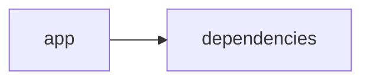

# Documentación del Proyecto

## Guía de Usuario
# Guía de Usuario

Bienvenido a tu herramienta interactiva para el análisis y procesamiento de información. En esta guía, encontrarás instrucciones claras y amigables para sacar el máximo provecho a nuestra aplicación.

---

## 📱 ¿Qué es esta aplicación?

- **Propósito principal**:  
  Esta herramienta permite analizar y procesar información contenida en archivos PDF, conversaciones y la Voz del Cliente (VoC) a través de una interfaz web interactiva, utilizando modelos de lenguaje basados en IA.

- **Problema que resuelve**:  
  Facilita la extracción de información valiosa y la generación de insights de documentos y comunicaciones, eliminando la necesidad de acudir a soluciones manuales o múltiples herramientas separadas para gestionar datos dispersos.

- **Beneficios clave**:  
  • Consolidación de diferentes fuentes de información en una sola plataforma.  
  • Rapidez en el procesamiento y análisis de datos.  
  • Acceso a insights relevantes y personalizados para mejorar la toma de decisiones.  
  • Interfaz intuitiva que simplifica el trabajo con datos.

- **Audiencia objetivo**:  
  Profesionales, analistas y equipos de atención al cliente o áreas de operaciones que necesiten procesar grandes volúmenes de documentos y conversaciones para obtener información accionable.

---

## ✨ Funcionalidades Principales

### Interfaz Web Interactiva con Streamlit
- **¿Qué hace?**:  
  Proporciona una interfaz amigable donde puedes interactuar con la herramienta, cargar documentos, ver resultados y navegar entre las distintas funcionalidades de forma intuitiva.
  
- **¿Cuándo usarla?**:  
  Siempre que inicies la aplicación para cargar nuevos datos o revisar análisis previos.
  
- **¿Cómo acceder?**:  
  1. Abre tu navegador web y accede a la URL proporcionada.  
  2. Inicia sesión si se requiere autenticación.
  
- **Resultado esperado**:  
  Visualizarás el panel principal con opciones de menú y botones para cargar archivos y ejecutar análisis.

### Procesamiento de Archivos PDF
- **¿Qué hace?**:  
  Extrae y organiza el contenido de archivos PDF, permitiendo que la información se procese posteriormente.
  
- **¿Cuándo usarla?**:  
  Cuando necesites analizar documentos o reportes que tengas en formato PDF.
  
- **¿Cómo acceder?**:  
  1. En el panel principal, selecciona la opción “Procesar PDF”.  
  2. Sube el archivo desde tu computador.
  
- **Resultado esperado**:  
  El contenido del PDF se visualizará en una estructura organizada, lista para el análisis.

### Análisis con Modelos de Lenguaje (IA)
- **¿Qué hace?**:  
  Utiliza algoritmos de inteligencia artificial para interpretar y extraer insights significativos del texto, mejorando la comprensión de la información.
  
- **¿Cuándo usarla?**:  
  Cuando se requiere transformar texto sin procesar en información relevante y accionable.
  
- **¿Cómo acceder?**:  
  1. Después de procesar un documento o conversación, selecciona “Analizar con IA”.  
  2. Confirma el análisis y espera a que se presente el reporte.
  
- **Resultado esperado**:  
  Aparecerán gráficos y resúmenes de texto que destacan los puntos clave y las tendencias.

### Análisis de Conversaciones
- **¿Qué hace?**:  
  Permite analizar diálogos y transcripciones de conversaciones para identificar patrones, temas recurrentes y sentimientos.
  
- **¿Cuándo usarla?**:  
  Al trabajar con registros de chat, llamadas o reuniones que necesiten ser evaluados para mejorar procesos o atención al cliente.
  
- **¿Cómo acceder?**:  
  1. En el menú principal, elige “Analizar Conversaciones”.  
  2. Sube el archivo o ingresa la transcripción.
  
- **Resultado esperado**:  
  Se generará un reporte con las principales conclusiones y áreas de mejora basadas en el análisis de diálogo.

### Análisis de Voz del Cliente (VoC)
- **¿Qué hace?**:  
  Recopila y analiza comentarios y opiniones de los clientes para identificar nivel de satisfacción y áreas críticas de atención.
  
- **¿Cuándo usarla?**:  
  Cuando necesites evaluar la experiencia y feedback de tus clientes de forma sistemática.
  
- **¿Cómo acceder?**:  
  1. Selecciona “Análisis de Voz del Cliente” desde el panel de navegación.  
  2. Carga el archivo con comentarios o conecta las fuentes de feedback.
  
- **Resultado esperado**:  
  Verás informes detallados que resaltan tendencias en la satisfacción del cliente y posibles oportunidades de mejora.

---

## 🚀 Cómo Empezar

### Primer Uso

1. **Requisitos previos**:  
   • Tener acceso a un navegador web actualizado.  
   • Contar con los documentos o archivos de conversación que deseas analizar.
   
2. **Acceso inicial**:  
   Ingresa a la URL de la aplicación e inicia sesión (si es necesario).

3. **Configuración básica**:  
   Revisa la sección de configuración (ubicada en el menú o en la página de bienvenida) para ajustar preferencias de idioma, notificaciones y formato de exportación de reportes.

4. **Primera tarea recomendada**:  
   Comienza subiendo un archivo PDF para familiarizarte con el proceso de extracción y visualización de contenido.

### Flujo Típico de Uso

1. **Paso 1**:  
   Accede a la aplicación mediante tu navegador y dirige tu atención al panel principal.

2. **Paso 2**:  
   Selecciona el tipo de análisis deseado (por ejemplo, "Procesar PDF" o "Analizar Conversaciones").

3. **Paso 3**:  
   Carga los archivos correspondientes, espera a que se complete el procesamiento y revisa el informe o los insights generados.

---

## 💡 Casos de Uso Comunes

### Escenario 1: Análisis de Reportes en PDF
**Situación**:  
Necesitas extraer y analizar información de reportes financieros o de proyectos almacenados en formato PDF.

**Pasos**:
1. Accede a la función “Procesar PDF”.
2. Sube el documento deseado.
3. Ejecuta el análisis con IA para obtener un resumen ejecutivo y conclusiones.
4. Revisa el reporte visual para identificar áreas clave.

### Escenario 2: Evaluación de Conversaciones de Atención al Cliente
**Situación**:  
Quieres identificar patrones en las interacciones del servicio al cliente para mejorar la experiencia.

**Pasos**:
1. Selecciona “Analizar Conversaciones” desde el menú.
2. Carga la transcripción del chat o llamada.
3. Revisa el análisis que identifica temas y emociones recurrentes.
4. Utiliza la información para ajustar protocolos de atención.

### Escenario 3: Recopilación de Voz del Cliente (VoC)
**Situación**:  
Buscas evaluar el feedback recibido a través de encuestas y comentarios en redes sociales.

**Pasos**:
1. Ve a la opción “Análisis de Voz del Cliente”.
2. Sube los archivos de feedback o conecta la fuente de datos.
3. Examina el reporte que resalta niveles de satisfacción y áreas de mejora.
4. Implementa cambios basándote en los insights obtenidos.

---

## ❓ Preguntas Frecuentes

P: ¿Cómo inicio sesión en la aplicación?  
R: Ingresa a la URL proporcionada, introduce tus credenciales y, en caso de ser tu primer acceso, sigue las instrucciones de registro.

P: ¿Qué hago si el archivo PDF no se carga correctamente?  
R: Verifica que el archivo no esté corrupto y que tenga un tamaño permitido. Si el problema persiste, intenta con otro documento o revisa la conexión a internet.

P: ¿Es seguro enviar mis documentos y conversaciones a través de esta herramienta?  
R: Sí. La aplicación implementa medidas de seguridad para proteger tus datos. No obstante, te recomendamos evitar subir información altamente confidencial sin haber verificado estas políticas.

P: ¿Cuáles son las limitaciones principales de la herramienta?  
R:  
• No soporta formatos de archivo distintos de PDF para documentos.  
• El análisis automatizado depende de la calidad del texto; textos muy complejos o poco claros podrían no rendir los mejores insights.  
• La herramienta está diseñada para análisis y no para edición de documentos.

---

## 🆘 Solución de Problemas

### Problema: Error al cargar un archivo PDF
- **Síntomas**:  
  Mensaje de error indicando fallo en la carga o visualización del documento.
- **Causa probable**:  
  Archivo en un formato incompatible o dañado.
- **Solución**:  
  1. Verifica el formato y la integridad del archivo.  
  2. Asegúrate de que cumpla con los requisitos de tamaño.  
  3. Intenta subir el archivo nuevamente.

### Problema: El análisis tarda demasiado en completarse
- **Síntomas**:  
  La aplicación muestra un indicador de carga durante un periodo prolongado.
- **Causa probable**:  
  Grandes volúmenes de datos o conexión a internet lenta.
- **Solución**:  
  1. Revisa tu conexión de red.  
  2. Si el documento es muy extenso, considera dividirlo en partes.  
  3. Espera unos minutos adicionales o reinicia el análisis.

### Problema: No se muestran resultados después del análisis con IA
- **Síntomas**:  
  La pantalla permanece en blanco o muestra un mensaje sin contenido.
- **Causa probable**:  
  Error interno en el procesamiento del modelo o datos incompletos.
- **Solución**:  
  1. Verifica que el documento o transcripción esté completo y sin errores.  
  2. Reinicia la función de análisis.  
  3. Si el problema continúa, contacta al soporte técnico.

---

## 📞 Soporte y Contacto

- **¿Necesitas ayuda adicional?**  
  Para asistencia personalizada, comunícate con el equipo de soporte a través del correo soporte@tudominio.com o llamando al +34 912 345 678.
  
- **¿Encontraste un error?**  
  Reporta cualquier incidencia mediante nuestro formulario de feedback accesible en la sección “Ayuda” del menú o directamente al correo reportes@tudominio.com.
  
- **¿Tienes sugerencias?**  
  Comparte tus ideas para mejorar la aplicación en nuestro buzón de sugerencias: sugerencias@tudominio.com.

---

Esperamos que esta guía te ayude a navegar y aprovechar al máximo todas las funcionalidades que ofrecemos. ¡Disfruta de tu experiencia y saca el mayor provecho de los análisis para mejorar tus procesos y decisiones!

## Documentación Técnica
A continuación se presenta la documentación técnica completa en Markdown, estructurada según la guía solicitada. Se ha analizado el código y la guía de usuario para integrar todos los aspectos relevantes.

------------------------------------------------------------
# Documentación Técnica

Esta documentación está orientada a desarrolladores y equipos técnicos interesados en comprender, mantener y extender la aplicación VoC Analyst. La herramienta procesa archivos (por ejemplo, documentos PDF) y analiza interacciones y conversaciones mediante Modelos de Lenguaje (LLM). La interfaz de usuario se implementa con Streamlit, mientras que el backend integra múltiples proveedores LLM (OpenAI, Anthropic y Google GenAI).

------------------------------------------------------------
## 🏗️ Arquitectura del Sistema

- **Patrón arquitectónico utilizado:**  
  La aplicación adopta una arquitectura modular monolítica (“híbrida”). Se separan las responsabilidades en dos grandes capas:
  - **Capa de Presentación (Frontend):** Implementada mediante Streamlit, se encarga de la carga de archivos, la interacción directa con el usuario, la visualización de resultados y la gestión del estado de la sesión mediante `st.session_state`.
  - **Capa de Lógica y Procesamiento (Backend):** Incluye módulos para extracción y validación de archivos (utilizando PyPDF2 para documentos PDF), procesamiento y parsing de conversaciones (con redacción de PII) y la integración con proveedores LLM para análisis de sentimientos, detección de temas y generación de insights.

- **Diagrama de componentes (Mermaid):**

  ```mermaid
  graph LR
      A[Interfaz Streamlit (Frontend)] --> B[Procesamiento y Validación de Archivos]
      A --> C[Gestión del Estado (st.session_state)]
      B --> D[Extracción de Texto (PyPDF2)]
      B --> E[Parser y Redacción de PII]
      A --> F[LLMBackend (Lógica de Negocio)]
      F --> G[Proveedores LLM (OpenAI, Anthropic, Gemini)]
  ```

- **Flujo de datos principal:**  
  1. El usuario carga archivos (por ejemplo, archivos PDF o TXT) a través de la interfaz web.  
  2. Se valida el tamaño del archivo (por ejemplo, mediante la función `validate_file_size`) y se extrae el contenido textual de documentos PDF usando `extract_text_from_pdf` (con PyPDF2).  
  3. El texto extraído es procesado mediante funciones de parsing para normalizar la conversación y redactar información sensible (PII).  
  4. El módulo **LLMBackend** envía el contenido a los proveedores LLM configurados usando prompts predefinidos (por ejemplo, _parse_prompt_ y _analyze_prompt_) para obtener insights, análisis de sentimientos, detección de temas y recomendaciones.  
  5. Los resultados del análisis se almacenan en `st.session_state` y se visualizan en la interfaz mediante paneles, tablas y gráficos.

- **Dependencias críticas y su propósito:**  
  - **Streamlit:** Construye la interfaz web interactiva y gestiona el estado en tiempo real.  
  - **PyPDF2:** Extrae el contenido textual de los documentos en PDF.  
  - **Pandas:** Facilita la manipulación y visualización de datos tabulados (por ejemplo, para mostrar resúmenes y KPIs).  
  - **LLM SDKs (openai, anthropic, google-genai):** Permiten la integración con proveedores de modelos de lenguaje para realizar análisis semántico avanzado.

------------------------------------------------------------
## 📋 Stack Tecnológico

- **Lenguajes:**  
  Principalmente Python (los archivos se clasifican como “other” en el repositorio).

- **Frameworks / Librerías:**  
  - **Streamlit:** (>= 1.49.1) para crear la interfaz web interactiva.  
  - **PyPDF2:** (>= 3.0.1) para la extracción de texto de documentos PDF.  
  - **Pandas:** (>= 2.3.2) para manipulación y visualización de datos.  
  - **LLM SDKs:**  
    - `openai` para integrar modelos de OpenAI.  
    - `anthropic` para conectarse a proveedores de Anthropic.  
    - `google-genai` para la integración con Google GenAI (Gemini).  
  - **Otras librerías:** json, os, time, datetime, uuid, zipfile, io, typing

- **Base de datos:**  
  No se utiliza una base de datos persistente; el almacenamiento de datos se realiza de forma transitoria mediante `st.session_state`.

- **APIs externas:**  
  Se integran las APIs de los proveedores LLM para el análisis semántico y generación de insights.

- **Infraestructura:**  
  La aplicación se despliega como una aplicación web simple mediante Streamlit, ejecutable en entornos locales, servidores o contenedores Docker.

------------------------------------------------------------
## 🔧 Componentes Principales

### 1. Aplicación Streamlit

- **Propósito:**  
  Proporciona la interfaz de usuario donde se realizan las siguientes tareas:
  - Configuración de la página (título, ícono, layout, etc.).
  - Carga y validación de archivos, con funciones específicas (por ejemplo, `extract_text_from_pdf` y `validate_file_size`).
  - Visualización interactiva de resultados y de los KPIs generados.
  - Gestión del estado de la sesión mediante `st.session_state`.

- **Ubicación:**  
  Normalmente el punto de entrada es el archivo `app.py`, ubicado en la raíz o en la carpeta `app/`.

- **Interfaces y Métodos Expuestos:**  
  - Configuración de la página usando `st.set_page_config`.
  - Funciones auxiliares para la extracción de texto y validación de archivos.
  - Uso de `st.session_state` para almacenar variables claves que se utilizan en el flujo de análisis (p.ej. `analysis_results`, `run_id`, `uploaded_files_data`).

- **Ejemplo de Uso:**

  ```python
  st.set_page_config(
      page_title="VoC Analyst - Análisis de Voz del Cliente con LLM",
      page_icon="📊",
      layout="wide",
      initial_sidebar_state="expanded"
  )
  
  if 'analysis_results' not in st.session_state:
      st.session_state.analysis_results = None
  ```

---

### 2. Módulo LLMBackend

- **Propósito:**  
  Actúa como capa de integración entre la aplicación y los proveedores de modelos de lenguaje (LLM). Su función principal es enviar datos (texto o conversaciones) para su análisis y obtener insights mediante el uso de prompts preconfigurados.

- **Ubicación:**  
  Se encuentra en el archivo `llm_backend.py` ubicado en la raíz del proyecto.

- **Interfaces / Funciones Destacadas:**
  - **ModelConfig:**  
    Clase que define la configuración necesaria para el uso del proveedor LLM, con atributos como:
    - `provider`: Proveedor a utilizar ("openai", "anthropic" o "gemini").
    - `model`: Modelo específico a emplear.
    - `api_key`: Clave de autenticación.
    - `max_retries` y `retry_delay`: Parámetros para reintentar en caso de fallo.
    
  - **LLMBackend:**  
    Métodos importantes incluyen:
    - `__init__(config: ModelConfig)`: Inicializa el backend con la configuración.
    - `_initialize_client()`: Selecciona el cliente LLM de acuerdo al proveedor.
    - `_load_parse_prompt()` y `_load_analyze_prompt()`: Preparan los prompts que se utilizarán para parsear y analizar el texto.
    - `analyze_text(text: str) → Dict[str, Any]`: Envía el texto a analizar y retorna los insights recibidos.
  
- **Ejemplo de Código:**

  ```python
  @dataclass
  class ModelConfig:
      provider: str
      model: str
      api_key: str
      max_retries: int = 3
      retry_delay: float = 1.0

  class LLMBackend:
      def __init__(self, config: ModelConfig):
          self.config = config
          self.client = self._initialize_client()
          self.parse_prompt = self._load_parse_prompt()
          self.analyze_prompt = self._load_analyze_prompt()
      
      def _initialize_client(self):
          if self.config.provider == 'openai':
              return OpenAI(api_key=self.config.api_key)
          elif self.config.provider == 'anthropic':
              return Anthropic(api_key=self.config.api_key)
          elif self.config.provider == 'gemini':
              return genai.Client(api_key=self.config.api_key)
          else:
              raise ValueError(f"Proveedor no soportado: {self.config.provider}")
      
      def analyze_text(self, text: str) -> dict:
          # Lógica simplificada para el análisis
          response = self.client.create_completion(
              engine=self.config.model,
              prompt=f"{self.analyze_prompt}\n{text}",
              max_tokens=150
          )
          return {"analysis": response}
  ```

---

### 3. Parser y Análisis de Conversaciones

- **Propósito:**  
  Procesar y normalizar el contenido textual extraído o ingresado para:
  - Estructurarlo en formato JSON.
  - Extraer metadatos como `conversation_id`, timestamps y roles de interlocutores.
  - Redactar información sensible (PII), sustituyéndola por etiquetas estandarizadas (e.g., [EMAIL], [PHONE]).

- **Funcionalidades Específicas:**  
  - Extraer la conversación a partir del contenido obtenido de un PDF o transcripción.
  - Dividir la conversación en mensajes y asociar metadatos.
  - Aplicar expresiones regulares para detectar y redactar PII antes de enviar el contenido al análisis LLM.

- **Ejemplo de Proceso (Requerimientos):**

  ```
  ## VoC Conversation Parser
  
  Transformar el texto de una interacción en un JSON estructurado con:
  - conversation_id derivado del nombre del archivo o metadatos.
  - Lista de mensajes con campos: sender, timestamp, content (con PII redactada) y metadata.
  ```

------------------------------------------------------------
## 🚀 APIs y Endpoints

Aunque la aplicación no expone endpoints REST públicos, dispone de “APIs internas” a través de funciones y métodos empleados para orquestar el flujo de análisis. Entre las principales se incluyen:

- **Función: extract_text_from_pdf(pdf_file) → str:**  
  Extrae el contenido textual de un archivo PDF utilizando PyPDF2. Gestiona errores mediante bloques try/except y notifica al usuario usando `st.error`.

- **Función: validate_file_size(file) → bool:**  
  Verifica que el archivo subido no exceda el límite de 100MB, utilizando operaciones en el puntero de archivo.

- **Método: LLMBackend.analyze_text(text: str) → Dict[str, Any]:**  
  Envía una solicitud al proveedor LLM, combinando el texto y un prompt predefinido, y retorna los insights obtenidos (por ejemplo, análisis de sentimientos, detección de temas, recomendaciones).

- **Funciones del Parser:**  
  Transforman el contenido de una conversación en un JSON estructurado, asegurando la correcta redacción de PII y la extracción de metadatos.

------------------------------------------------------------
## 💾 Modelo de Datos

- **Entidad Principal - Conversación:**  
  La información se organiza en un objeto JSON con los siguientes campos:
  - `conversation_id`: Identificador único de la conversación (derivado de metadatos o nombre de archivo).
  - `messages`: Lista de mensajes, donde cada mensaje incluye:
    - `sender`: Rol del emisor (cliente, agente o desconocido).
    - `timestamp`: Momento de envío del mensaje.
    - `content`: Texto del mensaje con PII redactada.
    - `metadata`: Información adicional (por ejemplo, canal, duración, etc.).

- **Transformaciones y Validaciones:**
  - Se valida que el texto extraído sea válido y esté normalizado.
  - Se aplican reglas para redactar y anonimizar información sensible.
  - Los resultados se estructuran para facilitar la visualización y análisis subsecuente en la interfaz.

------------------------------------------------------------
## 🛠️ Guía de Desarrollo

### Configuración del Entorno

1. **Prerrequisitos:**  
   - Python 3.8 o superior.  
   - Conexión a Internet para acceder a las APIs de proveedores LLM en producción.
  
2. **Instalación:**
   - Clonar el repositorio:
     ```bash
     git clone https://github.com/tu_usuario/VoC-Analyst.git
     cd VoC-Analyst
     ```
   - Crear y activar un entorno virtual:
     ```bash
     python -m venv venv
     source venv/bin/activate    # Linux/Mac
     venv\Scripts\activate       # Windows
     ```
   - Instalar las dependencias:
     ```bash
     pip install -r requirements.txt
     ```

3. **Variables de Entorno:**  
   Configure las API keys necesarias para los proveedores LLM mediante variables de entorno:
   - `OPENAI_API_KEY`
   - `ANTHROPIC_API_KEY`
   - `GEMINI_API_KEY`

---

### Estructura de Código

El repositorio se organiza de la siguiente manera:

```
VoC-Analyst/
├── app/
│   ├── app.py                # Punto de entrada (interfaz Streamlit)
│   ├── parser.py             # Funciones de parsing y normalización de conversaciones
│   └── utils.py              # Funciones auxiliares (extracción de texto, validación de archivos, etc.)
├── llm_backend.py            # Módulo de integración con proveedores LLM
├── requirements.txt          # Lista de dependencias
└── README.md                 # Documentación general y guía de usuario
```

---

### Estándares de Código

- **Convenciones de Naming:**  
  Se utiliza nombres descriptivos en minúsculas y con guiones bajos para archivos y funciones (por ejemplo, `extract_text_from_pdf`).

- **Patrones de Diseño Recomendados:**  
  - Separación de la lógica de la interfaz (Streamlit) y la lógica de negocio (LLMBackend y Parser).  
  - Inyección de dependencias mediante la clase `ModelConfig` para configurar dinámicamente los proveedores LLM.

- **Testing y Validación:**  
  - Implementar pruebas unitarias para funciones críticas (extracción de texto, validación del tamaño, análisis LLM) utilizando frameworks como pytest.
  - Validar la integración del módulo LLMBackend simulando respuestas de los proveedores y verificando el manejo correcto de reintentos.

- **Manejo de Errores y Logging:**  
  - Emplear bloques try/except en funciones críticas para capturar y notificar errores (por ejemplo, durante la extracción de textos o el análisis LLM).  
  - Utilizar el módulo logging para registrar eventos importantes y facilitar la depuración.

---

## 🔍 Puntos de Atención

- **Limitaciones Conocidas:**  
  - La extracción de texto depende de PyPDF2; PDFs basados en imágenes pueden requerir OCR.
  - El análisis LLM es tan preciso como la calidad y formato del texto extraído.
  - Actualmente la aplicación procesa un archivo a la vez; el análisis en lote aún se está evaluando.

- **Consideraciones de Rendimiento:**  
  - El procesamiento de archivos muy grandes (cercanos a 100MB) puede afectar la velocidad de respuesta.
  - Se recomienda implementar técnicas de caching o procesamiento asíncrono para optimizar el rendimiento en análisis repetitivos.

- **Aspectos de Seguridad:**  
  - Asegurar el manejo seguro de las API keys utilizando variables de entorno.
  - Redactar adecuadamente la información sensible (PII) antes de enviarla a cualquier proveedor externo.
  - Revisar e implementar políticas de privacidad y protección de datos conforme a las normativas vigentes.

- **TODOs y Mejoras Sugeridas:**  
  - Extender el soporte a nuevos formatos de archivo (por ejemplo, TXT).  
  - Integrar OCR para PDFs que contienen imágenes.  
  - Mejorar la modularidad del parser y la robustez en el manejo de errores en la comunicación con proveedores LLM.

---

## Diagrama de Componentes

El siguiente diagrama Mermaid ilustra la relación e interacción entre las principales capas y módulos del sistema:

```mermaid
graph LR
    A[Interfaz Streamlit] --> B[Procesamiento y Validación de Archivos]
    B --> C[Extracción de Texto y Parser de Conversaciones]
    A --> D[LLMBackend]
    D --> E[Proveedores LLM (OpenAI, Anthropic, Gemini)]
```

------------------------------------------------------------
## Conclusión

Esta documentación técnica proporciona un panorama completo del sistema VoC Analyst, desde la arquitectura y componentes principales hasta la configuración, desarrollo y puntos de atención críticos. Se recomienda a los desarrolladores mantener actualizada la documentación y los comentarios en el código conforme se realicen mejoras y se integren nuevos proveedores o funcionalidades.

Para cualquier duda, aporte o actualización, revise el repositorio de issues y consulte las guías de contribución.

------------------------------------------------------------
## Diagrama Final



------------------------------------------------------------

Happy Coding y ¡éxito en el desarrollo y análisis de la Voz del Cliente!


## Diagrama
```mermaid
graph LR\nApp["app"]-->Deps["dependencies"]\n
```
