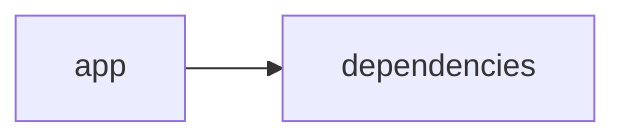

# Documentación del Proyecto

## Guía de Usuario
# Guía de Usuario

Bienvenido a esta guía para nuestra herramienta de análisis y procesamiento de información. Aquí encontrarás instrucciones simples y completas para sacar el máximo provecho a la aplicación.

---

## 📱 ¿Qué es esta aplicación?

- **Propósito principal**:  
  Es una herramienta interactiva que te ayuda a analizar y procesar información proveniente de archivos PDF, conversaciones y datos de Voz del Cliente (VoC) usando modelos de lenguaje basados en IA. La interfaz web, desarrollada con Streamlit, te permite realizar estos análisis de manera rápida y visual.

- **Problema que resuelve**:  
  Facilita la tarea de extraer información relevante de grandes volúmenes de texto y conversaciones, lo que te ayuda a ahorrar tiempo, detectar tendencias y tomar decisiones basadas en datos sin tener que hacer lecturas manuales exhaustivas.

- **Beneficios clave**:  
  • Análisis automatizado y preciso de documentos y conversaciones.  
  • Resultados visuales y fáciles de interpretar para obtener insights de forma inmediata.  
  • Interfaz amigable que no requiere conocimientos técnicos avanzados.  
  • Soporte para distintos tipos de contenido, desde informes en PDF hasta feedback de clientes.

- **Audiencia objetivo**:  
  Profesionales de análisis de datos, equipos de atención al cliente, gestores de calidad, analistas de mercado y cualquier persona interesada en obtener insights de información textual de manera rápida y precisa.

---

## ✨ Funcionalidades Principales

### Interfaz Web Interactiva con Streamlit
- **¿Qué hace?**:  
  Presenta una interfaz gráfica intuitiva donde puedes navegar por las distintas herramientas y módulos de análisis.
- **¿Cuándo usarla?**:  
  Siempre que desees iniciar un análisis, cargar documentos o visualizar resultados de manera interactiva.
- **¿Cómo acceder?**:  
  Simplemente ingresa la URL de la aplicación en tu navegador web.
- **Resultado esperado**:  
  Verás un panel de control con opciones de carga, visualización de resultados y acceso a otros módulos de análisis.

### Procesamiento de Archivos PDF
- **¿Qué hace?**:  
  Permite cargar y procesar archivos PDF, extrayendo el texto y preparándolo para su análisis posterior.
- **¿Cuándo usarla?**:  
  Cuando tengas documentos en PDF que necesites analizar para obtener insights o resumir contenidos.
- **¿Cómo acceder?**:  
  Selecciona la opción “Procesar PDF” en el menú principal y sigue las instrucciones para subir tu archivo.
- **Resultado esperado**:  
  El sistema extraerá y mostrará el contenido del PDF, listo para ser analizado con las herramientas disponibles.

### Análisis con Modelos de Lenguaje (IA)
- **¿Qué hace?**:  
  Utiliza modelos de inteligencia artificial para analizar y extraer información relevante del texto, incluyendo resúmenes, detección de temas y análisis de tono.
- **¿Cuándo usarla?**:  
  Cuando necesites interpretar grandes volúmenes de texto y extraer conclusiones de forma automatizada.
- **¿Cómo acceder?**:  
  Después de cargar tu documento o ingresar tu texto, selecciona la opción “Análisis con IA” y espera a que el análisis se complete.
- **Resultado esperado**:  
  Obtendrás un resumen del contenido, insights sobre los temas principales y una evaluación del tono del texto.

### Análisis de Conversaciones
- **¿Qué hace?**:  
  Examina transcripciones o registros de conversaciones para identificar patrones, temas recurrentes y sentimientos.
- **¿Cuándo usarla?**:  
  Cuando trabajas con historiales de conversaciones, chats o feedback de clientes y necesitas identificar tendencias o áreas de mejora.
- **¿Cómo acceder?**:  
  Ve al apartado “Análisis de Conversaciones”, carga la transcripción o copia el texto y ejecuta el análisis.
- **Resultado esperado**:  
  Verás agrupaciones de temas, análisis de sentimientos y gráficos que resaltan los puntos clave de la conversación.

### Análisis de Voz del Cliente (VoC)
- **¿Qué hace?**:  
  Recoge y analiza opiniones, feedback y reseñas de clientes para revelar percepciones y áreas de mejora en productos o servicios.
- **¿Cuándo usarla?**:  
  Cuando necesites evaluar la satisfacción del cliente y obtener insights sobre su experiencia.
- **¿Cómo acceder?**:  
  Selecciona la opción “Análisis de VoC”, sube el archivo o ingresa la información del feedback y lanza el análisis.
- **Resultado esperado**:  
  Se generarán visualizaciones y reportes que destacan los sentimientos del cliente, tendencias en el feedback y oportunidades de mejora.

---

## 🚀 Cómo Empezar

### Primer Uso
1. **Requisitos previos**:  
   • Tener acceso a un navegador web moderno (Chrome, Firefox, Safari, etc.)  
   • Contar con archivos PDF, transcripciones de conversaciones o datos de feedback que requieras analizar.
2. **Acceso inicial**:  
   Ingresa a la URL proporcionada de la aplicación en tu navegador.
3. **Configuración básica**:  
   Revisa y acepta cualquier aviso de privacidad o condiciones de uso que aparezcan la primera vez que accedes.
4. **Primera tarea recomendada**:  
   Prueba cargando un archivo PDF pequeño para familiarizarte con el proceso de extracción y análisis.

### Flujo Típico de Uso
1. **Paso 1**: Ingresa a la interfaz web mediante tu navegador.
2. **Paso 2**: Selecciona la funcionalidad que necesites (ej. Procesar un PDF o analizar conversaciones).
3. **Paso 3**: Carga el archivo o ingresa el texto en el módulo correspondiente.
4. **Paso 4**: Ejecuta el análisis y espera a que se muestren los resultados.
5. **Paso 5**: Revisa los reportes y visualizaciones generadas por la herramienta para obtener insights.

---

## 💡 Casos de Uso Comunes

### Escenario 1: Análisis de un Informe en PDF
**Situación**: Necesitas extraer y resumir la información de un informe extenso en PDF.  
**Pasos**: 
1. Selecciona “Procesamiento de Archivos PDF” en la interfaz.  
2. Carga el documento y espera la extracción del contenido.  
3. Ejecuta el “Análisis con Modelos de Lenguaje” para obtener un resumen y datos relevantes.

### Escenario 2: Evaluación de Conversaciones de Atención al Cliente
**Situación**: Quieres identificar patrones y áreas de mejora en las interacciones con clientes.  
**Pasos**: 
1. Accede a la sección “Análisis de Conversaciones”.  
2. Sube la transcripción de una conversación o chat.  
3. Revisa el análisis de sentimientos y la agrupación de temas para detectar oportunidades de mejora.

### Escenario 3: Revisión de Voz del Cliente (VoC)
**Situación**: Buscas evaluar el feedback recibido de tus clientes para mejorar productos o servicios.  
**Pasos**: 
1. Ingresa a la opción “Análisis de Voz del Cliente”.  
2. Carga el archivo o copia los comentarios de los clientes.  
3. Examina las visualizaciones y reportes que destacan comentarios positivos, áreas críticas y tendencias en la percepción del cliente.

---

## ❓ Preguntas Frecuentes

**P: ¿Cómo subo un archivo PDF para su análisis?**  
R: En la sección “Procesamiento de Archivos PDF”, haz clic en “Cargar archivo”, selecciona tu PDF y presiona el botón de “Iniciar Análisis”.

**P: ¿Qué hago si la aplicación no responde o muestra un error?**  
R: Revisa tu conexión a internet, refresca la página y asegúrate de que el archivo cumple con los formatos y tamaños permitidos. Si el problema persiste, consulta la sección de solución de problemas.

**P: ¿Es seguro usar la herramienta para analizar información confidencial?**  
R: Sí, se han implementado medidas de seguridad para proteger tus datos. Sin embargo, es recomendable no subir información altamente sensible o, de hacerse, contar con las políticas de privacidad adecuadas en tu organización.

**P: ¿Cuáles son las limitaciones principales de la aplicación?**  
R:  
- No reemplaza un análisis humano experto en casos complejos.  
- Los archivos con formatos no estándar o excesivamente grandes pueden presentar dificultades.  
- La precisión del análisis depende de la claridad y calidad del texto proporcionado.

---

## 🆘 Solución de Problemas

### Problema: Error al cargar un archivo PDF
- **Síntomas**:  
  La aplicación muestra un mensaje de error o no carga el contenido del archivo.
- **Causa probable**:  
  El archivo puede estar dañado, tener un formato incompatible o exceder el tamaño permitido.
- **Solución**:  
  Verifica que el archivo sea un PDF válido, comprueba el tamaño y, de ser necesario, prueba con otro archivo.

### Problema: Demora en la generación de resultados del análisis
- **Síntomas**:  
  El proceso de análisis tarda más de lo esperado o parece quedar “colgado”.
- **Causa probable**:  
  El archivo o texto ingresado es muy extenso o la conexión a internet es inestable.
- **Solución**:  
  Intenta reducir el tamaño del documento, verifica tu conexión y vuelve a ejecutar el análisis.

### Problema: Visualización incorrecta del panel de control
- **Síntomas**:  
  Los elementos de la interfaz se muestran desalineados o algunos botones no responden.
- **Causa probable**:  
  Esto puede deberse a una incompatibilidad temporal con el navegador.
- **Solución**:  
  Actualiza tu navegador a la última versión o prueba usar otro navegador (Chrome, Firefox, etc.).

---

## 📞 Soporte y Contacto

- **¿Necesitas ayuda adicional?**  
  Puedes contactar al equipo de soporte enviando un correo a soporte@tudominio.com.
  
- **¿Encontraste un error?**  
  Utiliza el formulario de “Reporte de Errores” disponible en la sección de soporte de la aplicación o envía un correo detallando el problema.
  
- **¿Tienes sugerencias?**  
  Estamos siempre atentos a tus comentarios. Por favor, envía tus sugerencias y feedback a feedback@tudominio.com.

---

Esperamos que esta guía te sea de ayuda para utilizar la herramienta de manera efectiva. ¡Gracias por elegir nuestra aplicación para potenciar tu análisis de información!

## Documentación Técnica
A continuación se presenta la documentación técnica completa en Markdown, siguiendo la estructura obligatoria y basada en el análisis del código y los documentos de guía del repositorio.

---

# Documentación Técnica

Esta documentación está orientada a desarrolladores y equipos técnicos interesados en comprender, mantener y extender el sistema VoC Analyst. La herramienta procesa archivos (por ejemplo, documentos PDF) para extraer y analizar la Voz del Cliente (VoC) mediante modelos de lenguaje (LLM). La interfaz se implementa con Streamlit y el backend integra la conexión con proveedores LLM (OpenAI, Anthropic, Google GenAI).

---

## 🏗️ Arquitectura del Sistema

- **Patrón arquitectónico utilizado:**  
  La aplicación sigue un enfoque modular monolítico “híbrido” que separa la lógica de presentación y la lógica de negocio.  
  - **Capa de Presentación (Frontend):**  
    Implementada completamente con Streamlit. Se encarga de la carga de archivos, manejo de la interfaz y visualización interactiva de los resultados, gestionando el estado de la sesión mediante `st.session_state`.
  - **Capa de Lógica y Análisis (Backend):**  
    Incluye módulos para la extracción y preprocesamiento de archivos (utilizando PyPDF2), el parser y análisis de conversaciones –incluyendo redacción de información sensible (PII)– y la integración con proveedores de modelos de lenguaje (LLM) mediante la clase LLMBackend.

- **Diagrama de componentes (Mermaid):**

  ```mermaid
  graph LR
      A[Interfaz Streamlit (Frontend)] --> B[Procesamiento y Validación de Archivos]
      A --> C[Gestión del Estado (st.session_state)]
      B --> D[Extracción de Texto (PyPDF2)]
      B --> E[Parser y Redacción de PII]
      A --> F[LLMBackend (Lógica de Negocio)]
      F --> G[Proveedores LLM (OpenAI, Anthropic, Gemini)]
  ```

- **Flujo de datos principal:**  
  1. El usuario accede a la aplicación mediante la interfaz web (Streamlit) y carga archivos (por ejemplo, archivos PDF).
  2. Se valida que los archivos cumplan con restricciones (por ejemplo, tamaño menor a 100MB mediante `validate_file_size`) y se extrae el contenido textual utilizando PyPDF2 mediante la función `extract_text_from_pdf`.
  3. El texto extraído es procesado mediante funciones de parser, que normalizan la conversación y redactan la información sensible (PII).
  4. La capa de negocio usa el módulo LLMBackend para enviar el contenido a los proveedores de LLM –mediante prompts preconfigurados– y obtener insights (análisis de sentimientos, detección de temas, recomendaciones, etc.).
  5. Los resultados se almacenan en el objeto `st.session_state` y se muestran de manera interactiva en la interfaz.

- **Dependencias críticas y su propósito:**  
  - **Streamlit:** Permite la creación de la interfaz web interactiva y gestiona el estado de la sesión.
  - **PyPDF2:** Se utiliza para extraer el contenido textual de los documentos PDF.
  - **Pandas:** Facilita la manipulación y visualización de los datos extraídos (por ejemplo, en tableros y gráficos).
  - **LLM SDKs (openai, anthropic, google-genai):** Integran y conectan la aplicación con diferentes proveedores de modelos de lenguaje para realizar análisis semánticos avanzados.
  - **Otras librerías estándar:** json, os, time, datetime, uuid, zipfile, io, typing – utilizadas para operaciones básicas y de manejo de datos.

---

## 📋 Stack Tecnológico

- **Lenguajes:**  
  Principalmente Python (catalogado como “other” en el repositorio).

- **Frameworks / Librerías:**  
  - **Streamlit:** (>= 1.49.1) para la interfaz web interactiva.
  - **PyPDF2:** (>= 3.0.1) para la extracción de texto desde documentos PDF.
  - **Pandas:** (>= 2.3.2) para la manipulación y visualización de datos.
  - **LLM SDKs:**  
    - `openai` – Para integrar modelos de OpenAI.
    - `anthropic` – Para conectar con modelos de Anthropic.
    - `google-genai` – Para la integración con Google Gemini u otros modelos de Google GenAI.
  - **Librerías estándar:** json, os, time, datetime, uuid, zipfile, io, typing.

- **Base de datos:**  
  No se utiliza una base de datos relacional; el almacenamiento es transitorio y se gestiona mediante `st.session_state`.

- **APIs externas:**  
  Se integran APIs de proveedores de modelos LLM (OpenAI, Anthropic, Google GenAI) para realizar análisis semántico y generar insights.

- **Infraestructura:**  
  La aplicación se despliega como una aplicación web simple con Streamlit, y puede ejecutarse en entornos locales, servidores o contenedores Docker.

---

## 🔧 Componentes Principales

### 1. Aplicación Streamlit

- **Propósito:**  
  Gestiona la interfaz de usuario, la carga y validación de archivos, y la visualización interactiva de los resultados. También se encarga de inicializar y mantener el estado de la sesión con `st.session_state`.

- **Ubicación:**  
  Principalmente en el archivo de entrada, por ejemplo, `app.py` (ubicado en la raíz o en la carpeta `app/`) junto con módulos auxiliares (como `parser.py` y `utils.py`).

- **Interfaces / Métodos Expuestos:**  
  - Configuración de la página mediante `st.set_page_config` (título, icono, layout).
  - Gestión de variables clave mediante `st.session_state` (por ejemplo, `analysis_results`, `run_id`, `uploaded_files_data`, `processing_complete`).
  - Funciones auxiliares:
    - `extract_text_from_pdf(pdf_file) → str`: Extrae el contenido textual del PDF.
    - `validate_file_size(file) → bool`: Verifica que el archivo no exceda el tamaño máximo (100MB).

- **Dependencias:**  
  Utiliza Streamlit, PyPDF2, Pandas y utilidades de Python (modulos os, time, uuid, etc.).

---

### 2. Módulo LLMBackend

- **Propósito:**  
  Sirve como puente entre la aplicación y los proveedores de modelos de lenguaje (LLM). Se encarga de enviar solicitudes al proveedor seleccionado para analizar el texto y obtener insights, gestionando reintentos y la configuración necesaria.

- **Ubicación:**  
  Se encuentra en el archivo `llm_backend.py` en la raíz del proyecto.

- **Interfaces / Métodos Expuestos:**  
  - **ModelConfig:**  
    Una clase de configuración que especifica:
    - `provider`: Nombre del proveedor (ej. "openai", "anthropic", "gemini").
    - `model`: Modelo específico a utilizar.
    - `api_key`: Clave de autenticación.
    - `max_retries` y `retry_delay`: Parámetros para gestionar reintentos en caso de fallo.
  
  - **LLMBackend:**  
    Métodos básicos:
    - `__init__(config: ModelConfig)`: Inicializa la instancia utilizando la configuración.
    - `_initialize_client()`: Selecciona e instancia el cliente para el proveedor LLM adecuado.
    - `_load_parse_prompt()` y `_load_analyze_prompt()`: Cargan o definen los prompts a usar para parsear y analizar el contenido.
    - `analyze_text(text: str) → Dict[str, Any]`: Envía el texto para análisis y retorna los insights obtenidos.

- **Dependencias:**  
  Utiliza las librerías específicas para cada proveedor (openai, anthropic, google-genai) y librerías básicas de Python.

---

### 3. Extracción y Procesamiento de Archivos

- **Propósito:**  
  Gestionar la carga, validación y extracción del contenido textual de los archivos subidos, especialmente documentos PDF.
  
- **Funciones Clave:**  
  - `extract_text_from_pdf(pdf_file) → str`: Recorre cada página del archivo PDF para extraer y concatenar el texto.
  - `validate_file_size(file) → bool`: Asegura que el tamaño del archivo no exceda 100MB.

- **Consideraciones:**  
  Estas funciones soportan la normalización de la entrada para que la información esté lista para el análisis posterior.

---

### 4. Parser y Análisis de Conversaciones

- **Propósito:**  
  Procesar y estructurar las conversaciones (por ejemplo, extraídas de PDFs o ingresadas manualmente) en un formato JSON que incluya:
  - Identificación de metadatos como `conversation_id`, timestamps y roles (cliente, agente, desconocido).
  - Redacción de información sensible (PII) reemplazándola por etiquetas estándar, como `[EMAIL]` o `[PHONE]`.
  
- **Funcionamiento:**  
  - El texto se divide en turnos de conversación.
  - Se extraen metadatos y se normaliza la información.
  - El resultado es un JSON estructurado listo para el análisis LLM.

---

## 🚀 APIs y Endpoints

Aunque la aplicación no expone endpoints REST públicos, se disponen de “APIs internas” a través de funciones y métodos que orquestan los siguientes procesos:

- **Función:** `extract_text_from_pdf(pdf_file) → str`  
  Extrae el contenido textual del archivo PDF y gestiona errores mediante bloques try/except.

- **Función:** `validate_file_size(file) → bool`  
  Verifica que el archivo cumpla con el límite de tamaño (100MB).

- **Método:** `LLMBackend.analyze_text(text: str) → Dict[str, Any]`  
  Envía el texto (combinado con el prompt de análisis) al proveedor LLM configurado y retorna un diccionario con los insights obtenidos (análisis de sentimientos, detección de temas, recomendaciones, etc.).

- **Funciones del Parser:**  
  Transforman las conversaciones en un formato estructurado (JSON), normalizando la información y redactando la PII para asegurar la privacidad.

---

## 💾 Modelo de Datos

- **Entidades Principales:**  
  - **Conversación:** Se representa internamente como un objeto JSON que incluye:
    - `conversation_id`: Identificador único.
    - `messages`: Lista de mensajes, donde cada mensaje contiene:
      - `sender`: Rol del emisor (cliente, agente, desconocido).
      - `timestamp`: Marca de tiempo del mensaje (si está disponible).
      - `content`: Texto del mensaje, con la información sensible ya redactada.
      - `metadata`: Información adicional (por ejemplo, canal, duración, etc.).

- **Esquemas de Entrada y Salida:**  
  - **Entrada:** Archivos PDF o textos ingresados manualmente.
  - **Salida:** Objeto JSON estructurado que se utiliza para generar gráficos, tablas y otros reportes en la interfaz.

- **Validaciones y Transformaciones:**  
  - Se verifica que el texto extraído sea no vacío y esté correctamente formateado.
  - Se aplican reglas de redacción para anonimizar la información sensible.
  - Se estructura el JSON para facilitar la integración con módulos de análisis y visualización.

---

## 🛠️ Guía de Desarrollo

### Configuración del Entorno

1. **Prerrequisitos:**  
   - Python 3.8 o superior.
   - Conexión a Internet para acceder a las APIs de los proveedores LLM en producción.

2. **Instalación:**  
   - Clona el repositorio:
     ```bash
     git clone https://github.com/tu_usuario/voc-analyst.git
     cd voc-analyst
     ```
   - Crea y activa un entorno virtual:
     ```bash
     python -m venv venv
     source venv/bin/activate    # En Linux/Mac
     venv\Scripts\activate       # En Windows
     ```
   - Instala las dependencias:
     ```bash
     pip install -r requirements.txt
     ```

3. **Variables de Entorno:**  
   Configura las API keys mediante variables de entorno, por ejemplo:
   - `OPENAI_API_KEY`
   - `ANTHROPIC_API_KEY`
   - `GEMINI_API_KEY`

---

### Estructura de Código

La organización del proyecto es la siguiente:

```
VoC-Analyst/
├── app/
│   ├── app.py                # Punto de entrada: Interfaz de usuario con Streamlit
│   ├── parser.py             # Funciones de parseo y procesamiento de conversaciones
│   └── utils.py              # Funciones auxiliares (extracción de texto, validación, etc.)
├── llm_backend.py            # Módulo para la integración con proveedores LLM
├── requirements.txt          # Lista de dependencias
└── README.md                 # Documentación general y guía de usuario
```

---

### Estándares de Código

- **Convenciones de Naming:**  
  Utiliza nombres descriptivos en minúsculas y con guiones bajos para archivos y funciones (por ejemplo, `extract_text_from_pdf`).

- **Patrón de Separación:**  
  Se separa la lógica de la interfaz (Streamlit) de la lógica de negocio (LLMBackend, Parser).  
  Se recomienda el uso de inyección de dependencias a través de la clase `ModelConfig` para mantener la flexibilidad.

- **Testing y Validación:**  
  Implementa pruebas unitarias con frameworks como pytest para:
  - Validar la extracción de texto.
  - Probar la función de validación del tamaño del archivo.
  - Simular las peticiones al módulo LLMBackend y verificar el manejo de respuestas y reintentos.
  
- **Manejo de Errores y Logging:**  
  Cada módulo debe emplear bloques try/except para capturar excepciones y utilizar el módulo logging para registrar eventos críticos.

---

## 🔍 Puntos de Atención

- **Limitaciones Conocidas:**  
  - La extracción de texto depende de la calidad del documento PDF; documentos basados en imágenes pueden requerir la integración de OCR.
  - Los análisis LLM dependerán de la calidad del texto extraído y de la configuración adecuada de la API key.
  - La versión actual procesa un archivo por sesión; el procesamiento en lote para múltiples documentos puede estar limitado.

- **Consideraciones de Rendimiento:**  
  - El procesamiento de archivos muy extensos (cercanos a 100MB) puede afectar la velocidad y respuesta de la aplicación.
  - Se recomienda implementar técnicas de caching o procesamiento asíncrono para mejorar el rendimiento en análisis repetitivos.

- **Aspectos de Seguridad:**  
  - Protege las API keys utilizando variables de entorno y evita exponerlas en el código fuente.
  - Redacta adecuadamente la información sensible (PII) antes de enviarla a proveedores externos.
  
- **Mejoras Sugeridas (TODOs):**  
  - Ampliar el soporte a otros formatos de archivo (por ejemplo, TXT).
  - Integrar OCR para documentos PDF basados en imágenes.
  - Mejorar la modularidad y manejo de errores en el parser y en la comunicación con proveedores LLM.

---

## Diagrama de Dependencias

El siguiente diagrama Mermaid resume la interacción principal entre la interfaz, el procesamiento de archivos, el módulo LLMBackend y el parser:

```mermaid
graph LR
    A[Interfaz Streamlit] --> B[Procesamiento de Archivos]
    B --> C[Parser y Normalización de Conversaciones]
    A --> D[LLMBackend]
    D --> E[Proveedores LLM (OpenAI, Anthropic, Gemini)]
```

---

## Consideraciones Finales

- **Escalabilidad:**  
  La arquitectura modular permite la fácil integración de nuevos proveedores LLM y funcionalidades adicionales sin reestructurar la interfaz de usuario.

- **Manejo de Errores:**  
  La correcta implementación de bloques try/except y el uso del logging son fundamentales para una adecuada detección y resolución de problemas en producción.

- **Seguridad:**  
  Protege la información sensible no solo en la transmisión (por ejemplo, usando HTTPS) sino también en la redacción de datos (PII).

- **Documentación:**  
  Mantén actualizada la documentación interna y los comentarios en el código para facilitar la colaboración entre desarrolladores y futuros mantenimientos.

---

## Diagrama Final



---

Happy Coding y éxito en el análisis de la Voz del Cliente. Para dudas, sugerencias o contribuciones, consulta el repositorio de issues o contacta al equipo de desarrollo.


## Diagrama
```mermaid
graph LR\nApp["app"]-->Deps["dependencies"]\n
```
