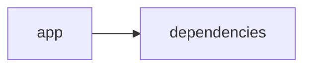

# Documentación del Proyecto

## Guía de Usuario
# Guía de Usuario

Bienvenido a la herramienta de análisis y procesamiento de información. Esta aplicación te ayudará a transformar grandes volúmenes de datos en insights claros y accionables a través de una interfaz web amigable.

---

## 📱 ¿Qué es esta aplicación?

- **Propósito principal:**  
  Esta herramienta permite analizar información contenida en archivos PDF, conversaciones y datos de Voz del Cliente (VoC) de forma interactiva. Utiliza modelos de lenguaje basados en IA para interpretar y extraer datos relevantes, facilitando el entendimiento y la toma de decisiones.

- **Problema que resuelve:**  
  Si necesitas extraer conocimientos de informes extensos, analizar diálogos o entender las opiniones y comentarios de tus clientes, nuestra aplicación automatiza estas tareas para ahorrarte tiempo y reducir errores en la interpretación manual.

- **Beneficios clave:**  
  • Ahorro de tiempo gracias a procesos automáticos.  
  • Resultados claros y visuales que facilitan la toma de decisiones.  
  • Soporte para múltiples tipos de análisis: documentos, conversaciones y feedback de clientes.  
  • Acceso a insights que pueden potenciar estrategias de negocio y atención al cliente.

- **Audiencia objetivo:**  
  Profesionales en áreas de análisis de datos, atención al cliente, marketing, investigación de mercado y equipos de soporte que necesiten transformar grandes volúmenes de información en datos útiles.

---

## ✨ Funcionalidades Principales

### Interfaz Web Interactiva
- **¿Qué hace?**  
  Ofrece un entorno visual y fácil de usar donde puedes navegar entre las diferentes funcionalidades de la aplicación, subir archivos, configurar análisis y visualizar resultados en tiempo real.

- **¿Cuándo usarla?**  
  Cada vez que necesites acceder a la herramienta, revisar resultados o configurar un nuevo análisis, la interfaz actúa como tu punto de entrada principal.

- **¿Cómo acceder?**  
  Simplemente abre tu navegador y dirígete a la URL proporcionada. Una vez cargada, encontrarás un menú claro para navegar entre las opciones disponibles.

- **Resultado esperado:**  
  Una pantalla limpia con opciones de menú, botones y paneles de visualización que te permiten interactuar fácilmente con la aplicación.

### Procesamiento de Archivos PDF
- **¿Qué hace?**  
  Permite cargar archivos PDF para extraer y procesar su contenido textual de manera automática, listo para ser analizado.

- **¿Cuándo usarla?**  
  Úsala cuando necesites analizar reportes, documentos o cualquier otro archivo PDF que contenga información relevante.

- **¿Cómo acceder?**  
  En la interfaz principal, selecciona la opción "Procesar PDF", luego arrastra y suelta tu archivo o haz clic para buscarlo en tu ordenador.

- **Resultado esperado:**  
  Una vista previa del contenido del documento extraído y listo para someterlo a análisis con modelos de lenguaje.

### Análisis con Modelos de Lenguaje (IA)
- **¿Qué hace?**  
  Utiliza algoritmos de inteligencia artificial para interpretar el contenido textual, identificar patrones y extraer insights valiosos.

- **¿Cuándo usarla?**  
  Ideal para analizar grandes volúmenes de texto cuando buscas extraer información específica, generar resúmenes o obtener recomendaciones basadas en el contenido.

- **¿Cómo acceder?**  
  Tras procesar un archivo o ingresar un texto, selecciona la opción "Analizar con IA" y sigue las indicaciones en pantalla.

- **Resultado esperado:**  
  Un reporte detallado con insights, clasificaciones y sugerencias basadas en los datos analizados.

### Análisis de Conversaciones
- **¿Qué hace?**  
  Permite cargar transcripciones o registros de conversaciones (como chats o llamadas) para analizarlas y extraer temas recurrentes y sentiment analysis.

- **¿Cuándo usarla?**  
  Cuando necesites entender el flujo de las conversaciones de soporte, detectar problemas recurrentes o medir el tono general de las interacciones.

- **¿Cómo acceder?**  
  Desde la interfaz, elige la sección "Análisis de Conversaciones", carga tus archivos o pega el texto y activa el proceso de análisis.

- **Resultado esperado:**  
  Visualizaciones y reportes que muestran los temas predominantes, la frecuencia de palabras clave y análisis de sentimientos.

### Análisis de Voz del Cliente (VoC)
- **¿Qué hace?**  
  Evalúa comentarios, reseñas y feedback de clientes, permitiendo identificar tendencias, niveles de satisfacción y áreas de mejora.

- **¿Cuándo usarla?**  
  Úsala cuando desees conocer en profundidad la opinión de tus clientes para mejorar productos, servicios o procesos internos.

- **¿Cómo acceder?**  
  En el menú, selecciona "Voz del Cliente (VoC)", sube los archivos o introduce los comentarios y empieza el análisis.

- **Resultado esperado:**  
  Un informe enfocado en las percepciones del cliente, destacando opiniones positivas, críticas y sugerencias de mejora.

---

## 🚀 Cómo Empezar

### Primer Uso
1. **Requisitos previos:**  
   - Una conexión estable a Internet.  
   - Un navegador web actualizado.  
   - Archivos PDF o textos de conversaciones/listados de feedback (si aplica).
2. **Acceso inicial:**  
   Ingresa a la aplicación usando la URL proporcionada. La página de inicio te dará la bienvenida y mostrará las opciones principales.
3. **Configuración básica:**  
   Revisa la configuración de idioma y visualización. No es necesaria una configuración avanzada, la aplicación está lista para usar.
4. **Primera tarea recomendada:**  
   Sube un archivo PDF y realiza un análisis básico para familiarizarte con la interfaz y el proceso de extracción de información.

### Flujo Típico de Uso
1. **Paso 1:**  
   Accede a la interfaz web mediante tu navegador.
2. **Paso 2:**  
   Selecciona la funcionalidad deseada (por ejemplo, "Procesar PDF" o "Análisis de Conversaciones").
3. **Paso 3:**  
   Sube el archivo o ingresa el texto, y luego activa el análisis.
4. **Paso 4:**  
   Visualiza el reporte generado, explora los insights y, si es necesario, ajusta los parámetros del análisis para afinar los resultados.

---

## 💡 Casos de Uso Comunes

### Escenario 1: Análisis de Reportes en PDF
**Situación:**  
Necesitas extraer información clave de un informe extenso para presentar insights a tu equipo.

**Pasos:**  
1. Ingresa a la aplicación y selecciona "Procesar PDF".  
2. Sube el informe en formato PDF.  
3. Activa el análisis con IA para resumir y resaltar puntos importantes.  
4. Revisa el informe generado y utiliza la información para preparar tu presentación.

### Escenario 2: Evaluación de Conversaciones de Soporte
**Situación:**  
Quieres identificar temas comunes y detectar áreas de mejora en las interacciones de soporte al cliente.

**Pasos:**  
1. Accede a "Análisis de Conversaciones".  
2. Carga las transcripciones de chats o registros de llamadas.  
3. Ejecuta el análisis y observa las visualizaciones y resúmenes.  
4. Usa los resultados para capacitar a tu equipo y optimizar procesos.

### Escenario 3: Revisión de la Voz del Cliente (VoC)
**Situación:**  
Deseas conocer la percepción de tus clientes acerca de un nuevo producto o servicio.

**Pasos:**  
1. Selecciona "Voz del Cliente (VoC)" en la interfaz.  
2. Sube los comentarios, encuestas o reseñas de clientes.  
3. Inicia el análisis y espera a que se generen los insights.  
4. Analiza el feedback para descubrir tendencias y áreas a mejorar.

---

## ❓ Preguntas Frecuentes

**P: ¿Cómo puedo cargar un archivo PDF para su análisis?**  
R: Simplemente dirígete a la sección "Procesar PDF", arrastra y suelta el archivo o haz clic para seleccionarlo desde tu dispositivo.

**P: ¿Qué hago si el análisis tarda demasiado en completarse?**  
R: Verifica tu conexión a Internet y asegúrate de que el archivo no sea excesivamente grande. Si el problema persiste, reinicia el proceso o contacta al soporte.

**P: ¿Es seguro usar la herramienta con datos confidenciales?**  
R: Sí, la aplicación aplica medidas de seguridad básicas para proteger la información. Sin embargo, te recomendamos evitar cargar documentos altamente sensibles o confidenciales.

**P: ¿Cuáles son las limitaciones principales de la aplicación?**  
R: La herramienta está optimizada para formatos de texto comunes. Puede tener dificultades con documentos escaneados sin reconocimiento óptico (OCR) o con formatos de archivos no soportados. Además, la precisión del análisis dependerá de la calidad del texto subido.

---

## 🆘 Solución de Problemas

### Problema: Error al Cargar un Archivo PDF
**Síntomas:**  
El archivo no se sube o aparece un mensaje de error durante la carga.

**Causa probable:**  
El archivo puede estar dañado, ser incompatible o exceder el tamaño permitido.

**Solución:**  
1. Verifica que el PDF se abra correctamente en otro visor.  
2. Asegúrate de que cumple con los requisitos de formato y tamaño.  
3. Intenta disminuir el tamaño o convertir el archivo y vuelve a intentarlo.

### Problema: Resultados Inesperados en el Análisis de Conversaciones
**Síntomas:**  
El reporte no muestra temas definidos o los insights parecen confusos.

**Causa probable:**  
El texto podría contener errores, estar mal estructurado o tener un formato inusual.

**Solución:**  
1. Revisa la calidad del texto cargado y corrige posibles errores de transcripción.  
2. Asegúrate de que las conversaciones estén bien delimitadas (por ejemplo, identificadores de interlocutores).  
3. Ejecuta nuevamente el proceso de análisis.

### Problema: Lentitud en la Visualización de Resultados
**Síntomas:**  
El análisis tarda más de lo esperado o la interfaz responde lentamente.

**Causa probable:**  
Puede ser un problema de conexión a Internet o una gran cantidad de datos a procesar.

**Solución:**  
1. Comprueba tu conexión a Internet.  
2. Intenta realizar el análisis en momentos de menor actividad.  
3. Si el problema persiste, contacta al soporte indicando el problema.

---

## 📞 Soporte y Contacto
- **¿Necesitas ayuda adicional?**  
  Comunícate con nuestro equipo de soporte al correo soporte@tuempresa.com.
- **¿Encontraste un error?**  
  Reporta cualquier fallo o comportamiento inesperado a través del formulario de feedback disponible en la herramienta.
- **¿Tienes sugerencias?**  
  Nos encantaría saber cómo podemos mejorar. Envía tus ideas y comentarios a feedback@tuempresa.com.

---

Esperamos que esta guía te sea útil para aprovechar al máximo la aplicación. ¡Disfruta del análisis y la extracción de insights de forma sencilla y eficiente!

## Documentación Técnica
A continuación se presenta la documentación técnica completa en Markdown, siguiendo la estructura solicitada y basada en el análisis del código proporcionado.

----------------------------------------------------------------
# Documentación Técnica

Esta documentación está orientada a desarrolladores y equipos técnicos interesados en comprender, mantener y extender la aplicación VoC Analyst. Esta herramienta permite procesar archivos (PDF y TXT), extraer y normalizar información de conversaciones y, a través de la integración con proveedores de modelos de lenguaje (LLM), generar insights sobre la Voz del Cliente (VoC). La interfaz se implementa con Streamlit y el procesamiento se realiza en un único módulo monolítico con responsabilidades bien definidas.

----------------------------------------------------------------
## 🏗️ Arquitectura del Sistema

- **Patrón arquitectónico utilizado:**  
  La aplicación sigue un enfoque modular monolítico “híbrido” en el que se integran la interfaz de usuario (Frontend) con la lógica de negocio (Backend).  
  - La **Capa de Presentación** se implementa con Streamlit, y es responsable de la carga de archivos, manejo de la interacción y visualización dinámica de resultados.  
  - La **Capa de Lógica y Análisis** se compone de módulos para la extracción y validación de archivos (por ejemplo, utilizando PyPDF2 para extraer texto), el parsing y normalización de conversaciones (incluyendo redacción de PII) y la integración con proveedores de Modelos de Lenguaje (LLM) a través del módulo LLMBackend.

- **Diagrama de componentes:**  
  A continuación se muestra un diagrama Mermaid que resume la estructura del sistema:

  ```mermaid
  graph LR
      A[Interfaz Streamlit (Frontend)] --> B[Procesamiento y Validación de Archivos]
      A --> C[Gestión del Estado (st.session_state)]
      B --> D[Extracción de Texto (PyPDF2)]
      B --> E[Parser y Redacción de PII]
      A --> F[LLMBackend (Lógica de Negocio)]
      F --> G[Proveedores LLM (OpenAI, Anthropic, Gemini)]
  ```

- **Flujo de datos principal entre componentes:**  
  1. El usuario accede a la aplicación mediante el navegador y carga archivos (PDF o TXT).  
  2. Se valida cada archivo (por ejemplo, con `validate_file_size`) y se extrae el contenido textual usando `extract_text_from_pdf`.  
  3. El texto extraído se envía al módulo de parser, donde se normaliza la conversación, se segmenta en turnos y se redacta la información sensible (PII).  
  4. La información normalizada se envía al módulo LLMBackend, el cual –mediante la configuración entregada en ModelConfig– envía el contenido a los proveedores LLM mediante un prompt (en este caso se utiliza el método de procesamiento en lote, `analyze_conversations_batch`) para obtener análisis, insights, detección de temas, sentimientos y recomendaciones.  
  5. Los resultados se almacenan en `st.session_state` y se visualizan de forma interactiva en la interfaz.

- **Dependencias críticas y su propósito:**  
  - **Streamlit:** Proporciona la interfaz web interactiva y maneja el estado en tiempo real.  
  - **PyPDF2:** Extrae el contenido textual de los documentos PDF.  
  - **Pandas:** Facilita la manipulación y visualización de datos tabulados, por ejemplo, para mostrar KPIs y tablas.  
  - **LLM SDKs (openai, anthropic, google-genai):** Permiten la integración con diferentes proveedores de modelos de lenguaje para realizar análisis semántico y generar insights.  
  - Otras librerías estándar (json, os, time, datetime, uuid, zipfile, io, typing) ofrecen utilidades básicas y manejo de datos a lo largo de la aplicación.

----------------------------------------------------------------
## 📋 Stack Tecnológico

- **Lenguajes:**  
  - Principalmente Python (los archivos se clasifican como “other” en el repositorio).

- **Frameworks / Librerías:**  
  - **Streamlit:** (>= 1.49.1) para la creación de la interfaz web interactiva.
  - **PyPDF2:** (>= 3.0.1) para extraer texto de documentos PDF.
  - **Pandas:** (>= 2.3.2) para manipular y visualizar datos (tablas, DataFrames, etc.).
  - **LLM SDKs:**
    - `openai` – Para integrar modelos de OpenAI.
    - `anthropic` – Para conectar con proveedores de Anthropic.
    - `google-genai` – Para integrar modelos de Google GenAI (Gemini).
  - **Librerías estándar de Python:** json, os, time, datetime, uuid, zipfile, io, typing.

- **Base de Datos:**  
  No se utiliza una base de datos relacional. El almacenamiento es transitorio y se gestiona en memoria a través de `st.session_state`.

- **APIs externas:**  
  La aplicación se conecta a las APIs de proveedores LLM (OpenAI, Anthropic y Google GenAI) para realizar análisis de lenguaje e inteligencia artificial.

- **Infraestructura:**  
  La aplicación se despliega como una aplicación web simple con Streamlit y puede ejecutarse en entornos locales, servidores o contenedores Docker.

----------------------------------------------------------------
## 🔧 Componentes Principales

### 1. Aplicación Streamlit

- **Propósito:**  
  Gestiona la interfaz de usuario final, permitiendo la carga, validación y visualización de archivos y resultados de análisis. Además, configura la página, maneja el estado de la sesión y coordina las interacciones con el backend.
  
- **Ubicación:**  
  Principalmente en el archivo `app.py` (dentro de la carpeta `app/` o en la raíz), junto a módulos auxiliares como `parser.py` y `utils.py`.

- **Interfaces y Funcionalidades:**  
  - **Configuración de la Página:** Se utiliza `st.set_page_config` para definir el título, el icono, el layout y la configuración inicial del sidebar.  
  - **Gestión del Estado:**  
    Se utiliza `st.session_state` para almacenar variables clave como:
      - `analysis_results`: Resultados del análisis ejecutado.
      - `run_id`: Identificador único para cada ejecución.
      - `uploaded_files_data`: Información de los archivos subidos, en forma de lista de diccionarios.
      - `processing_complete`: Indicador booleano que marca la finalización del análisis.
  - **Funciones Auxiliares de Carga y Procesamiento:**  
    - `extract_text_from_pdf(pdf_file) → str`: Recorre el PDF, extrae el texto de cada página y retorna el contenido completo.  
    - `validate_file_size(file) → bool`: Asegura que el archivo a procesar tenga un tamaño inferior a 100MB.
  
- **Ejemplo de Código:**  
  (Se muestra en el bloque inicial de código, donde se configuran las variables de sesión, se definen las funciones de extracción y validación, y se configura la página con Streamlit).

---

### 2. Módulo LLMBackend

- **Propósito:**  
  Integra la aplicación con proveedores de modelos de lenguaje (LLM) para analizar el contenido textual extraído y procesado. Permite configurar dinámicamente el proveedor y el modelo, cargar prompts específicos y gestionar la comunicación (incluyendo reintentos en caso de fallo).
  
- **Ubicación:**  
  Se encuentra en el archivo `llm_backend.py` en la raíz del proyecto.

- **Interfaces y Funcionalidades:**  
  - **ModelConfig:**  
    Una clase de configuración (utilizando dataclasses) que define:
    - `provider`: El proveedor a utilizar (ej.: "openai", "anthropic" o "gemini").
    - `model`: El modelo específico a emplear.
    - `api_key`: La clave API necesaria para la autenticación.
    - `max_retries` y `retry_delay`: Parámetros que permiten gestionar los reintentos en caso de error en la comunicación.
    
  - **LLMBackend:**  
    Métodos clave:
    - `__init__(config: ModelConfig)`: Inicializa el backend utilizando la configuración especificada.
    - `_initialize_client()`: Selecciona y retorna la instancia del cliente del proveedor LLM adecuado.
    - `_load_parse_prompt()` y `_load_analyze_prompt()`: Preparan y configuran los prompts necesarios para el análisis.  
    - `analyze_text(text: str) → Dict[str, Any]`: Envía el texto a analizar al proveedor LLM y retorna un diccionario con los resultados.  
    - En el ejemplo se utiliza además un método optimizado de procesamiento en lote con `analyze_conversations_batch(processed_files)`, que permite ejecutar el análisis de múltiples archivos a la vez para mejorar el rendimiento.

---

### 3. Extracción y Procesamiento de Archivos

- **Propósito:**  
  Gestionar la carga y el procesamiento de archivos subidos. Esto incluye la validación del tamaño y el tipo de archivo, la extracción del contenido textual de archivos PDF (o archivos de texto planos), y la preparación de los datos para el análisis.
  
- **Funciones Clave:**  
  - `extract_text_from_pdf(pdf_file) → str`: Extrae el texto concatenando el resultado de cada página del PDF y maneja excepciones en caso de error.
  - `validate_file_size(file) → bool`: Comprueba que el archivo no exceda el límite de 100MB.
  - `process_uploaded_files(uploaded_files) → List[Dict[str, Any]]`: Itera sobre cada archivo subido, valida su tamaño y tipo, extrae el contenido y compila un listado de datos con el nombre del archivo, contenido, tamaño y tipo.

---

### 4. Parser y Análisis de Conversaciones

- **Propósito:**  
  Transformar el contenido textual (extraído de archivos o ingresado manualmente) en un formato estructurado para el análisis.  
  Incluye la segmentación del texto en turnos de conversación, la identificación de metadatos como timestamps y roles (cliente, agente, desconocido) y la redacción de la información sensible (PII) reemplazándola por etiquetas predefinidas (por ejemplo, `[EMAIL]`, `[PHONE]`).
  
- **Funcionalidades Específicas:**  
  - Dividir y estructurar la conversación en un objeto JSON.
  - Extraer e incorporar metadatos adicionales para mejorar el análisis posterior.
  - Generar una salida homogénea para la visualización en paneles y la exportación en formatos reutilizables.

----------------------------------------------------------------
## 🚀 APIs y Endpoints

Aunque la aplicación no expone endpoints REST públicos, se definen “APIs internas” en forma de funciones y métodos que orquestan el flujo completo del procesamiento:

- **Función: extract_text_from_pdf(pdf_file) → str:**  
  Extrae el contenido textual de un PDF utilizando PyPDF2 y gestiona errores mediante bloques try/except.

- **Función: validate_file_size(file) → bool:**  
  Verifica que el archivo subido tenga un tamaño menor a 100MB mediante operaciones sobre el puntero del archivo.

- **Método: LLMBackend.analyze_text(text: str) → Dict[str, Any]:**  
  Envía el texto (junto con un prompt de análisis) al proveedor LLM configurado y retorna un diccionario con los insights, análisis de sentimientos, temas y recomendaciones.

- **Función de procesamiento en lote:**  
  El método `analyze_conversations_batch(processed_files)` (utilizado en el código) permite enviar múltiples archivos a procesar en una sola llamada para mejorar la eficiencia.

- **Parser de Conversaciones:**  
  Funciones que transforman la entrada textual en un JSON estructurado, normalizando la información y protegiendo la PII.

----------------------------------------------------------------
## 💾 Modelo de Datos

- **Entidades Principales: Conversación**  
  La información se estructura internamente en un formato JSON con los siguientes campos:
  - `conversation_id`: Identificador único, que puede derivarse del nombre del archivo o de metadatos.
  - `messages`: Lista de mensajes, donde cada mensaje incluye:
    - `sender`: El rol del emisor (cliente, agente o desconocido).
    - `timestamp`: La marca de tiempo del mensaje, si está disponible.
    - `content`: El texto del mensaje, con la información sensible ya redactada.
    - `metadata`: Información adicional, como canal de comunicación o duración del mensaje.
    
- **Esquemas de Entrada y Salida:**  
  - **Entrada:** Archivos PDF o archivos de texto (.txt) y transcripciones de conversaciones.  
  - **Salida:** JSON estructurado que incluye tanto el detalle de la conversación como los insights generados (KPI, temas, recomendaciones, asignaciones de mensajes, etc.).

- **Validaciones y Transformaciones:**  
  - Se valida que el contenido extraído sea no vacío y esté correctamente formateado.  
  - Se aplican reglas de redacción para anonimizar la información sensible (PII) antes de procesar el análisis.  
  - Se estructura el JSON para que sea fácilmente consumible por los módulos de visualización y exportación.

----------------------------------------------------------------
## 🛠️ Guía de Desarrollo

### 1. Configuración del Entorno

1. **Prerrequisitos:**
   - Python 3.8 o superior.
   - Conexión a Internet para realizar llamadas a las APIs de proveedores LLM (en producción).

2. **Instalación:**
   - Clona el repositorio:
     ```bash
     git clone https://github.com/tu_usuario/voc-analyst.git
     cd voc-analyst
     ```
   - Crea y activa un entorno virtual:
     ```bash
     python -m venv env
     source env/bin/activate       # En Linux/Mac
     env\Scripts\activate          # En Windows
     ```
   - Instala las dependencias:
     ```bash
     pip install -r requirements.txt
     ```

3. **Variables de Entorno:**
   - Configura las API keys mediante variables de entorno, por ejemplo:
     - `OPENAI_API_KEY`
     - `ANTHROPIC_API_KEY`
     - `GEMINI_API_KEY`

---

### 2. Estructura del Código

El repositorio se organiza de la siguiente manera:

```
VoC-Analyst/
├── app/
│   ├── app.py                # Punto de entrada: Interfaz de usuario con Streamlit
│   ├── parser.py             # Funciones de parseo y procesamiento de conversaciones
│   └── utils.py              # Funciones auxiliares (extracción de texto, validación, etc.)
├── llm_backend.py            # Módulo para integración con proveedores LLM
├── requirements.txt          # Lista de dependencias
└── README.md                 # Documentación general y guía de usuario
```

- **Convenciones de Código:**
  - Emplear nombres descriptivos en minúsculas y separados por guiones bajos.
  - Separar la lógica de la interfaz (Streamlit) de la lógica de negocio (LLMBackend y Parser).
  - Utilizar inyección de dependencias a través de la clase `ModelConfig` para facilitar la extensión y mantenimiento.
  - Escribir pruebas unitarias (por ejemplo, con pytest) para funciones críticas como la extracción de texto, validación y comunicación con el LLM.

- **Manejo de Errores y Logging:**
  - Utilizar bloques try/except en cada función crítica para capturar y notificar errores.
  - Registrar eventos importantes mediante el módulo logging (opcional para futuras mejoras).

---

### 3. Pruebas y Validación

- **Pruebas Unitarias:**
  - Implementar pruebas para:
    - Validar que `extract_text_from_pdf` extraiga correctamente el contenido.
    - Confirmar que `validate_file_size` funcione de acuerdo al límite permitido.
    - Simular peticiones al módulo LLMBackend y verificar el manejo correcto de respuestas y reintentos.
  
- **Validación de Integración:**
  - Asegurarse de que la cadena de flujo, desde la carga del archivo hasta la visualización de resultados, se ejecute correctamente.
  - Testear el método de procesamiento en lote (`analyze_conversations_batch`) para garantizar la escalabilidad.

---

## 🔍 Puntos de Atención

- **Limitaciones Conocidas:**
  - La extracción de texto depende de la calidad de los archivos PDF. PDFs basados en imágenes pueden requerir integrar OCR.
  - Los análisis de modelos LLM dependen de la claridad del texto ingresado y de la configuración correcta de la API key.
  - Actualmente, la aplicación procesa un archivo o grupo de archivos en una ejecución; el procesamiento asíncrono o en lotes podría mejorar el rendimiento en futuros desarrollos.

- **Consideraciones de Rendimiento:**
  - El procesamiento de archivos muy grandes (cercanos a 100MB) puede afectar el tiempo de respuesta.
  - Se recomienda implementar técnicas de caching o procesamiento en lote para análisis repetitivos.

- **Aspectos de Seguridad:**
  - Las API keys deben protegerse utilizando variables de entorno y no deben exponerse en el código fuente.
  - Es fundamental redactar (anonymizar) la información sensible (PII) antes de enviarla a proveedores externos.

- **TODOs y Mejoras Sugeridas:**
  - Ampliar el soporte a otros formatos de archivo (por ejemplo, TXT).
  - Integrar OCR para procesar PDFs basados en imágenes.
  - Desarrollar procesamiento asíncrono y/o en lote para mejorar el rendimiento en análisis masivo.
  - Mejorar la modularidad del parser y la gestión de errores en la comunicación con el LLM.

----------------------------------------------------------------
## Diagrama del Sistema

El siguiente diagrama Mermaid resume la interacción y flujo entre la interfaz de usuario, el módulo de procesamiento y el LLMBackend:

```mermaid
graph LR
    A[Interfaz Streamlit] --> B[Procesamiento y Validación de Archivos]
    B --> C[Parser y Normalización de Conversaciones]
    A --> D[LLMBackend]
    D --> E[Proveedores LLM (OpenAI, Anthropic, Gemini)]
```

----------------------------------------------------------------
## Consideraciones Finales

- **Escalabilidad y Mantenimiento:**  
  La estructura modular permite agregar nuevos proveedores LLM, ampliar funcionalidades y adaptar el parser sin reescribir la interfaz.  
- **Documentación y Colaboración:**  
  Se recomienda mantener la documentación actualizada conforme se realicen mejoras o se agreguen nuevos módulos.  
- **Seguridad y Privacidad:**  
  Se debe prestar atención a la protección de API keys y la redacción adecuada de PII para cumplir con las políticas de privacidad y normativas vigentes.

----------------------------------------------------------------
## Guía de Usuario – Resumen Práctico

1. **Acceso a la Aplicación:**  
   Abra su navegador y diríjase a la URL designada (ejemplo: http://localhost:8501).  
2. **Carga de Archivos:**  
   Utilice la opción “Cargar PDF” o “Subir Archivo” para cargar documentos o transcripciones.
3. **Ejecución del Análisis:**  
   Una vez procesados, haga clic en “Analizar con LLM” para enviar el contenido a los modelos de lenguaje y generar análisis e insights.
4. **Visualización y Exportación:**  
   Revise los paneles de resultados (KPIs, Temas, Recomendaciones, Asignaciones) y use las opciones de exportación (descargar JSON o CSV) para obtener los datos.
5. **Soporte:**  
   Para ayuda adicional, revise la sección de Preguntas Frecuentes o contacte al equipo de soporte mediante los datos proporcionados en la aplicación.

----------------------------------------------------------------
## Diagrama Final



----------------------------------------------------------------
Happy Coding y ¡éxito en el análisis de la Voz del Cliente!

Para cualquier duda, sugerencia o contribución, se recomienda revisar el repositorio de issues o contactar directamente al equipo de desarrollo.

----------------------------------------------------------------
## Diagrama (Resumen Visual)


## Diagrama
```mermaid
graph LR\nApp["app"]-->Deps["dependencies"]\n
```
