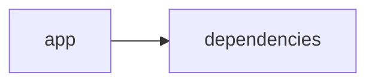

# Documentación del Proyecto

## Guía de Usuario
# Guía de Usuario

## 📱 ¿Qué es esta aplicación?
- **Propósito principal**:  
  Esta herramienta te permite procesar y analizar información de documentos PDF y conversaciones usando modelos de lenguaje basados en inteligencia artificial, todo a través de una interfaz web interactiva creada con Streamlit.
  
- **Problema que resuelve**:  
  Transforma documentos y conversaciones (como transcripciones y feedback de clientes) en información clara y accionable, facilitando la extracción de insights útiles para la toma de decisiones.

- **Beneficios clave**:  
  • Interfaz intuitiva y fácil de usar.  
  • Automatización en la digitalización y análisis de documentos PDF.  
  • Análisis inteligente de textos con IA para descubrir patrones y tendencias.  
  • Recopilación y evaluación de la Voz del Cliente (VoC) para mejorar productos y servicios.
  
- **Audiencia objetivo**:  
  Profesionales de análisis de datos, equipos de atención al cliente, marketing y cualquier usuario que necesite transformar información no estructurada en insights fácilmente comprensibles.

## ✨ Funcionalidades Principales

### Interfaz Web Interactiva con Streamlit
- **¿Qué hace?**:  
  Ofrece un entorno visual amigable donde puedes acceder a todas las herramientas de la aplicación de manera centralizada.
  
- **¿Cuándo usarla?**:  
  Úsala cada vez que necesites acceder o gestionar cualquier funcionalidad, desde la carga de archivos hasta el análisis con IA.
  
- **¿Cómo acceder?**:  
  Ingresa a la URL de la aplicación a través de tu navegador. Si se requiere, inicia sesión con tus credenciales.
  
- **Resultado esperado**:  
  Visualizarás un panel de control con opciones claras para procesar documentos, analizar conversaciones y revisar la Voz del Cliente.

### Procesamiento de Archivos PDF
- **¿Qué hace?**:  
  Permite cargar y extraer contenido de documentos PDF para su posterior análisis.
  
- **¿Cuándo usarla?**:  
  Cuando necesitas digitalizar y transformar la información contenida en archivos PDF en texto legible y procesable.
  
- **¿Cómo acceder?**:  
  Desde el menú principal de la interfaz, selecciona "Procesar PDF" y usa el botón para subir el archivo deseado.
  
- **Resultado esperado**:  
  Verás el contenido extraído del archivo PDF en formato de texto, listo para ser analizado con las otras herramientas de la aplicación.

### Análisis con Modelos de Lenguaje (IA)
- **¿Qué hace?**:  
  Utiliza avanzados modelos de lenguaje para analizar el texto, identificar tendencias, resumir información y responder a consultas específicas.
  
- **¿Cuándo usarla?**:  
  Cuando necesites interpretar y resumir grandes volúmenes de texto o cuando quieras descubrir patrones y recomendaciones automáticamente.
  
- **¿Cómo acceder?**:  
  Una vez que un documento ha sido procesado o una conversación transcrita, selecciona la opción "Analizar con IA" desde el menú.
  
- **Resultado esperado**:  
  Recibirás un reporte detallado o un resumen con insights clave derivados del contenido analizado.

### Análisis de Conversaciones
- **¿Qué hace?**:  
  Analiza transcripciones de conversaciones, chats u otros formatos de comunicación para identificar temas relevantes y evaluar el tono de las interacciones.
  
- **¿Cuándo usarla?**:  
  Ideal para equipos que necesitan evaluar la calidad del servicio al cliente o entender mejor las inquietudes de los usuarios.
  
- **¿Cómo acceder?**:  
  Ve a la sección "Análisis de Conversaciones" en la aplicación y carga el archivo o conecta la fuente de datos correspondiente.
  
- **Resultado esperado**:  
  Se generarán reportes y gráficos visuales que muestran los temas más frecuentes, el ánimo de las conversaciones y otros insights relevantes.

### Análisis de Voz del Cliente (VoC)
- **¿Qué hace?**:  
  Recoge y analiza feedback y opiniones de los clientes para ayudarte a conocer mejor sus necesidades y expectativas.
  
- **¿Cuándo usarla?**:  
  Cuando quieras recoger información directa de tus clientes para mejorar productos o servicios.
  
- **¿Cómo acceder?**:  
  Selecciona "Voz del Cliente" en el menú principal y sigue las instrucciones para conectar y subir datos de encuestas o comentarios.
  
- **Resultado esperado**:  
  Visualizarás dashboards y reportes que resaltan la satisfacción de los clientes y áreas de mejora basadas en sus comentarios.

## 🚀 Cómo Empezar

### Primer Uso
1. **Requisitos previos**:  
   Asegúrate de tener acceso a la aplicación a través de tu navegador y de contar con los documentos o datos (como archivos PDF y transcripciones) que deseas analizar.
   
2. **Acceso inicial**:  
   Ingresa a la aplicación mediante la URL proporcionada. Si es la primera vez, sigue el proceso de registro o inicia sesión con tus credenciales.
   
3. **Configuración básica**:  
   Configura tus preferencias de usuario, selecciona el idioma, y explora el menú principal para familiarizarte con las opciones disponibles.
   
4. **Primera tarea recomendada**:  
   Sube un documento PDF o una transcripción para probar el proceso de análisis desde el inicio.

### Flujo Típico de Uso
1. **Paso 1**:  
   Inicia sesión en la interfaz web de la aplicación.
   
2. **Paso 2**:  
   Selecciona la función que necesitas (por ejemplo, "Procesar PDF" o "Analizar Conversaciones").
   
3. **Paso 3**:  
   Sigue los pasos específicos para la funcionalidad elegida y revisa el reporte o gráfico generado.
   
4. **Paso 4**:  
   Utiliza los insights obtenidos para tomar decisiones o mejorar la calidad del servicio/producto.

## 💡 Casos de Uso Comunes

### Escenario 1: Resumen de Reportes en PDF
Situación: Necesitas resumir y extraer la información clave de múltiples informes de ventas en formato PDF.  
Pasos: 
1. Sube cada uno de los PDF en la sección "Procesar PDF".  
2. Utiliza "Análisis con IA" para obtener un resumen de los datos y descubrir tendencias.  
3. Revisa el reporte final y aplica los insights para ajustar estrategias de ventas.

### Escenario 2: Optimización del Servicio al Cliente
Situación: Buscas mejorar la calidad del servicio a través del análisis de transcripciones de chat.  
Pasos: 
1. Accede a la sección "Análisis de Conversaciones" y carga las transcripciones.  
2. Observa los reportes que indican los temas recurrentes y el tono general de las interacciones.  
3. Implementa mejoras basadas en estas conclusiones.

### Escenario 3: Evaluación de la Voz del Cliente
Situación: Quieres obtener feedback sobre un nuevo producto a partir de encuestas y comentarios.  
Pasos:
1. Dirígete a "Análisis de Voz del Cliente".  
2. Conecta las fuentes de feedback disponibles o sube archivos con respuestas.  
3. Analiza el dashboard para identificar áreas de mejora y puntos fuertes en la percepción del producto.

## ❓ Preguntas Frecuentes

P: ¿Cómo subo un archivo PDF para su análisis?  
R: En la pantalla principal, selecciona "Procesar PDF", haz clic en el botón para cargar tu archivo y espera a que se procese.

P: ¿Qué hago si no se genera el reporte de análisis de IA?  
R: Revisa que el archivo cargado contenga texto legible y vuelve a intentarlo. Si el problema persiste, contacta al soporte técnico.

P: ¿Es seguro procesar mis documentos en esta aplicación?  
R: Sí, la aplicación utiliza protocolos de seguridad para proteger tus datos y garantizar la confidencialidad de la información procesada.

P: ¿Cuáles son las limitaciones principales?  
R: La aplicación está optimizada para documentos en idioma español y puede presentar dificultades con textos altamente especializados o formatos atípicos.

## 🆘 Solución de Problemas

### Problema: Error al cargar un archivo PDF
- Síntomas: El archivo no se carga correctamente o se muestra un mensaje de error.
- Causa probable: El archivo podría estar dañado o no ser un PDF válido.
- Solución: Asegúrate de que el archivo es un PDF correcto, vuelve a intentarlo y, si el problema persiste, contacta al soporte.

### Problema: Resultados incompletos en el análisis con IA
- Síntomas: El reporte generado no muestra toda la información esperada.
- Causa probable: El contenido del documento o transcripción puede ser insuficiente o poco claro.
- Solución: Verifica que el documento tenga información relevante y vuelve a procesarlo. Revisa además las configuraciones de análisis.

### Problema: Interfaz lenta o sin respuesta
- Síntomas: La aplicación se cuelga o responde muy lentamente.
- Causa probable: Sobrecarga de datos o problemas temporales de conexión.
- Solución: Recarga la página, comprueba tu conexión a internet y reintenta la operación. Si el problema continúa, comunícate con soporte.

## 📞 Soporte y Contacto
- **¿Necesitas ayuda adicional?**  
  Contacta a soporte técnico mediante el correo: soporte@tuempresa.com.
  
- **¿Encontraste un error?**  
  Utiliza el formulario de contacto en la sección "Soporte" para reportarlo.
  
- **¿Tienes sugerencias?**  
  Envía tus comentarios y sugerencias a: feedback@tuempresa.com.

---

Esta guía está diseñada para ayudarte a sacarle el máximo provecho a la aplicación, facilitando el procesamiento y análisis de tus documentos y conversaciones de forma sencilla y eficiente. ¡Explora las funcionalidades y transforma tus datos en insights valiosos!

## Documentación Técnica
A continuación se muestra la documentación técnica completa en Markdown, organizada según la estructura obligatoria solicitada y basada en el análisis del código, la guía de usuario y los diagramas proporcionados.

---

# Documentación Técnica

Esta documentación está orientada a desarrolladores y equipos técnicos interesados en comprender, mantener y extender la aplicación VoC Analyst. La herramienta procesa archivos (por ejemplo, documentos PDF) y analiza la Voz del Cliente (VoC) mediante modelos de lenguaje (LLM). La interfaz se implementa con Streamlit y el backend integra la conexión con proveedores de LLM (OpenAI, Anthropic y Google GenAI).

---

## 🏗️ Arquitectura del Sistema

- **Patrón arquitectónico utilizado:**  
  La aplicación adopta una arquitectura modular monolítica “híbrida” que separa la lógica de presentación de la lógica de negocio.  
  - **Capa de Presentación (Frontend):** Se implementa con Streamlit, que permite la carga de archivos, la interacción del usuario, la visualización dinámica de resultados y la gestión del estado de la sesión mediante `st.session_state`.  
  - **Capa de Lógica y Análisis (Backend):** Comprende módulos para la extracción y preprocesamiento de archivos (utilizando PyPDF2), el parser y normalización de conversaciones (incluyendo la redacción de datos sensibles, PII) y la integración con proveedores de modelos de lenguaje (LLM).

- **Diagrama de componentes:**

  ```mermaid
  graph LR
      A[Interfaz Streamlit (Frontend)] --> B[Procesamiento y Validación de Archivos]
      A --> C[Gestión del Estado (st.session_state)]
      B --> D[Extracción de Texto (PyPDF2)]
      B --> E[Parser y Redacción de PII]
      A --> F[LLMBackend (Lógica de Negocio)]
      F --> G[Proveedores LLM (OpenAI, Anthropic, Gemini)]
  ```

- **Flujo de datos principal entre componentes:**  
  1. El usuario accede a la aplicación mediante la interfaz web y carga uno o más archivos, en su mayoría en formato PDF.  
  2. Se aplican funciones de validación (por ejemplo, `validate_file_size`) y se extrae el contenido textual por medio de `extract_text_from_pdf` (utilizando PyPDF2).  
  3. El texto extraído es enviado al módulo de parser, que normaliza y segmenta la conversación, redactando cualquier información sensible (PII).  
  4. La capa de negocio usa el módulo **LLMBackend** para enviar el contenido a los proveedores LLM (configurados mediante ModelConfig), obteniendo insights (análisis de sentimientos, detección de temas, recomendaciones, etc.).  
  5. Los resultados se almacenan en `st.session_state` y se presentan interactivamente en la interfaz.

- **Dependencias críticas y su propósito:**  
  - **Streamlit:** Facilita la creación de la interfaz web interactiva y la gestión del estado de la sesión.  
  - **PyPDF2:** Extrae el contenido textual de archivos PDF.  
  - **Pandas:** Permite la manipulación y visualización de datos a través de DataFrames.  
  - **LLM SDKs (openai, anthropic, google-genai):** Integran y conectan la aplicación con proveedores de modelos de lenguaje para realizar análisis semántico avanzado.  
  - **Otras librerías estándar:** json, os, time, datetime, uuid, zipfile, io, typing, que soportan operaciones básicas y manejo de datos.

---

## 📋 Stack Tecnológico

- **Lenguajes:**  
  Principalmente Python (catalogado como “other” en el repositorio).

- **Frameworks / Librerías:**  
  - **Streamlit:** (>= 1.49.1) para la creación de la interfaz web interactiva.  
  - **PyPDF2:** (>= 3.0.1) para extraer el contenido textual desde documentos PDF.  
  - **Pandas:** (>= 2.3.2) para la manipulación y visualización de datos.  
  - **LLM SDKs:**  
    - `openai` para integrarse con la API de OpenAI.  
    - `anthropic` para la integración con proveedores de Anthropic.  
    - `google-genai` para conectar con Google GenAI (Gemini u otros modelos).  
  - **Librerías estándar:** json, os, time, datetime, uuid, zipfile, io, typing.

- **Base de Datos:**  
  No se utiliza una base de datos relacional; el almacenamiento se realiza transitoriamente en memoria utilizando `st.session_state`.

- **APIs externas:**  
  Se integran las APIs de proveedores de LLM (OpenAI, Anthropic y Google GenAI) a través de llamadas directas en el módulo LLMBackend.

- **Infraestructura:**  
  La aplicación se despliega como una aplicación web simple mediante Streamlit, pudiendo ejecutarse en entornos locales, servidores o contenedores Docker.

---

## 🔧 Componentes Principales

### 1. Aplicación Streamlit

- **Propósito:**  
  Gestiona la interfaz de usuario final, incluyendo la carga y validación de archivos, la configuración de la página y la visualización interactiva de resultados. Se encarga además de gestionar el estado de la sesión mediante `st.session_state`.

- **Ubicación:**  
  El punto de entrada principal es el archivo `app.py` (ubicado en la raíz o en el directorio `app/`), junto con módulos auxiliares como `parser.py` y `utils.py`.

- **Interfaces y Funcionalidades:**  
  - **Configuración de la Página:**  
    Se utiliza `st.set_page_config` para definir el título, el icono, el layout y el estado inicial del sidebar.
  - **Gestión de Estado:**  
    Con `st.session_state`, se almacenan variables clave como:  
      - `analysis_results`: Resultados del análisis.  
      - `run_id`: Identificador único de cada ejecución.  
      - `uploaded_files_data`: Lista con información y metadatos de los archivos subidos.  
      - `processing_complete`: Indicador del estado de finalización del análisis.
  - **Funciones Auxiliares:**  
    - `extract_text_from_pdf(pdf_file) → str`: Recorre el PDF, extrae el texto de cada página y retorna el contenido completo.  
    - `validate_file_size(file) → bool`: Comprueba que el tamaño del archivo no exceda el límite predefinido (ej. 100MB).

- **Ejemplo de Código:**

  ```python
  import streamlit as st
  import PyPDF2

  st.set_page_config(
      page_title="VoC Analyst - Análisis de Voz del Cliente con LLM",
      page_icon="📊",
      layout="wide",
      initial_sidebar_state="expanded"
  )

  if 'analysis_results' not in st.session_state:
      st.session_state.analysis_results = None
  if 'run_id' not in st.session_state:
      st.session_state.run_id = None
  if 'uploaded_files_data' not in st.session_state:
      st.session_state.uploaded_files_data = []
  if 'processing_complete' not in st.session_state:
      st.session_state.processing_complete = False

  def extract_text_from_pdf(pdf_file) -> str:
      """Extraer texto de archivo PDF"""
      try:
          pdf_reader = PyPDF2.PdfReader(pdf_file)
          text = ""
          for page in pdf_reader.pages:
              text += page.extract_text() + "\n"
          return text.strip()
      except Exception as e:
          st.error(f"Error al extraer texto de PDF: {str(e)}")
          return ""
  ```

---

### 2. Módulo LLMBackend

- **Propósito:**  
  Facilitar la integración con proveedores de Modelos de Lenguaje (LLM) para analizar el contenido textual y generar insights (resúmenes, análisis de sentimientos, detección de temas y recomendaciones).

- **Ubicación:**  
  Se encuentra en el archivo `llm_backend.py` en la raíz del proyecto.

- **Interfaces y Funcionalidades:**  
  - **ModelConfig:**  
    Una clase de configuración (implementada con dataclasses) que define:
    - `provider`: Nombre del proveedor a utilizar (por ejemplo, "openai", "anthropic" o "gemini").
    - `model`: Modelo específico a emplear.
    - `api_key`: Clave para la autenticación.
    - `max_retries` y `retry_delay`: Parámetros para la gestión de reintentos.
    
    ```python
    from dataclasses import dataclass

    @dataclass
    class ModelConfig:
        provider: str  # Ej: "openai", "anthropic", "gemini"
        model: str
        api_key: str
        max_retries: int = 3
        retry_delay: float = 1.0
    ```
  
  - **LLMBackend:**  
    Provee métodos para:
    - Inicializar el cliente LLM adecuado mediante `_initialize_client()`.
    - Cargar los prompts correspondientes con `_load_parse_prompt()` y `_load_analyze_prompt()`.
    - Enviar el texto a analizar mediante `analyze_text(text: str) → Dict[str, Any]` y retornar los insights generados.

---

### 3. Parser y Procesamiento de Conversaciones

- **Propósito:**  
  Procesar y normalizar las conversaciones extraídas de los archivos o ingresadas manualmente, transformándolas en un formato JSON estructurado para facilitar el análisis posterior.  
  Incluye:
  - La segmentación del texto en turnos de conversación.
  - La extracción de metadatos (por ejemplo, `conversation_id`, timestamps y roles).
  - La redacción (anonimización) de información sensible (PII) sustituyéndola por etiquetas estandarizadas (p.ej., `[EMAIL]`, `[PHONE]`).

- **Ubicación:**  
  Las funciones de parser se encuentran en el archivo `parser.py` o integradas en los módulos de procesamiento dentro de `app/`.

- **Dependencias:**  
  Se pueden utilizar expresiones regulares y funciones de manipulación de cadenas para estructurar y anonimizar la información.

---

## 🚀 APIs y Endpoints

Aunque la aplicación no expone endpoints REST públicos, se han definido “APIs internas” a nivel de funciones y métodos:

- **Función: extract_text_from_pdf(pdf_file) → str**  
  Extrae el contenido textual de un archivo PDF utilizando PyPDF2, notificando errores a través de la interfaz.

- **Función: validate_file_size(file) → bool**  
  Verifica que el archivo subido no exceda el límite de tamaño permitido (por ejemplo, 100MB).

- **Método: LLMBackend.analyze_text(text: str) → Dict[str, Any]**  
  Envía el texto a analizar, junto con un prompt predefinido, al proveedor LLM configurado y retorna un diccionario con los resultados (insights, análisis de sentimientos, temas, etc.).

- **Funciones del Parser:**  
  Transforman las conversaciones extraídas en un formato JSON estructurado, normalizando la información y redactando la PII para su análisis posterior.

---

## 💾 Modelo de Datos

- **Entidades Principales: Conversación**  
  Se representa internamente como un objeto JSON con la siguiente estructura:
  - `conversation_id`: Identificador único.
  - `messages`: Lista de mensajes, donde cada mensaje contiene:
    - `sender`: Rol del emisor (cliente, agente, desconocido).
    - `timestamp`: Momento de envío (si disponible).
    - `content`: Texto del mensaje con la información sensible ya redactada.
    - `metadata`: Información adicional (por ejemplo, canal de comunicación, duración, etc.).

- **Esquemas de Entrada y Salida:**
  - **Entrada:** Archivos PDF o textos ingresados.
  - **Salida:** JSON estructurado con la conversación y los insights obtenidos para ser visualizados en la interfaz.

- **Validaciones y Transformaciones:**  
  - Se valida que el texto extraído sea válido y no esté vacío.  
  - Se aplican reglas para redactar y anonimizar datos sensibles (PII).  
  - Se estructura el resultado en un formato JSON homogéneo para facilitar su consumo por módulos de visualización.

---

## 🛠️ Guía de Desarrollo

### 1. Configuración del Entorno

1. **Prerrequisitos:**  
   - Python 3.8 o superior.  
   - Conexión a Internet (para llamadas a las APIs de proveedores LLM en producción).

2. **Instalación:**  
   - Clonar el repositorio:
     ```bash
     git clone https://github.com/tu_usuario/voc-analyst.git
     cd voc-analyst
     ```
   - Crear y activar un entorno virtual:
     ```bash
     python -m venv env
     source env/bin/activate    # En Linux/Mac
     venv\Scripts\activate       # En Windows
     ```
   - Instalar las dependencias:
     ```bash
     pip install -r requirements.txt
     ```

3. **Variables de Entorno:**  
   Configura las API keys mediante variables de entorno:
   - `OPENAI_API_KEY`
   - `ANTHROPIC_API_KEY`
   - `GEMINI_API_KEY`

---

### 2. Estructura del Código

La estructura del proyecto es la siguiente:

```
VoC-Analyst/
├── app/
│   ├── app.py                # Punto de entrada (Interfaz de usuario con Streamlit)
│   ├── parser.py             # Funciones para parseo y procesamiento de conversaciones
│   └── utils.py              # Funciones auxiliares (extracción de texto, validación, etc.)
├── llm_backend.py            # Módulo para integración con proveedores LLM
├── requirements.txt          # Lista de dependencias
└── README.md                 # Documentación general y guía de usuario
```

---

### 3. Estándares de Código

- **Convenciones de Naming:**  
  Utiliza nombres descriptivos en minúsculas y con guiones bajos para identificar archivos y funciones (por ejemplo, `extract_text_from_pdf`).
  
- **Separación de Lógica:**  
  La lógica de la interfaz (Streamlit) se separa de la lógica de negocio (LLMBackend y Parser). Se recomienda el uso de inyección de dependencias a través de la clase `ModelConfig`.

- **Testing y Validación:**  
  - Emplear frameworks como pytest para escribir pruebas unitarias y de integración, cubriendo funciones críticas como la extracción de texto, validación del tamaño y la interacción con el LLM.
  
- **Manejo de Errores y Logging:**  
  Se deben introducir bloques try/except en funciones críticas y utilizar módulos de logging para registrar errores y facilitar la depuración.

---

## 🔍 Puntos de Atención

- **Limitaciones Conocidas:**  
  - La extracción de texto depende de la calidad de los documentos PDF; PDFs basados en imágenes pueden requerir integración de OCR.
  - El rendimiento en el procesamiento de archivos muy grandes (cercanos a 100MB) puede verse afectado.
  
- **Consideraciones de Rendimiento:**  
  - Se recomienda optimizar el procesamiento en lote para análisis repetitivos y considerar técnicas de caching.
  - Ajustar los parámetros de reintentos (`max_retries` y `retry_delay`) para garantizar una comunicación estable con los proveedores LLM.

- **Aspectos de Seguridad:**  
  - Proteger las API keys utilizando variables de entorno y evitar exponerlas en el código fuente.
  - Redactar la información sensible (PII) antes de enviarla a proveedores externos, conforme a las políticas de privacidad.

- **Mejoras Sugeridas (TODOs):**  
  - Extender el soporte a otros formatos de archivo (por ejemplo, TXT).
  - Integrar OCR para documentos PDF basados en imágenes.
  - Mejorar la modularidad y el manejo de errores en el parser y en la capa de conexión con proveedores LLM.
  - Implementar procesamiento asíncrono y/o en lote para optimizar el rendimiento en análisis masivos.

---

## Diagrama del Sistema

El siguiente diagrama Mermaid resume la interacción entre los componentes principales del sistema:

```mermaid
graph LR
    A[Interfaz Streamlit] --> B[Procesamiento y Validación de Archivos]
    B --> C[Parser y Normalización de Conversaciones]
    A --> D[LLMBackend]
    D --> E[Proveedores LLM (OpenAI, Anthropic, Gemini)]
```

---

## Consideraciones Finales

- **Escalabilidad y Mantenimiento:**  
  La arquitectura modular facilita la integración de nuevos proveedores LLM y la extensión de funcionalidades sin reestructurar la interfaz.
- **Manejo de Errores:**  
  Es imprescindible el uso de bloques try/except y la implementación de mecanismos de logging para monitorizar y depurar el sistema.
- **Seguridad:**  
  Se debe prestar especial atención a la protección de las API keys y a la redacción (anonimización) de la información sensible.
- **Documentación:**  
  Mantén la documentación actualizada conforme se realicen cambios o se integren nuevas funcionalidades.

---

## Guía de Usuario – Resumen Práctico

1. **Acceso a la Aplicación:**  
   Inicia el navegador y visita la URL asignada (ej.: http://localhost:8501) para cargar la interfaz.
2. **Carga de Archivos:**  
   Usa la opción “Cargar PDF” para subir tus documentos o “Analizar Conversación” para procesar transcripciones.
3. **Ejecución del Análisis:**  
   Selecciona la funcionalidad de análisis (por ejemplo, “Analizar con IA”), y espera a que se procesen los datos.
4. **Visualización y Exportación:**  
   Revisa los reportes, gráficos e insights y utiliza las opciones de exportación (JSON, CSV) si deseas guardar los resultados.
5. **Soporte:**  
   En caso de problemas, consulta la sección de “Preguntas Frecuentes” o contacta al soporte mediante los correos indicados.

---

## Diagrama Final



---

Happy Coding y ¡éxito en el análisis de la Voz del Cliente!  
Para cualquier duda, sugerencia o contribución, revisa el repositorio de issues o contacta al equipo de desarrollo.

---

## Diagrama (Resumen Visual)


## Diagrama
```mermaid
graph LR\nApp["app"]-->Deps["dependencies"]\n
```
