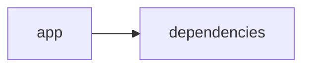

# Documentación del Proyecto

## Guía de Usuario
# Guía de Usuario

## 📱 ¿Qué es esta aplicación?
- **Propósito principal**: Es una herramienta diseñada para facilitar el análisis y procesamiento de información. Permite extraer contenido de archivos PDF, analizar conversaciones y evaluar la Voz del Cliente mediante modelos de lenguaje basados en inteligencia artificial, todo a través de una interfaz web interactiva.
- **Problema que resuelve**: Elimina la necesidad de procesos manuales y tediosos para extraer y analizar datos, ayudándote a obtener insights prácticos y relevantes de documentos y conversaciones de forma rápida y precisa.
- **Beneficios clave**: 
  - Ahorro de tiempo al automatizar el procesamiento de información.
  - Identificación de patrones y tendencias en documentos y conversaciones.
  - Mejora en la toma de decisiones a partir de insights claros y estructurados.
  - Interfaz intuitiva y fácil de usar para cualquier usuario.
- **Audiencia objetivo**: Analistas de datos, equipos de atención al cliente, gestores de calidad, y cualquier profesional que necesite procesar y extraer información valiosa de documentos y conversaciones.

## ✨ Funcionalidades Principales

### Interfaz Web Interactiva con Streamlit
- **¿Qué hace?**: Proporciona una página web amigable y fácil de navegar que integra todas las funciones de la aplicación.
- **¿Cuándo usarla?**: Al iniciar la aplicación y durante todo el proceso de análisis, ya que es el punto de acceso para todas las funcionalidades.
- **¿Cómo acceder?**: Abre tu navegador web y entra en la URL proporcionada por tu administrador o mediante el comando de inicio que abre la interfaz.
- **Resultado esperado**: Visualización de un menú principal con opciones claras para cargar archivos, iniciar análisis y ver reportes.

### Procesamiento de Archivos PDF
- **¿Qué hace?**: Permite cargar documentos en formato PDF y extraer el texto y los datos contenidos en ellos.
- **¿Cuándo usarla?**: Cuando dispongas de reportes, manuales o cualquier documento en PDF que necesites analizar.
- **¿Cómo acceder?**: Desde el menú principal, selecciona la opción “Cargar PDF” y sigue las instrucciones para subir el archivo.
- **Resultado esperado**: El contenido del PDF se extrae y se muestra en pantalla, listo para proceder con el análisis.

### Análisis con Modelos de Lenguaje (IA)
- **¿Qué hace?**: Utiliza inteligencia artificial para interpretar el contenido extraído de los documentos, identificando temas, patrones y ofreciendo insights.
- **¿Cuándo usarla?**: Cuando hayas cargado un documento o conversación y necesites analizar su contenido a fondo.
- **¿Cómo acceder?**: Después de cargar el documento, elige la opción “Analizar con IA” en el menú para ejecutar el proceso.
- **Resultado esperado**: Se generará un informe visual que resalta los principales temas, patrones y sugerencias obtenidos del análisis.

### Análisis de Conversaciones
- **¿Qué hace?**: Examina transcripciones de diálogos o registros de conversaciones para identificar tendencias, preguntas frecuentes y puntos críticos.
- **¿Cuándo usarla?**: Cuando tengas registros de atención al cliente, reuniones o cualquier tipo de conversación que requiera un desglose analítico.
- **¿Cómo acceder?**: En la interfaz web, selecciona “Análisis de Conversaciones” y carga el archivo o ingresa la transcripción.
- **Resultado esperado**: Se mostrará un resumen visual en forma de gráficos o tablas, destacando las tendencias y los aspectos más relevantes de las conversaciones.

### Análisis de Voz del Cliente (VoC)
- **¿Qué hace?**: Evalúa la retroalimentación de los clientes, identificando emociones, niveles de satisfacción y áreas de mejora.
- **¿Cuándo usarla?**: Cuando desees analizar opiniones, comentarios o encuestas para comprender mejor la percepción de tu marca o servicio.
- **¿Cómo acceder?**: Usa la opción “Voz del Cliente” desde el menú principal para cargar los datos o utilizar la información preprocesada.
- **Resultado esperado**: Se mostrará un dashboard con métricas de satisfacción, gráficos de emociones y recomendaciones prácticas basadas en la retroalimentación.

## 🚀 Cómo Empezar

### Primer Uso
1. **Requisitos previos**: 
   - Conexión a internet.
   - Acceso a un navegador web moderno.
   - Credenciales de usuario (si la aplicación requiere autenticación).
2. **Acceso inicial**: 
   - Ingresa a la URL de la aplicación en tu navegador.
   - Regístrate o inicia sesión con tus credenciales.
3. **Configuración básica**: 
   - Selecciona tu idioma y ajusta las preferencias iniciales en el menú de configuración.
4. **Primera tarea recomendada**: 
   - Sube un documento PDF y realiza un análisis preliminar para familiarizarte con las funcionalidades de extracción y análisis.

### Flujo Típico de Uso
1. **Paso 1**: Inicia sesión y explora el menú principal.
2. **Paso 2**: Carga el documento PDF o la transcripción de conversación que deseas analizar.
3. **Paso 3**: Selecciona la opción de análisis correspondiente (IA, Conversaciones, o Voz del Cliente).
4. **Paso 4**: Revisa el informe o dashboard generado y utiliza los insights para tus decisiones.

## 💡 Casos de Uso Comunes

### Escenario 1: Análisis de Reportes de Ventas
**Situación**: Necesitas obtener insights y tendencias de los reportes mensuales en PDF.  
**Pasos**: 
1. Sube el reporte en PDF usando la opción “Procesamiento de Archivos PDF”.
2. Ejecuta el análisis con IA para identificar tendencias de ventas.
3. Revisa el informe generado y ajusta tu estrategia en base a los insights.

### Escenario 2: Evaluación del Servicio de Atención al Cliente
**Situación**: Deseas evaluar la calidad de las interacciones de tu equipo de atención al cliente.  
**Pasos**: 
1. Carga las transcripciones de conversaciones desde la opción “Análisis de Conversaciones”.
2. Ejecuta el análisis para identificar preguntas frecuentes y puntos de mejora.
3. Implementa acciones basadas en el informe para optimizar la atención al cliente.

### Escenario 3: Monitorización de la Voz del Cliente (VoC)
**Situación**: Quieres conocer la percepción que tienen los clientes sobre tu marca o producto.  
**Pasos**: 
1. Accede a la sección “Voz del Cliente” y carga las opiniones y comentarios.
2. Selecciona las métricas de análisis y espera el dashboard.
3. Utiliza los datos del dashboard para identificar áreas de mejora en tu producto o servicio.

## ❓ Preguntas Frecuentes

P: ¿Cómo inicio sesión en la aplicación?  
R: Ingresa a la URL de la aplicación e introduce tu usuario y contraseña. Si es la primera vez, selecciona “Registrarse” y sigue las instrucciones.

P: ¿Qué hago si el PDF no se procesa correctamente?  
R: Asegúrate de que el archivo esté en formato PDF y no esté corrupto. Si el problema persiste, intenta cargar otro archivo o contacta al soporte.

P: ¿Es seguro usar la funcionalidad de análisis con IA?  
R: Sí, la aplicación procesa tus datos de forma segura y confidencial, aplicando estrictas medidas de seguridad para proteger tu información.

P: ¿Cuáles son las limitaciones principales de la aplicación?  
R: Actualmente, la aplicación solo soporta archivos PDF y transcripciones en formatos compatibles. No se admiten otros tipos de documentos o archivos de audio.

## 🆘 Solución de Problemas

### Problema: La aplicación no carga en el navegador
- **Síntomas**: La página web aparece en blanco o se muestran mensajes de error.
- **Causa probable**: Problemas de conexión a internet o incompatibilidad con el navegador.
- **Solución**: 
  1. Verifica tu conexión a internet.
  2. Refresca la página.
  3. Prueba usar otro navegador.
  4. Si el problema continúa, contacta al soporte.

### Problema: Error al procesar un archivo PDF
- **Síntomas**: Se muestra un mensaje de error al subir el archivo.
- **Causa probable**: El archivo puede estar dañado o no es un PDF válido.
- **Solución**: 
  1. Asegúrate de que el PDF esté intacto.
  2. Verifica que el archivo sea del tipo adecuado.
  3. Vuelve a intentar subir el archivo.
  4. Si el error persiste, contacta al soporte.

### Problema: Resultados de análisis incompletos
- **Síntomas**: El informe generado muestra datos faltantes o inconsistentes.
- **Causa probable**: El documento cargado puede no contener suficiente información o haber problemas en la extracción.
- **Solución**: 
  1. Revisa el contenido del documento para confirmar su integridad.
  2. Vuelve a cargar el archivo.
  3. Si el problema sigue, contacta al soporte para asistencia adicional.

## 📞 Soporte y Contacto
- **¿Necesitas ayuda adicional?**  
  Contacta al soporte escribiendo a: soporte@tuempresa.com
- **¿Encontraste un error?**  
  Reporta el inconveniente mediante la sección “Reportar Error” en la aplicación.
- **¿Tienes sugerencias?**  
  Envía tus comentarios y sugerencias a: feedback@tuempresa.com

---

## Documentación Técnica
A continuación se muestra la documentación técnica completa en Markdown, organizada según la estructura solicitada y basada en el análisis del repositorio, guías de usuario y muestras de código:

------------------------------------------------------------
# Documentación Técnica

Esta documentación está orientada a desarrolladores y equipos técnicos interesados en comprender, mantener y extender la aplicación VoC Analyst. La herramienta procesa archivos (por ejemplo, documentos PDF) y analiza la Voz del Cliente (VoC) mediante modelos de lenguaje (LLM). La interfaz se implementa con Streamlit y el backend integra la conexión con múltiples proveedores LLM (OpenAI, Anthropic y Google GenAI).

------------------------------------------------------------
## 🏗️ Arquitectura del Sistema

- **Patrón arquitectónico utilizado:**  
  La aplicación implementa una arquitectura modular monolítica “híbrida” que separa la lógica de presentación de la lógica de negocio.  
  - **Capa de Presentación (Frontend):**  
    La interfaz se desarrolla completamente en Streamlit y se encarga de la carga de archivos, el manejo de la interacción del usuario, la visualización dinámica de resultados y la gestión del estado de la sesión mediante `st.session_state`.
  
  - **Capa de Lógica y Análisis (Backend):**  
    Comprende módulos para la extracción y validación de archivos (por ejemplo, usando PyPDF2 para extraer el texto de archivos PDF), el parser de conversaciones que normaliza y redacta información sensible (PII), y la integración con proveedores de modelos de lenguaje (LLM) mediante la clase LLMBackend.

- **Diagrama de componentes:**  
  A continuación se presenta un diagrama Mermaid que resume la relación entre los principales componentes:
  
  ```mermaid
  graph LR
      A[Interfaz Streamlit (Frontend)] --> B[Procesamiento y Validación de Archivos]
      A --> C[Gestión del Estado (st.session_state)]
      B --> D[Extracción de Texto (PyPDF2)]
      B --> E[Parser y Redacción de PII]
      A --> F[LLMBackend (Lógica de Negocio)]
      F --> G[Proveedores LLM (OpenAI, Anthropic, Gemini)]
  ```

- **Flujo de datos principal entre componentes:**  
  1. El usuario accede a la aplicación mediante la interfaz web y carga archivos (por ejemplo, documentos PDF) a través de Streamlit.  
  2. Se validan los archivos (por ejemplo, mediante la función `validate_file_size`) y se extrae el contenido textual usando la función `extract_text_from_pdf` (que utiliza PyPDF2).  
  3. El texto se envía al módulo de parser, el cual segmenta la conversación en turnos, extrae metadatos y redacta información sensible (PII).  
  4. La capa de negocio utiliza el módulo LLMBackend, configurado a través de la clase ModelConfig, para enviar prompts al proveedor LLM seleccionado y obtener insights (análisis de sentimientos, detección de temas, recomendaciones, etc.).  
  5. Los resultados se almacenan en `st.session_state` y se presentan en la interfaz mediante paneles, gráficos y tablas.

- **Dependencias críticas y su propósito:**  
  - **Streamlit:** Permite la construcción de la interfaz web interactiva y la gestión en tiempo real del estado de la sesión.  
  - **PyPDF2:** Se utiliza para extraer el contenido textual de los documentos PDF.  
  - **Pandas:** Facilita la manipulación y visualización de datos en forma de DataFrames, útil para mostrar resúmenes y KPIs.  
  - **LLM SDKs (openai, anthropic, google-genai):** Proveen la integración con proveedores externos para ejecutar análisis semántico y generar insights mediante modelos de lenguaje.  
  - Otras librerías estándar (json, os, time, datetime, uuid, zipfile, io, typing) ofrecen funcionalidades básicas y manejo de datos.

------------------------------------------------------------
## 📋 Stack Tecnológico

- **Lenguajes:**  
  - Principalmente Python, clasificado en “other” en el repositorio.

- **Frameworks / Librerías:**  
  - **Streamlit:** (>= 1.49.1) para desarrollar la interfaz web interactiva.  
  - **PyPDF2:** (>= 3.0.1) para extraer el contenido textual de documentos PDF.  
  - **Pandas:** (>= 2.3.2) para la manipulación y visualización de datos.  
  - **LLM SDKs:**  
    - `openai` – Para integrar y conectarse a la API de OpenAI.  
    - `anthropic` – Para conectar con proveedores de modelos de Anthropic.  
    - `google-genai` – Para integrarse con Google GenAI (Gemini).  
  - **Librerías estándar:** json, os, time, datetime, uuid, zipfile, io, typing.

- **Base de Datos:**  
  No se utiliza una base de datos tradicional; el almacenamiento es transitorio y se gestiona en memoria mediante `st.session_state`.

- **APIs Externas:**  
  Se integran las APIs de proveedores de modelos LLM (OpenAI, Anthropic y Google GenAI) para realizar análisis semántico y generar insights.

- **Infraestructura:**  
  La aplicación se despliega como una aplicación web mediante Streamlit y puede ejecutarse en entornos locales, servidores o contenedores Docker.

------------------------------------------------------------
## 🔧 Componentes Principales

### 1. Aplicación Streamlit

- **Propósito:**  
  Gestionar la interfaz de usuario final, permitiendo la carga y validación de archivos, la visualización interactiva de resultados y el manejo del estado de la sesión mediante `st.session_state`.

- **Ubicación:**  
  Principalmente en el archivo de entrada, por ejemplo, `app.py` (ubicado en la raíz o en el directorio `app/`) junto con módulos auxiliares (como `parser.py` y `utils.py`).

- **Interfaces y Funcionalidades:**  
  - **Configuración de la Página:**  
    Se utiliza `st.set_page_config` para definir el título, el icono, el layout y la configuración inicial del sidebar.  
  - **Gestión del Estado:**  
    Se usan variables clave en `st.session_state` como:
    - `analysis_results`: Para almacenar los resultados obtenidos del análisis.
    - `run_id`: Identificador único de cada ejecución del análisis.
    - `uploaded_files_data`: Datos y metadatos de los archivos subidos.
    - `processing_complete`: Indicador para saber cuándo se ha completado el procesamiento.
  - **Funciones Auxiliares de Procesamiento:**  
    - `extract_text_from_pdf(pdf_file) → str`: Extrae y concatena el texto de cada página del PDF utilizando PyPDF2.  
    - `validate_file_size(file) → bool`: Verifica que el archivo subido no exceda el límite preestablecido (por ejemplo, 100 MB).

- **Ejemplo de Código:**
  ```python
  import streamlit as st
  import PyPDF2

  st.set_page_config(
      page_title="VoC Analyst - Análisis de Voz del Cliente con LLM",
      page_icon="📊",
      layout="wide",
      initial_sidebar_state="expanded"
  )

  if 'analysis_results' not in st.session_state:
      st.session_state.analysis_results = None
  if 'run_id' not in st.session_state:
      st.session_state.run_id = None
  if 'uploaded_files_data' not in st.session_state:
      st.session_state.uploaded_files_data = []
  if 'processing_complete' not in st.session_state:
      st.session_state.processing_complete = False

  def extract_text_from_pdf(pdf_file) -> str:
      """Extraer texto de archivo PDF"""
      try:
          pdf_reader = PyPDF2.PdfReader(pdf_file)
          text = ""
          for page in pdf_reader.pages:
              text += page.extract_text() + "\n"
          return text.strip()
      except Exception as e:
          st.error(f"Error al extraer texto de PDF: {str(e)}")
          return ""
  ```

---

### 2. Módulo LLMBackend

- **Propósito:**  
  Actuar como puente entre la aplicación y los proveedores de modelos de lenguaje (LLM) para analizar el contenido textual y generar insights automatizados, tales como análisis de sentimientos, detección de temas y recomendaciones.

- **Ubicación:**  
  Se encuentra en el archivo `llm_backend.py` en la raíz del proyecto.

- **Interfaces y Funcionalidades:**  
  - **ModelConfig:**  
    Una clase de configuración (por ejemplo, usando dataclasses) que define los parámetros necesarios:
    - `provider`: Nombre del proveedor (ej. "openai", "anthropic", "gemini").
    - `model`: Modelo específico a emplear.
    - `api_key`: Clave de API para autenticación.
    - `max_retries` y `retry_delay`: Parámetros para la gestión de reintentos en caso de error.
    
    ```python
    from dataclasses import dataclass

    @dataclass
    class ModelConfig:
        provider: str  # 'openai', 'anthropic', 'gemini'
        model: str
        api_key: str
        max_retries: int = 3
        retry_delay: float = 1.0
    ```
  
  - **LLMBackend:**  
    Provee métodos para:
    - Inicializar el cliente LLM adecuado mediante `_initialize_client()`.
    - Cargar los prompts para el parsing (`_load_parse_prompt()`) y el análisis (`_load_analyze_prompt()`).
    - Enviar el contenido a analizar a través del método `analyze_text(text: str) → Dict[str, Any]` y retornar un diccionario con los insights obtenidos.
    
    Ejemplo simplificado:
    ```python
    class LLMBackend:
        def __init__(self, config: ModelConfig):
            self.config = config
            self.client = self._initialize_client()
            self.parse_prompt = self._load_parse_prompt()
            self.analyze_prompt = self._load_analyze_prompt()
        
        def _initialize_client(self):
            if self.config.provider == 'openai':
                return openai.OpenAI(api_key=self.config.api_key)
            elif self.config.provider == 'anthropic':
                return anthropic.Anthropic(api_key=self.config.api_key)
            elif self.config.provider == 'gemini':
                return genai.Client(api_key=self.config.api_key)
            else:
                raise ValueError(f"Proveedor no soportado: {self.config.provider}")
        
        def analyze_text(self, text: str) -> dict:
            response = self.client.create_completion(
                engine=self.config.model,
                prompt=f"{self.analyze_prompt}\n{text}",
                max_tokens=150
            )
            return {"analysis": response}
    ```

---

### 3. Extracción y Procesamiento de Archivos

- **Propósito:**  
  Gestionar la carga y extracción del contenido de archivos, especialmente documentos PDF, para convertirlos en texto procesable.  
- **Funciones Clave:**  
  - `extract_text_from_pdf(pdf_file) → str`: Extraer el contenido textual de un PDF.
  - `validate_file_size(file) → bool`: Verificar que el archivo no exceda un tamaño predefinido (100 MB).

---

### 4. Parser y Análisis de Conversaciones

- **Propósito:**  
  Procesar y normalizar el contenido textual extraído o ingresado para estructurarlo en un JSON que incluya:
  - Metadata de la conversación (por ejemplo, `conversation_id`, timestamps, roles de interlocutores).  
  - Redacción (anonimización) de información sensible (PII) sustituyéndola por etiquetas estándar ([EMAIL], [PHONE], etc.).
  
- **Funcionamiento:**  
  El parser divide el texto en turnos, extrae datos relevantes y genera un objeto JSON estructurado que servirá de entrada para el análisis LLM y la visualización en la interfaz.

---

## 🚀 APIs y Endpoints

Aunque la aplicación no expone endpoints REST públicos, dispone de “APIs internas” implementadas como funciones y métodos que orquestan el flujo completo:

- **Función: extract_text_from_pdf(pdf_file) → str**  
  Extrae el contenido textual de un archivo PDF utilizando PyPDF2 y maneja excepciones mediante try/except.
  
- **Función: validate_file_size(file) → bool**  
  Verifica que el tamaño del archivo sea menor a 100 MB.
  
- **Método: LLMBackend.analyze_text(text: str) → Dict[str, Any]**  
  Envía el contenido a analizar, junto con un prompt predefinido, al proveedor LLM y retorna los insights (análisis de sentimientos, detección de temas, etc.).

- **Funciones del Parser:**  
  Transforman el texto de la conversación en un formato estructurado (JSON) y redactan la información sensible (PII).

---

## 💾 Modelo de Datos

- **Entidades Principales:**  
  - **Conversación:**  
    Representada como un objeto JSON con los siguientes campos:
    - `conversation_id`: Identificador único de la conversación.
    - `messages`: Lista de mensajes, donde cada mensaje contiene:
      - `sender`: Rol del emisor (cliente, agente o desconocido).
      - `timestamp`: Marca de tiempo del mensaje (si está disponible).
      - `content`: Texto del mensaje, con la PII ya redactada.
      - `metadata`: Información adicional (por ejemplo, canal, duración, etc.).

- **Esquemas de Entrada y Salida:**  
  - **Entrada:** Archivos PDF o textos ingresados manualmente que contengan la transcripción de la conversación.  
  - **Salida:** Objeto JSON estructurado, que contiene tanto la información normalizada de la conversación como los insights generados.

- **Validaciones y Transformaciones:**  
  Se asegura que el contenido extraído no esté vacío, se aplican reglas para redactar información sensible y se estructura el resultado en un JSON homogéneo.

---

## 🛠️ Guía de Desarrollo

### 1. Configuración del Entorno

1. **Prerrequisitos:**  
   - Python 3.8 o superior.  
   - Conexión a Internet (para acceder a las APIs de proveedores LLM en producción).

2. **Instalación:**  
   - Clonar el repositorio:
     ```bash
     git clone https://github.com/tu_usuario/voc-analyst.git
     cd voc-analyst
     ```
   - Crear y activar un entorno virtual:
     ```bash
     python -m venv venv
     source venv/bin/activate    # En Linux/Mac
     venv\Scripts\activate       # En Windows
     ```
   - Instalar las dependencias:
     ```bash
     pip install -r requirements.txt
     ```

3. **Variables de Entorno:**  
   Configura las API keys para los proveedores LLM mediante variables de entorno:
   - `OPENAI_API_KEY`
   - `ANTHROPIC_API_KEY`
   - `GEMINI_API_KEY`

---

### 2. Estructura del Código

El proyecto se organiza de la siguiente manera:

```
VoC-Analyst/
├── app/
│   ├── app.py                # Punto de entrada de la aplicación (Streamlit)
│   ├── parser.py             # Funciones de parseo y procesamiento de conversaciones
│   └── utils.py              # Funciones auxiliares (extracción de texto, validación, etc.)
├── llm_backend.py            # Módulo para integración con proveedores LLM
├── requirements.txt          # Lista de dependencias
└── README.md                 # Documentación general y guía de usuario
```

---

### 3. Estándares de Código

- **Convenciones de Naming:**  
  Se utilizan nombres descriptivos en minúsculas y separados por guiones bajos (por ejemplo, `extract_text_from_pdf`).

- **Patrón de Separación:**  
  La lógica de la interfaz (Streamlit) se separa de la lógica de negocio (LLMBackend, Parser). Se recomienda el uso de inyección de dependencias mediante la clase `ModelConfig`.
  
- **Testing y Validación:**  
  Se recomienda implementar pruebas unitarias usando frameworks como pytest para:
  - Validar la extracción de texto.  
  - Probar la función de validación del tamaño del archivo.  
  - Simular peticiones al módulo LLMBackend y verificar la correcta gestión de respuestas y reintentos.
  
- **Manejo de Errores y Logging:**  
  Cada módulo debe utilizar bloques try/except para capturar excepciones y, opcionalmente, implementar logging para facilitar la depuración.

---

## 🔍 Puntos de Atención

- **Limitaciones Conocidas:**  
  - La extracción de texto depende de la calidad del PDF; archivos basados en imágenes pueden requerir integración de OCR.  
  - Los análisis LLM dependen de la calidad del texto ingresado y de la correcta configuración de la API key.
  - En la versión actual se procesa un archivo o grupo de archivos por sesión; el procesamiento asíncrono o en lote puede mejorar el rendimiento.

- **Consideraciones de Rendimiento:**  
  - Procesar archivos muy grandes (cercanos a 100 MB) podría afectar la velocidad de respuesta.  
  - Se recomienda optimizar el procesamiento en lote o implementar técnicas de caching para análisis repetitivos.

- **Aspectos de Seguridad:**  
  - Proteger las API keys mediante variables de entorno y evitar exponerlas en el código fuente.  
  - Redactar la información sensible (PII) antes de enviarla a proveedores externos.

- **Mejoras Sugeridas (TODOs):**  
  - Ampliar el soporte a otros formatos de archivo (por ejemplo, TXT).  
  - Integrar OCR para documentos PDF basados en imágenes.  
  - Mejorar la modularidad y el manejo de errores en el parser y en la comunicación con proveedores LLM.  
  - Implementar procesamiento asíncrono y/o en lote para mejorar el rendimiento en análisis masivos.

---

## Diagrama del Sistema

El siguiente diagrama Mermaid resume la relación e interacción entre los componentes principales del sistema:

```mermaid
graph LR
    A[Interfaz Streamlit] --> B[Procesamiento y Validación de Archivos]
    B --> C[Parser y Normalización de Conversaciones]
    A --> D[LLMBackend]
    D --> E[Proveedores LLM (OpenAI, Anthropic, Gemini)]
```

---

## Consideraciones Finales

- **Escalabilidad y Mantenimiento:**  
  La arquitectura modular permite agregar fácilmente nuevos proveedores LLM y funcionalidades sin reestructurar la interfaz.
- **Manejo de Errores:**  
  Utilizar bloques try/except y, de ser necesario, logging para facilitar la detección y solución de problemas en producción.
- **Seguridad:**  
  Proteger la información sensible y las API keys es fundamental. Se recomienda revisar y cumplir con las políticas de privacidad y normativas vigentes.
- **Documentación:**  
  Mantener la documentación actualizada conforme se realicen cambios o se integren nuevas funcionalidades.

---

## Diagrama Final



---

Happy Coding y ¡éxito en el análisis de la Voz del Cliente!

Para cualquier duda, sugerencia o contribución, por favor revisa el repositorio de issues o contacta al equipo de desarrollo.

------------------------------------------------------------
## Diagrama Resumido
```mermaid
graph LR\nApp["app"]-->Deps["dependencies"]\n
```


## Diagrama
```mermaid
graph LR\nApp["app"]-->Deps["dependencies"]\n
```
