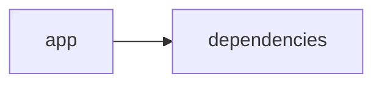

# Documentación del Proyecto

## Guía de Usuario
# Guía de Usuario

Bienvenido a la herramienta de análisis y procesamiento de información, diseñada para extraer datos y generar insights a partir de documentos y conversaciones. Esta guía te acompañará para que aproveches al máximo todas sus funcionalidades.

---

## 📱 ¿Qué es esta aplicación?
- **Propósito principal:**  
  Es una herramienta especializada que te permite procesar archivos PDF, analizar el contenido mediante modelos de lenguaje (IA) y evaluar conversaciones, incluida la Voz del Cliente (VoC), todo a través de una interfaz web interactiva basada en Streamlit.
  
- **Problema que resuelve:**  
  Facilita el manejo y análisis de grandes volúmenes de información no estructurada, permitiéndote extraer insights y tomar decisiones basadas en datos de documentos, conversaciones y feedback de clientes, eliminando la necesidad de procesos manuales extensos.

- **Beneficios clave:**  
  • Optimiza el análisis de documentos y conversaciones.  
  • Automatiza la extracción de información relevante.  
  • Integra análisis avanzados para transformar datos en insights accionables.  
  • Ofrece una experiencia visual e interactiva que simplifica la interpretación de resultados.

- **Audiencia objetivo:**  
  Profesionales de análisis de datos, equipos de atención al cliente, gestores de proyectos, consultores de negocio y cualquier usuario que necesite transformar información compleja en insights prácticos.

---

## ✨ Funcionalidades Principales

### 1. Interfaz Web Interactiva con Streamlit
- **¿Qué hace?**  
  Ofrece un entorno visual y dinámico donde puedes interactuar con tus datos y análisis sin necesidad de conocimientos técnicos profundos.
- **¿Cuándo usarla?**  
  Úsala cada vez que necesites visualizar resultados, navegar entre secciones o interactuar con las diferentes herramientas de análisis.
- **¿Cómo acceder?**  
  Ingresa la URL de la aplicación en tu navegador. No se requiere instalación previa, ya que la aplicación se ejecuta en la web.
- **Resultado esperado:**  
  Visualizarás un dashboard interactivo con menús, gráficos y opciones para explorar tus resultados.

### 2. Procesamiento de Archivos PDF
- **¿Qué hace?**  
  Permite la carga y extracción automática del contenido textual de archivos PDF para su posterior análisis.
- **¿Cuándo usarla?**  
  Siempre que tengas informes, documentos o reportes en formato PDF que necesites analizar.
- **¿Cómo acceder?**  
  Una vez en la interfaz, dirígete a la sección “Cargar PDF” y selecciona el archivo de tu dispositivo.
- **Resultado esperado:**  
  El contenido del PDF se mostrará en la pantalla y estará listo para procesos de análisis posteriores.

### 3. Análisis con Modelos de Lenguaje (IA)
- **¿Qué hace?**  
  Emplea algoritmos de inteligencia artificial para interpretar y extraer insights del contenido textual.
- **¿Cuándo usarla?**  
  Úsala cuando desees entender rápidamente el contenido de documentos o conversaciones, detectar temas relevantes o resumir información.
- **¿Cómo acceder?**  
  Después de cargar el documento o texto, selecciona la opción “Analizar con IA” y espera a que se procese la información.
- **Resultado esperado:**  
  Obtendrás un resumen, detección de temas o insights clave que facilitan la toma de decisiones.

### 4. Análisis de Conversaciones
- **¿Qué hace?**  
  Examina y procesa el contenido de chats, correos o transcripciones de reuniones para identificar tendencias, sentimientos y temas recurrentes.
- **¿Cuándo usarla?**  
  Ideal para revisar interacciones de atención al cliente, evaluaciones de reuniones o cualquier diálogo que requiera análisis profundo.
- **¿Cómo acceder?**  
  Accede a la sección “Análisis de Conversaciones”, carga el archivo o pega el contenido del diálogo y comienza el análisis.
- **Resultado esperado:**  
  Se mostrarán gráficos y resúmenes que delinean el sentimiento, frecuencia de palabras y temas principales de las conversaciones analizadas.

### 5. Análisis de Voz del Cliente (VoC)
- **¿Qué hace?**  
  Extrae y evalúa feedback y opiniones de clientes a partir de encuestas, comentarios o transcripciones, proporcionando insights sobre la experiencia del cliente.
- **¿Cuándo usarla?**  
  Utilízala para evaluar la percepción de tus clientes, identificar áreas de mejora o entender mejor sus necesidades.
- **¿Cómo acceder?**  
  Ve a la sección “Voz del Cliente” e importa el material correspondiente. Luego, inicia el análisis.
- **Resultado esperado:**  
  La aplicación te mostrará métricas sobre la satisfacción, áreas de preocupación y recomendaciones basadas en el feedback recopilado.

---

## 🚀 Cómo Empezar

### Primer Uso
1. **Requisitos previos:**  
   - Conexión estable a Internet.  
   - Acceso a los archivos PDF o transcripciones que deseas analizar.  
   - Navegador web actualizado.
2. **Acceso inicial:**  
   - Ingresa a la URL proporcionada para la aplicación.  
   - Asegúrate de leer cualquier mensaje introductorio o tutorial que aparezca.
3. **Configuración básica:**  
   - Si es necesario, crea una cuenta o inicia sesión (según configuración de la aplicación).  
   - Configura preferencias básicas como idioma y formato de visualización.
4. **Primera tarea recomendada:**  
   - Carga un documento PDF o un ejemplo de conversación para familiarizarte con el flujo de análisis.

### Flujo Típico de Uso
1. **Paso 1:**  
   Inicia sesión o accede a la interfaz web. Navega por el dashboard principal.
2. **Paso 2:**  
   Selecciona la funcionalidad deseada (por ejemplo, cargar un PDF o analizar una conversación) y sube tu archivo.
3. **Paso 3:**  
   Ejecuta el análisis y revisa los resultados interpretados, que se mostrarán en gráficos, resúmenes y tablas.

---

## 💡 Casos de Uso Comunes

### Escenario 1: Análisis de un Reporte en PDF
**Situación:**  
Necesitas extraer información clave de un informe extenso en PDF.  
**Pasos:**  
1. Accede a la sección “Procesamiento de Archivos PDF”.  
2. Carga el documento y espera a que se extraiga el contenido.  
3. Usa la opción “Analizar con IA” para obtener un resumen y destacar los puntos más importantes.

### Escenario 2: Evaluación de Conversaciones de Atención al Cliente
**Situación:**  
Deseas medir la satisfacción a través del análisis de chats o transcripciones de atención al cliente.  
**Pasos:**  
1. Entra en la sección “Análisis de Conversaciones”.  
2. Carga o pega los diálogos de atención.  
3. Revisa el análisis de sentimientos y temas recurrentes para identificar áreas de mejora.

### Escenario 3: Identificación de Insights en la Voz del Cliente (VoC)
**Situación:**  
Tienes feedback de clientes recopilado de encuestas y comentarios y necesitas evaluarlo.  
**Pasos:**  
1. Dirígete a la sección “Voz del Cliente”.  
2. Importa el archivo o introduce el contenido.  
3. Observa los resultados que muestran índices de satisfacción y recomendaciones para optimizar la experiencia del cliente.

---

## ❓ Preguntas Frecuentes

**P: ¿Cómo cargo un archivo PDF para su procesamiento?**  
R: Ingresa a la sección “Procesamiento de Archivos PDF”, haz clic en “Cargar PDF” y selecciona el archivo desde tu dispositivo. Luego, sigue las instrucciones en pantalla.

**P: ¿Qué hago si la aplicación tarda en responder o se siente lenta?**  
R: Asegúrate de tener una conexión estable a Internet y que el archivo no sea demasiado grande. Si el problema persiste, cierra otras pestañas o reinicia la aplicación.

**P: ¿Es seguro usar esta herramienta para análisis de datos sensibles?**  
R: Sí, la aplicación está diseñada con medidas de seguridad para proteger tus datos. Sin embargo, siempre se recomienda no cargar información altamente confidencial si no se cuenta con las debidas protecciones.

**P: ¿Cuáles son las limitaciones principales de la aplicación?**  
R:  
- No puede procesar archivos en formatos distintos a PDF para el análisis documentado.  
- El análisis de conversaciones y VoC se basa en la calidad del texto proporcionado, por lo que pueden reducirse resultados en textos ambiguos o mal transcritos.  
- Los modelos de IA pueden no captar contextos muy específicos o regionales de forma perfecta.

---

## 🆘 Solución de Problemas

### Problema: El PDF no se carga correctamente
**Síntomas:**  
- Mensaje de error al intentar subir el archivo.  
**Causa probable:**  
- El archivo puede estar dañado o en un formato no compatible.  
**Solución:**  
1. Verifica que el archivo PDF se abra en otro lector.  
2. Asegúrate de que el archivo no esté protegido con contraseña.  
3. Intenta cargar un PDF diferente para descartar problemas específicos del documento.

### Problema: El análisis tarda demasiado
**Síntomas:**  
- La interfaz se congela o muestra un mensaje de “en proceso” por un tiempo prolongado.  
**Causa probable:**  
- El archivo es muy extenso o la conexión a Internet es lenta.  
**Solución:**  
1. Verifica tu conexión a Internet.  
2. Intenta dividir el archivo en secciones más pequeñas.  
3. Espera unos minutos y, de ser posible, realiza el análisis en horarios de menor tráfico.

### Problema: Resultados inesperados en el análisis de conversaciones
**Síntomas:**  
- Los resúmenes o análisis de sentimientos no reflejan lo esperado.  
**Causa probable:**  
- El texto puede contener errores, abreviaturas o lenguaje muy coloquial.  
**Solución:**  
1. Revisa y, si es necesario, corrige manualmente el texto antes de cargarlo.  
2. Considera usar ejemplos de conversaciones con una estructura más clara.  
3. Consulta la sección de ayuda para consejos sobre el formato ideal.

---

## 📞 Soporte y Contacto
- **¿Necesitas ayuda adicional?**  
  Comunícate con nuestro equipo de soporte a través del correo: soporte@tusanalisisapp.com
- **¿Encontraste un error?**  
  Reporta cualquier error en la sección “Reportar un Error” de la aplicación o envíanos un correo a: reportes@tusanalisisapp.com
- **¿Tienes sugerencias?**  
  Envíanos tus comentarios y sugerencias para mejorar la experiencia en feedback@tusanalisisapp.com

---

Gracias por elegir nuestra herramienta de análisis. ¡Esperamos que esta guía te sea de gran ayuda para sacar el máximo provecho a todas las funcionalidades!

## Documentación Técnica
A continuación se presenta la documentación técnica completa en Markdown del proyecto VoC Analyst, que integra la descripción de la arquitectura del sistema, stack tecnológico, componentes principales, APIs internas, modelo de datos, guía de desarrollo y puntos de atención. Además, se incluye la guía de usuario que explica de forma práctica cómo interactuar con la herramienta.

----------------------------------------------------------------
# Documentación Técnica

Esta documentación está orientada a desarrolladores y equipos técnicos que necesiten comprender, mantener y extender la herramienta VoC Analyst. La solución procesa archivos (por ejemplo, documentos PDF) y analiza la Voz del Cliente (VoC) mediante modelos de lenguaje (LLM). La interfaz se desarrolla en Streamlit y el backend integra la extracción de información, el parser de conversaciones (con redacción de información sensible – PII) y la conexión con diferentes proveedores de LLM (OpenAI, Anthropic y Google GenAI).

----------------------------------------------------------------
## 🏗️ Arquitectura del Sistema

- **Patrón arquitectónico utilizado:**  
  La aplicación implementa una arquitectura modular monolítica “híbrida” en la que se separa la lógica de presentación (Frontend) de la lógica de negocio y análisis (Backend).  
  - La **Capa de Presentación** se desarrolla en Streamlit: gestiona la carga de archivos, la interacción del usuario, la visualización interactiva y la gestión del estado mediante `st.session_state`.
  - La **Capa de Lógica y Análisis** abarca la extracción y validación de archivos (utilizando PyPDF2 para documentos PDF), el parsing y normalización de conversaciones – incluyendo la redacción (anonimización) de PII – y la integración con diversos proveedores de modelos de lenguaje (LLM).

- **Diagrama de componentes:**  

  ```mermaid
  graph LR
      A[Interfaz Streamlit (Frontend)] --> B[Procesamiento y Validación de Archivos]
      A --> C[Gestión del Estado (st.session_state)]
      B --> D[Extracción de Texto (PyPDF2)]
      B --> E[Parser y Redacción de PII]
      A --> F[LLMBackend (Lógica de Negocio)]
      F --> G[Proveedores LLM (OpenAI, Anthropic, Gemini)]
  ```

- **Flujo de datos principal:**  
  1. El usuario accede a la aplicación mediante la interfaz web y carga archivos (como documentos PDF).  
  2. Se valida el archivo (por ejemplo, comprobando que no exceda el límite, mediante la función `validate_file_size`) y se extrae el contenido textual usando la función `extract_text_from_pdf` (que utiliza PyPDF2).  
  3. El contenido extraído se procesa en el módulo de parser, donde se normaliza la conversación, se segmenta el texto en turnos y se redacta la información sensible (PII).  
  4. El módulo **LLMBackend**, configurado con la clase ModelConfig, envía los datos a los proveedores de LLM mediante prompts predefinidos y recibe insights como análisis de sentimientos, detección de temas y recomendaciones.  
  5. Los resultados se almacenan en `st.session_state` y se visualizan interactivamente en la interfaz.

- **Dependencias críticas y su propósito:**  
  - **Streamlit:** Facilita la creación de la interfaz web interactiva y la gestión dinámica del estado.  
  - **PyPDF2:** Se utiliza para extraer el contenido textual de los documentos PDF.  
  - **Pandas:** Permite la manipulación y visualización de datos (por ejemplo, mostrando KPIs y tablas).  
  - **LLM SDKs (openai, anthropic, google-genai):** Integran la aplicación con proveedores externos de modelos de lenguaje para realizar análisis semántico avanzada.
  - Otras librerías estándar (json, os, time, datetime, uuid, zipfile, io, typing) aportan funcionalidades básicas y manejo de datos.

----------------------------------------------------------------
## 📋 Stack Tecnológico

- **Lenguajes:**  
  Principalmente Python (clasificado en “other” en el repositorio).

- **Frameworks / Librerías:**  
  - **Streamlit:** (>= 1.49.1) para la interfaz web interactiva.  
  - **PyPDF2:** (>= 3.0.1) para extraer texto de documentos PDF.  
  - **Pandas:** (>= 2.3.2) para la manipulación y visualización de datos.  
  - **LLM SDKs:**  
    - `openai` – Conexión a modelos de OpenAI.  
    - `anthropic` – Integración con modelos de Anthropic.  
    - `google-genai` – Conexión con Google GenAI (Gemini u otros).  
  - **Librerías estándar:** json, os, time, datetime, uuid, zipfile, io, typing.

- **Base de Datos:**  
  No se emplea una base de datos tradicional; el almacenamiento se gestiona de forma transitoria en memoria mediante `st.session_state`.

- **APIs Externas:**  
  Se integran las APIs de proveedores de modelos de lenguaje (LLM) como OpenAI, Anthropic y Google GenAI para realizar análisis de lenguaje e inteligencia artificial.

- **Infraestructura:**  
  La aplicación se despliega como una aplicación web mediante Streamlit y es compatible con instalaciones locales, servidores o contenedores Docker.

----------------------------------------------------------------
## 🔧 Componentes Principales

### 1. Aplicación Streamlit

- **Propósito:**  
  Gestionar la interfaz de usuario final, permitiendo la carga de archivos, el procesamiento interactivo y la visualización de resultados. También se encarga de gestionar el estado de la sesión mediante `st.session_state`.

- **Ubicación:**  
  El punto de entrada principal suele ser el archivo `app.py` (ubicado en la raíz o en un directorio como `app/`), junto con módulos auxiliares (por ejemplo, `parser.py` y `utils.py`).

- **Interfaces y Funcionalidades:**  
  - **Configuración de la Página:**  
    Se utiliza `st.set_page_config` para definir título, icono, layout y estado inicial del sidebar.  
  - **Gestión del Estado:**  
    Variables como:
    - `analysis_results`
    - `run_id`
    - `uploaded_files_data`
    - `processing_complete`  
    se almacenan en `st.session_state`.
  - **Funciones Auxiliares:**  
    - `extract_text_from_pdf(pdf_file) → str`: Lee el PDF, extrae el texto de cada página y retorna el contenido.  
    - `validate_file_size(file) → bool`: Comprueba que el tamaño del archivo cumpla con el límite preestablecido (ej. 100 MB).

- **Ejemplo de Código:**

  ```python
  import streamlit as st
  import PyPDF2

  st.set_page_config(
      page_title="VoC Analyst - Análisis de Voz del Cliente con LLM",
      page_icon="📊",
      layout="wide",
      initial_sidebar_state="expanded"
  )

  if 'analysis_results' not in st.session_state:
      st.session_state.analysis_results = None
  if 'run_id' not in st.session_state:
      st.session_state.run_id = None
  if 'uploaded_files_data' not in st.session_state:
      st.session_state.uploaded_files_data = []
  if 'processing_complete' not in st.session_state:
      st.session_state.processing_complete = False

  def extract_text_from_pdf(pdf_file) -> str:
      """Extraer texto de un archivo PDF"""
      try:
          pdf_reader = PyPDF2.PdfReader(pdf_file)
          text = ""
          for page in pdf_reader.pages:
              text += page.extract_text() + "\n"
          return text.strip()
      except Exception as e:
          st.error(f"Error al extraer texto de PDF: {str(e)}")
          return ""
  ```

---

### 2. Módulo LLMBackend

- **Propósito:**  
  Encapsula la integración con proveedores de modelos de lenguaje (LLM) para analizar el contenido textual de los documentos y generar insights (por ejemplo, análisis de sentimientos, detección de temas y recomendaciones).

- **Ubicación:**  
  Se encuentra en el archivo `llm_backend.py` en la raíz del proyecto.

- **Interfaces y Funcionalidades:**  
  - **ModelConfig:**  
    Clase que recoge la configuración necesaria para el proveedor, como:
    - `provider`: Nombre del proveedor (ej. "openai", "anthropic", "gemini").
    - `model`: Modelo a utilizar.
    - `api_key`: Clave de autenticación.
    - `max_retries` y `retry_delay`: Parámetros para reintentos.
    
    ```python
    from dataclasses import dataclass

    @dataclass
    class ModelConfig:
        provider: str  # 'openai', 'anthropic', 'gemini'
        model: str
        api_key: str
        max_retries: int = 3
        retry_delay: float = 1.0
    ```
  
  - **LLMBackend:**  
    Proporciona métodos esenciales:
    - `__init__(config: ModelConfig)`: Inicializa el backend con la configuración.
    - `_initialize_client()`: Selecciona e instancia el cliente del proveedor LLM adecuado.
    - `_load_parse_prompt()` y `_load_analyze_prompt()`: Cargan los prompts necesarios para el análisis.
    - `analyze_text(text: str) → Dict[str, Any]`: Envía el texto a analizar a través del proveedor y retorna un diccionario con los insights.

---

### 3. Parser de Conversaciones y Análisis

- **Propósito:**  
  Procesar y normalizar el contenido textual extraído para estructurarlo en un formato (por ejemplo, JSON) que facilite el análisis.  
  Incluye:
  - División del texto en turnos de conversación.
  - Extracción de metadatos (como conversation_id, timestamps, roles de interlocutores).
  - Redacción (anonimización) de la información sensible (PII) usando etiquetas predefinidas (e.g., [EMAIL], [PHONE]).

---

## 🚀 APIs y Endpoints

Aunque la aplicación no expone endpoints REST públicos, se definen “APIs internas” en forma de funciones y métodos que orquestan todo el flujo de análisis:

- **Función: extract_text_from_pdf(pdf_file) → str**  
  Extrae el contenido textual usando PyPDF2. Gestiona errores mediante try/except y retorna el texto.

- **Función: validate_file_size(file) → bool**  
  Verifica que el tamaño del archivo cargado no supere el límite (ej. 100 MB).

- **Método: LLMBackend.analyze_text(text: str) → Dict[str, Any]**  
  Envía el texto (junto con un prompt predefinido) al proveedor LLM configurado y retorna los insights (análisis de sentimientos, detección de temas, entre otros).

- **Funciones del Parser:**  
  Transforman el contenido de la conversación en un JSON estructurado, normalizando y redactando la información sensible (PII) para su posterior análisis.

---

## 💾 Modelo de Datos

- **Entidades Principales: Conversación**  
  La información se modela internamente en un objeto JSON que incluye:
  - `conversation_id`: Identificador único derivado del nombre del archivo o de metadatos.
  - `messages`: Lista de mensajes, donde cada mensaje contiene:
    - `sender`: Rol del emisor (cliente, agente, desconocido).
    - `timestamp`: Marca de tiempo (si está disponible).
    - `content`: Texto del mensaje, con la información sensible ya redactada.
    - `metadata`: Información adicional (por ejemplo, canal de comunicación, duración, etc.).

- **Esquemas de Entrada y Salida:**  
  - **Entrada:** Archivos PDF o textos (transcripciones) que contengan la conversación.  
  - **Salida:** JSON estructurado que incluye la conversación y los insights obtenidos, listo para ser mostrado en la interfaz.

- **Validaciones y Transformaciones:**  
  - Se valida que el contenido extraído no sea vacío ni inconsistente.  
  - Se aplican reglas y expresiones regulares para redactar la PII.  
  - Se estructura el resultado en un JSON homogéneo para facilitar su uso en paneles y dashboards.

---

## 🛠️ Guía de Desarrollo

### 1. Configuración del Entorno

1. **Prerrequisitos:**  
   - Python 3.8 o superior.  
   - Acceso a Internet para llamadas a las APIs de proveedores LLM en producción.

2. **Instalación:**  
   - Clonar el repositorio:
     ```bash
     git clone https://github.com/tu_usuario/VoC-Analyst.git
     cd VoC-Analyst
     ```
   - Crear y activar un entorno virtual:
     ```bash
     python -m venv venv
     source venv/bin/activate    # En Linux/Mac
     venv\Scripts\activate       # En Windows
     ```
   - Instalar las dependencias:
     ```bash
     pip install -r requirements.txt
     ```

3. **Variables de Entorno:**  
   Configure las API keys necesarias para los proveedores LLM mediante variables de entorno:
   - `OPENAI_API_KEY`
   - `ANTHROPIC_API_KEY`
   - `GEMINI_API_KEY`

---

### 2. Estructura del Código

La organización del proyecto es la siguiente:

```
VoC-Analyst/
├── app/
│   ├── app.py                # Punto de entrada (interfaz Streamlit)
│   ├── parser.py             # Funciones de parsing y análisis de conversaciones
│   └── utils.py              # Funciones auxiliares (extracción de texto, validación, etc.)
├── llm_backend.py            # Módulo para integración con proveedores LLM
├── requirements.txt          # Lista de dependencias
└── README.md                 # Documentación general y guía de usuario
```

---

### 3. Estándares de Código y Pruebas

- **Convenciones de Naming:**  
  Utiliza nombres descriptivos en minúsculas y con guiones bajos (por ejemplo, `extract_text_from_pdf`).
  
- **Separación de Lógica:**  
  Se separa la lógica de la interfaz (Streamlit) de la de negocio (LLMBackend y Parser). Se recomienda el uso de inyección de dependencias mediante la clase `ModelConfig`.
  
- **Testing y Validación:**  
  Es recomendable implementar pruebas unitarias mediante frameworks como pytest para:
  - Validar la extracción correcta de texto.
  - Comprobar el funcionamiento de la función de validación del tamaño de archivos.
  - Simular la conexión y respuesta del módulo LLMBackend para verificar el manejo de reintentos.

- **Manejo de Errores y Logging:**  
  Utiliza bloques try/except y, de ser necesario, el módulo logging para registrar y depurar errores en producción.

---

## 🔍 Puntos de Atención

- **Limitaciones Conocidas:**
  - La extracción de texto depende de la calidad de los archivos PDF; si el documento está basado en una imagen, puede requerirse integración de OCR.
  - El análisis con LLM depende de la calidad del texto extraído y de la correcta configuración de las API keys.
  - Actualmente, la aplicación procesa un archivo (o un conjunto de ellos) por sesión; el procesamiento asíncrono o en lote podría optimizar el rendimiento.

- **Consideraciones de Rendimiento:**
  - Archivos muy grandes (cercanos a 100 MB) pueden afectar el tiempo de respuesta de la aplicación.
  - Se recomienda implementar técnicas de caching o procesamiento en lote para análisis repetitivos o documentos voluminosos.

- **Aspectos de Seguridad:**
  - Proteger las API keys mediante variables de entorno y no incluirlas en el código fuente.
  - Redactar la información sensible (PII) antes de enviarla a proveedores externos.
  
- **Mejoras Sugeridas (TODOs):**
  - Ampliar el soporte a otros formatos (por ejemplo, TXT).
  - Integrar OCR para documentos PDF que contengan imágenes.
  - Mejorar la modularidad del parser y el manejo de errores en la comunicación con los proveedores de LLM.
  - Implementar procesamiento asíncrono y/o en lote para optimizar el rendimiento en análisis masivos.

---

## Diagrama del Sistema

El siguiente diagrama Mermaid resume la interacción principal entre los componentes:

```mermaid
graph LR
    A[Interfaz Streamlit] --> B[Extracción y Validación de Archivos]
    B --> C[Parser de Conversaciones y Redacción de PII]
    A --> D[LLMBackend]
    D --> E[Proveedores LLM (OpenAI, Anthropic, Gemini)]
```

---

## Conclusión

Esta documentación técnica ofrece una visión integral del sistema VoC Analyst, abordando desde su arquitectura y stack tecnológico hasta los detalles de sus componentes principales y pautas de desarrollo. Se recomienda mantener la documentación actualizada conforme se realicen mejoras o se integren nuevos módulos. Además, se invita a los desarrolladores a consultar el repositorio de issues para resolver dudas o sugerir mejoras.

----------------------------------------------------------------
## Diagrama Final



----------------------------------------------------------------
Happy Coding y ¡éxito en el análisis de la Voz del Cliente!

----------------------------------------------------------------
# Guía de Usuario

Esta guía está diseñada para ayudar a los usuarios a sacar el máximo provecho de la herramienta de análisis VoC Analyst sin necesidad de conocimientos técnicos avanzados.

## 1. ¿Qué es esta aplicación?
La aplicación permite transformar grandes volúmenes de datos de documentos PDF y conversaciones en insights valiosos mediante el uso de inteligencia artificial. Entre sus beneficios se encuentran:
- Análisis automatizado de documentos y transcripciones.
- Detección de sentimientos y emociones.
- Generación de reportes e insights para mejorar la toma de decisiones.

## 2. Funcionalidades Principales

### Interfaz Web Interactiva
- Acceso mediante navegador a la URL correspondiente.
- Menú principal con botones y secciones para cargar archivos, analizar datos y ver reportes.

### Procesamiento de Archivos PDF
- Carga y extracción de texto de documentos PDF.
- Validación automática del tamaño y formato del archivo.

### Análisis con Modelos de Lenguaje (IA)
- Conversión del contenido extraído en insights mediante IA.
- Resúmenes, detección de temas y patrones, y recomendaciones basadas en el contenido.

### Análisis de Conversaciones y Voz del Cliente (VoC)
- Procesamiento y análisis de transcripciones de conversaciones.
- Evaluación de sentimientos y emociones.
- Generación de reportes visuales con gráficos y dashboards.

## 3. Cómo Empezar

### Primer Uso
1. Abre tu navegador y visita la URL de la aplicación.
2. Inicia sesión (o regístrate, si es tu primer acceso).
3. Explora el menú principal para familiarizarte con las opciones.
4. Sube un documento PDF o ingresa una transcripción para probar el análisis.
5. Ejecuta el análisis y revisa los resultados generados.

### Flujo Típico de Uso
1. Inicia sesión en la aplicación.
2. Selecciona la opción “Procesar PDF” (o “Analizar Conversación”).
3. Carga el archivo o pega el texto en el área designada.
4. Ejecuta la herramienta de análisis correspondiente (IA, Sentimientos, VoC).
5. Revisa y utiliza el reporte o dashboard resultante para tomar decisiones o mejorar procesos.

## 4. Casos de Uso Comunes

### Análisis de Reportes en PDF
- Sube reportes y utiliza “Analizar con IA” para obtener resúmenes y tendencias.
  
### Evaluación de Conversaciones de Atención al Cliente
- Carga transcripciones y utiliza “Analizar Conversación” para detectar puntos críticos y áreas de mejora.

### Monitorización de la Voz del Cliente
- Utiliza la opción “Análisis VoC” para evaluar comentarios y feedback de clientes, obteniendo un dashboard de sentimientos y sugerencias.

## 5. Preguntas Frecuentes

**P: ¿Cómo subo un archivo PDF?**  
R: Selecciona “Procesar PDF” en la interfaz, haz clic en “Cargar Archivo” y sube el documento deseado.

**P: ¿Qué hago si el análisis tarda demasiado?**  
R: Verifica tu conexión a Internet y asegúrate de que el tamaño del archivo sea el adecuado. Si el problema persiste, contacta al soporte.

**P: ¿Es seguro subir mis documentos?**  
R: Sí, la aplicación procesa los datos de forma segura y no almacena información sensible de manera persistente.

**P: ¿Cuál es la principal limitación de la herramienta?**  
R: Actualmente, está optimizada para documentos PDF y textos en formatos compatibles; otros formatos o archivos basados en imágenes pueden requerir OCR o adaptación.

## 6. Soporte y Contacto

- **Para asistencia:**  
  Escribe a: soporte@tuanalisisapp.com  
- **Para reportar errores:**  
  Envia un correo a: reportes@tuanalisisapp.com  
- **Para sugerencias:**  
  Utiliza: feedback@tuanalisisapp.com

----------------------------------------------------------------
Esta guía está diseñada para que cualquier usuario pueda empezar a trabajar de inmediato y extraer insights valiosos de sus documentos y conversaciones, facilitando la toma de decisiones basada en datos.

----------------------------------------------------------------
## Diagrama Final (Resumen Visual)


----------------------------------------------------------------
Happy Coding y ¡éxito en el análisis de la Voz del Cliente!

Para consultas, sugerencias o contribuciones, revisa el repositorio de issues o contacta al equipo de desarrollo a través de los correos indicados.


## Diagrama
```mermaid
graph LR\nApp["app"]-->Deps["dependencies"]\n
```
