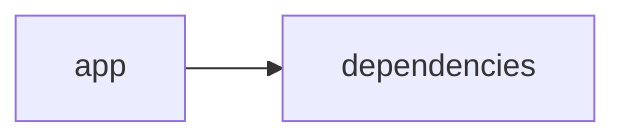

# Documentación del Proyecto

## Guía de Usuario
# Guía de Usuario

Bienvenido a nuestra herramienta de análisis y procesamiento de información, diseñada para ayudarte a extraer valor de documentos PDF, conversaciones y datos de voz de clientes mediante una interfaz web interactiva y el poder de la inteligencia artificial.

## 📱 ¿Qué es esta aplicación?

- **Propósito principal**:  
  Esta aplicación está diseñada para simplificar el análisis de documentos PDF y conversaciones, integrando modelos de lenguaje basados en inteligencia artificial para ofrecer insights útiles sobre el contenido y la Voz del Cliente (VoC).

- **Problema que resuelve**:  
  Te ayuda a procesar grandes volúmenes de información de manera rápida y precisa, eliminando la necesidad de revisar manualmente documentos largos y conversaciones, lo que permite tomar decisiones informadas y oportunas.

- **Beneficios clave**:  
  • Ahorro de tiempo en la extracción de datos esenciales.  
  • Análisis automatizado y detallado de documentos y conversaciones.  
  • Acceso a insights precisos sobre la experiencia del cliente.  
  • Interfaz sencilla e intuitiva para usuarios sin conocimientos técnicos avanzados.

- **Audiencia objetivo**:  
  Profesionales, analistas y equipos de atención al cliente que necesiten extraer y analizar información de documentos PDF, conversaciones o llamadas, y que busquen comprender mejor la Voz del Cliente.

## ✨ Funcionalidades Principales

### Interfaz Web Interactiva con Streamlit
- **¿Qué hace?**:  
  Proporciona una plataforma amigable y visual para interactuar con las demás funcionalidades de la aplicación.
  
- **¿Cuándo usarla?**:  
  Ideal cada vez que necesites cargar documentos, iniciar análisis o visualizar resultados de manera rápida y sencilla.
  
- **¿Cómo acceder?**:  
  Abre tu navegador y navega a la URL proporcionada para la aplicación. Una vez allí, podrás ver el menú principal con las opciones disponibles.
  
- **Resultado esperado**:  
  Una experiencia visual clara donde puedes seleccionar y operar las demás funcionalidades sin complicaciones.

### Procesamiento de Archivos PDF
- **¿Qué hace?**:  
  Permite importar y extraer información relevante de archivos PDF.
  
- **¿Cuándo usarla?**:  
  Úsala cuando necesites analizar datos de documentos PDF, como reportes, facturas, manuales o cualquier otro tipo de contenido textual.
  
- **¿Cómo acceder?**:  
  Desde la interfaz web, selecciona la opción “Procesar PDF”, sube el archivo deseado y espera a que la aplicación extraiga el contenido.
  
- **Resultado esperado**:  
  Visualización del texto extraído del PDF, listo para ser analizado o convertido en insights.

### Análisis con Modelos de Lenguaje (IA)
- **¿Qué hace?**:  
  Emplea inteligencia artificial para analizar y extraer información clave del texto procesado.
  
- **¿Cuándo usarla?**:  
  Cuando necesites interpretar el contenido textual para identificar patrones, sentimientos o insights específicos.
  
- **¿Cómo acceder?**:  
  Una vez que has procesado un archivo PDF o ingresado texto, selecciona “Analizar con IA” desde el menú de opciones.
  
- **Resultado esperado**:  
  Un análisis detallado y resumido del contenido, con insights relevantes y sugerencias de acción basadas en el texto.

### Análisis de Conversaciones
- **¿Qué hace?**:  
  Permite analizar transcripciones o registros de conversaciones para identificar temas, emociones y puntos clave en la comunicación.
  
- **¿Cuándo usarla?**:  
  Ideal para equipos de servicio al cliente, marketing o recursos humanos que quieran evaluar interacciones importantes con sus stakeholders.
  
- **¿Cómo acceder?**:  
  Selecciona “Analizar Conversaciones” en la interfaz, sube el archivo o copia la transcripción y procede con la acción de análisis.
  
- **Resultado esperado**:  
  Un reporte que destaca temas recurrentes, análisis de sentimientos y posibles áreas de mejora en la comunicación.

### Análisis de Voz del Cliente (VoC)
- **¿Qué hace?**:  
  Evalúa la retroalimentación y expresiones de los clientes extraídas de diferentes fuentes (documentos, conversaciones o registros de voz) para identificar necesidades y áreas de mejora.
  
- **¿Cuándo usarla?**:  
  Úsala cuando requieras una comprensión profunda sobre la experiencia del cliente y identificar oportunidades para mejorar el servicio o producto.
  
- **¿Cómo acceder?**:  
  En la interfaz web, selecciona “Análisis de Voz del Cliente” y sigue las instrucciones para cargar la fuente de datos deseada.
  
- **Resultado esperado**:  
  Un informe sintetizado con los conceptos clave de la experiencia del cliente, resaltando puntos positivos y áreas críticas.

## 🚀 Cómo Empezar

### Primer Uso
1. **Requisitos previos**:  
   Asegúrate de contar con un navegador actualizado y conexión a internet. Ten a la mano los archivos PDF o transcripciones que desees analizar.

2. **Acceso inicial**:  
   Ingresa a la URL de la aplicación desde tu navegador. La página principal te dará la bienvenida y mostrará las opciones disponibles.

3. **Configuración básica**:  
   No se requiere configuración avanzada. Solo debes dirigirte a la sección deseada, cargar tu archivo o introducir el texto, y seguir las instrucciones en pantalla.

4. **Primera tarea recomendada**:  
   Empieza probando la funcionalidad de “Procesamiento de Archivos PDF”, cargando un documento de tu interés para familiarizarte con la herramienta.

### Flujo Típico de Uso
1. **Paso 1**:  
   Accede a la interfaz web e identifica la funcionalidad que necesitas (por ejemplo, “Procesar PDF” o “Analizar Conversaciones”).

2. **Paso 2**:  
   Sube el archivo o ingresa el texto requerido. La aplicación procesará esta información automáticamente.

3. **Paso 3**:  
   Revisa los resultados del análisis: el sistema te mostrará reportes claros y fáciles de interpretar con insights relevantes.

## 💡 Casos de Uso Comunes

### Escenario 1: Análisis de Reportes Financieros
**Situación**: Necesitas revisar y extraer datos clave de un extenso reporte financiero en PDF.  
**Pasos**: 
1. Sube el PDF en la sección “Procesar PDF”.  
2. Ejecuta el “Análisis con IA” para extraer conceptos financieros críticos.  
3. Revisa el reporte y enfócate en las cifras y tendencias más relevantes.

### Escenario 2: Evaluación de Llamadas de Atención al Cliente
**Situación**: Deseas analizar la transcripción de las llamadas de soporte para mejorar la atención.  
**Pasos**: 
1. Importa la transcripción en “Analizar Conversaciones”.  
2. Observa el análisis de sentimientos y temas recurrentes.  
3. Identifica oportunidades de capacitación para el equipo.

### Escenario 3: Monitoreo de la Voz del Cliente
**Situación**: Quieres conocer la percepción de tus clientes sobre un nuevo producto.  
**Pasos**: 
1. Recopila comentarios y transcripciones de redes sociales, encuestas o llamadas.  
2. Usa la funcionalidad “Análisis de Voz del Cliente” para sintetizar la retroalimentación.  
3. Revisa el informe y adapta estrategias de marketing o mejora de producto.

## ❓ Preguntas Frecuentes

P: ¿Cómo subo un archivo PDF para procesar?  
R: Simplemente dirígete a la opción “Procesar PDF”, haz clic en el botón para cargar archivos y selecciona el documento desde tu dispositivo.

P: ¿Qué hago si el análisis de conversación no muestra resultados claros?  
R: Revisa que la transcripción esté completa y en formato de texto. Si el problema persiste, intenta reiniciar la carga del archivo.

P: ¿Es seguro usar la funcionalidad de análisis con modelos de lenguaje?  
R: Sí, la aplicación utiliza algoritmos seguros y probados para analizar el contenido, sin almacenar información sensible de manera permanente.

P: ¿Cuáles son las limitaciones principales?  
R: La aplicación actualmente sólo procesa documentos en formatos PDF y texto, y el análisis se basa en la calidad de la información ingresada. No puede interpretar contenido multimedia o imágenes dentro de los PDF.

## 🆘 Solución de Problemas

### Problema: El archivo PDF no se carga correctamente
**Síntomas**: El sistema no reconoce el archivo o aparece un mensaje de error.  
**Causa probable**: El archivo podría estar dañado o no ser compatible con el formato requerido.  
**Solución**:  
1. Verifica que el documento esté en formato PDF y que no esté corrupto.  
2. Intenta cargarlo nuevamente o utiliza otro archivo similar.

### Problema: Los resultados del análisis no son precisos
**Síntomas**: El informe de análisis carece de información relevante o muestra datos inconsistentes.  
**Causa probable**: El texto de origen podría tener errores o estar incompleto.  
**Solución**:  
1. Revisa el contenido del documento o la transcripción para verificar su integridad.  
2. Vuelve a ejecutar el proceso de análisis asegurándote de que el texto de origen sea correcto.

### Problema: La aplicación tarda demasiado en responder
**Síntomas**: La interfaz se congela o responde muy lentamente.  
**Causa probable**: Podría haber problemas de conexión a internet o sobrecarga en el servidor.  
**Solución**:  
1. Revisa tu conexión a internet.  
2. Espera unos minutos y vuelve a intentarlo.  
3. Si el problema persiste, contacta al soporte.

## 📞 Soporte y Contacto
- **¿Necesitas ayuda adicional?**  
  Contacta al equipo de soporte a través del correo soporte@tuanalisis.com o llama al +34 123 456 789.
  
- **¿Encontraste un error?**  
  Reporta cualquier fallo o inconveniente mediante el formulario de feedback disponible en la sección “Contacto” de la aplicación.

- **¿Tienes sugerencias?**  
  Envíanos tus ideas y comentarios a feedback@tuanalisis.com para ayudarnos a mejorar la herramienta.

---

Esperamos que esta guía te ayude a aprovechar al máximo todas las funcionalidades que nuestra herramienta te ofrece. ¡Bienvenido a una nueva era de análisis inteligente y eficiente!

## Documentación Técnica
A continuación se muestra la documentación técnica completa en Markdown, organizada según la estructura obligatoria solicitada y basada en el análisis del repositorio y las muestras de código proporcionadas.

------------------------------------------------------------
# Documentación Técnica

Esta documentación está orientada a desarrolladores y equipos técnicos interesados en comprender, mantener y extender la aplicación VoC Analyst. La herramienta permite procesar archivos (por ejemplo, documentos PDF) y analizar la Voz del Cliente (VoC) mediante modelos de lenguaje (LLM). La interfaz se implementa con Streamlit y el procesamiento se realiza en un único sistema modular que integra extracción de texto, parsing de conversaciones (con redacción de PII) y conexión con proveedores externos de IA (como OpenAI, Anthropic y Google GenAI).

------------------------------------------------------------
## 🏗️ Arquitectura del Sistema

- **Patrón arquitectónico utilizado:**  
  La aplicación adopta una arquitectura modular monolítica “híbrida” en la que se separa la lógica de presentación (Frontend) de la lógica de negocio (Backend).  
  - La **Capa de Presentación** se implementa con Streamlit. Esta capa se encarga de la carga de archivos, el manejo de la interacción del usuario, la visualización dinámica de resultados y la gestión del estado mediante `st.session_state`.  
  - La **Capa de Lógica y Análisis** se compone de módulos para:  
    • la extracción y validación de archivos (utilizando PyPDF2 para documentos PDF),  
    • el procesamiento y parsing de conversaciones (incluyendo la anonimización o redacción de información sensible, PII) y  
    • la integración con proveedores de Modelos de Lenguaje (LLM) mediante el módulo LLMBackend.
  
- **Diagrama de componentes:**  

  ```mermaid
  graph LR
      A[Interfaz Streamlit (Frontend)] --> B[Procesamiento y Validación de Archivos]
      A --> C[Gestión del Estado (st.session_state)]
      B --> D[Extracción de Texto (PyPDF2)]
      B --> E[Parser y Redacción de PII]
      A --> F[LLMBackend (Lógica de Negocio)]
      F --> G[Proveedores LLM (OpenAI, Anthropic, Gemini)]
  ```

- **Flujo de datos principal entre componentes:**  
  1. El usuario ingresa a la aplicación mediante la interfaz web y carga archivos (por ejemplo, PDFs o transcripciones).  
  2. Se valida el archivo (por ejemplo, comprobando su tamaño mediante `validate_file_size`) y se extrae el contenido textual utilizando la función `extract_text_from_pdf` (que utiliza PyPDF2).  
  3. El texto es enviado al módulo de parser, donde se segmenta en turnos, se asignan metadatos (por ejemplo, conversation_id, timestamps, roles) y se redacta la PII.  
  4. El módulo **LLMBackend** utiliza la configuración definida en la clase ModelConfig para enviar el contenido a los proveedores LLM (mediante prompts predefinidos) y obtener insights (análisis de sentimientos, detección de temas, recomendaciones, etc.).  
  5. Los resultados finales se almacenan en `st.session_state` y se presentan en la interfaz mediante paneles, gráficos y tablas interactivas.

- **Dependencias críticas y su propósito:**  
  - **Streamlit:** Facilita la creación de la interfaz web interactiva y la gestión en tiempo real del estado de la sesión.  
  - **PyPDF2:** Se utiliza para extraer el contenido textual de documentos PDF.  
  - **Pandas:** Permite manipular y visualizar datos (por ejemplo, para generar resúmenes y tableros).  
  - **LLM SDKs (openai, anthropic, google-genai):** Proveen la conexión y la integración con proveedores externos de Modelos de Lenguaje para realizar análisis semántico avanzado.  
  - Otras librerías estándar (json, os, time, datetime, uuid, zipfile, io, typing) ofrecen funcionalidades básicas para manejo de datos, archivos y excepciones.

------------------------------------------------------------
## 📋 Stack Tecnológico

- **Lenguajes:**  
  Principalmente Python (clasificado como “other” en el repositorio).

- **Frameworks / Librerías:**  
  - **Streamlit:** (>= 1.49.1) para la creación de la interfaz web interactiva.  
  - **PyPDF2:** (>= 3.0.1) para la extracción de texto de documentos PDF.  
  - **Pandas:** (>= 2.3.2) para el manejo y visualización de datos en formato tabular.  
  - **LLM SDKs:**  
    - `openai` – Para la integración con modelos de OpenAI.  
    - `anthropic` – Para conectarse a proveedores de Anthropic.  
    - `google-genai` – Para la integración con Google GenAI (Gemini u otros modelos).  
  - **Librerías estándar:** json, os, time, datetime, uuid, zipfile, io, typing.

- **Base de Datos:**  
  No se utiliza una base de datos persistente; el almacenamiento se gestiona de manera transitoria en memoria a través de `st.session_state`.

- **APIs externas:**  
  La aplicación se conecta a las APIs de proveedores de LLM (OpenAI, Anthropic y Google GenAI) para realizar análisis avanzados del contenido textual.

- **Infraestructura:**  
  La aplicación se despliega como una aplicación web simple con Streamlit, pudiendo ejecutarse en entornos locales, servidores o contenedores Docker para entornos de producción.

------------------------------------------------------------
## 🔧 Componentes Principales

### 1. Aplicación Streamlit

- **Propósito:**  
  Gestionar la interfaz de usuario, la carga y validación de archivos, así como la visualización interactiva de resultados y el manejo del estado de la sesión.  
- **Ubicación:**  
  Generalmente en el archivo de entrada (por ejemplo, `app.py`, ubicado en la raíz o en el directorio `app/`), junto a módulos auxiliares como `parser.py` y `utils.py`.
- **Interfaces / Funcionalidades:**  
  - **Configuración de la Página:**  
    Uso de `st.set_page_config` para definir el título, ícono, layout y configuración del sidebar.
  - **Gestión del Estado:**  
    Uso de `st.session_state` para almacenar variables clave:
    - `analysis_results`
    - `run_id`
    - `uploaded_files_data`
    - `processing_complete`
  - **Funciones Auxiliares:**  
    - `extract_text_from_pdf(pdf_file) → str`: Extrae el contenido textual del PDF usando PyPDF2 y gestiona posibles errores.  
    - `validate_file_size(file) → bool`: Verifica que el tamaño del archivo no exceda el límite preestablecido (por ejemplo, 100 MB).

- **Ejemplo de Código:**

  ```python
  import streamlit as st
  import PyPDF2

  st.set_page_config(
      page_title="VoC Analyst - Análisis de Voz del Cliente con LLM",
      page_icon="📊",
      layout="wide",
      initial_sidebar_state="expanded"
  )

  if 'analysis_results' not in st.session_state:
      st.session_state.analysis_results = None
  if 'run_id' not in st.session_state:
      st.session_state.run_id = None
  if 'uploaded_files_data' not in st.session_state:
      st.session_state.uploaded_files_data = []
  if 'processing_complete' not in st.session_state:
      st.session_state.processing_complete = False

  def extract_text_from_pdf(pdf_file) -> str:
      """Extraer texto de archivo PDF"""
      try:
          pdf_reader = PyPDF2.PdfReader(pdf_file)
          text = ""
          for page in pdf_reader.pages:
              text += page.extract_text() + "\n"
          return text.strip()
      except Exception as e:
          st.error(f"Error al extraer texto de PDF: {str(e)}")
          return ""
  ```

---

### 2. Módulo LLMBackend

- **Propósito:**  
  Encapsular la lógica de integración con proveedores de modelos de lenguaje (LLM), permitiendo enviar el contenido textual a analizar y obtener insights como análisis de sentimientos, detección de temas y recomendaciones.  
- **Ubicación:**  
  Se encuentra en el archivo `llm_backend.py` en la raíz del proyecto.
- **Interfaces y Funcionalidades:**  
  - **ModelConfig:**  
    Clase de configuración que define:
    - `provider`: Nombre del proveedor (ej. "openai", "anthropic", "gemini").
    - `model`: Modelo a utilizar.
    - `api_key`: Clave de autenticación.
    - `max_retries` y `retry_delay`: Parámetros para gestionar reintentos.
    
    ```python
    from dataclasses import dataclass

    @dataclass
    class ModelConfig:
        provider: str  # 'openai', 'anthropic', 'gemini'
        model: str
        api_key: str
        max_retries: int = 3
        retry_delay: float = 1.0
    ```
  
  - **LLMBackend:**  
    Métodos clave incluyen:
    - `__init__(config: ModelConfig)`: Inicializa el backend con la configuración proporcionada.
    - `_initialize_client()`: Selecciona e instancia el cliente del proveedor LLM según la configuración.
    - `_load_parse_prompt()` y `_load_analyze_prompt()`: Cargan los prompts necesarios para el análisis.
    - `analyze_text(text: str) → Dict[str, Any]`: Envía el texto junto con los prompts al proveedor LLM y retorna un diccionario con los insights generados.

- **Ejemplo Simplificado:**

  ```python
  class LLMBackend:
      def __init__(self, config: ModelConfig):
          self.config = config
          self.client = self._initialize_client()
          self.parse_prompt = self._load_parse_prompt()
          self.analyze_prompt = self._load_analyze_prompt()
      
      def _initialize_client(self):
          if self.config.provider == 'openai':
              return openai.OpenAI(api_key=self.config.api_key)
          elif self.config.provider == 'anthropic':
              return anthropic.Anthropic(api_key=self.config.api_key)
          elif self.config.provider == 'gemini':
              return genai.Client(api_key=self.config.api_key)
          else:
              raise ValueError(f"Proveedor no soportado: {self.config.provider}")
      
      def analyze_text(self, text: str) -> dict:
          response = self.client.create_completion(
              engine=self.config.model,
              prompt=f"{self.analyze_prompt}\n{text}",
              max_tokens=150
          )
          return {"analysis": response}
  ```

---

### 3. Parser y Procesamiento de Conversaciones

- **Propósito:**  
  Procesar y normalizar el contenido textual extraído o ingresado manualmente, estructurándolo en un formato JSON que incluya la información de la conversación y que aplique redacción de PII (anonimización de datos sensibles).  
- **Ubicación:**  
  Este módulo se ubica en el archivo `parser.py` o en secciones dentro de `app.py`.
- **Funciones Clave:**  
  - Dividir el texto en turnos de conversación y asignar roles a los interlocutores.  
  - Extraer metadatos como `conversation_id`, timestamps y otros datos relevantes.  
  - Redactar PII utilizando expresiones regulares para reemplazar datos sensibles por etiquetas estándar (por ejemplo, [EMAIL], [PHONE], etc.).

---

## 🚀 APIs y Endpoints

**Nota:**  
Aunque la aplicación no expone endpoints REST públicos, se definen “APIs internas” a través de funciones y métodos que orquestan el flujo de procesamiento:

- **Función: extract_text_from_pdf(pdf_file) → str:**  
  Extrae el contenido textual de un archivo PDF usando PyPDF2, gestionando errores mediante bloques try/except y notificando con `st.error`.

- **Función: validate_file_size(file) → bool:**  
  Verifica que el tamaño del archivo subido no exceda el límite predefinido (ej. 100 MB).

- **Método: LLMBackend.analyze_text(text: str) → Dict[str, Any]:**  
  Envía el texto (junto con un prompt predefinido) al proveedor LLM configurado y retorna un diccionario con los insights obtenidos (por ejemplo, análisis de sentimientos, detección de temas y recomendaciones).

- **Funciones del Parser:**  
  Transforman el contenido de la conversación en un objeto JSON estructurado, normalizando el texto y redactando información sensible (PII).

---

## 💾 Modelo de Datos

- **Entidades Principales: Conversación**
  - **Estructura JSON:**
    - `conversation_id`: Identificador único (derivado del nombre del archivo o metadatos).
    - `messages`: Lista de mensajes, donde cada mensaje contiene:
      - `sender`: Rol del emisor (cliente, agente o desconocido).
      - `timestamp`: Momento de envío del mensaje (si se detecta).
      - `content`: Texto del mensaje con información sensible ya redactada.
      - `metadata`: Información adicional (por ejemplo, canal, duración, etc.).
    
- **Esquemas de Entrada y Salida:**
  - **Entrada:** Documentos PDF o textos que contengan la conversación.
  - **Salida:** Objeto JSON estructurado que contiene la conversación y, posteriormente, los insights generados por el análisis.
  
- **Validaciones y Transformaciones:**  
  Se valida que el contenido extraído no esté vacío, se aplican reglas de redacción para anonimizar PII y se estructura el resultado en un formato homogéneo ideal para su visualización y análisis.

---

## 🛠️ Guía de Desarrollo

### Configuración del Entorno

1. **Prerrequisitos:**
   - Python 3.8 o superior.
   - Conexión a internet para llamadas a APIs de proveedores LLM.
  
2. **Instalación:**
   - Clona el repositorio:
     ```bash
     git clone https://github.com/tu_usuario/VoC-Analyst.git
     cd VoC-Analyst
     ```
   - Crea y activa un entorno virtual:
     ```bash
     python -m venv venv
     source venv/bin/activate    # En Linux/Mac
     venv\Scripts\activate       # En Windows
     ```
   - Instala las dependencias:
     ```bash
     pip install -r requirements.txt
     ```

3. **Variables de Entorno:**
   Configura las API keys necesarias para los proveedores LLM mediante variables de entorno:
   - `OPENAI_API_KEY`
   - `ANTHROPIC_API_KEY`
   - `GEMINI_API_KEY`

---

### Estructura del Código

El proyecto se organiza de la siguiente manera:

```
VoC-Analyst/
├── app/
│   ├── app.py                # Punto de entrada (Interfaz de usuario con Streamlit)
│   ├── parser.py             # Funciones de parsing y normalización de conversaciones
│   └── utils.py              # Funciones auxiliares (extracción de texto, validación, etc.)
├── llm_backend.py            # Módulo para integración con proveedores LLM
├── requirements.txt          # Lista de dependencias
└── README.md                 # Documentación general y guía de usuario
```

- **Convenciones de Naming:**
  - Se emplean nombres descriptivos en minúsculas y separados por guiones bajos (por ejemplo, `extract_text_from_pdf`).

- **Separación de Lógica:**
  - Se mantiene la lógica de la interfaz (Streamlit) separada de la lógica de negocio (LLMBackend y Parser), utilizando inyección de dependencias mediante la clase `ModelConfig`.

- **Testing y Validación:**
  - Se recomienda el uso de frameworks como `pytest` para pruebas unitarias en funciones críticas como la extracción de texto, la validación de archivos y la integración con el LLM.

- **Manejo de Errores y Logging:**
  - Utilizar bloques try/except para capturar y notificar errores.
  - Implementar un sistema de logging (opcional) para registrar eventos y facilitar la depuración.

---

## 🔍 Puntos de Atención

- **Limitaciones Conocidas:**
  - La extracción de texto depende de la calidad del PDF; documentos basados en imágenes pueden requerir OCR.
  - El análisis con modelos LLM es tan preciso como la claridad y formato del contenido extraído.
  - Actualmente, la aplicación procesa un archivo (o grupo de archivos) por sesión; el procesamiento asíncrono o en lote podría mejorar el rendimiento.

- **Consideraciones de Rendimiento:**
  - Archivos muy grandes (cerca o superiores a 100 MB) pueden afectar la velocidad de procesamiento.
  - Se recomienda implementar técnicas de caching o procesamiento en lote para optimizar el rendimiento en análisis repetitivos.

- **Aspectos de Seguridad:**
  - Proteger las API keys utilizando variables de entorno y no exponerlas en el código fuente.
  - Redactar apropiadamente la información sensible (PII) antes de enviarla a proveedores externos para cumplir con políticas de privacidad.

- **Mejoras Sugeridas (TODOs):**
  - Ampliar el soporte a otros formatos de archivos (por ejemplo, TXT).
  - Integrar OCR para documentos PDF basados en imágenes.
  - Desarrollar procesamiento asíncrono y/o en lote para análisis masivos.
  - Mejorar la modularidad y el manejo de errores en el parser y en la comunicación con proveedores LLM.

---

## Diagrama del Sistema

El siguiente diagrama Mermaid resume la relación e interacción entre los componentes principales:

```mermaid
graph LR
    A[Interfaz Streamlit] --> B[Procesamiento y Validación de Archivos]
    B --> C[Parser y Normalización de Conversaciones]
    A --> D[LLMBackend]
    D --> E[Proveedores LLM (OpenAI, Anthropic, Gemini)]
```

---

## Conclusión

Esta documentación técnica ofrece una visión integral del sistema VoC Analyst, detallando su arquitectura, stack tecnológico, componentes principales, APIs internas, modelo de datos y guía de desarrollo. Se recomienda mantener esta documentación actualizada a medida que se integren nuevas funcionalidades o se realicen cambios en la arquitectura.

Para cualquier duda, sugerencia o contribución, consulta el repositorio de issues o contacta al equipo de desarrollo.

------------------------------------------------------------
## Diagrama Final



------------------------------------------------------------
Happy Coding y ¡éxito en el análisis de la Voz del Cliente!

Para cualquier consulta adicional, por favor revisa el repositorio de issues o contacta directamente al equipo de soporte.

------------------------------------------------------------
## Diagrama (Resumen Visual)


------------------------------------------------------------


## Diagrama
```mermaid
graph LR\nApp["app"]-->Deps["dependencies"]\n
```
